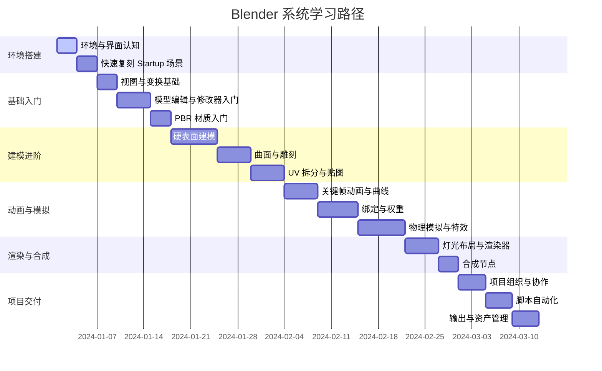

# Blender 全栈实战学习笔记

> 面向 0-5 年经验的三维内容创作者、转行学习者与需要快速建立 Blender 生产能力的技术人员。遵循“概念—步骤—实战—验证—扩展”节奏，确保每一知识点都能在真实项目中落地。

---

## 学习地图速览

| 学习阶段 | 核心目标 | 关键能力 | 代表实战项目 | 预估时长 |
| --- | --- | --- | --- | --- |
| 第 0 阶段：环境准备 | 完成 Blender 环境搭建与界面认知 | 熟悉界面、视图、文件管理 | 快速重建官方 Startup 场景 | 1-2 天 |
| 第 1 阶段：基础操控入门 | 掌握基础导航、建模与材质 | 操作内置对象，理解变换、修改器 | 制作一个带材质的小型桌面摆件 | 7-10 天 |
| 第 2 阶段：精细建模与贴图 | 建立高低模 workflow，掌握 UV 与 PBR | 创建复杂道具或场景 | 科技产品硬表面建模 | 10-14 天 |
| 第 3 阶段：动画与模拟 | 理解关键帧、曲线编辑、物理系统 | 完成角色或机械动画 | 机械臂运动与粒子特效结合 | 14-21 天 |
| 第 4 阶段：渲染与合成 | 精准控制光影、材质与渲染器参数 | 生成生产级画面并完成合成 | Cycles 渲染 + Eevee 实时预览项目 | 7-10 天 |
| 第 5 阶段：项目交付与扩展 | 完成从建模到交付流程，掌握脚本自动化与插件生态 | 输出多格式资源，对接 DCC/LBE 流程 | 完整产品广告短片交付 | 14 天 |

---

## 学习者画像与前置要求

- **定位**：具备基础计算机操作能力，对三维创作或图形渲染感兴趣的技术人员、设计师或开发者。
- **背景假设**：
  - 可能来自前端/游戏/工业设计/影视等领域，对三维软件的认知零散。
  - 熟悉基本的线性代数概念（向量、矩阵）可加速理解空间变换，但不是硬性要求。
  - 具备一定英文阅读能力，更容易利用官方文档与国外资源。
- **学习目标**：
  1. 独立完成 Blender 场景从建模到渲染的完整流程。
  2. 能够针对不同项目需求（影视、游戏、工业可视化）选择合适的建模/贴图/渲染策略。
  3. 具备一定的插件开发或 Python 脚本自动化能力，提高生产效率。
  4. 建立可复用的资产库，支撑持续项目交付。
- **学习约束**：每周建议投入 12-15 小时，持续 8-12 周，可根据项目紧急程度调整节奏。

---

## 学习路径总览



> **使用建议**：可将甘特图视为基准节奏，根据自身底层能力调整。每个阶段建议至少完成 1-2 个实战项目，并记录问题与解决方案，构建个人知识库。

---

## 环境与工具准备

### 硬件与操作系统建议

- **GPU**：推荐 Nvidia RTX 3060 及以上，显存 ≥ 8GB。若主要使用 Eevee，可适度降低标准；Cycles 渲染或复杂模拟需要更高配置。
- **CPU**：建议 6 核以上，主频 ≥ 3.0GHz；涉及多线程模拟（烟雾、布料）时越高越好。
- **内存**：至少 16GB，推荐 32GB 以上以满足高精度场景编辑与多软件并行。
- **存储**：SSD 是必须，Blender 项目、纹理、缓存建议使用 NVMe SSD；大型素材可放置在高速外部存储。
- **外设**：搭载滚轮与中键的鼠标；有条件可使用数位板和 3Dconnexion SpaceMouse；双屏配置能显著提升效率。

### 软件安装与版本管理

1. **下载渠道**：优先使用 [Blender 官方站点](https://www.blender.org/download/) 或 [Steam](https://store.steampowered.com/app/365670/Blender/) 获取最新 LTS/Stable 版本。
2. **版本策略**：
   - 生产项目建议使用 LTS（Long-term Support）版本，当前主流为 3.x LTS；
   - 想预览新特性可并行安装最新 Stable 或 Beta 版本，使用便携版避免覆盖；
   - 可通过 `blender --version` 与 `blender --background --python-expr "print('Hello')"` 在命令行快速验证安装成功。
3. **多版本共存**：
   - Windows：下载 ZIP 便携版，解压到独立文件夹，自定义 `blender.exe` 快捷方式；
   - macOS：通过 DMG/Universal 版本安装，多版本放置在 `/Applications` 子目录；
   - Linux：推荐使用 Snap (`sudo snap install blender --classic`) 或 Flatpak (`flatpak install flathub org.blender.Blender`)，或直接下载 tarball 解压运行；
   - 使用 Blender Launcher / Steam 可自动完成更新与切换。
4. **必备依赖**：
   - GPU 驱动更新到最新稳定版；
   - 安装 FFmpeg（Blender 内置，但 CLI 输出需要单独安装）；
   - 如需结合外部渲染引擎（如 Octane、Redshift），提前确认硬件与许可证。

### 初始配置与工作目录规范

- **资源目录规划**：建议建立如下结构，保持项目可迁移性。

```bash
BlenderProjects/
  ├── 00_Assets/          # 通用资产：HDRI、纹理、模型库
  ├── 01_Study/           # 学习练习项目，包含阶段性案例
  ├── 02_Commercial/      # 商业项目文件夹
  └── templates/          # 自定义 Startup 文件与渲染 preset
```

- **Startup File 自定义**：
  1. 调整首选项（快捷键、主题、添加/移除插件、视图单位）。
  2. 建立常用 Collection、摄像机与灯光模板。
  3. 执行 `File -> Defaults -> Save Startup File`，保存为团队统一标准。

- **首选项同步**：
  - 使用 `File -> Defaults -> Save Preferences` 将配置写入用户目录；
  - 在多台设备之间，可拷贝 `~/Library/Application Support/Blender/<version>/config`（macOS）或 `%APPDATA%\Blender Foundation\Blender\<version>\config`（Windows）实现同步；
  - 利用 Blender Cloud 或 Git 管理 `config` 与 `scripts` 文件夹，确保一致性。

### 插件与脚本生态

- **官方内置插件（Add-ons）**：通过 `Edit -> Preferences -> Add-ons` 启用，推荐：
  - `Node Wrangler`：增强 Shader Editor 操作。
  - `LoopTools`：快速建模辅助。
  - `Bool Tool`：布尔操作脚本化。
  - `Sketchfab`/`BlenderKit`：快速获取云端资产。
- **第三方插件推荐**：
  - **建模效率**：HardOps/Boxcutter、Machin3Tools、Speedflow。
  - **贴图与材质**：Extreme PBR、Simplicage Library。
  - **动画与绑定**：Auto Rig Pro、Rigify (官方内置)、Animation Nodes。
  - **渲染增强**：K-Cycles、Physical Starlight and Atmosphere。
  - **生产管理**：Clean Panels、Asset Browser Manager。
- **插件安装方法**：
  1. 下载 `.zip` 或 `.py` 文件；
  2. 在 `Preferences -> Add-ons -> Install` 选择文件；
  3. 勾选启用，必要时在 `N` 面板找到功能；
  4. 定期更新版本，记录变更日志。

### Blender 与其他工具联动

- **DCC**：与 Maya、3ds Max 通过 `FBX/OBJ/Alembic` 交互，注意轴向差异（Blender 默认 Z 轴向上）。
- **游戏引擎**：与 Unreal Engine、Unity 配合时，使用 `glTF` 或专用插件（如 UE 官方 Send to Unreal）；
- **纹理软件**：Substance 3D Painter/Designer、Quixel Mixer；导出 PBR 套件后导入 Blender Shader；
- **版本管理**：
  - 使用 Git-LFS 或 Perforce 管理大文件；
  - Blender 支持 `.blend` 文件作为二进制增量存储，可结合 `--background --python` 实现自动打包。

> **错误预防**：确保资产路径使用相对路径，开启 `File -> External Data -> Automatically Pack into .blend` 仅适用于小型项目，大型项目需自建素材服务器。

---

## 模块一：基础入门（第 1 阶段）

### 模块目标

- 熟练掌握 Blender 界面、导航与常用快捷键。
- 理解对象模式（Object Mode）与编辑模式（Edit Mode）的区别与切换逻辑。
- 能够创建基础几何体，并进行移动（G）、旋转（R）、缩放（S）等操作。
- 理解 Modifier（修改器）工作原理，完成简单非破坏性建模。
- 能够为模型添加基本材质与贴图，并输出首个渲染结果。

### 核心知识点拆解

1. **界面导航与视图控制**：
   - 3D 视口：`Shift + 中键` 平移、`中键` 旋转视角、`滚轮` 缩放。
   - 视图快捷键：数字键盘 `1/3/7` 对应前/侧/顶视图；`Ctrl + 数字键` 切换到相反方向；`0` 切换到摄像机视图。
   - 工作区（Layout、Modeling、UV Editing、Shading、Animation、Rendering 等）切换与自定义。
2. **对象管理与 Collection**：
   - `Outliner` 中管理层级、隐藏/显示、集合（Collection）的使用；
   - `Alt + H` 取消隐藏，`H` 隐藏选中对象。
3. **变换与对齐**：
   - 使用 gizmo 控制，熟悉 Snap (`Shift + Tab`) 与对齐选项；
   - `Shift + S` 光标与对象的对齐方式，`Ctrl + A` 应用变换。
4. **基础建模**：
   - 编辑模式下顶点/边/面切换（`1/2/3`）；
   - `E` 拉伸、`I` 内插面、`Ctrl + R` 环切；
   - 修改器如 `Subdivision Surface`、`Mirror` 的使用流程。
5. **材质与渲染**：
   - Eevee 与 Cycles 渲染器区别，`Viewport Shading` 四模式；
   - 基于 Principled BSDF 的 PBR 材质节点介绍；
   - `F12` 渲染静帧，输出设置（分辨率、采样、色彩空间）。

### 实战案例：桌面造型小摆件

> **案例目标**：在 2 小时内完成一个包含主体模型、材质和简单灯光的桌面摆件（如带灯座的小夜灯）。

1. **初始化项目**：
   - 使用默认立方体，先应用缩放 (`Ctrl + A`)；
   - 切换到 `Edit Mode`，使用 `Loop Cut` 切割出灯罩形状。
2. **建立造型**：
   - 使用 `Modifier -> Subdivision Surface` 平滑灯罩；
   - 添加 `Solidify` 修改器控制厚度；
   - 使用 `Bevel` 修改器增强棱线。
3. **材质设置**：
   - 创建两种材质：灯罩玻璃（半透明、发光）与底座金属；
   - 在 Shader Editor 中使用 `Principled BSDF`、`Emission`，配合 `Mix Shader`。
4. **灯光布局**：
   - 添加 `Area Light` 模拟环境灯；
   - 复制灯罩材质内的 `Emission Strength` 形成灯光发光效果。
5. **摄像机与渲染**：
   - `Ctrl + Alt + 0` 将摄像机对准当前视角；
   - 设置 Eevee 渲染器，启用 `Bloom` 表现发光；
   - `Output Properties` 中设置分辨率 1920x1080，保存输出。
6. **成果验证**：
   - 渲染图像无明显法线错误与面闪；
   - 模型拓扑清晰，面数可控；
   - 材质表现符合预期，发光部分不过曝。

### 常见错误与排查

- **法线反转**：进入 `Edit Mode` 全选（`A`），`Shift + N` 重计算法线。
- **Modifier 应用顺序混乱**：遵循 Mirror -> Boolean -> Bevel -> Subdivision 的常见顺序；可利用自定义 Stack 模板。
- **材质发黑**：检查是否开启 `Use Nodes`，以及灯光是否足够；切换渲染模式预览。
- **缩放异常**：未应用变换导致；确保 `Ctrl + A` 应用 Location/Rotation/Scale。

### 阶段小结与 Checklist

- [ ] 熟悉 Blender 主要界面板块与常用快捷键。
- [ ] 能使用 Pivot、Snap、3D Cursor 提高变换精度。
- [ ] 能创建并管理 Collection，保持场景整洁。
- [ ] 至少完成 1 个包含多材质的静帧作品。
- [ ] 将项目文件与渲染输出按照既定目录归档。

---

## 模块二：建模进阶（第 2 阶段）

### 模块目标

- 建立硬表面与有机建模两套 workflow，理解拓扑优化原则。
- 掌握常用修改器（Array、Boolean、Lattice、Data Transfer）组合使用。
- 熟悉高模/低模生产流程，能与游戏引擎实时资产对接。
- 理解 Box Modeling、Spline Modeling、Sculpting 的适用场景。
- 掌握 UV 展开、贴图烘焙的基础流程，为材质阶段做准备。

### 核心知识点拆解

1. **硬表面建模流程**：
   - 从参考图（blueprint）与 `Grease Pencil` 标注开始；
   - Box → Detail：先用基础几何体搭框架，再逐步细化；
   - 精准布尔：使用 `Boxcutter` + `HardOps` 或原生 `Boolean`；
   - 控制锐边：`Weighted Normal`、`Bevel` 设置 `Limit Method`、`Profile`。
2. **有机建模与雕刻**：
   - 使用 `Dyntopo` 进行快速草模；
   - 利用 `Remesh` 与 `Multiresolution` 控制细节层级；
   - `Sculpt Tools UI`、`Pose`、`Grab`、`Clay Strips`、`Inflate` 等常用笔刷。
3. **拓扑优化**：
   - 面向动画：保持四边形拓扑、边流顺畅、关节处增加环线；
   - 面向渲染：控制面数，关注高光过渡区域；
   - 利用 `Quadriflow Remesh`、`Retopoflow`（插件）进行重拓扑。
4. **精细细节与曲面**：
   - `Shrinkwrap` 与 `Surface Deform` 建立曲面贴合关系；
   - NURBS/Spline 生成曲面，适合汽车、工业设计；
   - `Curve` 转网格 (`Alt + C`)，应用后继续细化。
5. **UV 展开与贴图准备**：
   - 标记缝隙：`Ctrl + E` -> Mark Seam；
   - 使用 `UV Editing` 工作区展开，确保无明显拉伸；
   - 利用 `UDIM` 管理大面积纹理；
   - 导出 UV Layout 供贴图软件使用。

### 实战案例 A：科技机械臂硬表面建模

> **案例需求**：为虚拟工厂场景制作一款六轴机械臂，要求结构可运动，拓扑干净，可导入 Unreal Engine 实现实时展示。

1. **需求分析与拆解**：
   - 参考真实机械臂（ABB、KUKA）结构，收集正视/侧视图；
   - 将模型拆解为基座、关节、传动杆、末端执行器等组件。
2. **建模流程**：
   - `Outline`：使用 `Cube`、`Cylinder` 组合建立基本形状；
   - `Blocking`：添加 `Subdivision` 辅助控制曲面，适度增加环线控制硬边；
   - `Boolean`：利用 `Difference` 切割结构细节，使用 `Bevel` 修饰；
   - `Array`：处理重复结构（如螺钉、散热孔），结合 `Empty` 控制方向；
   - `Mirror`：沿中心轴镜像，确保关节对称；
   - `Data Transfer`：将精细高模的 `Normal` 转移到低模上。
3. **运动性保证**：
   - 关节部位保持独立对象；
   - 保留旋转轴位置与方向，备用于后续绑定。
4. **UV 与贴图准备**：
   - 将机械臂分为几大 UDIM Tile（1001、1002）；
   - 确保关键区域（logo、转角）拉伸最小；
   - 导出低模 + 法线贴图，为 Substance Painter 烘焙准备。
5. **成果检验**：
   - 拓扑全部四边形，法线流畅；
   - 面数控制在实时渲染可接受范围（如 50k-100k tris）；
   - FBX 导出后在 UE 中导入测试，骨骼与动画保持正确。

### 实战案例 B：有机角色雕刻到拓扑

1. **草模**：使用 `Sculpt` 模式的 `Dyntopo` 快速雕刻角色体块；
2. **细化**：利用 `Multires` 与 `Detail Flood Fill`；
3. **重拓扑**：使用 `Retopology` 插件或 `Quad Draw`；
4. **多分辨率处理**：
   - 保存高模细节到 `Multires`；
   - 以低模导出烘焙法线；
5. **结果评估**：关节区域环线均匀，面数在 30k 左右，满足绑定需求。

### 常见问题与解决方案

- **布尔产生非流形几何**：在布尔前应用变换并检查法线；必要时 `Mesh -> Clean Up -> Merge by Distance`。
- **雕刻时卡顿**：开启 `Simplify` 调整细分限制，或切换 `Clay Strips` + `Auto Smooth` 控制细节；
- **重拓扑困难**：使用 `Grease Pencil` 绘制拓扑流线，结合 `Poly Build` 工具；
- **UV 拉伸严重**：利用 `UV -> Minimize Stretch`，必要时拆分为更多 UV 岛。

### 阶段 Checklist

- [ ] 能针对不同类型模型选择合适的建模策略。
- [ ] 完成至少一个硬表面与一个有机模型案例。
- [ ] 能独立完成低模、UV 展开并准备贴图烘焙。
- [ ] 掌握常用修改器组合，能写下个人建模模板。
- [ ] 在 Git 或 DCC Asset Library 中整理模型资产。

---

## 模块三：材质、贴图与灯光渲染（第 3 阶段）

### 模块目标

- 深入理解 PBR（Physically Based Rendering）材质参数与节点结构。
- 熟悉 Blender Shader Editor，能构建复杂节点树并复用。
- 掌握贴图烘焙流程：高到低模法线、AO、Curvature、ID、Roughness 等。
- 熟悉 HDRI、三点布光、区域光等灯光布局方法。
- 掌握 Eevee 与 Cycles 渲染器参数优化，理解降噪、采样和性能调优。

### 核心知识点拆解

1. **PBR 基础**：
   - 基础通道：Base Color、Metallic、Roughness、Normal、AO。
   - 介质分类：金属（Metal）、非金属（Dielectric）；
   - 次表面散射（SSS）、半透明（Transmission）。
2. **Shader Editor 进阶**：
   - `Node Wrangler` 快捷 `Ctrl + T` 创建贴图节点；
   - `Mix Shader`、`Layer Weight`、`ColorRamp` 控制效果；
   - `Attribute` 节点获取自定义顶点颜色、UV；
   - 通过 `Group` 复用节点树。
3. **贴图与烘焙**：
   - 使用 Substance Painter 导出 `Metallic/Roughness/Normal`；
   - Blender 内部烘焙：启用 Cycles，设置 `Cage`，`Bake` AO/Normal；
   - `Image Editor` 创建空白贴图（32-bit float），`Select` 高/低模，执行 `Bake`。
4. **灯光理论与布光**：
   - 三点布光（Key、Fill、Rim）；
   - HDRI 环境光控制；
   - 面光源与体积光配合，营造氛围。
5. **渲染器选择与设置**：
   - **Eevee**：实时预览，适合快速迭代；启用 `SSAO`、`Bloom`、`Screen Space Reflection`；
   - **Cycles**：路径追踪，支持 CPU/GPU、Adaptive Sampling、Denoise（OpenImageDenoise、OptiX）。

### 实战案例：科技产品场景渲染

1. **场景准备**：
   - 导入机械臂模型与配套环境；
   - 使用 `Asset Browser` 进行材质与灯光快速布置。
2. **材质构建**：
   - 金属外壳：`Principled BSDF` + `Flakes` 程序纹理；
   - 塑料部件：`Subsurface` + `Roughness` 控制；
   - 屏幕 UI：使用发光贴图 + `Alpha Clip`。
3. **灯光策略**：
   - 使用 HDRI 作为基础环境光，结合三点布光突出主体；
   - 添加体积雾气（`Volume Scatter` + `Volume Absorption`）。
4. **渲染优化**：
   - Cycles GPU 渲染：设置 `Samples` 1024，启用 `Adaptive Sampling`；
   - `Render Properties -> Denoising -> OptiX`；
   - 输出多通道（Diffuse、Glossy、AO、Emission）供后期合成。
5. **合成节点**：
   - 使用 `Compositor` 中的 `Glare`、`Color Balance`；
   - 添加 `Cryptomatte` 方便局部调色。
6. **验证标准**：
   - 纹理无拉伸与接缝；
   - 光影过渡自然，无噪点；
   - 输出 EXR 与压缩格式，尺寸符合交付要求。

### 常见问题与解决方案

- **渲染噪点**：提高采样、启用 `Denoise`、优化灯光数量。
- **颜色失真**：确认色彩空间（使用 Filmic），避免 sRGB 到 Linear 的误差。
- **贴图偏移**：检查 UV 与节点链接；利用 `Vector` 节点调整。
- **Eevee 与 Cycles 材质不一致**：使用兼容节点，或针对 Eevee 定制材质。

### 阶段 Checklist

- [ ] 熟悉 Principled Shader 全部参数。
- [ ] 能独立完成贴图烘焙，导出标准 PBR 套件。
- [ ] 能在 2 小时内布光并完成一次高质量静帧渲染。
- [ ] 能使用 Compositor 完成基础调色、景深与特效。
- [ ] 产出材质库并建立分类标签。

---

## 学习路径阶段总结

> 完成前三个模块后，学习者应具备独立建模与渲染静态作品的能力。接下来将进入动画、模拟、管线自动化等高级主题。

---

## 模块四：动画、绑定与物理模拟（第 4 阶段）

### 模块目标

- 掌握关键帧、曲线编辑器（Graph Editor）与 Dope Sheet 的协同使用。
- 理解骨骼（Armature）系统、权重绘制以及常见约束（Constraint）设置。
- 熟悉非线性动画编辑（NLA）与动作复用流程。
- 掌握布料、刚体、粒子、烟雾等物理系统的基础原理与参数调优。
- 理解 Geometry Nodes 与动画、特效的结合方式，能创建程序化效果。

### 核心知识点拆解

1. **动画基础**：
   - 关键帧类型：`Loc/Rot/Scale`、`Custom Properties`、`Shape Keys`；
   - 插值模式：`Bezier`、`Linear`、`Constant`，以及缓入缓出（Ease In/Out）；
   - `Graph Editor`：调节曲线切线、关键帧加权、F-Curve Modifiers（Ping Pong、Cycles）。
2. **骨骼绑定与 IK/FK**：
   - 创建骨架：使用 `Armature`，在正交视图中布置骨骼；
   - 父子关系与骨骼层级（Bone Hierarchy）；
   - Inverse Kinematics（IK）与 Forward Kinematics（FK）的切换；
   - 常用约束：`Copy Rotation`、`Copy Location`、`Limit Rotation`、`Track To`；
   - 权重绘制（Weight Paint）：`Normalize All`、`Vertex Group` 管理。
3. **角色面部与形态动画**：
   - 使用 `Shape Keys` 制作表情；
   - 驱动器（Driver）连接 Slider 与骨骼控制；
   - `Pose Library` 与 `Asset Browser` 联动。
4. **非线性动画编辑（NLA）**：
   - 将动作（Action）推至 NLA 轨道，实现叠加与重用；
   - `Strip` 的混合模式（Add、Substract）与淡入淡出；
   - 动作剪辑与修改器（Time、Speed Control）。
5. **物理模拟系统**：
   - 刚体（Rigid Body）：主动/被动刚体、碰撞组、质量与阻尼；
   - 布料（Cloth）：质量、碰撞、风场控制；
   - 粒子（Particles）：发射器、力场、渲染模式（对象/集合）；
   - 烟雾与火焰（Smoke/Fire）：域（Domain）、流体（Flow）、解析精度；
   - 流体（Fluid）：Flip Fluids / Mantaflow 设置，缓存管理。
6. **Geometry Nodes**：
   - 节点类型：Geometry、Attribute、Field；
   - 通过 `Point Instance`、`Instance on Points` 生成大量对象；
   - 借助 `Scene Time`、`Value` 驱动动画参数；
   - 结合 `Simulation Nodes` 实现粒子、群体行为。

### 实战案例 A：机械臂装配动画与动力学联动

> **案例目标**：制作机械臂抓取零件并放置到流水线的动画，结合刚体模拟与摄像机运动。

1. **骨骼搭建**：
   - 为机械臂各关节创建骨骼链，使用 `Copy Rotation` 保持与模型轴向一致；
   - 末端夹具建立 `IK` 控制器，配置 `Pole Target` 避免关节翻转。
2. **关键帧与曲线调优**：
   - 使用 `Auto Keying` 记录关键帧；
   - 在 `Graph Editor` 中调整缓入缓出，使机械臂运动符合真实机械特性。
3. **刚体模拟**：
   - 将零件设为 `Passive`，被抓取时切换为 `Active`；
   - 使用 `Rigid Body Constraint` 实现短暂吸附；
   - 控制缓存帧范围与子帧精度，确保稳定。
4. **摄像机与渲染**：
   - 添加 `Empty` 作为摄像机目标，使用 `Track To` 约束；
   - 应用运动模糊与景深突出主体。
5. **交互与导出**：
   - 将动画烘焙为 `Action`，导出 FBX 到 Unreal，测试动画播放；
   - 在 UE 中设置 Niagara 粒子搭配零件飞溅特效。

### 实战案例 B：角色行走循环与布料效果

1. **Rigify 绑定**：
   - 启用 `Rigify` 插件，生成人形骨架；
   - 调整骨骼位置，生成控制器；
   - 使用 `Automatic Weights` 绑定，必要时手动修正权重。
2. **动作捕捉/自制动作**：
   - 使用 `Dope Sheet` / `Action Editor` 创建 walk cycle；
   - 应用 `Pose Breakdowner`、`Pose Slide` 微调姿势；
   - 使用 `NLA` 将动作循环，并控制速度。
3. **布料模拟**：
   - 角色衣物单独建模，设置为 Cloth；
   - 调整 `Quality Steps`、`Stiffness`、`Collision`；
   - 缓存至磁盘，观察碰撞是否穿模，必要时增加 `Substeps`。
4. **效果增强**：
   - 使用 `Motion Paths` 检查骨骼移动轨迹；
   - 曲线编辑器中添加 `Noise` Modifier 模拟自然抖动；
   - 添加 `Grease Pencil` 注解记录反馈点。

### 常见问题与解决策略

- **骨骼翻腕**：调整 `Pole Target` 位置，或使用 `IK` Chain Length 限制；
- **权重穿插**：开启 `Auto Normalize`，在 Weight Paint 中逐骨骼校正；
- **布料穿模**：提高碰撞步数，检查缩放是否应用；
- **粒子抖动**：增加缓存样本，使用 `Subframe` 控制；
- **模拟缓存丢失**：启用 `Disk Cache`，并在版本管理中备份缓存目录。

### 阶段 Checklist

- [ ] 熟悉关键帧、曲线编辑器与 Dope Sheet 的联动。
- [ ] 能够为角色或机械建立骨骼并完成动作制作。
- [ ] 能在项目中使用至少一种物理模拟（布料/粒子/烟雾）。
- [ ] 理解 Geometry Nodes 动画驱动的基本方法。
- [ ] 完成至少一个 10-30 秒的动画片段并输出预览。

---

## 模块五：渲染、合成与输出（第 5 阶段）

### 模块目标

- 根据项目需求在 Cycles、Eevee、第三方渲染器之间做出选择。
- 熟悉渲染层（Render Layers）与视图层（View Layer），灵活输出 AOV。
- 掌握合成节点（Compositor）工作流，实现调色、景深、特效。
- 针对不同交付场景（影视、实时、XR）配置输出格式与色彩管理。
- 建立渲染优化思路，平衡质量与性能。

### 核心知识点拆解

1. **渲染器配置**：
   - Cycles：路径追踪参数、光线反弹（Diffuse/Glossy/Transmission/Bounce）、`Clamp` 噪点控制；
   - Eevee：光照缓存（Irradiance Volume、Reflection Cubemap）、`Shadow` 设置；
   - 外部渲染：Octane、Redshift、Arnold 插件安装与流程。
2. **渲染层与通道**：
   - `View Layer` 管理场景元素，使用 `Collections` 控制显示；
   - `Passes` 输出（Diffuse Color、Glossy、Shadow、Cryptomatte、Z-Depth）；
   - 使用 `Light Groups` 分离灯光影响。
3. **合成节点流程**：
   - 线性工作流：加载 `Render Layers`，使用 `Glare`、`Color Balance`、`Vector Blur`；
   - `Cryptomatte` 精准选择；
   - 使用 `Viewer` 节点实时预览；
   - 将合成节点保存为 `Node Group`，复用在不同项目。
4. **后期与调色**：
   - Blender 内部色彩管理：`Filmic`、`Filmic Log`、`Standard`；
   - LUT 应用、对白平衡、色调映射（Tone Mapping）；
   - 景深（Z Pass + Defocus）、运动模糊（Vector Pass + Vector Blur）。
5. **输出与交付**：
   - 序列帧（EXR、PNG）：适用于后期合成；
   - 视频编码：FFmpeg（MP4/H.264/H.265）、ProRes；
   - 多格式导出：`File -> Export ->` FBX/OBJ/GLTF/Alembic；
   - 使用 `Compositor` 添加水印、片尾 LOGO。
6. **性能优化**：
   - 使用 `Render -> Render Region` 进行局部测试；
   - 分布式渲染：Blender Network Render、Flamenco、Deadline；
   - 使用 `Simplify` 限制最大细分、贴图尺寸；
   - 渲染统计（`Viewport -> Overlay -> Statistics`）监控面数、内存使用。

### 实战案例：产品广告短片渲染流程

1. **场景拆层**：
   - 将产品主体、背景、特效分离到不同 `View Layer`；
   - 使用 `Holdout` 实现遮罩。
2. **灯光与相机**：
   - 建立 `Light Rig`：主光（Key）、辅光（Fill）、轮廓光（Rim），外加 `Area Light` 做柔光；
   - 使用 `Camera Depth of Field` 突出细节；
   - 在 `Graph Editor` 中为摄像机添加缓动。
3. **渲染与合成**：
   - Cycles GPU 渲染，分辨率 3840x2160，采样 2048；
   - 输出 `Cryptomatte`、`Z`、`Emission`、`Mist`；
   - 在 Compositor 中完成调色、Bloom、暗角，并叠加字体。
4. **后期整合**：
   - 导入序列帧到 Blender Video Sequencer 或 DaVinci Resolve；
   - 加入音效、BGM，使用 `Color Space Transform` 做 HDR/SDR 转换；
   - 输出多版本（8-bit H.264、10-bit ProRes），并生成社交媒体短版。

### 常见问题与解决策略

- **渲染闪烁**：确保 `Sampling` 足够，使用 `Temporal Stabilization`（Eevee）或提高 `Motion Blur` 的 subframe。
- **色彩管理混乱**：统一使用 ACES 或 Filmic，导出时保持颜色空间一致；
- **输出序列丢帧**：使用 `Overwrite` 选项，渲染前清理缓存；
- **GPU 内存不足**：切换 CPU 渲染或开启 `Out-of-core`，降低贴图尺寸；
- **合成节点性能低**：启用 `Performance -> Chunk Size` 调优。

### 阶段 Checklist

- [ ] 能根据项目需求确定渲染器与输出设置。
- [ ] 熟练使用 View Layer、Passes 分层渲染并进行后期合成。
- [ ] 至少完成一个 10 秒以上的广告或产品渲染片段。
- [ ] 具备基础色彩管理知识，能处理 HDR/SDR 输出。
- [ ] 了解分布式渲染与渲染农场接入流程。

---

## 模块六：项目管线、自动化与协作（第 6 阶段）

### 模块目标

- 建立团队统一的项目结构、命名规范与资产管理策略。
- 掌握 Blender Python API 基础，编写脚本提升重复任务效率。
- 理解跨软件协作流程，与版本控制、任务管理系统集成。
- 能够搭建渲染自动化、批处理导出、日志监控等管线工具。
- 从项目需求到交付全流程把控质量，并制定回顾与优化机制。

### 项目组织与命名规范

1. **目录结构与命名**：
   - `ProjectName_YYYYMM/` 作为顶层目录，内含 `scenes/`, `assets/`, `textures/`, `renders/`, `cache/`；
   - 命名格式：`<类型>_<描述>_<版本>_<作者>`，如 `scene_factoryLayout_v003_zwang.blend`；
   - 使用 `README.md` 记录项目背景、依赖、渲染设置。
2. **版本管理**：
   - `.blend` 文件采用增量版本，关键节点做 `Save Copy`；
   - 使用 Git-LFS 存储贴图、缓存；
   - 结合 `git hooks` 自动同步 `render settings`、`asset index`；
   - 通过 `ShotGrid`、`ftrack` 或 `Notion` 等工具跟踪任务状态。

### Blender Python 自动化

1. **基础概念**：
   - `bpy` 模块：`bpy.data`（数据）、`bpy.context`（上下文）、`bpy.ops`（操作）；
   - 脚本执行方式：`Text Editor`、`Scripting` 工作区、命令行 `blender --background --python script.py`；
   - 注册自定义面板、操作符（Operator）及属性。
2. **常见脚本场景**：
   - 批量导入/导出模型格式：

```python
import bpy
from pathlib import Path

input_dir = Path("/path/to/fbx")
for fbx in input_dir.glob("*.fbx"):
    bpy.ops.import_scene.fbx(filepath=str(fbx))
    # 自定义处理逻辑
    bpy.ops.export_scene.gltf(filepath=str(fbx.with_suffix('.glb')))
```

   - 自动命名与清理：

```python
import bpy

for obj in bpy.data.objects:
    if obj.type == 'MESH':
        obj.name = obj.name.replace(' ', '_')
        obj.data.use_auto_smooth = True
```

   - 批量渲染：

```python
import bpy

scene = bpy.context.scene
render = scene.render
render.engine = 'CYCLES'
render.filepath = '/mnt/render/output_'

for index, view_layer in enumerate(scene.view_layers):
    scene.view_layers.active = view_layer
    render.filepath = f"/mnt/render/{view_layer.name}_{index:03d}"
    bpy.ops.render.render(write_still=True)
```

3. **自定义工具开发流程**：
   - 定义 Operator (`bpy.types.Operator`)，注册按键快捷方式；
   - 使用 `Panel` 将功能集成到 UI；
   - 打包为插件：创建 `__init__.py`、`bl_info`、注册函数。
4. **脚本发布与更新**：
   - 使用 Git 管理；
   - 提供 `Changelog`、`README`；
   - 通过 `Preferences -> Add-ons -> Install` 分发给团队。

### 协作与交付流程

1. **需求与可行性评估**：
   - 评估场景复杂度、动画时长、渲染分辨率；
   - 估算人力与渲染资源，制定里程碑。
2. **生产阶段**：
   - Pre-production：分镜、资产清单、风格指引；
   - Production：建模、贴图、动画、灯光、渲染并行；
   - Post-production：合成、剪辑、调色、交付。
3. **质量控制**：
   - 每日提交 `Playblast` 或 Viewport 录屏；
   - 使用 `Shot Review`（如 SyncSketch）收集反馈；
   - 建立 QA 检查表（拓扑、材质、灯光、渲染参数）。
4. **交付与归档**：
   - 输出最终版本（EXR/MP4/GLB 等）；
   - 整理源文件、缓存、脚本到归档服务器；
   - 编写项目总结，记录问题与解决方案。

### 案例：中小型团队广告项目管线实践

1. **项目启动**：
   - 使用 Notion 创建项目模板，列出镜头（Shot）与资产（Asset）；
   - 在 Git 仓库中初始化 `Blender Template`。
2. **资产流程**：
   - 资产建模完成后，推送到 Asset Library；
   - 通过 `Asset Browser` 分享，自动记录版本号；
   - 使用 Python 脚本生成资产列表（CSV），同步给策划与客户。
3. **渲染自动化**：
   - 采用 Flamenco 搭建渲染队列，配置 Worker 节点；
   - 设置任务模板（场景路径、视图层、帧范围、采样）；
   - 渲染完成后自动发布至 NAS，对接通知机器人。
4. **交付总结**：
   - 按阶段（建模/材质/动画/渲染）整理回顾文档；
   - 记录脚本使用情况与改进建议，为下一项目迭代。

### 常见问题与解决策略

- **团队命名不统一**：制定命名规范手册，使用脚本自动检测；
- **插件版本不一致**：建立插件仓库，使用启动脚本同步；
- **渲染排队冲突**：使用调度工具或队列优先级，预留紧急通道；
- **Python 脚本失效**：在脚本中加入版本检测，使用 `try/except` 捕获 API 变更；
- **文件丢失**：开启自动备份，将 `autosave` 间隔设为 2-3 分钟，并定期备份。

### 阶段 Checklist

- [ ] 建立统一的项目目录和命名规范，并落地在至少一个真实项目中。
- [ ] 编写并部署至少两个 Blender Python 脚本或工具命令。
- [ ] 熟悉渲染队列或分布式渲染的搭建与使用。
- [ ] 建立资产库管理流程，并完成一次资产更新迭代。
- [ ] 能清晰描述项目从需求到交付的每个环节与风险控制点。

---

## 实战项目路线与评估

为帮助学习者将各模块知识融会贯通，设计以下三条实战项目路线，可根据职业目标选择：

1. **产品可视化路线**
   - 阶段 1：完成桌面摆件（基础操作）。
   - 阶段 2：制作科技机械臂（硬表面 + 材质灯光）。
   - 阶段 3：制作 30 秒产品广告短片（动画 + 渲染 + 合成）。
   - 阶段 4：编写脚本批量输出多版本（自动化）。

2. **角色动画路线**
   - 阶段 1：完成低模角色建模与 UV。
   - 阶段 2：雕刻高模、烘焙贴图。
   - 阶段 3：Rigify 绑定 + 动作片段（走跑跳）。
   - 阶段 4：布料/头发模拟 + 场景渲染。
   - 阶段 5：输出 Unreal Engine 实时展示版本。

3. **数字孪生/工业仿真路线**
   - 阶段 1：重建工厂或机房基础场景。
   - 阶段 2：制作关键设备模型，建立参数化控制。
   - 阶段 3：结合 Geometry Nodes 与 Python，制作数据驱动动画。
   - 阶段 4：整合到 WebGL 或 XR 平台，完成实时互动演示。

> **提示**：每条路线都应在阶段结束时进行回顾，记录遇到的技术问题、解决方法以及时间消耗，为下一阶段做准备。

---

## 常见 Bug/故障排查速查表

| 问题现象 | 可能原因 | 排查步骤 | 解决方案 | 预防策略 |
| --- | --- | --- | --- | --- |
| 模型渲染出现黑斑 | 法线反转、采样不足 | 切换到 Normal 显示，检查采样数 | 重新计算法线、增加采样或启用 Denoise | 建模过程中保持拓扑干净，及时应用变换 |
| 布料穿插 | 碰撞距离过小、缓存不足 | 检查 Cloth 设置、开启自碰撞 | 增加质量步骤与子步，适度增厚衣物 | 使用缩放一致的模型，提前做好测试 |
| 渲染卡顿 | 贴图过大、光线反弹过多 | 检查材质贴图大小，观察渲染统计 | 使用 `Simplify` 限制，设置合理 Bounce 值 | 建立贴图尺寸规范，渲染前做性能测试 |
| 插件失效 | 版本不兼容、依赖缺失 | 查看 Console 报错 | 更新插件或 Blender 版本，补齐依赖库 | 在团队内统一插件版本，编写更新指引 |
| FBX 导出骨骼错误 | 命名不规范、缩放未应用 | 检查骨骼命名、单位设置 | 应用变换（`Ctrl + A`），确保骨骼朝向正确 | 建立导出前 Checklist，并使用脚本自动化检查 |
| 渲染输出颜色偏差 | 色彩空间设置不一致 | 检查 View Transform、导出设置 | 使用正确的色彩管理方案（如 Filmic） | 记录项目色彩设定，交付时附色彩说明 |

---

## 学习成果验证标准

1. **技能闯关任务**
   - ✅ 在 90 分钟内，独立完成一个包含 5 个以上对象的静态场景建模与 Eevee 渲染预览。
   - ✅ 在 3 天内，从零搭建一个含 Rigify 绑定与 15 秒动画的角色片段，并交付含布料模拟的成品视频。
   - ✅ 编写一个 Blender Python 脚本，实现对指定目录下所有 FBX 文件的批量导入、重命名、自动渲染预览输出。

2. **质量量化指标**
   - 几何拓扑：关键关节区域四边形比例 ≥ 90%，不存在非流形面与重复顶点。
   - 渲染质量：Cycles 噪点水平（在 1920x1080 分辨率 256 采样下）低于 0.015（依据 NLM 去噪测量）。
   - 贴图一致性：PBR 材质在 Eevee 与 Cycles 中显示差异不超过 10%（通过采样关键像素 RGB 对比）。
   - 动画平滑度：在曲线编辑器中消除尖刺，动作曲线最大加速度变化率（jerk）控制在合理范围，确保视觉自然。

3. **项目交付验收**
   - 提供完整项目文件（包含 `.blend`、贴图、缓存、脚本），目录结构符合规范。
   - 输出 1 份技术文档，描述项目流程、使用工具、关键参数与问题解决方案。
   - 若目标平台为实时引擎，需提供导入演示视频或运行截图，并附性能指标（帧率、面数、贴图内存）。

4. **团队协作指标**
   - 在项目管理工具中，每个资产或镜头的状态更新及时率 ≥ 95%。
   - 脚本工具使用反馈至少 3 条，形成迭代 backlog。
   - 渲染队列任务失败率低于 5%，建立追踪与报警机制。

---

## 扩展资源与进阶路径

- **官方资源**
  - Blender 官方文档：[https://docs.blender.org/](https://docs.blender.org/)
  - Blender Studio & Open Projects：研究官方项目结构与作业标准。
  - Blender Today / Blender Nation：关注最新版本特性与插件。

- **学习社区与课程**
  - CG Cookie、FlipNormals、Gumroad 高质量课程。
  - 国内社区：哔哩哔哩（BlenderCN）、知乎专栏、QQ群/Discord。
  - 建议参与 Daily Challenge（如 Artstation Weekly）积累作品。

- **工具与插件**
  - **资产管理**：Simple Asset Manager、Blender Asset Tracer。
  - **渲染辅助**：Lighting Setup Add-on、Gaffer。
  - **几何节点**：Geometry Nodes Cookbook、Erindale 学习资源。
  - **Python 开发**：`blender-python-template`、Text Editor Tools。

- **进阶方向**
  1. **电影级管线**：与 Houdini、Nuke 联动，将 Blender 用于 previz、lookdev 与轻量渲染。
  2. **实时引擎**：学习 USD、Alembic、Nvidia Omniverse 流程，接入 Unreal/Natron。
  3. **几何节点程序化**：深入 Field、Simulation、Solvers，构建程序化资产库。
  4. **技术美术（TA）**：强化脚本、Shader、性能优化，与游戏引擎团队协作。
  5. **XR/交互体验**：结合 WebXR、Three.js、Babylon.js，实现实时 3D 体验。

---

## 持续提升与复盘

1. **学习节奏建议**
   - 采用 “3-2-1” 复盘模型：每完成 3 个练习，总结 2 个问题，整理 1 篇技术笔记。
   - 每周至少一次作品打磨与点评（自评 + 外部反馈）。
   - 每月选定一个主题（如硬表面、动画、节点），制作专题作品集。

2. **知识图谱构建**
   - 使用思维导图或 Obsidian 建立知识关联；
   - 将脚本、节点树、材质预设整理为可引用片段；
   - 与团队共享最佳实践，形成标准化模板。

3. **性能与工作流优化**
   - 持续测试硬件升级对渲染效率的影响，评估性价比；
   - 引入自动化测试脚本（如渲染时间检测、资产引用检查）；
   - 关注官方/社区更新，评估是否纳入新版本与插件。

4. **作品集策略**
   - 建立主题明确的作品集（产品、角色、建筑等）；
   - 每个项目附上技术说明、参数、问题与优化点；
   - 制作 Demo Reel，控制在 1-2 分钟，突出核心技能。

5. **社群与合作**
   - 参与 Blender 官方开发者周会或社区讨论；
   - 与程序员合作开发插件，与设计师合作完成综合项目；
   - 关注招聘市场需求，调整学习重点（如实时渲染、脚本化）。

---

## 附录 A：快捷键与命令速查（按工作流分类）

### 视图与导航
- `Shift + 空格`：全屏显示当前区域
- `Ctrl + 空格`：最大化/恢复区域
- `Shift + C`：重置 3D 光标与视图中心
- `Ctrl + Alt + Q`：四视图切换

### 建模
- `Ctrl + B`：倒角
- `Ctrl + Shift + B`：顶点倒角
- `Alt + S`：边法线方向缩放（厚度调整）
- `Shift + R`：重复上一次动作
- `F`：补面；`Alt + F`：自动三角化
- `M`：合并顶点（At Center/At Cursor）
- `Ctrl + Shift + R`：多环切（Loop Cut）

### 雕刻
- `Shift + R`：调整笔刷半径
- `Shift + F`：调整笔刷强度
- `Ctrl + Shift + F`：设置笔刷倾斜角度
- `F`：更改笔刷半径

### 动画
- `I`：插入关键帧
- `Alt + I`：删除关键帧
- `Shift + E`：关键帧插值菜单
- `Shift + Ctrl + Alt + C`：设置骨骼 IK 约束
- `Ctrl + Shift + C`：添加约束

### 渲染与合成
- `F12`：渲染当前帧
- `Ctrl + F12`：渲染动画
- `Ctrl + B`（渲染里程）：设置渲染区域
- `Ctrl + Alt + B`：取消渲染区域
- `Ctrl + J`：合并节点树中选中节点
- `Ctrl + Shift + 点击`（Node Wrangler）：预览节点输出

### Python 层面
- `Alt + P`：在脚本编辑器运行脚本
- `Ctrl + 空格`：自动补全（需开启）
- `Info` 面板：查看操作对应的 Python 命令

---

## 附录 B：常用模板与表单

1. **项目需求模板**

```markdown
# 项目名称
- 客户/需求方：
- 项目周期：
- 目标交付：
- 分辨率与帧率：
- 风格参考：
- 技术约束：

## 资产列表
| 名称 | 类型 | 负责人 | 计划完成 | 状态 | 备注 |

## 镜头列表
| Shot ID | 描述 | 时长 | 负责人 | 状态 | 风险 |

## 渲染配置
- 渲染器：
- 分辨率：
- 采样：
- 输出格式：
```

2. **每日进度与风险记录**

```markdown
## 日期：YYYY-MM-DD
### 今日完成
- [ ] 任务 1
- [ ] 任务 2

### 明日计划
- [ ] 任务 3

### 风险与问题
- 风险描述：
- 影响范围：
- 解决方案/负责人：
```

3. **渲染农场任务模板（Flamenco）**

```json
{
  "job": {
    "name": "ProjectName_Shot010",
    "frames": "100-250",
    "chunk_size": 5,
    "command": "blender",
    "command_args": [
      "--background",
      "//scenes/shot010.blend",
      "--render-output",
      "//renders/shot010_",
      "--render-frame"
    ],
    "env": {
      "BLENDER_USER_SCRIPTS": "//scripts"
    }
  }
}
```

4. **资产更新表**

```csv
asset_name,asset_type,version,artist,status,update_notes
robot_arm,prop,v005,alice,approved,"增加末端执行器细节"
control_panel,prop,v003,bob,in_review,"待补充法线贴图"
factory_floor,environment,v002,carol,wip,"重新布光"
```

---

## 附录 C：性能测试与 Benchmark 建议

| 测试项目 | 工具/脚本 | 指标 | 目标值 | 备注 |
| --- | --- | --- | --- | --- |
| Viewport FPS | Viewport Statistics | 帧率 | ≥ 24 FPS | 场景选择代表镜头 |
| 渲染时间 | Python 脚本统计 | 单帧耗时 | < 10 min (4K) | Cycles GPU, 2048 采样 |
| 内存占用 | 系统监控/GPU-Z | 峰值显存 | < 90% | 防止溢出 |
| 贴图管理 | 自编脚本扫描 | 贴图尺寸/数量 | 100% 符合规范 | 限制 8K 贴图数量 |
| 脚本稳定性 | 单元测试 | 成功率 | ≥ 98% | 关键自动化脚本 |

---

## 后续行动计划建议

1. **建立个人作品集路线图**：围绕三条实战路线，各自规划 2-3 个代表作品，设定完成时间。
2. **制定学习复盘节奏**：每周撰写学习日志，总结问题与关键收获，定期复查 Checklist。
3. **参与社区与竞赛**：每季度至少参加一次 Blender 社区活动或比赛，检验综合能力。
4. **扩展跨领域技能**：结合摄影、灯光、编程、UI 设计等知识，增强作品表现力。
5. **保持版本更新与技术前瞻**：关注 Blender 官方 Roadmap，提前评估 Geometry Nodes、Real-time Compositor 等新特性。

---

> 通过以上结构化学习与实践安排，学习者可以逐步构建起 Blender 的系统知识体系，并将技能应用到真实生产环境中。持续迭代、主动复盘与团队协作将是实现长期成长的关键。


---

## 专题拓展篇：从实战项目反推能力图谱

### 专题一：Geometry Nodes 程序化工作流

> 目标：建立从基础 Field 概念到大型程序化资产的完整实践指南，将 Geometry Nodes 融入团队生产管线。

#### 1. 核心理念

- **字段（Field）机制**：理解每个节点输出的数值或向量可在任意点、边、面上求值。
- **Geometry 数据结构**：Mesh、Curve、Point Cloud、Volume 四大类型及其属性（Attribute）。
- **实例化（Instance）思想**：尽量使用实例避免重复几何，大幅提升性能。
- **程序化迭代**：节点树可通过 `Group` 封装，形成可复用资产。

#### 2. 常用节点语义图谱

| 节点类型 | 代表节点 | 用途说明 | 实战提示 |
| --- | --- | --- | --- |
| 数据输入 | `Object Info`、`Collection Info` | 引入外部物体或集合 | 勾选 `As Instance` 减少内存 |
| 几何操作 | `Join Geometry`、`Separate Geometry` | 合并或筛选几何 | 搭配 `Boolean` 控制流程 |
| 字段计算 | `Math`、`Vector Math`、`Color Ramp` | 处理标量、向量、颜色 | 可使用 `Map Range` 控制范围 |
| 拓扑调整 | `Subdivision`、`Triangulate`、`Dual Mesh` | 改变拓扑结构 | 留意 UV/法线变化 |
| 实例管理 | `Point Instance`、`Instance on Points` | 在点上生成实例 | 与 `Random Value` 结合随机化 |
| 模式控制 | `Switch`、`Compare`、`Boolean Math` | 控制条件分支 | 可通过自定义属性驱动 |
| 输出 | `Group Output`、`Store Named Attribute` | 输出最终几何或属性 | 善用 `Named Attribute` 与 Shader 交互 |

#### 3. 实战案例：工业园景观快速生成

**需求**：自动生成一片包含道路、绿化、建筑体块的工业园区，参数可驱动道路宽度、建筑高度、绿植密度。

1. **数据准备**：
   - 导入参考曲线（道路中线）作为 `Curve`。
   - 使用 `Store Named Attribute` 将道路宽度写入属性 `road_width`。
2. **道路生成**：
   - `Curve to Mesh`：使用 `Curve Circle` 控制道路横截面宽度。
   - 添加 `Set Material` 指定沥青材质。
3. **地块划分**：
   - 使用 `Geometry Proximity` 获取到道路的距离字段；
   - 利用 `Compare` 判断距离阈值，将距离较远区域作为可建造用地。
4. **建筑体块**：
   - 将可建区域转换为点云，使用 `Poisson Disk` 分布控制密度；
   - `Instance on Points` 放置基础建筑体，使用 `Random Value` 控制高度、朝向；
   - 使用 `Realize Instances` 将关键建筑转为实体供细化。
5. **绿化布置**：
   - 根据距离字段与随机种子生成绿化点位；
   - `Instance on Points` 引用树木集合，使用 `Scale` 随机化。
6. **参数化控制**：
   - 通过 `Group Input` 暴露参数：道路宽度、建筑高度范围、绿化密度；
   - 将节点树保存为资产，自定义缩略图。

#### 4. 几何节点在管线中的应用

- **程序化资产**：建立道路、楼梯、栏杆、机柜等模块的节点资产库，减少重复建模。
- **特效驱动**：使用 `Simulation Nodes` 创建粒子聚合、流水线产品运动轨迹。
- **数据交互**：通过 `Store Named Attribute` 向 Shader 传递自定义属性，实现图案/色彩的 procedural control。
- **动态摄影机**：使用 `Curve` + `Sample Curve` 控制摄像机沿路径运动，参数化调节速度与焦距。
- **性能优化**：尽量保持实例化，设置 `Display As Bounding Box` 预览；对大型节点树使用 `Viewer` 节点逐段调试。

#### 5. 进阶挑战

- 开发 `Geometry Nodes` 资产库管理脚本，自动更新版本和预览。
- 与 Python 配合，读取外部 JSON/CSV 数据，驱动节点参数，实现数据可视化。
- 将节点树导出为自定义资产包，与团队共享并编写使用手册。

---

### 专题二：Shader 节点实战配方

> 目标：提供 10 套常用材质的节点构建步骤，让学习者快速积累可复用的材质方案。

| 材质 | 核心特性 | 关键节点 | 具体步骤 | 调优建议 |
| --- | --- | --- | --- | --- |
| 磨砂金属 | 高粗糙度、法线随机 | `Noise Texture`、`ColorRamp`、`Principled BSDF` | 1. 使用 Noise 控制粗糙度；2. 添加 `Bump` 赋予细纹；3. 通过 `ColorRamp` 控制反射衰减 | 将 `Noise` 缩放设为 50-200，模拟微小瑕疵 |
| 拉丝铝 | 方向纹理 | `Wave Texture`、`Anisotropic` | 1. `Wave Texture` 设置 Directional；2. 将 `Vector Rotate` 对齐纹理方向；3. 使用 Anisotropic Shader 控制高光 | 通过 `Anisotropic Rotation` 调整拉丝方向 |
| 透明玻璃 | 折射、反射 | `Glass BSDF`、`Mix Shader` | 1. 使用 `Light Path -> Is Shadow Ray` 混合；2. 控制 IOR=1.45；3. 添加 `Volume Absorption` 模拟色偏 | Eevee 中打开 `Screen Space Refraction` |
| 次表面皮肤 | 半透明、色散 | `Principled BSDF`（Subsurface）、`Texture Coordinate` | 1. 设置 Subsurface=0.2-0.4；2. 使用三层贴图：Color、Roughness、Normal；3. 添加 `Subsurface Radius` 控制色散 | 结合 `Specular Tint` 与 `Sheen` 模拟油脂 |
| 科技发光面板 | 发光、扫描线 | `Emission`、`Gradient Texture`、`Math` | 1. `Gradient` 生成扫描线；2. 使用 `Sine` 叠加闪烁；3. `ColorRamp` 控制颜色；4. `Mix Shader` 与基础材质混合 | 配合 `Drivers` 或 `Geometry Nodes` 控制动画节奏 |
| 旧木材 | 颜色分层、凹凸 | `Noise`、`Voronoi`、`Bump` | 1. `Voronoi` 生成年轮；2. `Noise` 叠加随机；3. 使用 `Bump` 模拟凹凸；4. `Roughness` 设置较高 | 引入贴图混合以提高真实度 |
| 油漆剥落 | 噪声遮罩 | `Noise`、`ColorRamp`、`Mix` | 1. 构建 `Noise` 遮罩；2. 使用 `ColorRamp` 控制剥落区域；3. `Mix Shader` 将金属底层与油漆顶层融合；4. 添加 `Bump` 增强边缘 | 使用 `Ambient Occlusion` 控制缝隙剥落程度 |
| 雾化玻璃 | 模糊、散射 | `Noise`、`Voronoi`、`Principled BSDF` | 1. `Noise` 控制 Roughness；2. `Voronoi` 添加细节；3. `Emission` 模拟背光 | 根据厚度调整 `Transmission` 与 `Alpha` |
| 霓虹灯牌 | 发光、辉光 | `Emission`、`Layer Weight`、`Bevel` | 1. 使用 `Layer Weight -> Facing` 控制边缘亮度；2. 添加 `Bevel Shader` 软化边缘；3. `Mix Shader` 添加透明背景 | 在 Eevee 中启用 Bloom，调整半径 |
| 赛博金属反光 | 高光、贴图 | `Fresnel`、`Metallic`、`Clearcoat` | 1. `Fresnel` 控制边缘亮度；2. `Clearcoat` 增加第二层高光；3. `Noise Texture` 添加微小划痕；4. 使用 `Mapping` 控制方向 | 渲染时使用 HDRI 环境提升反射品质 |

> **操作建议**：为每种材质制作节点组，并在 `Asset Browser` 中归档。构建材质库时记录使用场景、渲染需求与性能指标。

#### Shader 调试技巧

- 使用 `Ctrl + Shift + 左键`（Node Wrangler）预览任意节点输出。
- `View -> Texture Paint -> Stencil` 绘制遮罩，自定义破损效果。
- 将参数暴露为 `Custom Properties`，通过驱动器控制材质动画。
- 在渲染层输出 `Emission`、`Glossy` 等通道，便于后期调色。

---

### 专题三：Python 插件开发深度实践

> 目标：通过完整的插件案例，帮助学习者从脚本编写推进到 UI 定制、事件响应与批处理，真正融入生产流程。

#### 案例：团队资产命名与导出助手

**功能需求**：
- 自动校验对象命名是否符合规范（前缀 + 功能 + 序号）。
- 批量导出选中对象为 FBX，并自动生成缩略图。
- 在界面中显示校验结果，支持一键修复。

```python
bl_info = {
    "name": "Asset Naming & Export Helper",
    "author": "Tech Artist Team",
    "version": (1, 0, 0),
    "blender": (3, 6, 0),
    "description": "Check naming conventions, auto export FBX and thumbnails.",
    "category": "Pipeline",
}

import bpy
import os
from pathlib import Path
import re

NAMING_PATTERN = re.compile(r"^(CHR|PROP|ENV)_[A-Za-z0-9]+_[0-9]{3}$")

class ASSETCHECK_OT_check(bpy.types.Operator):
    bl_idname = "assetcheck.check"
    bl_label = "检查命名"
    report_items: bpy.props.CollectionProperty(type=bpy.types.PropertyGroup)

    def execute(self, context):
        scene = context.scene
        report_items = scene.assetcheck_report
        report_items.clear()
        for obj in bpy.data.objects:
            if obj.type in {"MESH", "EMPTY", "ARMATURE"}:
                item = report_items.add()
                item.name = obj.name
                item["is_valid"] = bool(NAMING_PATTERN.match(obj.name))
        self.report({'INFO'}, "命名检查完成")
        return {'FINISHED'}

class ASSETCHECK_OT_fix(bpy.types.Operator):
    bl_idname = "assetcheck.fix"
    bl_label = "自动修复命名"

    def execute(self, context):
        for obj in bpy.data.objects:
            if not NAMING_PATTERN.match(obj.name):
                prefix = "PROP"
                if obj.type == 'ARMATURE':
                    prefix = 'CHR'
                obj.name = f"{prefix}_{obj.name.upper()}_001"
        self.report({'INFO'}, "命名已修复，记得人工校验")
        return {'FINISHED'}

class ASSETCHECK_OT_export(bpy.types.Operator):
    bl_idname = "assetcheck.export"
    bl_label = "批量导出 FBX"

    directory: bpy.props.StringProperty(subtype='DIR_PATH')

    def execute(self, context):
        output_dir = Path(self.directory)
        output_dir.mkdir(parents=True, exist_ok=True)
        for obj in context.selected_objects:
            filepath = output_dir / f"{obj.name}.fbx"
            bpy.ops.object.select_all(action='DESELECT')
            obj.select_set(True)
            context.view_layer.objects.active = obj
            bpy.ops.export_scene.fbx(
                filepath=str(filepath),
                use_selection=True,
                apply_unit_scale=True,
                bake_anim=False,
            )
            # 生成缩略图
            thumb = output_dir / f"{obj.name}_thumb.png"
            bpy.ops.view3d.camera_to_view_selected()
            context.scene.render.filepath = str(thumb)
            bpy.ops.render.render(write_still=True)
        self.report({'INFO'}, "导出完成")
        return {'FINISHED'}

    def invoke(self, context, event):
        context.window_manager.fileselect_add(self)
        return {'RUNNING_MODAL'}

class ASSETCHECK_UL_report(bpy.types.UIList):
    bl_idname = "ASSETCHECK_UL_report"

    def draw_item(self, context, layout, data, item, icon, active_data, active_propname, index):
        is_valid = item.get("is_valid", False)
        icon_name = 'CHECKMARK' if is_valid else 'ERROR'
        layout.label(text=item.name, icon=icon_name)

class ASSETCHECK_PT_panel(bpy.types.Panel):
    bl_label = "资产命名与导出助手"
    bl_space_type = 'VIEW_3D'
    bl_region_type = 'UI'
    bl_category = 'Pipeline'

    def draw(self, context):
        layout = self.layout
        scene = context.scene
        layout.operator("assetcheck.check", icon='FILE_REFRESH')
        layout.operator("assetcheck.fix", icon='BRUSH_DATA')
        layout.template_list("ASSETCHECK_UL_report", "", scene, "assetcheck_report", scene, "assetcheck_index")
        layout.operator("assetcheck.export", icon='EXPORT')

classes = (
    ASSETCHECK_OT_check,
    ASSETCHECK_OT_fix,
    ASSETCHECK_OT_export,
    ASSETCHECK_UL_report,
    ASSETCHECK_PT_panel,
)

def register():
    for cls in classes:
        bpy.utils.register_class(cls)
    bpy.types.Scene.assetcheck_report = bpy.props.CollectionProperty(type=bpy.types.PropertyGroup)
    bpy.types.Scene.assetcheck_index = bpy.props.IntProperty(default=0)

def unregister():
    for cls in reversed(classes):
        bpy.utils.unregister_class(cls)
    del bpy.types.Scene.assetcheck_report
    del bpy.types.Scene.assetcheck_index

if __name__ == "__main__":
    register()
```

#### 关键实现说明

- 使用 `bpy.types.Scene` 自定义属性存储报告结果，方便 UIList 展示。
- 通过 `template_list` 构建交互界面，可快速查看每个对象命名状态。
- 导出时自动聚焦对象摄像机，并渲染缩略图，适用资产库维护。
- 可拓展功能：导出日志、邮件通知、与项目管理系统对接。

#### 插件迭代路线

1. **V1.1**：增加配置文件（YAML/JSON）定义命名规则与输出格式。
2. **V1.2**：支持批量检查材质、贴图路径，输出报告。
3. **V1.3**：接入渲染农场 API，一键推送渲染任务。
4. **V2.0**：图形界面美化，增加进度条、错误高亮，与团队账号体系整合。

---

### 专题四：Blender 与实时引擎的协同流程

> 目标：构建 Unreal Engine / Unity 实时可视化项目的全流程操作指南。

#### 1. 资产准备

- 统一单位：Blender 设置为公制（Metric），比例 0.01；Unity 默认单位为米，UE 支持厘米。
- 应用变换：导出前 `Ctrl + A` 应用 Location/Rotation/Scale。
- 动画烘焙：`Action` 中的关键帧转换为 Bake，确保导出后动作不丢失。
- 材质命名：遵循 `MAT_` 前缀，方便引擎中自动匹配 Shader。

#### 2. 导出设置

- **glTF**：适合 PBR 工作流，导出时勾选 `Include -> Selected Objects`，设置 `Apply Modifiers`。
- **FBX**：
  - 设置 `Forward = -Z Forward`，`Up = Y Up`；
  - 勾选 `Apply Transform`；
  - 如果含骨骼，勾选 `Add Leaf Bones = False`，`Bake Animation` 按需设置。
- **USD**：对接 Omniverse 或 Unreal 时可使用。

#### 3. Unreal Engine Workflow

1. 安装官方插件 `Send to Unreal`，在 Blender 中选择对象 > `File -> Send to Unreal`。
2. 在 UE 中设置 `Import Settings`：
   - `Normal Import Method` = `Import Normals and Tangents`；
   - `Material Import Method` = `Do Not Create Material`（若使用引擎材质）；
   - `Skeleton` 指定共用骨架。
3. 配置 `Datasmith` 场景更新，适合多次迭代。
4. 构建 `Blueprint`：将 Blender 动画转换为 Level Sequence。
5. 使用 `Control Rig` 或 Niagara 增强实时特效。

#### 4. Unity Workflow

1. 导出 glTF 或 FBX，放入 `Assets` 目录。
2. 使用 Unity HDRP/URP 材质球，导入 Blender PBR 贴图（Albedo/Metallic/Normal/AO）。
3. 若使用动画，创建 `Animator Controller`，设置状态机。
4. 配置 `ProBuilder` 或 `Cinemachine` 进行实时预演。
5. 结合 Timeline 制作摄像机动画与特效。

#### 5. 性能优化与调试

- 贴图压缩：在引擎中使用平台特定压缩格式（如 ASTC、BC7）。
- LOD：在 Blender 中创建多级 LOD，对应命名 `LOD0/LOD1`，导入引擎时自动识别。
- 光照贴图：使用 Blender UV Channel 2 整理光照图，导出后在引擎中烘焙。
- 动画压缩：在引擎中设置关键帧精度、压缩模式。
- Debug：使用引擎 Profiler/Stat 命令检测性能瓶颈。

#### 6. 常见问题

- 导入缩放错误：检查 `Apply Transform` 与引擎单位设置。
- 动画破损：确认骨骼命名一致，导出时 Bake 动画并禁用 Add Leaf Bones。
- 材质异常：引擎 Shader 模型与 Blender 不一致，需重新构建材质图。
- 光照表现差：确保法线正确，使用 Lightmass/Enlighten 烘焙光照。

---

### 专题五：XR/虚拟现实交付要点

> 目标：指导学习者将 Blender 作品拓展到 VR/AR/XR 场景，关注性能与交互体验。

#### XR 项目关键指标

- **帧率目标**：VR 至少 72 FPS（Quest 2），高端 PC VR 90/120 FPS；AR 体验 ≥ 60 FPS。
- **面数限制**：单帧总面数控制在 500k 以下（含实例），关键对象 ≤ 50k。
- **贴图规格**：主要材质 2K，重要对象可用 4K；优先使用图集（Atlas）。
- **交互延迟**：输入到反馈延迟不超过 20ms。

#### 资产优化策略

1. 使用 `Decimate`、`Quad Remesh` 输出低模版本。
2. 贴图合并：`UV Packmaster`、`Tiles UV` 创建贴图图集。
3. 材质合并：使用 Geometry Nodes 或 Python 脚本合并材质槽。
4. 实例化：在引擎内使用 GPU Instancing / HLOD。
5. 动画优化：尽量使用骨骼动画替代形态键，减少 CPU 计算。

#### 工作流建议

1. 在 Blender 中建立 VR 相机预设（FOV 110、IPD 配置）。
2. 通过 `XR Interaction Toolkit` (Unity) 或 `OpenXR` (UE) 进行交互设计。
3. 使用 `Baking` 将复杂 Shader 转换为贴图，减少实时计算。
4. 在 Blender 中使用 `MeasureIt` 插件确认尺寸比例，确保 VR 中体验真实。
5. 对交互对象设定 `Collider`，并输出辅助碰撞模型（低面数）。

#### 测试与验证

- 在真实设备上测试性能，使用 RenderDoc/Frame Debugger 检查瓶颈。
- 记录用户反馈，尤其是舒适度、眩晕问题。
- 持续对比不同优化策略的效果，形成团队最佳实践库。

---

### 专题六：十二周系统训练营计划

| 周次 | 主题 | 关键目标 | 实战任务 | 评估方式 |
| --- | --- | --- | --- | --- |
| 第 1 周 | 环境搭建与界面 | 完成软件安装、自定义 Startup | 复刻官方 Startup 场景，记录快捷键 | 提交操作录屏+Checklist |
| 第 2 周 | 基础建模 | 掌握对象模式与编辑模式 | 制作桌面摆件，应用 3 个修改器 | 作品截图+拓扑检查表 |
| 第 3 周 | 进阶建模策略 | 学习硬表面布尔与 Bevel | 制作机械零件，输出版本对比 | 提交前后效果对比图 |
| 第 4 周 | UV 与贴图 | 完成 UV 分拆与贴图烘焙 | 为零件制作 PBR 材质套件 | Substance 导出截图+节点图 |
| 第 5 周 | 光照与渲染 | 理解三点布光、HDRI 使用 | 为模型制作灯光演示 | 提交 Eevee/Cycles 双版本 |
| 第 6 周 | Geometry Nodes 入门 | 学习 Field 概念与实例化 | 构建参数化楼梯或栏杆 | 节点截图+参数描述 |
| 第 7 周 | 角色建模与绑定 | 建立角色低模与 Rigify 绑定 | 制作行走循环 | Playblast + Rig 说明 |
| 第 8 周 | 物理模拟 | 掌握布料/粒子基础参数 | 制作布料飘动效果 | 模拟缓存文件+渲染预览 |
| 第 9 周 | 合成与调色 | 熟悉 Compositor 节点 | 对现有作品做后期调色 | 节点配置文件 |
| 第 10 周 | Python 自动化 | 编写简单批处理脚本 | 自动重命名+导出 FBX 脚本 | 代码提交+效果视频 |
| 第 11 周 | 实时引擎互通 | 掌握 glTF/FBX 导出与引擎导入 | 将作品导入 UE/Unity 并设置材质 | 引擎中运行录屏 |
| 第 12 周 | 综合项目 | 完成 30-60 秒综合短片 | 整合建模、动画、渲染、后期 | 提交成片+项目文档 |

> 建议每周至少安排一次在线/线下 Review，让导师或同伴提供反馈，形成闭环学习机制。

---

### 专题七：常见 FAQ（精选 40 问）

1. **问：Blender 与 Maya 相比适合什么项目？**
   - 答：Blender 在单兵或小团队环境更灵活，适合产品可视化、独立动画、实时内容开发。Maya 在大型影视、绑定管线有深厚积累。Blender 通过插件与脚本可补齐定位。
2. **问：学习 Blender 前需要掌握哪些数学？**
   - 答：基础线性代数（向量、矩阵乘法、点积）、三角函数、基础物理（力、加速度）足以应对大部分 3D 场景。对动画和物理模拟深入研究可继续学习微积分、动力学。
3. **问：如何避免布尔建模产生杂乱拓扑？**
   - 答：在布尔前确保对象缩放已应用，法线正确；使用高分辨源几何进行布尔，完成后使用 `Remesh` 或 `Quadriflow` 清理；配合 `Weighted Normal` 保持平滑。
4. **问：Cycles 渲染噪点多怎么办？**
   - 答：提高采样、使用 `Adaptive Sampling`、启用 `Denoising`；减少难渲染的光线（如多重反射透明材质），也可通过 `Light Paths -> Clamp` 限制极端值。
5. **问：如何管理大型项目的素材？**
   - 答：建立 Asset Browser 分类，使用版本号和责任人标签，借助 Git-LFS 或 SVN 管理大文件，确保路径相对化。
6. **问：Geometry Nodes 与传统模型结合方式？**
   - 答：传统模型负责基础形态，Geometry Nodes 负责细节或重复元素。通过 `Collection Info` 引入传统模型作为输入，使用节点增加参数化能力。
7. **问：如何与团队共享自定义节点组？**
   - 答：使用 `Asset Browser` 标记节点组为资产，将 `assets.blend` 存放在共享目录，团队成员在 `Preferences -> File Paths -> Asset Libraries` 中添加路径。
8. **问：渲染时 GPU 崩溃怎么办？**
   - 答：降低采样，关闭部分特效（如体积光），增加虚拟内存；升级驱动；必要时切换 CPU 渲染或分批渲染。
9. **问：如何捕获 Blender 操作日志？**
   - 答：`Window -> Toggle System Console` 查看操作对应的 Python 命令，可将命令复制到脚本；也可在 Scripting 工作区查看 `Info` 面板记录。
10. **问：Eevee 与 Cycles 如何协作？**
    - 答：Eevee 用于快速预览与迭代，Cycles 用于最终高质量渲染。可在 Eevee 中调试材质，再切换到 Cycles 做精调。
11. **问：如何制作 NPR（非真实感）渲染？**
    - 答：使用 `Freestyle` 线条渲染，结合 `Shader to RGB` 节点实现色块。推荐 ToonKit、Stylized NPR 插件。
12. **问：有没有推荐的 Blender 配套脚本语言资源？**
    - 答：官方 API 文档，YouTube 频道（Blender Python, CG Cookie Scripting），社区 `Blender StackExchange`。
13. **问：如何快速定位缺失贴图？**
    - 答：`File -> External Data -> Find Missing Files` 指定根目录；Python 脚本遍历 `bpy.data.images` 检查 `filepath`。
14. **问：导出 glTF 后贴图丢失？**
    - 答：确认贴图路径相对，勾选 `Include -> Selected Objects`，并在导出面板启用 `Images -> Automatic Packing`。
15. **问：如何在 Blender 中实现批量渲染不同材质？**
    - 答：使用 Python 脚本遍历材质集合，替换对象材质后调用渲染命令。
16. **问：布料模拟导致模型震动？**
    - 答：降低布料质量或增加阻尼，检查碰撞体是否有尖锐角，必要时使用代理碰撞体。
17. **问：怎样在 Blender 做景深？**
    - 答：选中摄像机，启用 Depth of Field，指定焦点对象或距离；在 Cycles 中更真实，Eevee 需开启 DOF。
18. **问：如何同步多个 Blender 实例的首选项？**
    - 答：拷贝 `config` 文件夹到共享位置，或使用 `Blender Launcher` 支持云同步。
19. **问：Modifier 堆叠顺序有无原则？**
    - 答：通常 Mirror/Array -> Boolean -> Bevel -> Subdivision，确保拓扑先成型再平滑。
20. **问：如何保持场景帧率流畅？**
    - 答：减少视口曝光对象，使用 `Collection Visibility`、`Viewport Display`，开启 Simplify 降低分辨率与细分。
21. **问：是否需要学习雕刻？**
    - 答：取决于目标。如果涉及角色或有机模型，雕刻必不可少；工业、建筑项目可专注硬表面。
22. **问：如何使用 Blender 做摄影测量重建？**
    - 答：使用外部工具（RealityCapture、Metashape）生成模型，再导入 Blender 做清理与材质。
23. **问：Blender 是否支持 USD？**
    - 答：官方提供 USD 插件，支持导入/导出，可对接 Omniverse、Pixar 管线。
24. **问：如何做多人协同编辑？**
    - 答：目前无原生协同，需要通过版本管理、任务分配分拆场景，使用 `Library Overrides` 合并。
25. **问：如何制作 NPR/卡通材质边缘描边？**
    - 答：使用 `Freestyle` 或在材质中利用 `Layer Weight` + `ColorRamp` 模拟边缘暗化。
26. **问：怎样管理大量摄像机？**
    - 答：使用 `Markers` 与 `Bind Camera to Marker`；自动命名脚本记录镜头。
27. **问：插件冲突怎么办？**
    - 答：逐一禁用测试，在 Console 查看报错，更新到兼容版本；必要时联系插件作者。
28. **问：如何渲染透明背景？**
    - 答：在 `Render Properties -> Film -> Transparent`；输出 PNG 或 EXR。
29. **问：如何制作体积光？**
    - 答：添加 `Volume Scatter`/`Volume Absorption` 到世界或对象；在 Eevee 中需开启 Volumetrics。
30. **问：可否使用 Blender 做 CAD 精度建模？**
    - 答：Blender 支持精确单位与 `MeasureIt`，但缺乏历史记录。可结合 `CAD Sketcher` 插件提升精度。
31. **问：怎么将 Blender 场景转换为 Web 展示？**
    - 答：导出 glTF/GLB，使用 Three.js/Babylon.js 加载；需进行贴图压缩与性能优化。
32. **问：如何测试渲染输出颜色？**
    - 答：使用色卡（Color Checker），渲染后比对标准值，或在后期软件中校准。
33. **问：渲染时提示 Out of Memory？**
    - 答：降低渲染分辨率、采样，关闭未使用的 Collection，启用 `Persistent Data` 减少重复加载。
34. **问：如何在 Blender 里制作动态图表？**
    - 答：使用 Geometry Nodes 读取 CSV 数据，转换为点阵或曲线，再配合动画驱动。
35. **问：可以在 Blender 中做脚本化建模吗？**
    - 答：可以，使用 Python 直接操作 Mesh Data，或结合 Geometry Nodes 实现。
36. **问：如何保持工作文件整洁？**
    - 答：定期删除未使用数据（`File -> Clean Up`），使用 `Outliner` 统一命名，启用颜色标签。
37. **问：如何在 Blender 中实现实时协作审阅？**
    - 答：可通过共享屏幕、VR 录屏、或使用外部审阅平台（SyncSketch）；Blender 本身暂不支持在线协同编辑。
38. **问：布料模拟如何导入游戏引擎？**
    - 答：将布料烘焙为骨骼动画或 Alembic 缓存，注意面数与贴图资源；实时布料则需引擎内重新设置。
39. **问：如何在 Blender 中进行音频同步？**
    - 答：使用 Video Sequencer 导入音频，启用 `A/V Sync`，在动画过程中参考波形线。
40. **问：Blender 学习瓶颈如何突破？**
    - 答：短时间集中完成完整项目；加入社区挑战；分析优秀项目文件，拆解其材质、节点、脚本。

---

## 附录 D：术语对照表（中英双语）

| 中文 | 英文 | 说明 |
| --- | --- | --- |
| 对象模式 | Object Mode | 操作整体对象的模式 |
| 编辑模式 | Edit Mode | 编辑顶点、边、面的模式 |
| 修改器 | Modifier | 对象的非破坏性操作工具 |
| 关键帧 | Keyframe | 记录动画属性的时间点 |
| 曲线编辑器 | Graph Editor | 调整动画曲线的窗口 |
| 骨骼 | Armature | 控制角色或机械的骨架 |
| 权重 | Weight | 骨骼对顶点的影响权重 |
| 粒子系统 | Particle System | 创建粒子效果的系统 |
| 几何节点 | Geometry Nodes | 程序化建模与效果系统 |
| 实例 | Instance | 引用同一几何的轻量拷贝 |
| 渲染层 | Render Layer/View Layer | 控制渲染输出的层级 |
| 域 | Domain | 物理模拟的空间范围 |
| 贴图烘焙 | Baking | 将信息写入贴图，供材质/引擎使用 |
| 资产浏览器 | Asset Browser | 管理可复用资产的界面 |
| 驱动器 | Driver | 用表达式控制属性的系统 |
| 形态键 | Shape Key | 控制模型形变的关键值 |
| HDRI | High Dynamic Range Image | 高动态范围图像，用于环境光 |
| LOD | Level of Detail | 模型细节等级 |
| UV | UV Coordinates | 将 3D 模型展开到 2D 平面的方式 |
| NLA | Nonlinear Animation | 非线性动画编辑器 |

---

## 附录 E：实践 checklist 总表（打印版）

```markdown
# Blender 学习实践 Checklist
- [ ] 完成环境搭建与首选项配置
- [ ] 设定统一目录结构与命名规范
- [ ] 完成基础建模作品 3 个
- [ ] 完成硬表面作品 2 个
- [ ] 建立材质库并归档 20 组材质
- [ ] 完成角色建模与绑定练习
- [ ] 制作 30 秒动画短片（含布料/粒子）
- [ ] 在 Unreal/Unity 中完成一次导入测试
- [ ] 开发或部署 3 个 Python 自动化脚本
- [ ] 运行渲染农场任务并验证结果
- [ ] 撰写至少 6 篇技术笔记或复盘
- [ ] 完成 1 次作品集更新与分享
```

---

## 附录 F：资源索引与工具一览

### 视频教程频道
- Blender 官方频道：版本更新、功能演示。
- Grant Abbitt：基础建模与场景设计。
- Ian Hubert：超高速场景搭建技巧。
- Erindale：Geometry Nodes 深入案例。
- Ducky 3D：材质与节点特效。

### 学习网站
- Blender Guru、CG Boost、CG Cookie、Blender StackExchange。
- 国内：BlenderCN、次元客、优设动效社区。

### 工具与插件分类清单

| 分类 | 插件 | 功能 | 备注 |
| --- | --- | --- | --- |
| 建模 | HardOps、Boxcutter、Machin3Tools | 硬表面高效建模 | 付费，结合使用效果最佳 |
| 节点 | Animation Nodes、Sverchok | 程序化动画、建模扩展 | Geometry Nodes 前身，仍有价值 |
| 材质 | Extreme PBR、Materialiq | 材质库管理 | 支持 PBR 快速赋值 |
| 灯光 | Gaffer、Physical Starlight and Atmosphere | 灯光预设、体积 | 场景光照快速搭建 |
| 动画 | Auto Rig Pro、Animaide | 快速绑定、曲线编辑 | Auto Rig Pro 支持自动权重优化 |
| 渲染 | K-Cycles、Render+ | 渲染调优 | K-Cycles 优化 Cycles 输出 |
| 管线 | Flamenco、Blender Launcher | 渲染队列、版本管理 | Flamenco 官方渲染管理方案 |

### 书籍推荐
- 《Blender Secrets》：实用技巧合集。
- 《The Complete Guide to Blender Graphics》：系统学习路径。
- 《Procedural Worlds with Blender》：Geometry Nodes 深度解析。
- 《Blender for Technical Artists》：脚本与自动化专向。

---

