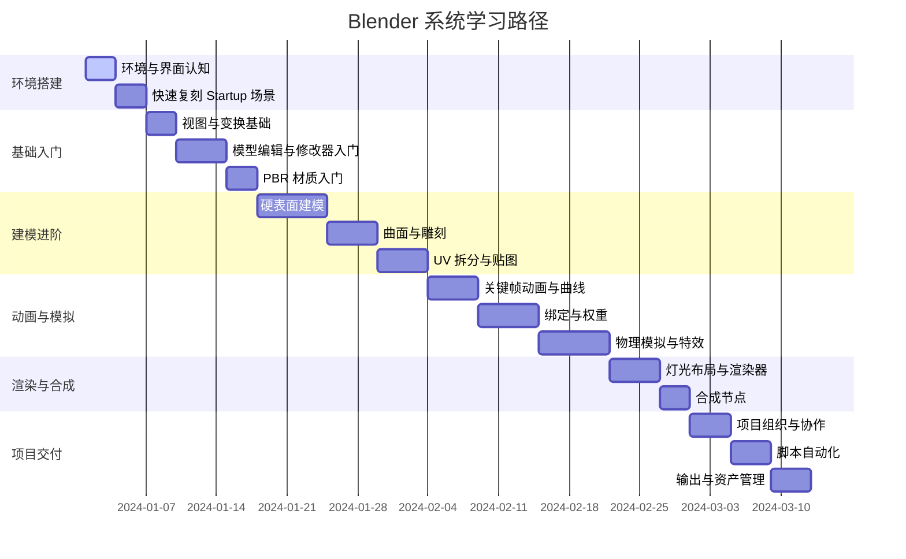

# Blender 全栈实战学习笔记

> 面向 0-5 年经验的三维内容创作者、转行学习者与需要快速建立 Blender 生产能力的技术人员。遵循"概念—步骤—实战—验证—扩展"节奏,确保每一知识点都能在真实项目中落地。

---

## 📚 笔记导航

本学习笔记采用模块化结构,主文件包含核心学习路径,专题内容独立成章:

- **[主文件]** Blender.md - 核心学习路径与基础知识体系
- **[专题]** [Blender-GeometryNodes专题.md](./Blender-GeometryNodes专题.md) - 程序化建模深度实践
- **[专题]** [Blender-Shader材质专题.md](./Blender-Shader材质专题.md) - 10套实战材质配方与节点技巧
- **[专题]** [Blender-Python自动化专题.md](./Blender-Python自动化专题.md) - 插件开发与脚本自动化
- **[专题]** [Blender-实战项目案例集.md](./Blender-实战项目案例集.md) - 完整项目从需求到交付

---

## 学习地图速览

| 学习阶段 | 核心目标 | 关键能力 | 代表实战项目 | 预估时长 |
| --- | --- | --- | --- | --- |
| 第 0 阶段:环境准备 | 完成 Blender 环境搭建与界面认知 | 熟悉界面、视图、文件管理 | 快速重建官方 Startup 场景 | 1-2 天 |
| 第 1 阶段:基础操控入门 | 掌握基础导航、建模与材质 | 操作内置对象,理解变换、修改器 | 制作一个带材质的小型桌面摆件 | 7-10 天 |
| 第 2 阶段:精细建模与贴图 | 建立高低模 workflow,掌握 UV 与 PBR | 创建复杂道具或场景 | 科技产品硬表面建模 | 10-14 天 |
| 第 3 阶段:动画与模拟 | 理解关键帧、曲线编辑、物理系统 | 完成角色或机械动画 | 机械臂运动与粒子特效结合 | 14-21 天 |
| 第 4 阶段:渲染与合成 | 精准控制光影、材质与渲染器参数 | 生成生产级画面并完成合成 | Cycles 渲染 + Eevee 实时预览项目 | 7-10 天 |
| 第 5 阶段:项目交付与扩展 | 完成从建模到交付流程,掌握脚本自动化与插件生态 | 输出多格式资源,对接 DCC/LBE 流程 | 完整产品广告短片交付 | 14 天 |

---

## 学习者画像与前置要求

### 目标学习者定位

- **技术背景**:具备基础计算机操作能力,对三维创作或图形渲染感兴趣的技术人员、设计师或开发者
- **来源领域**:可能来自前端/游戏/工业设计/影视等领域,对三维软件的认知零散
- **数学基础**:熟悉基本的线性代数概念(向量、矩阵)可加速理解空间变换,但不是硬性要求
- **语言能力**:具备一定英文阅读能力,更容易利用官方文档与国外资源

### 核心学习目标

1. **独立完成全流程**:从建模到渲染的完整场景制作流程
2. **项目需求适配**:能够针对不同项目需求(影视、游戏、工业可视化)选择合适的建模/贴图/渲染策略
3. **自动化能力**:具备一定的插件开发或 Python 脚本自动化能力,提高生产效率
4. **资产库建设**:建立可复用的资产库,支撑持续项目交付

### 学习时间规划

- **周投入**:每周建议投入 12-15 小时
- **学习周期**:持续 8-12 周
- **调整机制**:可根据项目紧急程度调整节奏

---

## 学习路径总览



> **使用建议**:可将甘特图视为基准节奏,根据自身底层能力调整。每个阶段建议至少完成 1-2 个实战项目,并记录问题与解决方案,构建个人知识库。

---

## 环境与工具准备

### 硬件与操作系统建议

#### 推荐配置

- **GPU**:推荐 Nvidia RTX 3060 及以上,显存 ≥ 8GB
  - 主要使用 Eevee 可适度降低标准
  - Cycles 渲染或复杂模拟需要更高配置
- **CPU**:建议 6 核以上,主频 ≥ 3.0GHz
  - 涉及多线程模拟(烟雾、布料)时越高越好
- **内存**:至少 16GB,推荐 32GB 以上
  - 满足高精度场景编辑与多软件并行需求
- **存储**:SSD 必须,推荐 NVMe SSD
  - Blender 项目、纹理、缓存使用 NVMe SSD
  - 大型素材可放置在高速外部存储
- **外设**:
  - 搭载滚轮与中键的鼠标(必需)
  - 数位板(可选,雕刻建模时提升效率)
  - 3Dconnexion SpaceMouse(可选,专业三维导航)
  - 双屏配置(推荐,显著提升效率)

### 软件安装与版本管理

#### 下载与安装

1. **官方渠道**
   - [Blender 官方站点](https://www.blender.org/download/)
   - [Steam 版本](https://store.steampowered.com/app/365670/Blender/)

2. **版本选择策略**
   - **生产项目**:使用 LTS(Long-term Support)版本,当前主流为 3.x LTS
   - **新特性体验**:并行安装最新 Stable 或 Beta 版本,使用便携版避免覆盖
   - **版本验证**:
     ```bash
     blender --version
     blender --background --python-expr "print('Hello')"
     ```

3. **多版本共存方案**
   - **Windows**:下载 ZIP 便携版,解压到独立文件夹,自定义快捷方式
   - **macOS**:通过 DMG/Universal 版本安装,多版本放置在 `/Applications` 子目录
   - **Linux**:
     ```bash
     # Snap 安装
     sudo snap install blender --classic

     # Flatpak 安装
     flatpak install flathub org.blender.Blender

     # 或下载 tarball 直接解压运行
     ```
   - **版本管理工具**:使用 Blender Launcher 或 Steam 自动完成更新与切换

4. **必备依赖**
   - GPU 驱动更新到最新稳定版
   - 安装 FFmpeg(Blender 内置,但 CLI 输出需要单独安装)
   - 外部渲染引擎(如 Octane、Redshift)需提前确认硬件与许可证

### 初始配置与工作目录规范

#### 资源目录规划

建议建立如下结构,保持项目可迁移性:

```bash
BlenderProjects/
  ├── 00_Assets/          # 通用资产:HDRI、纹理、模型库
  ├── 01_Study/           # 学习练习项目,包含阶段性案例
  ├── 02_Commercial/      # 商业项目文件夹
  └── templates/          # 自定义 Startup 文件与渲染 preset
```

#### Startup File 自定义

1. 调整首选项(快捷键、主题、添加/移除插件、视图单位)
2. 建立常用 Collection、摄像机与灯光模板
3. 执行 `File -> Defaults -> Save Startup File`,保存为团队统一标准

#### 首选项同步

- 使用 `File -> Defaults -> Save Preferences` 将配置写入用户目录
- **多设备同步**:
  - macOS: `~/Library/Application Support/Blender/<version>/config`
  - Windows: `%APPDATA%\Blender Foundation\Blender\<version>\config`
  - 利用 Blender Cloud 或 Git 管理 `config` 与 `scripts` 文件夹

### 插件与脚本生态

#### 官方内置插件

通过 `Edit -> Preferences -> Add-ons` 启用,推荐:

- **Node Wrangler**:增强 Shader Editor 操作
- **LoopTools**:快速建模辅助
- **Bool Tool**:布尔操作脚本化
- **Sketchfab/BlenderKit**:快速获取云端资产

#### 第三方插件推荐

| 分类 | 插件 | 功能说明 |
| --- | --- | --- |
| 建模效率 | HardOps/Boxcutter、Machin3Tools、Speedflow | 硬表面建模加速 |
| 贴图与材质 | Extreme PBR、Simplicage Library | 材质库管理 |
| 动画与绑定 | Auto Rig Pro、Rigify(官方)、Animation Nodes | 自动绑定与动画节点 |
| 渲染增强 | K-Cycles、Physical Starlight and Atmosphere | 渲染优化与真实天光 |
| 生产管理 | Clean Panels、Asset Browser Manager | 界面优化与资产管理 |

#### 插件安装方法

1. 下载 `.zip` 或 `.py` 文件
2. 在 `Preferences -> Add-ons -> Install` 选择文件
3. 勾选启用,必要时在 `N` 面板找到功能
4. 定期更新版本,记录变更日志

### Blender 与其他工具联动

#### DCC 软件集成

- **Maya/3ds Max**:通过 `FBX/OBJ/Alembic` 交互
  - 注意轴向差异(Blender 默认 Z 轴向上)
  - 统一单位系统与坐标系

#### 游戏引擎对接

- **Unreal Engine**:
  - 使用 `glTF` 或专用插件(UE 官方 Send to Unreal)
  - 配置 Datasmith 支持场景更新
- **Unity**:
  - 导出 glTF 或 FBX
  - 使用 HDRP/URP 材质系统

#### 纹理软件协作

- **Substance 3D Painter/Designer**:导出 PBR 套件后导入 Blender Shader
- **Quixel Mixer**:使用 Megascans 资产库

#### 版本管理

- 使用 Git-LFS 或 Perforce 管理大文件
- Blender 支持 `.blend` 文件作为二进制增量存储
- 可结合 `--background --python` 实现自动打包

> **错误预防**:确保资产路径使用相对路径,开启 `File -> External Data -> Automatically Pack into .blend` 仅适用于小型项目,大型项目需自建素材服务器。

---

## 模块一:基础入门(第 1 阶段)

### 模块目标

✅ 熟练掌握 Blender 界面、导航与常用快捷键
✅ 理解对象模式(Object Mode)与编辑模式(Edit Mode)的区别与切换逻辑
✅ 能够创建基础几何体,并进行移动(G)、旋转(R)、缩放(S)等操作
✅ 理解 Modifier(修改器)工作原理,完成简单非破坏性建模
✅ 能够为模型添加基本材质与贴图,并输出首个渲染结果

### 核心知识点拆解

#### 1. 界面导航与视图控制

**3D 视口操作**:
- `Shift + 中键`:平移视图
- `中键`:旋转视角
- `滚轮`:缩放视图

**视图快捷键**:
- 数字键盘 `1/3/7`:前/侧/顶视图
- `Ctrl + 数字键`:切换到相反方向
- `0`:切换到摄像机视图
- `Home`:聚焦所有对象
- `.`(小数点):聚焦选中对象

**工作区**:
- Layout、Modeling、UV Editing、Shading、Animation、Rendering 等
- 可自定义工作区并保存

#### 2. 对象管理与 Collection

**Outliner 管理**:
- 层级管理、隐藏/显示
- Collection(集合)组织对象
- `Alt + H`:取消隐藏
- `H`:隐藏选中对象

**选择技巧**:
- `A`:全选/取消全选
- `Alt + A`:取消选择
- `Box Select` (B):框选
- `Circle Select` (C):圈选

#### 3. 变换与对齐

**基础变换**:
- `G`:移动(Grab)
- `R`:旋转(Rotate)
- `S`:缩放(Scale)
- 按 `X/Y/Z` 锁定轴向
- 按 `Shift + X/Y/Z` 排除轴向

**精确控制**:
- 数字键输入精确数值
- `Shift`:精细调整
- `Ctrl`:按步长调整
- `Shift + S`:光标与对象的对齐菜单
- `Ctrl + A`:应用变换

#### 4. 基础建模

**编辑模式**:
- `Tab`:切换对象模式/编辑模式
- `1/2/3`:顶点/边/面选择模式

**常用操作**:
- `E`:拉伸(Extrude)
- `I`:内插面(Inset)
- `Ctrl + R`:环切(Loop Cut)
- `K`:刀切(Knife)
- `F`:补面
- `X`:删除菜单

**修改器系统**:
- `Subdivision Surface`:平滑细分
- `Mirror`:镜像建模
- `Array`:阵列复制
- `Bevel`:倒角
- `Boolean`:布尔运算

#### 5. 材质与渲染入门

**渲染器选择**:
- **Eevee**:实时渲染引擎,快速预览
- **Cycles**:路径追踪渲染器,高质量输出

**Viewport Shading 四模式**:
- `Z` 键切换:线框/实体/材质预览/渲染预览

**基础材质**:
- Principled BSDF:基于物理的材质节点
- 基础参数:Base Color、Metallic、Roughness、Normal

**渲染输出**:
- `F12`:渲染当前帧
- `Ctrl + F12`:渲染动画
- 输出设置:分辨率、采样、色彩空间

### 实战案例:桌面造型小摆件

> **案例目标**:在 2 小时内完成一个包含主体模型、材质和简单灯光的桌面摆件(如带灯座的小夜灯)。

#### 步骤 1:初始化项目

1. 使用默认立方体,先应用缩放 (`Ctrl + A`)
2. 切换到 `Edit Mode` (`Tab`)
3. 使用 `Loop Cut` (`Ctrl + R`) 切割出灯罩形状

#### 步骤 2:建立造型

1. 使用 `Modifier -> Subdivision Surface` 平滑灯罩
2. 添加 `Solidify` 修改器控制厚度
3. 使用 `Bevel` 修改器增强棱线
4. 调整参数直到形态满意

#### 步骤 3:材质设置

1. 切换到 Shading 工作区
2. 创建两种材质:
   - **灯罩玻璃**:半透明、发光
     - Transmission: 1.0
     - Roughness: 0.1
     - 添加 Emission 节点
   - **底座金属**:
     - Metallic: 1.0
     - Roughness: 0.3
3. 在 Shader Editor 中使用 `Principled BSDF`

#### 步骤 4:灯光布局

1. 添加 `Area Light` (`Shift + A -> Light -> Area`)
2. 调整灯光位置和强度
3. 在灯罩材质中添加 `Emission` 节点模拟发光

#### 步骤 5:摄像机与渲染

1. 调整视角到理想位置
2. `Ctrl + Alt + 0`:将摄像机对准当前视角
3. 切换到 Eevee 渲染器
4. 启用 `Bloom` 效果表现发光
5. 设置输出:
   - 分辨率:1920x1080
   - 采样:64(预览)或 128(最终)
6. `F12` 渲染并保存输出

#### 步骤 6:成果验证

✅ 渲染图像无明显法线错误与面闪
✅ 模型拓扑清晰,面数可控(< 10k)
✅ 材质表现符合预期,发光部分不过曝
✅ 文件已按目录规范保存

### 常见错误与排查

| 问题 | 原因 | 解决方案 |
| --- | --- | --- |
| 法线反转(模型发黑) | 面朝向错误 | `Edit Mode` 全选 (`A`), `Shift + N` 重计算法线 |
| Modifier 应用顺序混乱 | 不理解修改器堆叠逻辑 | 遵循 Mirror -> Boolean -> Bevel -> Subdivision 顺序 |
| 材质发黑 | 未开启节点或缺少灯光 | 检查 `Use Nodes`,添加光源 |
| 缩放异常 | 未应用变换 | `Ctrl + A` 应用 Location/Rotation/Scale |
| 视图操作卡顿 | 对象太多或细分过高 | 使用 Simplify,降低视口细分级别 |

### 阶段小结与 Checklist

- [ ] 熟悉 Blender 主要界面板块与常用快捷键
- [ ] 能使用 Pivot、Snap、3D Cursor 提高变换精度
- [ ] 能创建并管理 Collection,保持场景整洁
- [ ] 至少完成 1 个包含多材质的静帧作品
- [ ] 将项目文件与渲染输出按照既定目录归档

---

## 模块二:建模进阶(第 2 阶段)

### 模块目标

✅ 建立硬表面与有机建模两套 workflow,理解拓扑优化原则
✅ 掌握常用修改器(Array、Boolean、Lattice、Data Transfer)组合使用
✅ 熟悉高模/低模生产流程,能与游戏引擎实时资产对接
✅ 理解 Box Modeling、Spline Modeling、Sculpting 的适用场景
✅ 掌握 UV 展开、贴图烘焙的基础流程

### 核心知识点拆解

#### 1. 硬表面建模流程

**工作流程**:
1. **参考准备**:从 blueprint 或实物照片开始
2. **Box Modeling**:先用基础几何体搭框架
3. **逐步细化**:添加环线、拉伸、内插
4. **布尔运算**:使用 Boolean 切割结构细节
5. **边缘处理**:使用 Bevel、Weighted Normal

**关键技术**:
- **精准布尔**:使用 `Boxcutter` + `HardOps` 或原生 `Boolean`
- **锐边控制**:
  - `Weighted Normal` modifier
  - `Bevel` 设置 `Limit Method`、`Profile`
  - `Mean Crease` 控制细分边缘

#### 2. 有机建模与雕刻

**雕刻工作流**:
1. **基础形态**:使用 `Dyntopo` 快速草模
2. **细节雕刻**:利用 `Multiresolution` 控制细节层级
3. **笔刷工具**:
   - `Grab`:大范围变形
   - `Clay Strips`:添加体积
   - `Inflate`:膨胀
   - `Pose`:姿态调整
   - `Crease`:折痕

**Remesh 技术**:
- `Voxel Remesh`:快速重建拓扑
- `Quadriflow`:生成四边形拓扑
- `Dyntopo`:动态拓扑,边雕边调整

#### 3. 拓扑优化

**面向动画的拓扑**:
- 保持四边形拓扑
- 边流顺畅,跟随肌肉结构
- 关节处增加环线
- 避免极点(5条以上边汇聚)

**面向渲染的拓扑**:
- 控制面数在预算内
- 关注高光过渡区域
- 使用法线贴图传递高模细节

**重拓扑工具**:
- `Retopoflow` 插件
- `Quad Draw` 手动重建
- `Shrinkwrap` modifier 贴合高模

#### 4. 曲面建模技术

**NURBS/Spline 建模**:
- 适合汽车、工业设计
- `Curve` 对象 -> 转网格 (`Alt + C`)
- 使用 `Bevel` 控制厚度
- `Array` + `Curve Modifier` 沿路径排列

**精细细节控制**:
- `Shrinkwrap`:曲面贴合
- `Surface Deform`:柔性绑定
- `Lattice`:格子变形

#### 5. UV 展开与贴图准备

**UV 展开流程**:
1. **标记缝隙**:`Ctrl + E` -> Mark Seam
2. **智能展开**:`U` -> Smart UV Project 或 Unwrap
3. **UV 编辑**:在 UV Editor 中调整岛屿
4. **最小化拉伸**:`UV -> Minimize Stretch`

**高级技术**:
- **UDIM**:管理大面积纹理,多个贴图区块
- **UV 打包**:使用 `UV Packmaster` 插件优化空间利用
- **导出 UV Layout**:供 Substance Painter 等软件使用

### 实战案例:科技机械臂硬表面建模

> **案例需求**:为虚拟工厂场景制作一款六轴机械臂,要求结构可运动,拓扑干净,可导入 Unreal Engine 实现实时展示。

#### 需求分析

- 参考真实机械臂(ABB、KUKA)结构
- 收集正视/侧视图
- 拆解为:基座、关节、传动杆、末端执行器

#### 建模流程详解

**1. Blocking 阶段**

```
使用 Cube、Cylinder 组合建立基本形状
保持低面数,专注于比例和结构
将各部分组织到不同 Collection
```

**2. 细化阶段**

- 添加 `Subdivision Surface` 辅助控制曲面
- 适度增加环线控制硬边
- 使用 `Loop Tools` 对齐和整理边线

**3. 布尔运算**

- 利用 `Difference` 切割结构细节
- 布尔后使用 `Bevel` 修饰边缘
- 保持干净的拓扑结构

**4. 细节添加**

- `Array` 处理重复结构(螺钉、散热孔)
- 结合 `Empty` 控制阵列方向
- `Mirror` 沿中心轴镜像

**5. 数据传递**

- 使用 `Data Transfer` modifier
- 将精细高模的 Normal 转移到低模
- 保持视觉效果同时降低面数

#### UV 与贴图准备

1. 将机械臂分为几大 UDIM Tile(1001、1002)
2. 确保关键区域(logo、转角)拉伸最小
3. 导出低模 FBX + 法线贴图
4. 为 Substance Painter 烘焙准备

#### 成果检验标准

✅ 拓扑全部四边形,法线流畅
✅ 面数控制在 50k-100k tris(实时渲染标准)
✅ 关节部位保持独立对象
✅ FBX 导出后在 UE 中测试无问题
✅ UV 无明显拉伸和重叠

### 常见问题与解决方案

| 问题 | 原因 | 解决方案 |
| --- | --- | --- |
| 布尔产生非流形几何 | 面重叠、法线错误 | 布尔前应用变换,检查法线;`Mesh -> Clean Up -> Merge by Distance` |
| 雕刻时卡顿 | 面数过高 | 开启 `Simplify`,调整细分限制;使用 `Decimate` 降低面数 |
| 重拓扑困难 | 不熟悉拓扑流线 | 使用 `Grease Pencil` 绘制流线,结合 `Poly Build` 工具 |
| UV 拉伸严重 | 展开方法不当 | 多次 Mark Seam,利用 `Minimize Stretch`;拆分为更多 UV 岛 |
| 修改器顺序错误 | 不理解堆叠逻辑 | 遵循 Mirror -> Boolean -> Bevel -> Subdivision 标准流程 |

### 阶段 Checklist

- [ ] 能针对不同类型模型选择合适的建模策略
- [ ] 完成至少一个硬表面与一个有机模型案例
- [ ] 能独立完成低模、UV 展开并准备贴图烘焙
- [ ] 掌握常用修改器组合,建立个人建模模板
- [ ] 在资产库中整理至少 5 个可复用模型

---

## 模块三:材质、贴图与灯光渲染(第 3 阶段)

### 模块目标

✅ 深入理解 PBR(Physically Based Rendering)材质参数与节点结构
✅ 熟悉 Blender Shader Editor,能构建复杂节点树并复用
✅ 掌握贴图烘焙流程:高到低模法线、AO、Curvature 等
✅ 熟悉 HDRI、三点布光、区域光等灯光布局方法
✅ 掌握 Eevee 与 Cycles 渲染器参数优化

### 核心知识点拆解

#### 1. PBR 材质基础

**PBR 核心通道**:
- **Base Color**:固有色(漫反射颜色)
- **Metallic**:金属度(0=非金属,1=金属)
- **Roughness**:粗糙度(0=光滑,1=粗糙)
- **Normal**:法线贴图(表面细节)
- **AO**:环境光遮蔽(凹陷处变暗)

**材质类型**:
- **金属(Metal)**:Metallic=1,较低的 Roughness
- **非金属(Dielectric)**:Metallic=0,变化的 Roughness
- **次表面散射(SSS)**:皮肤、蜡烛等半透明材质
- **透明(Transmission)**:玻璃、水等

#### 2. Shader Editor 进阶

**Node Wrangler 快捷键**:
- `Ctrl + T`:自动创建贴图节点组
- `Ctrl + Shift + 左键`:预览节点输出
- `Ctrl + J`:合并选中节点为 Frame

**常用节点组合**:
```
Principled BSDF (核心)
├─ Image Texture (贴图输入)
├─ ColorRamp (控制渐变)
├─ Mix Shader (混合材质)
├─ Layer Weight (边缘控制)
├─ Fresnel (菲涅尔效果)
└─ Attribute (获取自定义属性)
```

**节点复用**:
- 选中节点组 -> `Ctrl + G`:创建 Node Group
- 在 Asset Browser 中标记为资产
- 团队共享 assets.blend 文件

#### 3. 贴图烘焙流程

**烘焙类型**:
- **Normal**:法线贴图(高模细节->低模)
- **AO**:环境光遮蔽
- **Curvature**:曲率贴图(用于程序化贴图遮罩)
- **Diffuse**:漫反射颜色
- **Roughness/Metallic**:PBR 参数贴图

**Blender 内部烘焙**:
1. 准备高模和低模
2. UV 展开低模
3. 在 Image Editor 创建空白贴图(32-bit float)
4. 选择低模,`Shift` 选择高模
5. `Render Properties -> Bake`:
   - 设置 `Cage` 避免表面偏移
   - 选择 Bake 类型
   - 点击 `Bake` 执行

**Substance Painter 工作流**:
1. 从 Blender 导出低模 FBX
2. 在 SP 中烘焙 AO/Normal/Curvature
3. 绘制贴图
4. 导出 Metallic/Roughness/Normal 套件
5. 导入 Blender Shader

#### 4. 灯光理论与布光

**三点布光法**:
- **Key Light**:主光源,最强,定义主要明暗
- **Fill Light**:辅光,填充阴影,强度约为主光 1/3-1/2
- **Rim Light**:轮廓光,从背后打亮边缘

**HDRI 环境光**:
- 使用 HDRIHaven、PolyHaven 等资源
- `World Properties -> Surface -> Environment Texture`
- 调整 `Strength` 控制强度
- 使用 `Mapping` 节点旋转方向

**光源类型**:
- **Point Light**:点光源,全方向发光
- **Sun Light**:太阳光,平行光
- **Spot Light**:聚光灯,锥形照射
- **Area Light**:面光源,柔和阴影

**体积光**:
- `Volume Scatter`:光线散射(雾气效果)
- `Volume Absorption`:光线吸收(着色雾气)

#### 5. 渲染器配置

**Eevee(实时渲染)**:
- 启用 `Ambient Occlusion`(SSAO)
- 启用 `Bloom`(辉光效果)
- 启用 `Screen Space Reflections`(SSR)
- 启用 `Shadows` 并调整质量
- 适合:快速预览、实时演示、风格化渲染

**Cycles(路径追踪)**:
- 设置 `Samples`:预览 128-256,最终 512-2048
- 启用 `Adaptive Sampling`:自动优化采样
- 启用 `Denoising`:
  - `OpenImageDenoise`:CPU 降噪
  - `OptiX`:Nvidia GPU 降噪(更快)
- 调整 `Light Paths`:
  - Diffuse/Glossy/Transmission Bounces:控制反弹次数
  - Clamp Indirect:限制噪点
- 适合:最终渲染、产品可视化、写实效果

### 实战案例:科技产品场景渲染

#### 场景准备

1. 导入机械臂模型
2. 使用 `Asset Browser` 快速布置环境
3. 添加背景平面和反射面

#### 材质构建

**金属外壳**:
```
Principled BSDF
├─ Base Color: 灰色(0.8)
├─ Metallic: 1.0
├─ Roughness: 0.3
└─ Normal: 添加细微划痕法线
```

**塑料部件**:
```
Principled BSDF
├─ Base Color: 黑色(0.05)
├─ Metallic: 0.0
├─ Roughness: 0.4
├─ Subsurface: 0.1 (轻微次表面)
└─ Subsurface Color: 微红色调
```

**屏幕 UI**:
```
Mix Shader
├─ Emission (发光贴图)
└─ Principled BSDF (玻璃表面)
```

#### 灯光策略

1. **HDRI 基础环境光**:
   - 使用工业环境 HDRI
   - Strength: 0.5-1.0

2. **三点布光**:
   - Key: Area Light(右前上方),强度 100W
   - Fill: Area Light(左前方),强度 30W
   - Rim: Area Light(后方),强度 50W

3. **体积雾气**:
   - 添加 Cube 作为体积域
   - `Volume Scatter` + `Volume Absorption`
   - Density: 0.01-0.05

#### 渲染优化

**Cycles GPU 设置**:
- Device: GPU Compute
- Samples: 1024
- Adaptive Sampling: 启用,Threshold 0.01
- Denoising: OptiX (Nvidia) 或 OpenImageDenoise

**输出多通道**:
- `View Layer -> Passes` 启用:
  - Diffuse Color
  - Glossy
  - AO
  - Emission
  - Cryptomatte

#### 合成节点

切换到 Compositing 工作区:

```
Render Layers
├─ Glare (辉光效果)
├─ Color Balance (调色)
├─ Lens Distortion (镜头畸变)
└─ Cryptomatte (精确蒙版)
```

#### 成果验证

✅ 纹理无拉伸与接缝
✅ 光影过渡自然,无明显噪点
✅ 输出 EXR(32-bit)与 PNG(8-bit)
✅ 渲染时间在可接受范围内(< 5min/frame)

### 专题资源链接

> **深度学习**:详细的 Shader 材质配方和节点技巧,请参考 [Blender-Shader材质专题.md](./Blender-Shader材质专题.md)

### 阶段 Checklist

- [ ] 熟悉 Principled Shader 全部参数
- [ ] 能独立完成贴图烘焙,导出标准 PBR 套件
- [ ] 能在 2 小时内布光并完成高质量静帧渲染
- [ ] 能使用 Compositor 完成基础调色与特效
- [ ] 建立个人材质库(至少 20 组)

---

## 模块四:动画、绑定与物理模拟(第 4 阶段)

### 模块目标

✅ 掌握关键帧、曲线编辑器(Graph Editor)与 Dope Sheet 协同使用
✅ 理解骨骼(Armature)系统、权重绘制与常见约束(Constraint)
✅ 熟悉非线性动画编辑(NLA)与动作复用
✅ 掌握布料、刚体、粒子、烟雾等物理系统基础
✅ 理解 Geometry Nodes 与动画的结合方式

### 核心知识点拆解

#### 1. 动画基础

**关键帧操作**:
- `I`:插入关键帧
- `Alt + I`:删除关键帧
- 支持属性:Location、Rotation、Scale、Custom Properties、Shape Keys

**插值模式**:
- `Bezier`:平滑曲线,可调节切线
- `Linear`:线性插值
- `Constant`:阶跃,无过渡
- `Ease In/Out`:缓入缓出

**Graph Editor(曲线编辑器)**:
- 调节曲线切线控制运动节奏
- 关键帧加权
- F-Curve Modifiers:
  - `Cycles`:循环重复
  - `Noise`:添加随机抖动
  - `Ping Pong`:来回循环

#### 2. 骨骼绑定系统

**Armature 创建**:
1. `Shift + A -> Armature -> Single Bone`
2. 在 `Edit Mode` 中添加和调整骨骼
3. 建立父子关系(选中子骨骼,`Shift` 选父骨骼,`Ctrl + P`)

**IK vs FK**:
- **Forward Kinematics (FK)**:从父到子传递运动,适合机械臂
- **Inverse Kinematics (IK)**:从子到父反向计算,适合角色腿部

**常用约束**:
- `Copy Rotation`:复制旋转
- `Copy Location`:复制位置
- `Limit Rotation`:限制旋转范围
- `Track To`:始终朝向目标

**权重绘制**:
- `Ctrl + Tab`:切换到 Weight Paint 模式
- `Normalize All`:规范化所有权重
- `Vertex Group` 管理各骨骼影响范围

#### 3. 形态动画

**Shape Keys(形态键)**:
- 用于面部表情、口型同步
- `Value`:控制形态强度(0-1)
- 可添加关键帧制作表情动画

**Driver(驱动器)**:
- 通过表达式控制属性
- 连接 Slider 与骨骼控制
- 例:`#frame / 10` 让属性随时间变化

#### 4. 非线性动画编辑(NLA)

**NLA Editor**:
- 将动作(Action)推至 NLA 轨道
- 实现动作叠加、混合、重用
- `Strip` 的混合模式:Add、Subtract、Multiply

**动作管理**:
- `Fake User`:保护动作不被删除
- `Push Down`:将当前动作推入 NLA
- `Time Remapping`:调整播放速度

#### 5. 物理模拟系统

**刚体(Rigid Body)**:
- `Active`:主动刚体,受重力和力场影响
- `Passive`:被动刚体,不移动但可碰撞
- `Collision Groups`:控制哪些对象相互碰撞
- 调整 `Mass`(质量)、`Friction`(摩擦)、`Bounciness`(弹性)

**布料(Cloth)**:
- `Quality Steps`:模拟精度(越高越稳定)
- `Stiffness`:布料硬度
- `Damping`:阻尼(减少震荡)
- `Collision`:碰撞设置(Distance、Self Collision)

**粒子(Particles)**:
- `Emitter`:发射器类型
- `Number`:粒子数量
- `Lifetime`:生命周期
- `Force Fields`:力场(重力、风、涡流)
- 渲染模式:Object、Collection、Path

**烟雾与火焰(Smoke/Fire)**:
- `Domain`:模拟域(计算空间)
- `Flow`:流体发射器
- `Resolution`:解析精度(越高越细腻,越慢)
- `Vorticity`:涡流强度

**流体(Fluid)**:
- `Mantaflow`:Blender 内置流体系统
- 类型:Liquid、Gas
- 缓存管理:保存到磁盘以加速预览

#### 6. Geometry Nodes 动画

**基础概念**:
- 通过 `Scene Time` 节点获取时间
- 使用 `Value` 节点驱动参数变化
- `Instance on Points` 创建程序化动画

**应用场景**:
- 大量对象的程序化运动
- 粒子群体行为模拟
- 参数化动画效果

> **深度学习**:详细的 Geometry Nodes 程序化工作流,请参考 [Blender-GeometryNodes专题.md](./Blender-GeometryNodes专题.md)

### 实战案例:机械臂装配动画

> **案例目标**:制作机械臂抓取零件并放置到流水线的动画,结合刚体模拟与摄像机运动。

#### 骨骼搭建

1. 为机械臂各关节创建骨骼链
2. 使用 `Copy Rotation` 约束保持与模型轴向一致
3. 末端夹具建立 `IK` 控制器
4. 配置 `Pole Target` 避免关节翻转

#### 关键帧动画

1. 使用 `Auto Keying` 记录关键帧
2. 在 `Graph Editor` 中调整缓入缓出
3. 使机械臂运动符合真实机械特性

#### 刚体模拟

1. 将零件设为 `Passive` 初始状态
2. 被抓取时使用关键帧切换为 `Active`
3. 使用 `Rigid Body Constraint` 实现吸附
4. 控制缓存帧范围与子帧精度

#### 成果输出

✅ 动画流畅无卡顿
✅ 物理模拟稳定无穿模
✅ 摄像机运动自然
✅ 导出 FBX 到 Unreal Engine 测试通过

### 常见问题与解决方案

| 问题 | 原因 | 解决方案 |
| --- | --- | --- |
| 骨骼翻腕 | Pole Target 位置不当 | 调整 Pole Target,或使用 IK Chain Length 限制 |
| 权重穿插 | 权重分配不合理 | 开启 Auto Normalize,在 Weight Paint 中逐骨骼校正 |
| 布料穿模 | 碰撞距离过小 | 提高 Quality Steps,检查缩放是否应用 |
| 粒子抖动 | 缓存精度不足 | 增加缓存样本,使用 Subframe 控制 |
| 模拟缓存丢失 | 项目移动或重命名 | 启用 Disk Cache,并在版本管理中备份缓存目录 |

### 阶段 Checklist

- [ ] 熟悉关键帧、曲线编辑器与 Dope Sheet
- [ ] 能够为角色或机械建立骨骼并完成动作制作
- [ ] 在项目中使用至少一种物理模拟
- [ ] 完成至少一个 10-30 秒的动画片段
- [ ] 理解 NLA 编辑器的动作复用机制

---

## 模块五:渲染、合成与输出(第 5 阶段)

### 模块目标

✅ 根据项目需求在 Cycles、Eevee 之间选择渲染器
✅ 熟悉渲染层(Render Layers)与 AOV 输出
✅ 掌握合成节点(Compositor)工作流
✅ 针对不同交付场景配置输出格式与色彩管理
✅ 建立渲染优化思路,平衡质量与性能

### 核心知识点拆解

#### 1. 渲染器深度配置

**Cycles 高级参数**:
```
Render Properties
├─ Device: GPU Compute (Nvidia/AMD)
├─ Samples: 512-2048 (最终渲染)
├─ Light Paths
│  ├─ Max Bounces: 12 (总反弹)
│  ├─ Diffuse: 4
│  ├─ Glossy: 4
│  ├─ Transmission: 12
│  └─ Clamp Indirect: 10 (控制火点)
├─ Performance
│  ├─ Tiles: Auto
│  └─ Persistent Data: 启用
└─ Denoising: OptiX/OpenImageDenoise
```

**Eevee 高级设置**:
```
Render Properties
├─ Sampling
│  ├─ Viewport: 16
│  └─ Render: 64-128
├─ Ambient Occlusion: 启用
├─ Bloom: 启用 (辉光)
├─ Screen Space Reflections: 启用
├─ Shadows
│  ├─ Cube Size: 2048
│  └─ Cascade Size: 2048
└─ Volumetrics: 启用 (体积光)
```

#### 2. 渲染层与通道

**View Layer 管理**:
- 使用 `Collections` 控制可见性
- 每个 View Layer 可独立设置
- 适合分层渲染(角色/背景/特效)

**Passes(通道)输出**:
- `Combined`:最终合成结果
- `Diffuse Color`:漫反射颜色
- `Glossy`:镜面反射
- `Shadow`:阴影
- `AO`:环境光遮蔽
- `Emission`:发光
- `Z-Depth`:深度信息
- `Cryptomatte`:精确蒙版
- `Mist`:雾气深度

**Light Groups**:
- 分离不同灯光的影响
- 后期可独立调整每组灯光强度

#### 3. 合成节点流程

**基础合成流程**:
```
Render Layers
├─ Glare (辉光/星芒效果)
├─ Color Balance (调色)
├─ RGB Curves (曲线调整)
├─ Lens Distortion (镜头畸变)
├─ Vignette (暗角)
└─ Denoise (降噪)
```

**高级技巧**:
- `Cryptomatte`:通过对象/材质精确选择
- `Vector Blur`:运动模糊(使用 Vector Pass)
- `Defocus`:景深(使用 Z Pass)
- `Mix` 节点:混合多个渲染层

**节点复用**:
- 将合成节点保存为 `Node Group`
- 在 Asset Browser 中管理
- 跨项目复用调色预设

#### 4. 色彩管理

**色彩空间**:
- **Filmic**:电影级色彩管理(推荐)
- **Standard**:传统 sRGB
- **False Color**:检查曝光

**View Transform**:
- `Filmic`:默认,动态范围大
- `Filmic Log`:对数,更多细节
- `Standard`:传统 sRGB

**Look**:
- `None`
- `Medium Contrast`
- `High Contrast`
- `Very High Contrast`

**LUT 应用**:
- 使用外部 LUT 文件
- 统一项目色调

#### 5. 输出与交付

**图像序列输出**:
- **EXR**:32-bit,支持多通道,适合后期
- **PNG**:8/16-bit,无损压缩
- **TIFF**:支持 16-bit,高质量

**视频编码**:
- **FFmpeg**:
  - H.264:通用格式,适合网络
  - H.265:更高压缩率
  - ProRes:专业视频编辑
- **设置**:
  - 比特率:根据质量需求调整
  - 关键帧间隔:24-30

**多格式导出**:
- `File -> Export`:
  - FBX:游戏引擎
  - OBJ:通用 3D 格式
  - glTF/GLB:Web3D、实时渲染
  - Alembic:复杂动画缓存

#### 6. 性能优化

**渲染优化策略**:
1. **Render Region**:
   - `Ctrl + B`:框选渲染区域
   - 局部测试光照和材质

2. **Simplify**:
   - 限制最大细分
   - 限制贴图尺寸
   - 降低 AO 和 SSS 质量

3. **分布式渲染**:
   - **Flamenco**:官方渲染农场管理
   - **Deadline**:商业渲染队列系统
   - **Blender Network Render**:简单网络渲染

4. **缓存管理**:
   - 物理模拟缓存到磁盘
   - 定期清理临时文件

### 实战案例:产品广告短片渲染

#### 场景拆层

1. 将产品主体、背景、特效分离到不同 View Layer
2. 使用 `Holdout` 实现遮罩
3. 每层单独渲染,后期合成

#### 灯光设计

**Light Rig 搭建**:
- **Key Light**:Area Light,100W,右前上方
- **Fill Light**:Area Light,30W,左前方
- **Rim Light**:Area Light,50W,后方
- **HDRI**:环境光,强度 0.5

#### 摄像机设置

1. 添加 `Camera Depth of Field`
2. 焦点对象:产品主体
3. F-Stop: 2.8(浅景深)
4. 在 `Graph Editor` 中为摄像机添加缓动

#### 渲染与合成

**Cycles 渲染设置**:
- 分辨率:3840x2160(4K)
- 采样:2048
- Denoising:OptiX
- 输出 Passes:Cryptomatte、Z、Emission、Mist

**Compositor 合成**:
```
Render Layers
├─ Denoise (OptiX)
├─ Color Balance (调色)
├─ Glare (Bloom 辉光)
├─ Lens Distortion (轻微畸变)
├─ Vignette (暗角)
└─ Cryptomatte (精确蒙版)
```

#### 后期整合

1. 导出序列帧(EXR)
2. 导入 DaVinci Resolve 或 Blender Video Sequencer
3. 加入音效、BGM
4. 色彩空间转换(HDR/SDR)
5. 输出多版本:
   - 8-bit H.264(社交媒体)
   - 10-bit ProRes(客户交付)

### 常见问题排查

| 问题 | 原因 | 解决方案 |
| --- | --- | --- |
| 渲染闪烁 | 采样不足 | 提高 Samples,使用 Temporal Stabilization |
| 色彩管理混乱 | 色彩空间不一致 | 统一使用 Filmic,导出时保持色彩空间 |
| 输出序列丢帧 | 渲染中断 | 使用 Overwrite 选项,渲染前清理缓存 |
| GPU 内存不足 | 场景过大 | 切换 CPU 渲染,开启 Out-of-core,降低贴图 |
| 合成节点性能低 | 节点树复杂 | 启用 Chunk Size 调优,分段合成 |

### 阶段 Checklist

- [ ] 能根据项目需求确定渲染器与输出设置
- [ ] 熟练使用 View Layer、Passes 分层渲染
- [ ] 完成至少一个 10 秒以上的渲染片段
- [ ] 具备基础色彩管理知识
- [ ] 了解分布式渲染接入流程

---

## 模块六:项目管线、自动化与协作(第 6 阶段)

### 模块目标

✅ 建立团队统一的项目结构、命名规范与资产管理策略
✅ 掌握 Blender Python API 基础,编写脚本提升效率
✅ 理解跨软件协作流程,与版本控制系统集成
✅ 搭建渲染自动化、批处理导出等管线工具
✅ 从项目需求到交付全流程把控质量

### 项目组织与命名规范

#### 目录结构标准

```bash
ProjectName_YYYYMM/
├── README.md              # 项目说明
├── scenes/                # 场景文件
│   ├── shot_001_v001.blend
│   └── shot_002_v001.blend
├── assets/                # 资产库
│   ├── models/
│   ├── materials/
│   └── hdri/
├── textures/              # 纹理贴图
├── renders/               # 渲染输出
│   ├── shot_001/
│   └── shot_002/
├── cache/                 # 模拟缓存
├── scripts/               # 自动化脚本
└── docs/                  # 技术文档
```

#### 命名规范

**文件命名**:
```
<类型>_<描述>_<版本>_<作者>.blend

例如:
scene_factoryLayout_v003_zwang.blend
asset_robotArm_v002_alice.blend
```

**对象命名**:
```
<前缀>_<描述>_<序号>

前缀规范:
- CHR: 角色
- PROP: 道具
- ENV: 环境
- CAM: 摄像机
- LGT: 灯光

例如:
CHR_Worker_001
PROP_RobotArm_001
ENV_Factory_Floor
```

### 版本管理

#### Git 工作流

**仓库结构**:
```
project-repo/
├── .gitignore
├── .gitattributes         # Git-LFS 配置
├── blender/               # Blender 文件
├── assets/                # 大文件(Git-LFS)
└── scripts/               # Python 脚本
```

**.gitignore 配置**:
```
# Blender 自动保存
*.blend1
*.blend2

# 缓存文件
cache/
*.abc

# 临时文件
tmp/
*.tmp
```

**.gitattributes (Git-LFS)**:
```
*.blend filter=lfs diff=lfs merge=lfs -text
*.png filter=lfs diff=lfs merge=lfs -text
*.jpg filter=lfs diff=lfs merge=lfs -text
*.exr filter=lfs diff=lfs merge=lfs -text
*.hdr filter=lfs diff=lfs merge=lfs -text
```

#### 任务管理

**推荐工具**:
- **ShotGrid**(原 Shotgun):专业影视管线
- **ftrack**:项目跟踪与资产管理
- **Notion**:灵活的知识库与任务看板
- **Jira**:软件团队项目管理

### Blender Python 自动化

#### 基础概念

**核心模块**:
- `bpy.data`:访问 Blender 数据(对象、材质、纹理等)
- `bpy.context`:当前上下文(选中对象、活动场景等)
- `bpy.ops`:操作符(执行命令)

**脚本执行方式**:
1. **Text Editor**:内部编辑器,`Alt + P` 运行
2. **Scripting 工作区**:专门的脚本环境
3. **命令行**:
   ```bash
   blender --background --python script.py
   ```

#### 实用脚本示例

**批量导入 FBX**:
```python
import bpy
from pathlib import Path

input_dir = Path("/path/to/fbx")

for fbx in input_dir.glob("*.fbx"):
    bpy.ops.import_scene.fbx(filepath=str(fbx))
    # 自定义处理
    obj = bpy.context.selected_objects[0]
    obj.location = (0, 0, 0)
```

**批量重命名**:
```python
import bpy

for obj in bpy.data.objects:
    if obj.type == 'MESH':
        # 规范化命名
        obj.name = obj.name.replace(' ', '_').upper()
        # 启用自动平滑
        obj.data.use_auto_smooth = True
```

**批量渲染多视图层**:
```python
import bpy

scene = bpy.context.scene
render = scene.render
render.engine = 'CYCLES'

for view_layer in scene.view_layers:
    scene.view_layers.active = view_layer
    render.filepath = f"/mnt/render/{view_layer.name}_"
    bpy.ops.render.render(write_still=True)
```

> **深度学习**:完整的插件开发教程和高级自动化案例,请参考 [Blender-Python自动化专题.md](./Blender-Python自动化专题.md)

### 协作与交付流程

#### 生产阶段划分

**Pre-production(前期)**:
- 分镜设计
- 资产清单
- 风格指引
- 技术可行性评估

**Production(制作)**:
- 建模
- 贴图
- 动画
- 灯光
- 渲染

**Post-production(后期)**:
- 合成
- 剪辑
- 调色
- 音效
- 交付

#### 质量控制

**每日流程**:
1. 提交 `Playblast` 或 Viewport 录屏
2. 使用 `Shot Review` 工具(如 SyncSketch)收集反馈
3. 更新任务状态

**QA 检查表**:
- [ ] 拓扑无非流形几何
- [ ] 材质无缺失贴图
- [ ] 灯光无过曝或死黑
- [ ] 渲染参数符合规范
- [ ] 文件命名符合规范
- [ ] 版本已提交到仓库

#### 交付与归档

**最终交付清单**:
1. 最终渲染文件(EXR/MP4/MOV)
2. 源文件(打包的 .blend)
3. 资产库(模型、材质、贴图)
4. 技术文档(README、参数说明)
5. 项目总结报告

**归档策略**:
- 整理到归档服务器
- 保留 3 个月热备份
- 重要项目长期归档

### 常见问题排查

| 问题 | 原因 | 解决方案 |
| --- | --- | --- |
| 团队命名不统一 | 缺乏规范 | 制定命名手册,使用脚本自动检测 |
| 插件版本不一致 | 未统一管理 | 建立插件仓库,使用启动脚本同步 |
| 渲染排队冲突 | 无调度机制 | 使用 Flamenco 等工具,设置优先级 |
| Python 脚本失效 | API 版本变更 | 脚本中加入版本检测,使用 try/except |
| 文件丢失 | 无备份机制 | 开启自动备份,设置 2-3 分钟间隔 |

### 阶段 Checklist

- [ ] 建立统一的项目目录和命名规范
- [ ] 编写并部署至少 2 个自动化脚本
- [ ] 熟悉渲染队列或分布式渲染
- [ ] 建立资产库管理流程
- [ ] 清晰描述项目从需求到交付的每个环节

---

## 实战项目路线图

为帮助学习者将各模块知识融会贯通,设计以下三条实战项目路线:

### 路线一:产品可视化

**适合人群**:工业设计、产品渲染、广告制作

| 阶段 | 项目 | 核心技能 | 预期成果 |
| --- | --- | --- | --- |
| 1 | 桌面摆件 | 基础建模、材质、渲染 | 静帧渲染图 |
| 2 | 科技机械臂 | 硬表面建模、PBR 材质 | 高质量产品渲染 |
| 3 | 30 秒产品广告 | 动画、灯光、合成 | 短视频成片 |
| 4 | 批量输出自动化 | Python 脚本、管线 | 自动化工具集 |

### 路线二:角色动画

**适合人群**:游戏开发、动画制作、角色设计

| 阶段 | 项目 | 核心技能 | 预期成果 |
| --- | --- | --- | --- |
| 1 | 低模角色建模 | 建模基础、UV 展开 | 角色模型 |
| 2 | 高模雕刻 | 雕刻、贴图烘焙 | PBR 贴图套件 |
| 3 | 角色绑定 | Rigify、权重绘制 | 完整 Rig |
| 4 | 动作制作 | 关键帧、曲线编辑 | 走/跑/跳动作 |
| 5 | 实时引擎导出 | FBX/glTF、引擎对接 | UE/Unity 可用资产 |

### 路线三:数字孪生/工业仿真

**适合人群**:工业可视化、XR 开发、数据可视化

| 阶段 | 项目 | 核心技能 | 预期成果 |
| --- | --- | --- | --- |
| 1 | 工厂场景基础建模 | 建模、场景组织 | 场景模型 |
| 2 | 关键设备详细建模 | 硬表面、参数化 | 设备资产库 |
| 3 | 数据驱动动画 | Geometry Nodes、Python | 程序化动画 |
| 4 | 实时交互集成 | WebGL/XR、优化 | 交互演示系统 |

---

## 学习成果验证标准

### 1. 技能闯关任务

**基础级**:
- ✅ 90 分钟内完成 5 个以上对象的静态场景 + Eevee 渲染

**中级**:
- ✅ 3 天内完成含 Rigify 绑定的 15 秒角色动画 + 布料模拟

**高级**:
- ✅ 编写批处理脚本:批量导入、重命名、渲染预览输出

### 2. 质量量化指标

**几何拓扑**:
- 关键区域四边形比例 ≥ 90%
- 无非流形面与重复顶点

**渲染质量**:
- Cycles 噪点水平(1080p, 256 采样)< 0.015
- Eevee 帧率 ≥ 30 FPS

**贴图一致性**:
- PBR 材质在 Eevee/Cycles 显示差异 < 10%

**动画平滑度**:
- 曲线编辑器无尖刺
- 最大加速度变化率(jerk)在合理范围

### 3. 项目交付验收

**必需文件**:
- 完整项目文件(.blend + 贴图 + 缓存 + 脚本)
- 目录结构符合规范
- 技术文档(README、参数说明)

**实时引擎验收**:
- 提供导入演示视频或截图
- 附性能指标(帧率、面数、贴图内存)

### 4. 团队协作指标

- 任务状态更新及时率 ≥ 95%
- 脚本工具使用反馈 ≥ 3 条
- 渲染队列任务失败率 < 5%

---

## 扩展资源与进阶路径

### 官方资源

- **Blender 官方文档**:[https://docs.blender.org/](https://docs.blender.org/)
- **Blender Studio & Open Projects**:研究官方项目结构
- **Blender Today / Blender Nation**:最新版本特性与插件

### 学习社区与课程

**国际平台**:
- CG Cookie、FlipNormals、Gumroad 高质量课程
- Blender StackExchange 问答社区
- BlenderArtists 论坛

**国内社区**:
- 哔哩哔哩 BlenderCN
- 知乎 Blender 专栏
- QQ 群/Discord 中文社区

**推荐频道**:
- Grant Abbitt:基础建模与场景设计
- Ian Hubert:超高速场景搭建
- Erindale:Geometry Nodes 深入
- Ducky 3D:材质与节点特效

### 进阶方向

**1. 电影级管线**:
- 与 Houdini、Nuke 联动
- Blender 用于 previz、lookdev
- 学习 VFX 行业标准流程

**2. 实时引擎深度集成**:
- 学习 USD、Alembic 格式
- Nvidia Omniverse 流程
- 接入 Unreal/Unity 实时管线

**3. 几何节点程序化**:
- 深入 Field、Simulation、Solvers
- 构建程序化资产库
- 开发自定义节点插件

**4. 技术美术(TA)**:
- 强化脚本、Shader、性能优化
- 与游戏引擎团队协作
- 开发管线工具集

**5. XR/交互体验**:
- 结合 WebXR、Three.js、Babylon.js
- 实现实时 3D 交互体验
- VR/AR 内容制作

---

## 持续提升与复盘机制

### 学习节奏建议

**3-2-1 复盘模型**:
- 完成 3 个练习
- 总结 2 个问题
- 整理 1 篇技术笔记

**周度节奏**:
- 每周至少一次作品打磨与点评
- 记录学习日志,跟踪进度
- 参与社区分享或挑战

**月度专题**:
- 选定一个主题(硬表面/动画/节点)
- 制作专题作品集
- 总结最佳实践

### 知识图谱构建

**工具推荐**:
- 思维导图(XMind、MindNode)
- 知识库(Obsidian、Notion)
- 代码片段(GitHub Gist)

**管理策略**:
- 整理脚本、节点树、材质预设
- 建立可引用的知识片段
- 与团队共享最佳实践

### 作品集策略

**作品集组织**:
- 建立主题明确的作品集(产品/角色/建筑)
- 每个项目附技术说明
- 记录参数、问题与优化点

**Demo Reel 制作**:
- 控制在 1-2 分钟
- 突出核心技能
- 高质量渲染,专业配乐

### 社群与合作

- 参与 Blender 官方开发者周会
- 与程序员合作开发插件
- 与设计师合作综合项目
- 关注招聘市场需求,调整学习重点

---

## 附录 A:快捷键速查(按工作流分类)

### 视图与导航

| 快捷键 | 功能 |
| --- | --- |
| `中键` | 旋转视图 |
| `Shift + 中键` | 平移视图 |
| `滚轮` | 缩放视图 |
| `数字键 1/3/7` | 前/侧/顶视图 |
| `数字键 0` | 摄像机视图 |
| `Home` | 聚焦所有对象 |
| `.` (小数点) | 聚焦选中对象 |
| `Shift + 空格` | 全屏当前区域 |
| `Ctrl + 空格` | 最大化/恢复区域 |
| `Shift + C` | 重置 3D 光标与视图 |

### 选择与变换

| 快捷键 | 功能 |
| --- | --- |
| `A` | 全选/取消全选 |
| `B` | 框选 |
| `C` | 圈选 |
| `G` | 移动 |
| `R` | 旋转 |
| `S` | 缩放 |
| `X/Y/Z` | 锁定轴向 |
| `Shift + X/Y/Z` | 排除轴向 |
| `Shift + D` | 复制 |
| `Alt + D` | 关联复制 |
| `Ctrl + A` | 应用变换 |
| `Shift + S` | 光标/对象对齐菜单 |

### 建模

| 快捷键 | 功能 |
| --- | --- |
| `Tab` | 切换对象/编辑模式 |
| `1/2/3` | 顶点/边/面模式 |
| `E` | 拉伸 |
| `I` | 内插面 |
| `Ctrl + R` | 环切 |
| `K` | 刀切 |
| `F` | 补面 |
| `X` | 删除菜单 |
| `Ctrl + B` | 倒角 |
| `Ctrl + Shift + B` | 顶点倒角 |
| `Alt + S` | 法线方向缩放 |
| `Shift + N` | 重计算法线 |
| `M` | 合并顶点 |

### 材质与渲染

| 快捷键 | 功能 |
| --- | --- |
| `Z` | 视图着色模式切换 |
| `F12` | 渲染当前帧 |
| `Ctrl + F12` | 渲染动画 |
| `Ctrl + B` (渲染视图) | 设置渲染区域 |
| `Ctrl + Alt + B` | 取消渲染区域 |

### 动画

| 快捷键 | 功能 |
| --- | --- |
| `I` | 插入关键帧 |
| `Alt + I` | 删除关键帧 |
| `空格` | 播放/暂停动画 |
| `Shift + ←/→` | 跳转到首/尾帧 |

### Node Editor

| 快捷键 | 功能 (需 Node Wrangler) |
| --- | --- |
| `Ctrl + T` | 自动创建贴图节点组 |
| `Ctrl + Shift + 左键` | 预览节点输出 |
| `Ctrl + J` | 合并节点为 Frame |

---

## 附录 B:术语对照表(中英双语)

| 中文 | 英文 | 说明 |
| --- | --- | --- |
| 对象模式 | Object Mode | 操作整体对象的模式 |
| 编辑模式 | Edit Mode | 编辑顶点、边、面的模式 |
| 修改器 | Modifier | 非破坏性操作工具 |
| 关键帧 | Keyframe | 记录动画属性的时间点 |
| 曲线编辑器 | Graph Editor | 调整动画曲线的窗口 |
| 骨骼 | Armature | 控制角色/机械的骨架 |
| 权重 | Weight | 骨骼对顶点的影响权重 |
| 粒子系统 | Particle System | 创建粒子效果的系统 |
| 几何节点 | Geometry Nodes | 程序化建模与效果系统 |
| 实例 | Instance | 引用同一几何的轻量拷贝 |
| 渲染层 | View Layer | 控制渲染输出的层级 |
| 贴图烘焙 | Baking | 将信息写入贴图 |
| 资产浏览器 | Asset Browser | 管理可复用资产的界面 |
| 驱动器 | Driver | 用表达式控制属性的系统 |
| 形态键 | Shape Key | 控制模型形变的关键值 |
| HDRI | High Dynamic Range Image | 高动态范围环境光 |
| UV | UV Coordinates | 3D 模型展开到 2D 的方式 |
| NLA | Nonlinear Animation | 非线性动画编辑器 |

---

## 附录 C:常见 Bug 排查速查表

| 问题现象 | 可能原因 | 排查步骤 | 解决方案 | 预防策略 |
| --- | --- | --- | --- | --- |
| 模型渲染发黑 | 法线反转、采样不足 | 切换法线显示,检查采样 | 重计算法线,增加采样 | 保持拓扑干净,应用变换 |
| 布料穿插 | 碰撞距离小、缓存不足 | 检查布料设置 | 增加质量步骤和子步 | 使用统一缩放模型 |
| 渲染卡顿 | 贴图过大、反弹过多 | 检查材质和统计 | 使用 Simplify,降低反弹 | 建立贴图规范 |
| 插件失效 | 版本不兼容 | 查看 Console 报错 | 更新插件或 Blender | 统一插件版本 |
| FBX 导出错误 | 命名不规范、未应用变换 | 检查命名和单位 | 应用变换,规范命名 | 建立导出 Checklist |
| 色彩偏差 | 色彩空间不一致 | 检查 View Transform | 使用正确色彩管理 | 记录项目色彩设定 |

---

## 附录 D:学习 Checklist 总表

```markdown
# Blender 学习实践 Checklist

## 基础阶段
- [ ] 完成环境搭建与首选项配置
- [ ] 设定统一目录结构与命名规范
- [ ] 完成基础建模作品 3 个
- [ ] 熟悉 Blender 主要快捷键(至少 30 个)

## 建模阶段
- [ ] 完成硬表面作品 2 个
- [ ] 完成有机模型(雕刻)1 个
- [ ] 掌握 UV 展开和贴图烘焙

## 材质与渲染
- [ ] 建立材质库(至少 20 组)
- [ ] 完成产品级渲染作品 1 个
- [ ] 能在 2 小时内完成高质量静帧

## 动画与模拟
- [ ] 完成角色建模与 Rigify 绑定
- [ ] 制作 30 秒动画短片
- [ ] 使用至少一种物理模拟(布料/粒子)

## 项目与自动化
- [ ] 开发或部署 3 个 Python 脚本
- [ ] 在 Unreal/Unity 完成导入测试
- [ ] 运行渲染农场任务
- [ ] 撰写至少 6 篇技术笔记

## 作品集
- [ ] 完成 1 次作品集更新与分享
- [ ] 制作 Demo Reel(1-2 分钟)
```

---

## 后续行动建议

### 1. 建立个人作品集路线图

根据职业目标选择一条实战路线:
- 产品可视化路线
- 角色动画路线
- 数字孪生/工业仿真路线

规划 2-3 个代表作品,设定完成时间

### 2. 制定学习复盘节奏

- **每周**:撰写学习日志,总结关键收获
- **每月**:复查 Checklist,调整学习计划
- **每季度**:作品集更新,参加社区活动

### 3. 参与社区与竞赛

- 每季度至少参加一次 Blender 社区活动或比赛
- 在 BlenderArtists、ArtStation 分享作品
- 参与 Daily Challenge 积累经验

### 4. 扩展跨领域技能

结合其他技能增强作品表现力:
- **摄影**:理解构图、光影
- **编程**:深化脚本能力
- **UI 设计**:提升界面审美
- **音效制作**:完善作品呈现

### 5. 保持技术前瞻

- 关注 Blender 官方 Roadmap
- 提前评估新特性(Geometry Nodes、Real-time Compositor)
- 跟踪行业趋势(USD、Omniverse、XR)

---

## 结语

通过以上结构化学习与实践安排,学习者可以逐步构建起 Blender 的系统知识体系,并将技能应用到真实生产环境中。

**成功关键要素**:
1. **持续迭代**:每个项目都比上一个更好
2. **主动复盘**:总结问题,形成个人知识库
3. **团队协作**:与他人合作,学习最佳实践
4. **保持热情**:三维创作是技术与艺术的结合,享受创造的过程

**记住**:
> "The best way to learn Blender is by doing. Start small, iterate fast, and never stop creating."

祝你在 Blender 学习之旅中收获满满! 🎨🚀

---

**笔记版本**: v2.0 (模块化结构)
**最后更新**: 2025-01-06
**维护者**: Claude Code Tech Note Generator
**许可**: CC BY-SA 4.0
