# 网络协议（Network Protocol）深度学习笔记

## 📋 学习路径总览

```mermaid
graph LR
    A[协议基础概念] --> B[协议分层模型]
    B --> C[物理层与链路层协议]
    C --> D[网络层协议]
    D --> E[传输层协议]
    E --> F[应用层协议]
    F --> G[IoT与专用协议]
    G --> H[协议安全与优化]
```



**适用人群**: 0-5年开发经验、网络编程初学者、希望系统学习网络协议的技术人员
**预计学习时间**: 60-80小时
**学习目标**: 深入理解网络协议工作原理，掌握协议交互过程和数据帧结构，具备协议应用开发和问题排查能力

---

## 第一章：网络协议基础概念

### 1.1 什么是网络协议

#### 核心定义
网络协议（Network Protocol）是计算机网络中进行数据交换而建立的规则、标准或约定的集合。它定义了通信双方如何进行数据交换，包括数据格式、传输顺序、错误处理等方面。

**协议的本质**: 一套通信双方都理解和遵守的"语言规范"

#### 协议的三要素

```
┌─────────────────────────────────────────┐
│         网络协议三要素                     │
├─────────────────────────────────────────┤
│ 1. 语法(Syntax)                          │
│    - 数据格式                             │
│    - 编码方式                             │
│    - 信号电平                             │
│                                          │
│ 2. 语义(Semantics)                       │
│    - 控制信息                             │
│    - 错误处理                             │
│    - 同步方式                             │
│                                          │
│ 3. 时序(Timing)                          │
│    - 速度匹配                             │
│    - 顺序控制                             │
│    - 超时处理                             │
└─────────────────────────────────────────┘
```

#### 协议示例解析

**HTTP协议的三要素体现**:

```http
# 语法: HTTP请求格式
GET /api/users HTTP/1.1
Host: example.com
User-Agent: Mozilla/5.0
Accept: application/json

# 语义: GET表示获取资源，/api/users表示资源路径
# 时序: 客户端发送请求后等待响应，超时时间通常为30-60秒
```

### 1.2 协议的分类

#### 按功能分类

| 分类 | 作用 | 典型协议 | 应用场景 |
|------|------|---------|---------|
| **传输协议** | 负责数据可靠传输 | TCP, UDP, QUIC | 文件传输、实时通信 |
| **路由协议** | 负责路径选择 | RIP, OSPF, BGP | 路由器间通信 |
| **应用协议** | 提供应用层服务 | HTTP, FTP, SMTP | Web访问、邮件发送 |
| **网络管理协议** | 网络监控和管理 | SNMP, ICMP | 网络诊断、性能监控 |
| **安全协议** | 提供加密和认证 | TLS/SSL, IPSec | 安全通信、VPN |
| **IoT协议** | 物联网设备通信 | MQTT, CoAP, CAN | 传感器、工业控制 |

#### 按工作模式分类

**1. 面向连接协议 vs 无连接协议**

```python
# 面向连接协议示例 (TCP)
import socket

# 建立连接
client = socket.socket(socket.AF_INET, socket.SOCK_STREAM)
client.connect(('example.com', 80))

# 发送数据（保证顺序和可靠性）
client.send(b'GET / HTTP/1.1\r\nHost: example.com\r\n\r\n')

# 接收响应
response = client.recv(4096)

# 关闭连接
client.close()
```

```python
# 无连接协议示例 (UDP)
import socket

# 无需建立连接
udp_socket = socket.socket(socket.AF_INET, socket.SOCK_DGRAM)

# 直接发送数据（不保证到达）
message = b'Hello, UDP!'
udp_socket.sendto(message, ('example.com', 9999))

# 接收响应（可能丢失）
data, addr = udp_socket.recvfrom(1024)

udp_socket.close()
```

**对比分析**:

| 特性 | 面向连接（TCP） | 无连接（UDP） |
|------|----------------|--------------|
| **连接建立** | 需要三次握手 | 不需要 |
| **可靠性** | 可靠传输，保证顺序 | 不可靠，可能丢失 |
| **速度** | 较慢（有确认机制） | 快速（无额外开销） |
| **开销** | 头部20-60字节 | 头部8字节 |
| **应用场景** | 文件传输、Web浏览 | 视频直播、DNS查询 |

---

## 第二章：协议分层模型

### 2.1 OSI七层模型

#### 模型结构

```
┌──────────────────────────────────────────────┐
│  7. 应用层 (Application Layer)                │  HTTP, FTP, SMTP, DNS
├──────────────────────────────────────────────┤
│  6. 表示层 (Presentation Layer)               │  加密、压缩、编码
├──────────────────────────────────────────────┤
│  5. 会话层 (Session Layer)                    │  会话管理、同步
├──────────────────────────────────────────────┤
│  4. 传输层 (Transport Layer)                  │  TCP, UDP
├──────────────────────────────────────────────┤
│  3. 网络层 (Network Layer)                    │  IP, ICMP, ARP
├──────────────────────────────────────────────┤
│  2. 数据链路层 (Data Link Layer)              │  Ethernet, Wi-Fi
├──────────────────────────────────────────────┤
│  1. 物理层 (Physical Layer)                   │  电缆、光纤、无线电
└──────────────────────────────────────────────┘
```

#### 各层详细功能

**1. 物理层 (Physical Layer)**
- **功能**: 传输原始比特流
- **关键技术**: 调制解调、信号编码、电气特性
- **设备**: 集线器(Hub)、中继器(Repeater)
- **协议标准**: RS-232, RJ45, 10BASE-T

**2. 数据链路层 (Data Link Layer)**
- **功能**: 提供可靠的点到点数据传输
- **关键技术**: MAC地址、帧同步、错误检测
- **设备**: 交换机(Switch)、网桥(Bridge)
- **子层**:
  - LLC (逻辑链路控制)
  - MAC (媒体访问控制)

**3. 网络层 (Network Layer)**
- **功能**: 路由选择、逻辑寻址
- **关键技术**: IP地址、路由算法、分片重组
- **设备**: 路由器(Router)、三层交换机
- **协议**: IP, ICMP, ARP, OSPF, BGP

**4. 传输层 (Transport Layer)**
- **功能**: 端到端可靠传输
- **关键技术**: 流量控制、拥塞控制、错误恢复
- **协议**: TCP, UDP, SCTP
- **端口号**: 标识应用程序 (0-65535)

**5. 会话层 (Session Layer)**
- **功能**: 建立、管理、终止会话
- **关键技术**: 会话同步、检查点、恢复
- **典型应用**: RPC, NetBIOS

**6. 表示层 (Presentation Layer)**
- **功能**: 数据格式转换
- **关键技术**: 加密解密、压缩解压、编码转换
- **格式**: ASCII, JPEG, MPEG, SSL/TLS

**7. 应用层 (Application Layer)**
- **功能**: 为应用程序提供网络服务
- **协议**: HTTP, FTP, SMTP, DNS, Telnet
- **接口**: Socket API

### 2.2 TCP/IP四层模型

#### 模型对比

```
OSI七层模型              TCP/IP四层模型              数据封装
┌──────────────┐        ┌──────────────┐        ┌──────────────┐
│   应用层     │        │              │        │   数据       │
├──────────────┤        │   应用层     │        │   (Data)     │
│   表示层     │        │              │        │              │
├──────────────┤        │              │        │              │
│   会话层     │        │              │        │              │
├──────────────┤        ├──────────────┤        ├──────────────┤
│   传输层     │   <==> │   传输层     │        │  TCP/UDP段   │
├──────────────┤        ├──────────────┤        ├──────────────┤
│   网络层     │   <==> │   网络层     │        │   IP数据包   │
├──────────────┤        ├──────────────┤        ├──────────────┤
│  数据链路层  │        │ 网络接口层   │        │   以太网帧   │
├──────────────┤        │              │        │              │
│   物理层     │        │              │        │   比特流     │
└──────────────┘        └──────────────┘        └──────────────┘
```

#### 数据封装过程

```
应用数据 (Application Data)
    ↓
[TCP头部 | 应用数据] = TCP段 (Segment)
    ↓
[IP头部 | TCP段] = IP数据包 (Packet)
    ↓
[以太网头部 | IP数据包 | 以太网尾部] = 以太网帧 (Frame)
    ↓
物理信号 (Bits)
```

---

## 第三章：物理层与数据链路层协议

### 3.1 Ethernet (以太网) 协议

#### Ethernet帧结构

```
┌─────────────────────────────────────────────────────────────────┐
│                        以太网帧结构                                │
├──────────┬──────────┬──────────┬──────────┬──────────┬──────────┤
│  前导码   │ 目标MAC  │ 源MAC    │ 类型     │ 数据     │   FCS    │
│ Preamble │   Dst    │  Src     │  Type    │  Data    │   CRC    │
│ 7 bytes  │ 6 bytes  │ 6 bytes  │ 2 bytes  │ 46-1500  │ 4 bytes  │
├──────────┴──────────┴──────────┴──────────┴──────────┴──────────┤
│  SFD (帧起始定界符) : 1 byte                                       │
└─────────────────────────────────────────────────────────────────┘
```

**字段详解**:

1. **前导码 (Preamble)**: 7字节，用于同步
   ```
   10101010 10101010 10101010 10101010 10101010 10101010 10101010
   ```

2. **SFD (Start Frame Delimiter)**: 1字节
   ```
   10101011  # 标识帧的真正开始
   ```

3. **目标MAC地址**: 6字节
   ```
   示例: FF:FF:FF:FF:FF:FF (广播地址)
         00:1A:2B:3C:4D:5E (单播地址)
   ```

4. **源MAC地址**: 6字节
   ```
   示例: 00:0C:29:6F:8A:9B
   ```

5. **类型/长度字段**: 2字节
   ```
   0x0800: IPv4
   0x0806: ARP
   0x86DD: IPv6
   0x8100: VLAN标签
   ```

6. **数据字段**: 46-1500字节
   - 最小46字节（不足需填充）
   - 最大1500字节（MTU）

7. **FCS (Frame Check Sequence)**: 4字节CRC校验

#### Ethernet工作原理

**CSMA/CD (载波侦听多路访问/冲突检测)**

```
发送流程:
1. 监听信道 → 空闲?
   ├─ 是 → 发送数据
   └─ 否 → 继续监听

2. 发送过程中监听冲突
   ├─ 无冲突 → 发送完成
   └─ 检测到冲突 → 停止发送
       ├─ 发送干扰信号
       ├─ 等待随机时间
       └─ 重新发送
```

**实战示例：抓取以太网帧**

```python
from scapy.all import *

def analyze_ethernet_frame(packet):
    """分析以太网帧"""
    if packet.haslayer(Ether):
        eth = packet[Ether]
        print(f"源MAC: {eth.src}")
        print(f"目标MAC: {eth.dst}")
        print(f"类型: {hex(eth.type)}")

        # 解析上层协议
        if eth.type == 0x0800:
            print("上层协议: IPv4")
        elif eth.type == 0x0806:
            print("上层协议: ARP")
        elif eth.type == 0x86DD:
            print("上层协议: IPv6")

# 抓包分析
sniff(prn=analyze_ethernet_frame, count=10)
```

#### VLAN (虚拟局域网)

**VLAN标签格式**:

```
┌────────────────────────────────────┐
│  TPID (Tag Protocol Identifier)    │  0x8100 (2 bytes)
├────────────────────────────────────┤
│  TCI (Tag Control Information)     │  2 bytes
│  ├─ PRI (Priority): 3 bits         │
│  ├─ CFI (Canonical Format): 1 bit  │
│  └─ VID (VLAN ID): 12 bits         │
└────────────────────────────────────┘
```

**VLAN配置示例**:

```python
from scapy.all import Ether, Dot1Q, IP, ICMP

# 创建带VLAN标签的数据包
packet = Ether(dst="ff:ff:ff:ff:ff:ff") / \
         Dot1Q(vlan=10) / \
         IP(dst="192.168.1.1") / \
         ICMP()

# 查看数据包结构
packet.show()
```

### 3.2 Wi-Fi (无线局域网) 协议

#### Wi-Fi协议族

| 标准 | 频段 | 最大速率 | 发布年份 | 特点 |
|------|------|---------|---------|------|
| **802.11b** | 2.4 GHz | 11 Mbps | 1999 | 最早的商用标准 |
| **802.11a** | 5 GHz | 54 Mbps | 1999 | 抗干扰能力强 |
| **802.11g** | 2.4 GHz | 54 Mbps | 2003 | 兼容802.11b |
| **802.11n** | 2.4/5 GHz | 600 Mbps | 2009 | MIMO技术 |
| **802.11ac** | 5 GHz | 6.93 Gbps | 2013 | MU-MIMO |
| **802.11ax (Wi-Fi 6)** | 2.4/5 GHz | 9.6 Gbps | 2019 | OFDMA |
| **802.11be (Wi-Fi 7)** | 2.4/5/6 GHz | 46 Gbps | 2024 | MLO |

#### Wi-Fi帧结构

```
┌─────────────────────────────────────────────────────────────┐
│                    802.11 MAC帧格式                          │
├──────┬──────┬──────┬──────┬──────┬──────┬──────┬──────────┤
│Frame │Duration│Addr1 │Addr2 │Addr3 │Seq  │Addr4 │Frame Body│FCS│
│Control│/ID   │      │      │      │Ctrl │      │          │   │
│2 bytes│2 bytes│6 bytes│6 bytes│6 bytes│2 bytes│6 bytes│0-2312│4 bytes│
└──────┴──────┴──────┴──────┴──────┴──────┴──────┴──────────┴───┘
```

**Frame Control字段详解**:

```
┌────────────────────────────────────┐
│     Frame Control (2 bytes)        │
├────┬────┬────┬────┬────┬──────────┤
│Version│Type│SubType│To DS│From DS│More Frag│Retry│Power Mgmt│More Data│WEP│Order│
│2 bits │2 bits│4 bits │1 bit│1 bit │1 bit   │1 bit│1 bit    │1 bit   │1 bit│1 bit│
└────┴────┴────┴────┴────┴──────────┘
```

**帧类型**:

1. **管理帧 (Management Frame)**
   - Beacon: 信标帧，AP定期广播
   - Probe Request/Response: 探测请求/响应
   - Authentication: 认证
   - Association Request/Response: 关联请求/响应
   - Deauthentication: 解除认证

2. **控制帧 (Control Frame)**
   - RTS (Request To Send): 请求发送
   - CTS (Clear To Send): 允许发送
   - ACK: 确认帧

3. **数据帧 (Data Frame)**
   - 传输实际数据

#### Wi-Fi连接过程

```
客户端                                  AP (接入点)
   │                                      │
   │─────── Probe Request ──────────────→│  (扫描可用网络)
   │                                      │
   │←────── Probe Response ──────────────│  (返回网络信息)
   │                                      │
   │─────── Authentication Request ─────→│  (请求认证)
   │                                      │
   │←────── Authentication Response ─────│  (认证成功)
   │                                      │
   │─────── Association Request ────────→│  (请求关联)
   │                                      │
   │←────── Association Response ────────│  (关联成功)
   │                                      │
   │─────── EAPOL (4-Way Handshake) ────→│  (WPA密钥交换)
   │←───────────────────────────────────│
   │                                      │
   │ ════════ 数据传输 ═════════════════→│
   │                                      │
```

**实战示例：Wi-Fi抓包分析**

```python
from scapy.all import *

def wifi_packet_handler(packet):
    """分析Wi-Fi数据包"""
    if packet.haslayer(Dot11):
        # 获取帧类型
        frame_type = packet.type
        frame_subtype = packet.subtype

        # 管理帧
        if frame_type == 0:
            if frame_subtype == 8:  # Beacon帧
                ssid = packet.info.decode('utf-8', errors='ignore')
                bssid = packet.addr3
                print(f"[Beacon] SSID: {ssid}, BSSID: {bssid}")
            elif frame_subtype == 4:  # Probe Request
                print(f"[Probe Request] from {packet.addr2}")

        # 数据帧
        elif frame_type == 2:
            print(f"[Data] {packet.addr2} -> {packet.addr1}")

# 监听Wi-Fi (需要网卡支持监听模式)
# sniff(iface="wlan0mon", prn=wifi_packet_handler)
```

#### Wi-Fi安全协议

**1. WEP (Wired Equivalent Privacy)** - 已废弃
```
问题: 使用静态密钥，容易被破解
```

**2. WPA (Wi-Fi Protected Access)**
```
改进: 使用TKIP动态密钥
认证: PSK (Pre-Shared Key) 或 802.1X
```

**3. WPA2 (AES-CCMP)**
```
加密: AES (高级加密标准)
完整性: CCMP (Counter Mode with CBC-MAC Protocol)
```

**4. WPA3**
```
特性:
- SAE (Simultaneous Authentication of Equals) 握手
- 前向保密 (Forward Secrecy)
- 192位加密套件 (企业级)
- 简化的设备配置
```

---

## 第四章：网络层协议

### 4.1 IP (Internet Protocol) 协议

#### IPv4数据包结构

```
 0                   1                   2                   3
 0 1 2 3 4 5 6 7 8 9 0 1 2 3 4 5 6 7 8 9 0 1 2 3 4 5 6 7 8 9 0 1
┌───────┬───────┬───────────────┬───────────────────────────────┐
│Version│  IHL  │Type of Service│         Total Length          │
│ 4 bits│ 4 bits│    8 bits     │           16 bits             │
├───────┴───────┴───────────────┴───────────────────────────────┤
│         Identification        │Flags│    Fragment Offset      │
│           16 bits             │3 bits│       13 bits           │
├───────────────────────────────┬───────────────────────────────┤
│  Time to Live │   Protocol    │      Header Checksum          │
│    8 bits     │    8 bits     │           16 bits             │
├───────────────────────────────┴───────────────────────────────┤
│                     Source IP Address                         │
│                          32 bits                              │
├───────────────────────────────────────────────────────────────┤
│                  Destination IP Address                       │
│                          32 bits                              │
├───────────────────────────────────────────────────────────────┤
│                    Options (if IHL > 5)                       │
│                         Variable                              │
├───────────────────────────────────────────────────────────────┤
│                          Data                                 │
│                         Variable                              │
└───────────────────────────────────────────────────────────────┘
```

**字段详解**:

1. **Version (4 bits)**: 版本号
   - IPv4 = 4
   - IPv6 = 6

2. **IHL (Internet Header Length, 4 bits)**: 头部长度
   - 单位: 32位字(4字节)
   - 范围: 5-15 (20-60字节)
   - 示例: IHL=5 表示20字节头部

3. **Type of Service (8 bits)**: 服务类型
   ```
   ┌────┬────┬────┬────┬────┬────┬────┬────┐
   │ Precedence │   D  │  T  │  R  │ C │  0  │
   │  (3 bits)  │(Delay)│(Throughput)│(Reliability)│(Cost)│(Reserved)│
   └────┴────┴────┴────┴────┴────┴────┴────┘
   ```

4. **Total Length (16 bits)**: 总长度
   - 包括头部和数据
   - 最大: 65535字节

5. **Identification (16 bits)**: 标识符
   - 用于分片重组
   - 同一数据报的所有分片具有相同标识

6. **Flags (3 bits)**: 标志位
   ```
   ┌─────┬─────┬─────┐
   │  0  │ DF  │ MF  │
   └─────┴─────┴─────┘
   DF (Don't Fragment): 1表示不分片
   MF (More Fragments): 1表示后面还有分片
   ```

7. **Fragment Offset (13 bits)**: 分片偏移
   - 单位: 8字节
   - 表示当前分片在原始数据中的位置

8. **Time to Live (8 bits)**: 生存时间
   - 每经过一个路由器减1
   - 为0时丢弃数据包
   - 防止数据包无限循环

9. **Protocol (8 bits)**: 上层协议
   ```
   1  : ICMP
   6  : TCP
   17 : UDP
   41 : IPv6
   89 : OSPF
   ```

10. **Header Checksum (16 bits)**: 头部校验和
    - 仅校验头部，不校验数据
    - 每跳都需重新计算

11. **Source/Destination IP Address (32 bits each)**: 源/目标IP地址

#### IPv4地址分类

```
┌───────────────────────────────────────────────────────────┐
│ A类: 0.0.0.0 - 127.255.255.255                            │
│      网络位: 8 bits | 主机位: 24 bits                      │
│      默认子网掩码: 255.0.0.0                               │
│      示例: 10.0.0.1 (私有地址)                             │
├───────────────────────────────────────────────────────────┤
│ B类: 128.0.0.0 - 191.255.255.255                          │
│      网络位: 16 bits | 主机位: 16 bits                     │
│      默认子网掩码: 255.255.0.0                             │
│      示例: 172.16.0.1 (私有地址)                           │
├───────────────────────────────────────────────────────────┤
│ C类: 192.0.0.0 - 223.255.255.255                          │
│      网络位: 24 bits | 主机位: 8 bits                      │
│      默认子网掩码: 255.255.255.0                           │
│      示例: 192.168.1.1 (私有地址)                          │
├───────────────────────────────────────────────────────────┤
│ D类: 224.0.0.0 - 239.255.255.255  (组播地址)              │
├───────────────────────────────────────────────────────────┤
│ E类: 240.0.0.0 - 255.255.255.255  (保留)                  │
└───────────────────────────────────────────────────────────┘
```

**私有地址范围**:
```
A类: 10.0.0.0    - 10.255.255.255    (10.0.0.0/8)
B类: 172.16.0.0  - 172.31.255.255    (172.16.0.0/12)
C类: 192.168.0.0 - 192.168.255.255   (192.168.0.0/16)
```

#### IPv6数据包结构

```
 0                   1                   2                   3
 0 1 2 3 4 5 6 7 8 9 0 1 2 3 4 5 6 7 8 9 0 1 2 3 4 5 6 7 8 9 0 1
┌───────┬───────────────┬───────────────────────────────────────┐
│Version│Traffic Class  │          Flow Label                   │
│4 bits │   8 bits      │           20 bits                     │
├───────┴───────────────┴───────────────┬───────────────────────┤
│        Payload Length                 │   Next Header │Hop Limit│
│             16 bits                   │    8 bits     │ 8 bits │
├───────────────────────────────────────┴───────────────────────┤
│                                                                │
│                   Source IPv6 Address                          │
│                        128 bits                                │
│                                                                │
├────────────────────────────────────────────────────────────────┤
│                                                                │
│                Destination IPv6 Address                        │
│                        128 bits                                │
│                                                                │
└────────────────────────────────────────────────────────────────┘
```

**IPv6特点**:
- **地址空间**: 128位 (2^128个地址)
- **简化头部**: 固定40字节
- **取消校验和**: 由上层协议负责
- **内置安全**: IPSec是强制的
- **自动配置**: SLAAC (无状态地址自动配置)

**IPv6地址表示**:
```
完整格式: 2001:0db8:85a3:0000:0000:8a2e:0370:7334
压缩格式: 2001:db8:85a3::8a2e:370:7334  (连续的0可省略)

特殊地址:
::1                 # 本地回环地址 (等同于IPv4的127.0.0.1)
::                  # 未指定地址
fe80::/10           # 链路本地地址
ff00::/8            # 组播地址
```

**实战示例：构造和解析IP数据包**

```python
from scapy.all import IP, TCP, send, sniff

# 构造IPv4数据包
ip_packet = IP(dst="192.168.1.1", ttl=64) / TCP(dport=80)
ip_packet.show()

# 发送数据包
send(ip_packet)

# 解析IP数据包
def analyze_ip_packet(packet):
    if packet.haslayer(IP):
        ip_layer = packet[IP]
        print(f"源IP: {ip_layer.src}")
        print(f"目标IP: {ip_layer.dst}")
        print(f"TTL: {ip_layer.ttl}")
        print(f"协议: {ip_layer.proto}")
        print(f"总长度: {ip_layer.len}")

        # 检查分片
        if ip_layer.flags.MF or ip_layer.frag > 0:
            print(f"分片: Offset={ip_layer.frag}, MF={ip_layer.flags.MF}")

# 抓包分析
sniff(filter="ip", prn=analyze_ip_packet, count=5)
```

### 4.2 ICMP (Internet Control Message Protocol) 协议

#### ICMP报文结构

```
 0                   1                   2                   3
 0 1 2 3 4 5 6 7 8 9 0 1 2 3 4 5 6 7 8 9 0 1 2 3 4 5 6 7 8 9 0 1
┌───────────────────┬───────────────────┬───────────────────────┐
│      Type         │       Code        │      Checksum         │
│     8 bits        │      8 bits       │       16 bits         │
├───────────────────┴───────────────────┴───────────────────────┤
│                  Rest of Header                               │
│                    (varies)                                   │
├───────────────────────────────────────────────────────────────┤
│                     Data                                      │
│           (原始IP头部 + 前8字节数据)                           │
└───────────────────────────────────────────────────────────────┘
```

#### ICMP消息类型

| Type | Code | 描述 | 用途 |
|------|------|------|------|
| **0** | 0 | Echo Reply (回显应答) | ping响应 |
| **3** | 0-15 | Destination Unreachable | 目标不可达 |
| | 0 | Network Unreachable | 网络不可达 |
| | 1 | Host Unreachable | 主机不可达 |
| | 2 | Protocol Unreachable | 协议不可达 |
| | 3 | Port Unreachable | 端口不可达 |
| | 4 | Fragmentation Needed | 需要分片但设置了DF |
| **5** | 0-3 | Redirect | 重定向 |
| **8** | 0 | Echo Request (回显请求) | ping请求 |
| **11** | 0 | Time Exceeded (TTL超时) | traceroute |
| | 1 | Fragment Reassembly Time Exceeded | 分片重组超时 |

#### Ping原理与实现

**Ping交互过程**:

```
客户端                                   目标主机
   │                                        │
   │────── Echo Request (Type 8) ─────────→│
   │  ID: 12345, Seq: 1                    │
   │  Data: 32 bytes                        │
   │                                        │
   │←───── Echo Reply (Type 0) ────────────│
   │  ID: 12345, Seq: 1                    │
   │  Data: 32 bytes (回显)                 │
   │                                        │
   │────── Echo Request (Type 8) ─────────→│
   │  ID: 12345, Seq: 2                    │
   │                                        │
   │←───── Echo Reply (Type 0) ────────────│
   │  ID: 12345, Seq: 2                    │
   │                                        │
```

**Echo Request/Reply报文格式**:

```
 0                   1                   2                   3
 0 1 2 3 4 5 6 7 8 9 0 1 2 3 4 5 6 7 8 9 0 1 2 3 4 5 6 7 8 9 0 1
┌───────────────────┬───────────────────┬───────────────────────┐
│  Type (8 or 0)    │    Code (0)       │      Checksum         │
├───────────────────┴───────────────────┴───────────────────────┤
│          Identifier                   │   Sequence Number     │
├───────────────────────────────────────┴───────────────────────┤
│                         Data                                  │
│                    (可选，通常32字节)                          │
└───────────────────────────────────────────────────────────────┘
```

**实战示例：实现Ping**

```python
import socket
import struct
import time
import os

def checksum(data):
    """计算校验和"""
    s = 0
    n = len(data) % 2
    for i in range(0, len(data) - n, 2):
        s += (data[i] << 8) + data[i + 1]
    if n:
        s += data[-1] << 8
    while s >> 16:
        s = (s & 0xFFFF) + (s >> 16)
    return ~s & 0xFFFF

def create_ping_packet(seq_num):
    """创建ICMP Echo Request数据包"""
    # ICMP头部
    icmp_type = 8  # Echo Request
    icmp_code = 0
    icmp_checksum = 0
    icmp_id = os.getpid() & 0xFFFF
    icmp_seq = seq_num

    # 数据部分
    data = b'abcdefghijklmnopqrstuvwxyz123456'  # 32字节

    # 构造头部（校验和先填0）
    header = struct.pack('!BBHHH', icmp_type, icmp_code, icmp_checksum,
                         icmp_id, icmp_seq)

    # 计算校验和
    icmp_checksum = checksum(header + data)

    # 重新构造头部（填入正确的校验和）
    header = struct.pack('!BBHHH', icmp_type, icmp_code,
                         socket.htons(icmp_checksum), icmp_id, icmp_seq)

    return header + data

def ping(host, count=4):
    """发送ping请求"""
    # 创建原始套接字
    sock = socket.socket(socket.AF_INET, socket.SOCK_RAW,
                         socket.IPPROTO_ICMP)
    sock.settimeout(2)

    try:
        dest_addr = socket.gethostbyname(host)
        print(f"正在 Ping {host} [{dest_addr}] 具有 32 字节的数据:\n")

        for seq in range(1, count + 1):
            # 发送Echo Request
            packet = create_ping_packet(seq)
            send_time = time.time()
            sock.sendto(packet, (dest_addr, 0))

            try:
                # 接收Echo Reply
                data, addr = sock.recvfrom(1024)
                recv_time = time.time()

                # 解析IP头部
                ip_header = data[:20]
                iph = struct.unpack('!BBHHHBBH4s4s', ip_header)
                ttl = iph[5]

                # 解析ICMP头部
                icmp_header = data[20:28]
                icmp_type, code, checksum, p_id, p_seq = struct.unpack(
                    '!BBHHH', icmp_header
                )

                if icmp_type == 0:  # Echo Reply
                    rtt = (recv_time - send_time) * 1000
                    print(f"来自 {addr[0]} 的回复: 字节=32 时间={rtt:.0f}ms TTL={ttl}")
                else:
                    print(f"收到 ICMP Type={icmp_type}, Code={code}")

            except socket.timeout:
                print("请求超时。")

            time.sleep(1)

    finally:
        sock.close()

# 使用示例
if __name__ == "__main__":
    ping("www.baidu.com", count=4)
```

#### Traceroute原理

**Traceroute工作原理**:

```
利用IP数据包的TTL字段：

步骤1: 发送TTL=1的数据包
   客户端 ───[TTL=1]───> 路由器1 ───[ICMP Time Exceeded]───> 客户端

步骤2: 发送TTL=2的数据包
   客户端 ───[TTL=1]───> 路由器1 ───[TTL=1]───> 路由器2 ───[ICMP Time Exceeded]───> 客户端

步骤3: 发送TTL=3的数据包
   客户端 ───[TTL=1]───> 路由器1 ───[TTL=1]───> 路由器2 ───[TTL=1]───> 目标主机

...依此类推，直到到达目标
```

**实战示例：实现Traceroute**

```python
import socket
import struct
import time

def traceroute(dest_name, max_hops=30):
    """追踪路由路径"""
    dest_addr = socket.gethostbyname(dest_name)
    print(f"追踪到 {dest_name} [{dest_addr}] 的路由，最多 {max_hops} 个跃点:\n")

    # 创建UDP套接字发送，ICMP套接字接收
    send_sock = socket.socket(socket.AF_INET, socket.SOCK_DGRAM,
                               socket.IPPROTO_UDP)
    recv_sock = socket.socket(socket.AF_INET, socket.SOCK_RAW,
                               socket.IPPROTO_ICMP)
    recv_sock.settimeout(2)

    port = 33434  # traceroute使用的端口

    for ttl in range(1, max_hops + 1):
        send_sock.setsockopt(socket.SOL_IP, socket.IP_TTL, ttl)

        # 发送3个探测包
        recv_addr = None
        times = []

        for _ in range(3):
            send_time = time.time()
            send_sock.sendto(b'', (dest_addr, port))

            try:
                data, addr = recv_sock.recvfrom(512)
                recv_time = time.time()
                rtt = (recv_time - send_time) * 1000
                times.append(rtt)
                recv_addr = addr[0]
            except socket.timeout:
                times.append(None)

        # 输出结果
        if recv_addr:
            try:
                hostname = socket.gethostbyaddr(recv_addr)[0]
            except:
                hostname = recv_addr

            time_str = ' '.join([f'{t:.0f} ms' if t else '*' for t in times])
            print(f"{ttl:2d}  {time_str}  {hostname} [{recv_addr}]")

            if recv_addr == dest_addr:
                print("\n追踪完成。")
                break
        else:
            print(f"{ttl:2d}  * * *  请求超时。")

    send_sock.close()
    recv_sock.close()

# 使用示例
if __name__ == "__main__":
    traceroute("www.google.com")
```

### 4.3 ARP (Address Resolution Protocol) 协议

#### ARP工作原理

**ARP的作用**: 将IP地址解析为MAC地址

```
场景: 主机A (192.168.1.10) 要发送数据给主机B (192.168.1.20)

步骤1: 主机A广播ARP请求
   A: "谁是 192.168.1.20？请告诉 192.168.1.10 (MAC: AA:AA:AA:AA:AA:AA)"
   ↓ (广播到所有主机)

步骤2: 主机B单播ARP应答
   B: "我是 192.168.1.20，我的MAC地址是 BB:BB:BB:BB:BB:BB"
   → (直接发送给A)

步骤3: 主机A缓存ARP条目
   A: 192.168.1.20 → BB:BB:BB:BB:BB:BB (缓存)
```

#### ARP报文格式

```
 0                   1                   2                   3
 0 1 2 3 4 5 6 7 8 9 0 1 2 3 4 5 6 7 8 9 0 1 2 3 4 5 6 7 8 9 0 1
┌───────────────────────────────┬───────────────────────────────┐
│    Hardware Type (HTYPE)      │    Protocol Type (PTYPE)      │
│         (1 = Ethernet)        │        (0x0800 = IPv4)        │
│          16 bits              │           16 bits             │
├───────────────┬───────────────┴───────────────────────────────┤
│  Hardware     │  Protocol     │         Operation             │
│Address Length │Address Length │  (1=Request, 2=Reply)         │
│(HLEN=6 bytes) │(PLEN=4 bytes) │         16 bits               │
│    8 bits     │    8 bits     │                               │
├───────────────┴───────────────┴───────────────────────────────┤
│               Sender Hardware Address (SHA)                   │
│                  (MAC地址，6字节)                              │
├───────────────────────────────────────────────────────────────┤
│          Sender Protocol Address (SPA)                        │
│               (IP地址，4字节)                                  │
├───────────────────────────────────────────────────────────────┤
│               Target Hardware Address (THA)                   │
│         (目标MAC地址，请求时为0，6字节)                         │
├───────────────────────────────────────────────────────────────┤
│          Target Protocol Address (TPA)                        │
│               (目标IP地址，4字节)                              │
└───────────────────────────────────────────────────────────────┘
```

**字段说明**:

- **Hardware Type**: 硬件类型 (1 = Ethernet)
- **Protocol Type**: 协议类型 (0x0800 = IPv4)
- **HLEN**: 硬件地址长度 (6字节for MAC)
- **PLEN**: 协议地址长度 (4字节for IPv4)
- **Operation**: 操作类型
  - 1 = ARP Request (请求)
  - 2 = ARP Reply (应答)
  - 3 = RARP Request
  - 4 = RARP Reply

**实战示例：ARP欺骗检测与防御**

```python
from scapy.all import ARP, Ether, srp, sniff
import time

class ARPMonitor:
    """ARP监控器 - 检测ARP欺骗"""

    def __init__(self, interface='eth0'):
        self.interface = interface
        self.arp_table = {}  # IP -> MAC 映射表

    def get_mac(self, ip):
        """获取IP对应的MAC地址"""
        arp = ARP(pdst=ip)
        ether = Ether(dst="ff:ff:ff:ff:ff:ff")
        packet = ether/arp

        result = srp(packet, timeout=2, verbose=0)[0]

        if result:
            return result[0][1].hwsrc
        return None

    def scan_network(self, ip_range):
        """扫描网络中的所有主机"""
        print(f"正在扫描网络 {ip_range}...")

        arp = ARP(pdst=ip_range)
        ether = Ether(dst="ff:ff:ff:ff:ff:ff")
        packet = ether/arp

        result = srp(packet, timeout=3, verbose=0)[0]

        clients = []
        for sent, received in result:
            clients.append({'ip': received.psrc, 'mac': received.hwsrc})
            self.arp_table[received.psrc] = received.hwsrc

        return clients

    def detect_arp_spoof(self, packet):
        """检测ARP欺骗"""
        if packet.haslayer(ARP) and packet[ARP].op == 2:  # ARP Reply
            try:
                real_mac = self.arp_table.get(packet[ARP].psrc)
                response_mac = packet[ARP].hwsrc

                if real_mac and real_mac != response_mac:
                    print(f"\n[!] 检测到ARP欺骗攻击!")
                    print(f"    IP: {packet[ARP].psrc}")
                    print(f"    真实MAC: {real_mac}")
                    print(f"    伪造MAC: {response_mac}")
                    return True
                else:
                    # 更新ARP表
                    self.arp_table[packet[ARP].psrc] = response_mac

            except KeyError:
                pass

        return False

    def start_monitoring(self):
        """开始监控ARP流量"""
        print(f"开始监控 {self.interface} 上的ARP流量...")
        print("按 Ctrl+C 停止监控\n")

        sniff(filter="arp", prn=self.detect_arp_spoof,
              iface=self.interface, store=0)

# 使用示例
if __name__ == "__main__":
    monitor = ARPMonitor(interface='eth0')

    # 扫描网络
    clients = monitor.scan_network("192.168.1.0/24")
    print("\n发现的主机:")
    for client in clients:
        print(f"  IP: {client['ip']:15s}  MAC: {client['mac']}")

    print()
    # 开始监控
    monitor.start_monitoring()
```

**ARP缓存操作**:

```bash
# Linux查看ARP缓存
arp -n

# Windows查看ARP缓存
arp -a

# 添加静态ARP条目（防止ARP欺骗）
sudo arp -s 192.168.1.1 00:11:22:33:44:55

# 删除ARP条目
sudo arp -d 192.168.1.1

# 清空ARP缓存
sudo ip -s -s neigh flush all
```

**免费ARP (Gratuitous ARP)**:

```
作用:
1. 宣告自己的IP地址，检测IP冲突
2. 更新其他主机的ARP缓存
3. 用于主备切换（如VRRP）

特点:
- 发送者IP = 目标IP
- 通常在网卡启动时发送
```

```python
from scapy.all import ARP, Ether, sendp

def send_gratuitous_arp(interface, ip, mac):
    """发送免费ARP"""
    arp = ARP(op=2,  # ARP Reply
              psrc=ip,
              pdst=ip,  # 目标IP等于源IP
              hwsrc=mac,
              hwdst="ff:ff:ff:ff:ff:ff")  # 广播

    ether = Ether(dst="ff:ff:ff:ff:ff:ff", src=mac)
    packet = ether / arp

    sendp(packet, iface=interface, verbose=0)
    print(f"已发送免费ARP: IP={ip}, MAC={mac}")

# 使用示例
send_gratuitous_arp("eth0", "192.168.1.100", "00:0c:29:6f:8a:9b")
```

---

## 第五章：传输层协议

### 5.1 TCP (Transmission Control Protocol) 协议

#### TCP段结构

```
 0                   1                   2                   3
 0 1 2 3 4 5 6 7 8 9 0 1 2 3 4 5 6 7 8 9 0 1 2 3 4 5 6 7 8 9 0 1
┌───────────────────────────────┬───────────────────────────────┐
│         Source Port           │      Destination Port         │
│           16 bits             │           16 bits             │
├───────────────────────────────┴───────────────────────────────┤
│                      Sequence Number                          │
│                          32 bits                              │
├───────────────────────────────────────────────────────────────┤
│                  Acknowledgment Number                        │
│                          32 bits                              │
├─────┬─────┬─┬─┬─┬─┬─┬─┬─┬─┬─┬───────────────────────────────┤
│Data │Rsvd │N│C│E│U│A│P│R│S│F│                               │
│Offset│     │S│W│C│R│C│S│S│Y│I│        Window Size            │
│4 bits│3 bits│1│1│1│1│1│1│1│1│1│           16 bits             │
├─────┴─────┴─┴─┴─┴─┴─┴─┴─┴─┴─┴───────────────────────────────┤
│           Checksum            │      Urgent Pointer           │
│           16 bits             │           16 bits             │
├───────────────────────────────┴───────────────────────────────┤
│                    Options (if any)                           │
│                      Variable                                 │
├───────────────────────────────────────────────────────────────┤
│                          Data                                 │
│                      Variable                                 │
└───────────────────────────────────────────────────────────────┘
```

**字段详解**:

1. **Source/Destination Port (16 bits each)**: 源/目标端口号
   - 范围: 0-65535
   - 0-1023: 知名端口
   - 1024-49151: 注册端口
   - 49152-65535: 动态端口

2. **Sequence Number (32 bits)**: 序列号
   - 标识发送的字节流位置
   - 初始值随机生成（ISN）
   - 用于数据排序和重传

3. **Acknowledgment Number (32 bits)**: 确认号
   - 期望接收的下一个字节的序列号
   - ACK标志为1时有效

4. **Data Offset (4 bits)**: 数据偏移
   - TCP头部长度
   - 单位: 32位字(4字节)
   - 范围: 5-15 (20-60字节)

5. **Reserved (3 bits)**: 保留字段

6. **Flags (9 bits)**: 控制标志
   ```
   NS  (1 bit): ECN-nonce
   CWR (1 bit): Congestion Window Reduced
   ECE (1 bit): ECN-Echo
   URG (1 bit): Urgent pointer有效
   ACK (1 bit): Acknowledgment有效
   PSH (1 bit): Push功能
   RST (1 bit): Reset连接
   SYN (1 bit): Synchronize序列号
   FIN (1 bit): Finish，发送方完成发送
   ```

7. **Window Size (16 bits)**: 窗口大小
   - 接收窗口大小（字节）
   - 用于流量控制

8. **Checksum (16 bits)**: 校验和
   - 校验头部、数据和伪头部

9. **Urgent Pointer (16 bits)**: 紧急指针
   - URG=1时有效
   - 指向紧急数据的最后一个字节

10. **Options (Variable)**: 选项字段
    - MSS (Maximum Segment Size): 最大段大小
    - Window Scale: 窗口扩大因子
    - SACK (Selective Acknowledgment): 选择性确认
    - Timestamps: 时间戳

#### TCP三次握手

```
客户端                                  服务器
   │                                      │
   │                                      │  (LISTEN状态)
   │                                      │
   │───── SYN (seq=x) ────────────────→  │  步骤1: SYN
   │  (SYN_SENT状态)                      │  (SYN_RCVD状态)
   │                                      │
   │←─── SYN+ACK (seq=y, ack=x+1) ─────  │  步骤2: SYN+ACK
   │                                      │
   │                                      │
   │───── ACK (seq=x+1, ack=y+1) ──────→ │  步骤3: ACK
   │  (ESTABLISHED状态)                   │  (ESTABLISHED状态)
   │                                      │
   │ ═══════ 数据传输 ═══════════════════│
   │                                      │
```

**详细交互过程**:

```
步骤1: 客户端 → 服务器 (SYN)
┌──────────────────────────────────────┐
│ SYN = 1                              │
│ ACK = 0                              │
│ Seq = ISN_client (如 1000)           │
│ Ack = 0                              │
│ Options: MSS=1460, Window Scale=7    │
└──────────────────────────────────────┘

步骤2: 服务器 → 客户端 (SYN+ACK)
┌──────────────────────────────────────┐
│ SYN = 1                              │
│ ACK = 1                              │
│ Seq = ISN_server (如 2000)           │
│ Ack = ISN_client + 1 (1001)          │
│ Options: MSS=1460, Window Scale=7    │
└──────────────────────────────────────┘

步骤3: 客户端 → 服务器 (ACK)
┌──────────────────────────────────────┐
│ SYN = 0                              │
│ ACK = 1                              │
│ Seq = ISN_client + 1 (1001)          │
│ Ack = ISN_server + 1 (2001)          │
└──────────────────────────────────────┘
```

**为什么需要三次握手？**

1. **防止旧连接**: 避免已失效的连接请求突然又传送到服务器
2. **双向确认**: 确认双方的发送和接收能力都正常
3. **同步序列号**: 双方交换初始序列号（ISN）

**SYN Flood攻击与防御**:

```python
from scapy.all import IP, TCP, send
import random

def syn_flood(target_ip, target_port, count=100):
    """SYN Flood攻击演示（仅用于学习）"""
    print(f"[!] 警告: 这是攻击演示代码，仅用于安全学习")
    print(f"正在向 {target_ip}:{target_port} 发送SYN包...")

    for i in range(count):
        # 随机源IP和源端口
        src_ip = f"{random.randint(1,254)}.{random.randint(1,254)}." \
                 f"{random.randint(1,254)}.{random.randint(1,254)}"
        src_port = random.randint(1024, 65535)

        # 构造SYN包
        ip = IP(src=src_ip, dst=target_ip)
        tcp = TCP(sport=src_port, dport=target_port, flags='S',
                  seq=random.randint(0, 2**32-1))

        send(ip/tcp, verbose=0)

        if (i+1) % 10 == 0:
            print(f"已发送 {i+1} 个SYN包")

# 防御SYN Flood
"""
1. SYN Cookies: 不保存半连接状态
2. 增大SYN队列: sysctl -w net.ipv4.tcp_max_syn_backlog=4096
3. 减少SYN-ACK重传次数: sysctl -w net.ipv4.tcp_synack_retries=1
4. 使用防火墙限制: iptables -A INPUT -p tcp --syn -m limit --limit 1/s -j ACCEPT
"""
```

#### TCP四次挥手

```
客户端                                  服务器
   │                                      │
   │───── FIN (seq=u) ────────────────→  │  步骤1: FIN
   │  (FIN_WAIT_1状态)                    │  (CLOSE_WAIT状态)
   │                                      │
   │←──── ACK (ack=u+1) ───────────────  │  步骤2: ACK
   │  (FIN_WAIT_2状态)                    │
   │                                      │
   │                                      │  (服务器继续发送数据)
   │                                      │
   │←──── FIN (seq=v) ──────────────────│  步骤3: FIN
   │  (TIME_WAIT状态)                     │  (LAST_ACK状态)
   │                                      │
   │───── ACK (ack=v+1) ────────────────→│  步骤4: ACK
   │                                      │  (CLOSED状态)
   │  (等待2MSL后CLOSED)                  │
   │                                      │
```

**TIME_WAIT状态的意义**:

```
1. 确保最后的ACK能够到达
   - 如果最后的ACK丢失，服务器会重传FIN
   - TIME_WAIT状态可以响应重传的FIN

2. 确保旧连接的数据包在网络中消失
   - 等待时间: 2MSL (Maximum Segment Lifetime)
   - MSL通常为30秒-2分钟
   - 2MSL = 4分钟左右
```

**实战示例：TCP连接管理**

```python
import socket
import struct
import time

class TCPConnection:
    """TCP连接管理"""

    def __init__(self):
        self.sock = socket.socket(socket.AF_INET, socket.SOCK_STREAM)
        self.state = 'CLOSED'

    def connect(self, host, port):
        """建立TCP连接"""
        print(f"[*] 正在连接 {host}:{port}...")
        print(f"    状态: {self.state} -> SYN_SENT")

        try:
            self.sock.connect((host, port))
            self.state = 'ESTABLISHED'
            print(f"    状态: SYN_SENT -> ESTABLISHED")
            print(f"[+] 连接成功!")

            # 获取连接信息
            local_addr = self.sock.getsockname()
            remote_addr = self.sock.getpeername()
            print(f"    本地地址: {local_addr[0]}:{local_addr[1]}")
            print(f"    远程地址: {remote_addr[0]}:{remote_addr[1]}")

            return True
        except Exception as e:
            print(f"[-] 连接失败: {e}")
            self.state = 'CLOSED'
            return False

    def send_data(self, data):
        """发送数据"""
        if self.state != 'ESTABLISHED':
            print("[-] 连接未建立")
            return False

        try:
            self.sock.sendall(data)
            print(f"[+] 已发送 {len(data)} 字节")
            return True
        except Exception as e:
            print(f"[-] 发送失败: {e}")
            return False

    def receive_data(self, buffer_size=4096):
        """接收数据"""
        if self.state != 'ESTABLISHED':
            print("[-] 连接未建立")
            return None

        try:
            data = self.sock.recv(buffer_size)
            print(f"[+] 已接收 {len(data)} 字节")
            return data
        except Exception as e:
            print(f"[-] 接收失败: {e}")
            return None

    def close(self):
        """关闭连接"""
        if self.state == 'CLOSED':
            return

        print(f"\n[*] 正在关闭连接...")
        print(f"    状态: {self.state} -> FIN_WAIT_1")

        self.sock.close()
        self.state = 'CLOSED'

        print(f"    状态: FIN_WAIT_1 -> FIN_WAIT_2 -> TIME_WAIT -> CLOSED")
        print(f"[+] 连接已关闭")

# 使用示例
if __name__ == "__main__":
    conn = TCPConnection()

    if conn.connect('www.baidu.com', 80):
        # 发送HTTP请求
        request = b'GET / HTTP/1.1\r\nHost: www.baidu.com\r\n\r\n'
        conn.send_data(request)

        # 接收响应
        response = conn.receive_data()
        if response:
            print(f"\n接收到的数据:\n{response[:200].decode('utf-8', errors='ignore')}...")

        # 关闭连接
        conn.close()
```

### 5.2 UDP (User Datagram Protocol) 协议

#### UDP数据报结构

```
 0                   1                   2                   3
 0 1 2 3 4 5 6 7 8 9 0 1 2 3 4 5 6 7 8 9 0 1 2 3 4 5 6 7 8 9 0 1
┌───────────────────────────────┬───────────────────────────────┐
│         Source Port           │      Destination Port         │
│           16 bits             │           16 bits             │
├───────────────────────────────┴───────────────────────────────┤
│          Length               │          Checksum             │
│         16 bits               │           16 bits             │
├───────────────────────────────────────────────────────────────┤
│                          Data                                 │
│                       (Variable)                              │
└───────────────────────────────────────────────────────────────┘
```

**字段说明**:

1. **Source Port (16 bits)**: 源端口号（可选，可以为0）
2. **Destination Port (16 bits)**: 目标端口号
3. **Length (16 bits)**: UDP数据报总长度（头部8字节+数据）
4. **Checksum (16 bits)**: 校验和（可选，IPv4中可以为0）

#### UDP特点

**优势**:
```
1. 低延迟 - 无需建立连接
2. 简单高效 - 头部仅8字节
3. 支持广播和组播
4. 无连接状态维护
```

**劣势**:
```
1. 不可靠 - 不保证数据到达
2. 无序 - 不保证顺序
3. 无流量控制
4. 无拥塞控制
```

#### UDP vs TCP对比

| 特性 | TCP | UDP |
|------|-----|-----|
| **连接性** | 面向连接 | 无连接 |
| **可靠性** | 可靠传输 | 不可靠传输 |
| **顺序** | 保证顺序 | 不保证顺序 |
| **头部大小** | 20-60字节 | 8字节 |
| **速度** | 较慢 | 快速 |
| **开销** | 大（确认、重传） | 小 |
| **流量控制** | 有 | 无 |
| **拥塞控制** | 有 | 无 |
| **适用场景** | 文件传输、Web | 视频直播、DNS |

#### UDP应用场景

**1. 实时音视频传输**
```python
import socket

# UDP音频流发送端
def audio_sender(host, port):
    sock = socket.socket(socket.AF_INET, socket.SOCK_DGRAM)

    # 模拟发送音频数据
    for i in range(100):
        audio_data = f"Audio Frame {i}".encode()
        sock.sendto(audio_data, (host, port))
        print(f"发送音频帧 {i}")
        time.sleep(0.02)  # 50fps

    sock.close()

# UDP音频流接收端
def audio_receiver(port):
    sock = socket.socket(socket.AF_INET, socket.SOCK_DGRAM)
    sock.bind(('0.0.0.0', port))

    print(f"正在监听端口 {port}...")

    while True:
        data, addr = sock.recvfrom(1024)
        print(f"从 {addr} 接收: {data.decode()}")
```

**2. DNS查询**
```python
import socket
import struct

def dns_query(domain, dns_server='8.8.8.8', port=53):
    """发送DNS查询"""
    # 构造DNS查询数据包
    transaction_id = 0x1234
    flags = 0x0100  # 标准查询
    questions = 1
    answer_rrs = 0
    authority_rrs = 0
    additional_rrs = 0

    # DNS头部
    header = struct.pack('!HHHHHH', transaction_id, flags, questions,
                         answer_rrs, authority_rrs, additional_rrs)

    # 查询部分
    qname = b''
    for part in domain.split('.'):
        qname += bytes([len(part)]) + part.encode()
    qname += b'\x00'  # 结束符

    qtype = 1   # A记录
    qclass = 1  # IN类
    question = qname + struct.pack('!HH', qtype, qclass)

    # 发送查询
    query = header + question
    sock = socket.socket(socket.AF_INET, socket.SOCK_DGRAM)
    sock.settimeout(2)

    try:
        sock.sendto(query, (dns_server, port))
        response, _ = sock.recvfrom(512)
        print(f"DNS响应长度: {len(response)} 字节")
        # 解析响应...
        return response
    except socket.timeout:
        print("DNS查询超时")
        return None
    finally:
        sock.close()

# 使用示例
dns_query("www.baidu.com")
```

**3. UDP组播**
```python
import socket
import struct

def udp_multicast_sender(multicast_group, port, ttl=2):
    """UDP组播发送端"""
    sock = socket.socket(socket.AF_INET, socket.SOCK_DGRAM)

    # 设置TTL
    sock.setsockopt(socket.IPPROTO_IP, socket.IP_MULTICAST_TTL,
                    struct.pack('b', ttl))

    try:
        for i in range(10):
            message = f"Multicast message {i}".encode()
            sock.sendto(message, (multicast_group, port))
            print(f"发送组播消息 {i}")
            time.sleep(1)
    finally:
        sock.close()

def udp_multicast_receiver(multicast_group, port):
    """UDP组播接收端"""
    sock = socket.socket(socket.AF_INET, socket.SOCK_DGRAM)
    sock.setsockopt(socket.SOL_SOCKET, socket.SO_REUSEADDR, 1)

    # 绑定到端口
    sock.bind(('', port))

    # 加入组播组
    mreq = struct.pack('4sl', socket.inet_aton(multicast_group),
                       socket.INADDR_ANY)
    sock.setsockopt(socket.IPPROTO_IP, socket.IP_ADD_MEMBERSHIP, mreq)

    print(f"已加入组播组 {multicast_group}:{port}")

    try:
        while True:
            data, addr = sock.recvfrom(1024)
            print(f"从 {addr} 接收: {data.decode()}")
    except KeyboardInterrupt:
        pass
    finally:
        sock.close()

# 使用示例
# 发送端: udp_multicast_sender('224.0.0.1', 5007)
# 接收端: udp_multicast_receiver('224.0.0.1', 5007)
```

---

## 第六章：应用层协议

### 6.1 HTTP/HTTPS 协议深度解析

#### HTTP协议特点

- **无状态**: 每次请求都是独立的，服务器不保存客户端状态
- **基于请求-响应**: 客户端发起请求，服务器返回响应
- **文本协议**: 使用可读的文本格式传输数据
- **默认端口**: HTTP使用80端口，HTTPS使用443端口

#### HTTP请求格式

```
GET /api/users HTTP/1.1\r\n
Host: example.com\r\n
User-Agent: Mozilla/5.0\r\n
Accept: application/json\r\n
Connection: keep-alive\r\n
\r\n
[请求体]
```

**请求行组成**:
```
方法 + 空格 + URI + 空格 + 协议版本 + CRLF
GET /index.html HTTP/1.1\r\n
```

#### HTTP请求方法详解

| 方法 | 描述 | 幂等性 | 安全性 | 请求体 | 响应体 | 典型用途 |
|------|------|--------|--------|--------|--------|---------|
| **GET** | 获取资源 | 是 | 是 | 否 | 是 | 查询数据、下载文件 |
| **POST** | 创建资源 | 否 | 否 | 是 | 是 | 提交表单、上传文件 |
| **PUT** | 更新资源 | 是 | 否 | 是 | 是 | 完整更新资源 |
| **PATCH** | 部分更新 | 否 | 否 | 是 | 是 | 部分更新资源 |
| **DELETE** | 删除资源 | 是 | 否 | 可选 | 可选 | 删除数据 |
| **HEAD** | 获取头部 | 是 | 是 | 否 | 否 | 检查资源是否存在 |
| **OPTIONS** | 获取支持的方法 | 是 | 是 | 否 | 是 | CORS预检请求 |
| **TRACE** | 追踪请求 | 是 | 是 | 否 | 是 | 诊断 |
| **CONNECT** | 建立隧道 | 否 | 否 | 可选 | 可选 | HTTPS代理 |

#### HTTP状态码完整分类

**1xx - 信息性状态码**
```
100 Continue          - 客户端应继续请求
101 Switching Protocols - 服务器正在切换协议
102 Processing        - 服务器正在处理请求（WebDAV）
103 Early Hints       - 提前返回部分响应头
```

**2xx - 成功状态码**
```
200 OK                - 请求成功
201 Created           - 资源已创建
202 Accepted          - 请求已接受，但未完成处理
203 Non-Authoritative - 返回的信息可能来自副本
204 No Content        - 请求成功但无返回内容
205 Reset Content     - 请求成功，重置文档视图
206 Partial Content   - 部分内容（Range请求）
```

**3xx - 重定向状态码**
```
300 Multiple Choices  - 多种选择
301 Moved Permanently - 永久重定向
302 Found             - 临时重定向
303 See Other         - 查看其他位置
304 Not Modified      - 资源未修改，使用缓存
307 Temporary Redirect - 临时重定向（保持方法）
308 Permanent Redirect - 永久重定向（保持方法）
```

**4xx - 客户端错误**
```
400 Bad Request       - 请求语法错误
401 Unauthorized      - 未认证
402 Payment Required  - 保留（未使用）
403 Forbidden         - 禁止访问
404 Not Found         - 资源不存在
405 Method Not Allowed - 方法不允许
406 Not Acceptable    - 不可接受
407 Proxy Authentication Required - 需要代理认证
408 Request Timeout   - 请求超时
409 Conflict          - 冲突
410 Gone              - 资源已永久删除
411 Length Required   - 需要Content-Length
412 Precondition Failed - 前置条件失败
413 Payload Too Large - 请求体过大
414 URI Too Long      - URI过长
415 Unsupported Media Type - 不支持的媒体类型
416 Range Not Satisfiable - Range请求无效
417 Expectation Failed - Expect头部失败
418 I'm a teapot      - 彩蛋状态码
421 Misdirected Request - 请求被错误定向
422 Unprocessable Entity - 无法处理实体
423 Locked            - 资源被锁定
424 Failed Dependency - 依赖失败
425 Too Early         - 请求过早
426 Upgrade Required  - 需要升级协议
428 Precondition Required - 需要前置条件
429 Too Many Requests - 请求过多
431 Request Header Fields Too Large - 请求头过大
451 Unavailable For Legal Reasons - 因法律原因不可用
```

**5xx - 服务器错误**
```
500 Internal Server Error - 服务器内部错误
501 Not Implemented   - 功能未实现
502 Bad Gateway       - 网关错误
503 Service Unavailable - 服务不可用
504 Gateway Timeout   - 网关超时
505 HTTP Version Not Supported - HTTP版本不支持
506 Variant Also Negotiates - 内部配置错误
507 Insufficient Storage - 存储空间不足
508 Loop Detected     - 检测到循环
510 Not Extended      - 需要扩展
511 Network Authentication Required - 需要网络认证
```

#### HTTP头部字段

**通用头部**:
```
Cache-Control: max-age=3600       # 缓存控制
Connection: keep-alive            # 连接管理
Date: Wed, 21 Oct 2015 07:28:00 GMT # 消息发送时间
Transfer-Encoding: chunked        # 传输编码
Upgrade: websocket                # 协议升级
Via: 1.1 proxy.example.com        # 代理信息
Warning: 199 Miscellaneous warning # 警告信息
```

**请求头部**:
```
Accept: application/json          # 可接受的媒体类型
Accept-Charset: utf-8             # 可接受的字符集
Accept-Encoding: gzip, deflate    # 可接受的编码
Accept-Language: en-US,en;q=0.9   # 可接受的语言
Authorization: Bearer <token>     # 认证信息
Cookie: session=abc123            # Cookie
Host: www.example.com             # 主机名（必需）
If-Modified-Since: Wed, 21 Oct 2015 07:28:00 GMT # 条件请求
If-None-Match: "686897696a7c876b7e" # ETag条件
Referer: https://www.google.com/  # 来源页面
User-Agent: Mozilla/5.0...        # 用户代理
Origin: https://example.com       # 请求来源（CORS）
```

**响应头部**:
```
Age: 12                           # 缓存年龄
Allow: GET, POST, HEAD            # 允许的方法
Content-Encoding: gzip            # 内容编码
Content-Language: en              # 内容语言
Content-Length: 1234              # 内容长度
Content-Type: application/json    # 内容类型
ETag: "686897696a7c876b7e"        # 实体标签
Expires: Wed, 21 Oct 2015 07:28:00 GMT # 过期时间
Last-Modified: Wed, 21 Oct 2015 07:28:00 GMT # 最后修改时间
Location: https://www.example.com/ # 重定向位置
Server: nginx/1.18.0              # 服务器信息
Set-Cookie: session=abc123; HttpOnly # 设置Cookie
WWW-Authenticate: Basic realm="Access" # 认证方式
Access-Control-Allow-Origin: *    # CORS头部
```

#### HTTP/1.1 vs HTTP/2 vs HTTP/3

| 特性 | HTTP/1.1 | HTTP/2 | HTTP/3 |
|------|----------|--------|--------|
| **传输层** | TCP | TCP | QUIC (UDP) |
| **多路复用** | 否 | 是 | 是 |
| **头部压缩** | 否 | HPACK | QPACK |
| **服务器推送** | 否 | 是 | 是 |
| **二进制协议** | 否 | 是 | 是 |
| **队头阻塞** | 是 | 部分（TCP层） | 否 |
| **连接复用** | 需Keep-Alive | 是 | 是 |
| **加密** | 可选（HTTPS） | 通常要求 | 强制TLS 1.3 |

#### HTTPS工作原理

**HTTPS = HTTP + TLS/SSL**

**TLS握手过程**:

```
客户端                                     服务器
   │                                         │
   │────── ClientHello ─────────────────────→│  1. 支持的协议版本和加密套件
   │                                         │
   │←───── ServerHello ─────────────────────│  2. 选择的协议版本和加密套件
   │←───── Certificate ─────────────────────│  3. 服务器证书
   │←───── ServerHelloDone ─────────────────│  4. 握手完成
   │                                         │
   │────── ClientKeyExchange ───────────────→│  5. 预主密钥（加密）
   │────── ChangeCipherSpec ────────────────→│  6. 切换到加密通信
   │────── Finished ────────────────────────→│  7. 握手完成消息
   │                                         │
   │←───── ChangeCipherSpec ────────────────│  8. 切换到加密通信
   │←───── Finished ────────────────────────│  9. 握手完成消息
   │                                         │
   │ ══════ 加密的应用数据 ══════════════════│
   │                                         │
```

**实战示例：HTTP客户端实现**

```python
import socket
import ssl

class HTTPClient:
    """简单的HTTP/HTTPS客户端"""

    def __init__(self):
        self.sock = None

    def request(self, method, url, headers=None, body=None):
        """发送HTTP请求"""
        # 解析URL
        if url.startswith('https://'):
            protocol = 'https'
            default_port = 443
            url = url[8:]
        elif url.startswith('http://'):
            protocol = 'http'
            default_port = 80
            url = url[7:]
        else:
            protocol = 'http'
            default_port = 80

        # 分离主机和路径
        if '/' in url:
            host, path = url.split('/', 1)
            path = '/' + path
        else:
            host = url
            path = '/'

        # 分离端口
        if ':' in host:
            host, port = host.split(':')
            port = int(port)
        else:
            port = default_port

        # 构造请求
        request_line = f"{method} {path} HTTP/1.1\r\n"

        # 默认头部
        if headers is None:
            headers = {}
        headers.setdefault('Host', host)
        headers.setdefault('User-Agent', 'Python-HTTP-Client/1.0')
        headers.setdefault('Connection', 'close')

        if body:
            headers['Content-Length'] = str(len(body))

        # 构造头部
        header_lines = '\r\n'.join([f"{k}: {v}" for k, v in headers.items()])

        # 完整请求
        request = request_line + header_lines + '\r\n\r\n'
        if body:
            request += body

        # 发送请求
        self.sock = socket.socket(socket.AF_INET, socket.SOCK_STREAM)

        if protocol == 'https':
            # TLS包装
            context = ssl.create_default_context()
            self.sock = context.wrap_socket(self.sock, server_hostname=host)

        self.sock.connect((host, port))
        self.sock.sendall(request.encode())

        # 接收响应
        response = b''
        while True:
            chunk = self.sock.recv(4096)
            if not chunk:
                break
            response += chunk

        self.sock.close()

        # 解析响应
        return self.parse_response(response)

    def parse_response(self, response):
        """解析HTTP响应"""
        response_str = response.decode('utf-8', errors='ignore')

        # 分离头部和主体
        if '\r\n\r\n' in response_str:
            headers, body = response_str.split('\r\n\r\n', 1)
        else:
            headers = response_str
            body = ''

        # 解析状态行
        lines = headers.split('\r\n')
        status_line = lines[0]
        parts = status_line.split(' ', 2)

        if len(parts) >= 3:
            version, status_code, reason = parts
        else:
            version, status_code, reason = parts[0], parts[1], ''

        # 解析头部
        header_dict = {}
        for line in lines[1:]:
            if ': ' in line:
                key, value = line.split(': ', 1)
                header_dict[key] = value

        return {
            'version': version,
            'status_code': int(status_code),
            'reason': reason,
            'headers': header_dict,
            'body': body
        }

    def get(self, url, headers=None):
        """GET请求"""
        return self.request('GET', url, headers)

    def post(self, url, data, headers=None):
        """POST请求"""
        return self.request('POST', url, headers, data)

# 使用示例
if __name__ == "__main__":
    client = HTTPClient()

    # HTTP GET请求
    print("=" * 60)
    print("HTTP GET 请求示例")
    print("=" * 60)
    response = client.get('http://www.baidu.com/')
    print(f"状态码: {response['status_code']}")
    print(f"响应体: {response['body'][:200]}...")

    # HTTPS GET请求
    print("\n" + "=" * 60)
    print("HTTPS GET 请求示例")
    print("=" * 60)
    response = client.get('https://www.baidu.com/')
    print(f"状态码: {response['status_code']}")
    print(f"Content-Type: {response['headers'].get('Content-Type')}")
```

### 6.2 WebSocket 协议

#### WebSocket特点

**与HTTP的区别**:
```
HTTP:
- 请求-响应模式
- 单向通信
- 每次请求都需要建立连接
- 头部开销大

WebSocket:
- 全双工通信
- 持久连接
- 服务器可主动推送
- 头部开销小（握手后）
```

#### WebSocket握手过程

```
客户端                                     服务器
   │                                         │
   │────── HTTP Upgrade Request ────────────→│
   │  GET /chat HTTP/1.1                     │
   │  Host: server.example.com               │
   │  Upgrade: websocket                     │
   │  Connection: Upgrade                    │
   │  Sec-WebSocket-Key: dGhlIHNhbXBsZSBub25jZQ==
   │  Sec-WebSocket-Version: 13              │
   │                                         │
   │←───── HTTP 101 Switching Protocols ────│
   │  HTTP/1.1 101 Switching Protocols       │
   │  Upgrade: websocket                     │
   │  Connection: Upgrade                    │
   │  Sec-WebSocket-Accept: s3pPLMBiTxaQ9kYGzzhZRbK+xOo=
   │                                         │
   │ ══════ WebSocket 数据帧 ════════════════│
   │                                         │
```

#### WebSocket数据帧格式

```
  0                   1                   2                   3
  0 1 2 3 4 5 6 7 8 9 0 1 2 3 4 5 6 7 8 9 0 1 2 3 4 5 6 7 8 9 0 1
 +-+-+-+-+-------+-+-------------+-------------------------------+
 |F|R|R|R| opcode|M| Payload len |    Extended payload length    |
 |I|S|S|S|  (4)  |A|     (7)     |             (16/64)           |
 |N|V|V|V|       |S|             |   (if payload len==126/127)   |
 | |1|2|3|       |K|             |                               |
 +-+-+-+-+-------+-+-------------+ - - - - - - - - - - - - - - - +
 |     Extended payload length continued, if payload len == 127  |
 + - - - - - - - - - - - - - - - +-------------------------------+
 |                               |Masking-key, if MASK set to 1  |
 +-------------------------------+-------------------------------+
 | Masking-key (continued)       |          Payload Data         |
 +-------------------------------- - - - - - - - - - - - - - - - +
 :                     Payload Data continued ...                :
 + - - - - - - - - - - - - - - - - - - - - - - - - - - - - - - - +
 |                     Payload Data continued ...                |
 +---------------------------------------------------------------+
```

**字段说明**:

- **FIN (1 bit)**: 是否为最后一帧
- **RSV1-3 (3 bits)**: 保留位
- **Opcode (4 bits)**: 操作码
  ```
  0x0: 继续帧
  0x1: 文本帧
  0x2: 二进制帧
  0x8: 连接关闭
  0x9: Ping
  0xA: Pong
  ```
- **MASK (1 bit)**: 是否使用掩码（客户端必须为1）
- **Payload Length (7 bits)**: 负载长度
  - 0-125: 实际长度
  - 126: 后续2字节为长度
  - 127: 后续8字节为长度
- **Masking-key (32 bits)**: 掩码密钥
- **Payload Data**: 实际数据

**实战示例：WebSocket服务器**

```python
import socket
import hashlib
import base64
import struct

class WebSocketServer:
    """简单的WebSocket服务器"""

    GUID = "258EAFA5-E914-47DA-95CA-C5AB0DC85B11"

    def __init__(self, host='0.0.0.0', port=8765):
        self.host = host
        self.port = port
        self.server_socket = None

    def start(self):
        """启动服务器"""
        self.server_socket = socket.socket(socket.AF_INET, socket.SOCK_STREAM)
        self.server_socket.setsockopt(socket.SOL_SOCKET, socket.SO_REUSEADDR, 1)
        self.server_socket.bind((self.host, self.port))
        self.server_socket.listen(5)

        print(f"WebSocket服务器运行在 ws://{self.host}:{self.port}")

        while True:
            client_sock, addr = self.server_socket.accept()
            print(f"新连接来自 {addr}")
            self.handle_client(client_sock)

    def handle_client(self, client_sock):
        """处理客户端连接"""
        # 接收HTTP握手请求
        request = client_sock.recv(1024).decode()

        # 解析Sec-WebSocket-Key
        key = None
        for line in request.split('\r\n'):
            if line.startswith('Sec-WebSocket-Key:'):
                key = line.split(': ')[1]
                break

        if not key:
            client_sock.close()
            return

        # 计算Sec-WebSocket-Accept
        accept = base64.b64encode(
            hashlib.sha1((key + self.GUID).encode()).digest()
        ).decode()

        # 发送握手响应
        response = (
            'HTTP/1.1 101 Switching Protocols\r\n'
            'Upgrade: websocket\r\n'
            'Connection: Upgrade\r\n'
            f'Sec-WebSocket-Accept: {accept}\r\n'
            '\r\n'
        )
        client_sock.send(response.encode())

        print("WebSocket握手完成")

        # 处理WebSocket帧
        try:
            while True:
                frame = self.receive_frame(client_sock)
                if frame is None:
                    break

                opcode, payload = frame

                if opcode == 0x1:  # 文本帧
                    print(f"接收到文本: {payload.decode('utf-8')}")
                    # 回显消息
                    self.send_frame(client_sock, 0x1, payload)
                elif opcode == 0x8:  # 关闭帧
                    print("客户端请求关闭连接")
                    break
                elif opcode == 0x9:  # Ping
                    # 响应Pong
                    self.send_frame(client_sock, 0xA, payload)

        except Exception as e:
            print(f"错误: {e}")
        finally:
            client_sock.close()
            print("连接已关闭")

    def receive_frame(self, sock):
        """接收WebSocket帧"""
        try:
            # 读取前2字节
            header = sock.recv(2)
            if len(header) < 2:
                return None

            byte1, byte2 = header[0], header[1]

            # 解析头部
            fin = (byte1 >> 7) & 1
            opcode = byte1 & 0x0F
            mask = (byte2 >> 7) & 1
            payload_len = byte2 & 0x7F

            # 读取扩展长度
            if payload_len == 126:
                extended_len = sock.recv(2)
                payload_len = struct.unpack('!H', extended_len)[0]
            elif payload_len == 127:
                extended_len = sock.recv(8)
                payload_len = struct.unpack('!Q', extended_len)[0]

            # 读取掩码
            if mask:
                masking_key = sock.recv(4)
            else:
                masking_key = None

            # 读取负载
            payload = sock.recv(payload_len)

            # 解除掩码
            if mask and masking_key:
                payload = bytes([payload[i] ^ masking_key[i % 4]
                                for i in range(len(payload))])

            return (opcode, payload)

        except Exception as e:
            print(f"接收帧错误: {e}")
            return None

    def send_frame(self, sock, opcode, payload):
        """发送WebSocket帧"""
        frame = bytearray()

        # 第一字节: FIN=1, opcode
        frame.append(0x80 | opcode)

        # 第二字节: MASK=0, payload length
        payload_len = len(payload)
        if payload_len <= 125:
            frame.append(payload_len)
        elif payload_len <= 65535:
            frame.append(126)
            frame.extend(struct.pack('!H', payload_len))
        else:
            frame.append(127)
            frame.extend(struct.pack('!Q', payload_len))

        # 负载数据
        frame.extend(payload)

        sock.send(frame)

# 使用示例
if __name__ == "__main__":
    server = WebSocketServer()
    server.start()
```

**WebSocket客户端示例（JavaScript）**:

```html
<!DOCTYPE html>
<html>
<head>
    <title>WebSocket Client</title>
</head>
<body>
    <h1>WebSocket客户端</h1>
    <input type="text" id="message" placeholder="输入消息">
    <button onclick="sendMessage()">发送</button>
    <div id="output"></div>

    <script>
        // 连接WebSocket服务器
        const ws = new WebSocket('ws://localhost:8765');

        ws.onopen = function() {
            console.log('WebSocket连接已建立');
            document.getElementById('output').innerHTML += '<p>已连接到服务器</p>';
        };

        ws.onmessage = function(event) {
            console.log('收到消息:', event.data);
            document.getElementById('output').innerHTML +=
                '<p>服务器: ' + event.data + '</p>';
        };

        ws.onclose = function() {
            console.log('WebSocket连接已关闭');
            document.getElementById('output').innerHTML += '<p>连接已关闭</p>';
        };

        ws.onerror = function(error) {
            console.error('WebSocket错误:', error);
        };

        function sendMessage() {
            const message = document.getElementById('message').value;
            ws.send(message);
            document.getElementById('output').innerHTML +=
                '<p>我: ' + message + '</p>';
            document.getElementById('message').value = '';
        }
    </script>
</body>
</html>
```

### 6.3 DNS 协议深度解析

#### DNS查询过程

```
1. 浏览器缓存
   ↓ (未找到)
2. 操作系统缓存 (/etc/hosts)
   ↓ (未找到)
3. 本地DNS服务器 (ISP提供)
   ↓ (未找到，开始递归查询)
4. 根域名服务器 (.)
   ↓ (返回顶级域名服务器地址)
5. 顶级域名服务器 (.com)
   ↓ (返回权威域名服务器地址)
6. 权威域名服务器 (example.com)
   ↓ (返回IP地址)
7. 返回给客户端并缓存
```

#### DNS报文格式

```
 0                   1                   2                   3
 0 1 2 3 4 5 6 7 8 9 0 1 2 3 4 5 6 7 8 9 0 1 2 3 4 5 6 7 8 9 0 1
┌───────────────────────────────────────────────────────────────┐
│                      Transaction ID                           │
├─┬─┬─┬─┬─┬─┬─┬─┬─┬─┬─┬─┬─┬─┬─┬───────────────────────────────┤
│QR│ Opcode  │AA│TC│RD│RA│Z│AD│CD│      Response Code        │
├─┴─┴─┴─┴─┴─┴─┴─┴─┴─┴─┴─┴─┴─┴─┴───────────────────────────────┤
│                    Question Count                             │
├───────────────────────────────────────────────────────────────┤
│                    Answer Count                               │
├───────────────────────────────────────────────────────────────┤
│                   Authority Count                             │
├───────────────────────────────────────────────────────────────┤
│                  Additional Count                             │
├───────────────────────────────────────────────────────────────┤
│                      Questions                                │
│                      ...                                      │
├───────────────────────────────────────────────────────────────┤
│                      Answers                                  │
│                      ...                                      │
├───────────────────────────────────────────────────────────────┤
│                    Authority Records                          │
│                      ...                                      │
├───────────────────────────────────────────────────────────────┤
│                   Additional Records                          │
│                      ...                                      │
└───────────────────────────────────────────────────────────────┘
```

**标志位说明**:

- **QR**: 0=查询，1=响应
- **Opcode**: 操作码（0=标准查询，1=反向查询）
- **AA**: 权威应答
- **TC**: 截断标志
- **RD**: 期望递归
- **RA**: 可用递归
- **Z**: 保留
- **AD**: 已认证数据
- **CD**: 检查禁用
- **Rcode**: 响应码（0=无错误，3=域名不存在）

#### DNS记录类型详解

| 类型 | 值 | 描述 | 示例 |
|------|---|------|------|
| **A** | 1 | IPv4地址 | example.com -> 93.184.216.34 |
| **AAAA** | 28 | IPv6地址 | example.com -> 2606:2800:220:1:248:1893:25c8:1946 |
| **CNAME** | 5 | 别名 | www.example.com -> example.com |
| **MX** | 15 | 邮件服务器 | example.com -> mail.example.com (优先级10) |
| **NS** | 2 | 域名服务器 | example.com -> ns1.example.com |
| **TXT** | 16 | 文本记录 | example.com -> "v=spf1 include:_spf.google.com ~all" |
| **PTR** | 12 | 反向解析 | 34.216.184.93.in-addr.arpa -> example.com |
| **SOA** | 6 | 授权起始 | 包含域的主要信息 |
| **SRV** | 33 | 服务记录 | _http._tcp.example.com -> server.example.com:80 |

### 6.4 Telnet 协议

#### Telnet特点

- **远程登录协议**: 允许用户远程访问主机
- **明文传输**: 不加密，存在安全风险
- **默认端口**: 23
- **已被SSH取代**: SSH提供加密通信

#### Telnet协议格式

**Telnet命令格式**:
```
IAC + Command + Option

IAC (Interpret As Command): 0xFF (255)
```

**常用命令**:
```
SE   (240): 子选项结束
NOP  (241): 无操作
DM   (242): 数据标记
BRK  (243): 中断
IP   (244): 中断进程
AO   (245): 中止输出
AYT  (246): 你在吗？
EC   (247): 转义字符
EL   (248): 删除行
GA   (249): 继续
SB   (250): 子选项开始
WILL (251): 将要使用某选项
WONT (252): 不会使用某选项
DO   (253): 请求对方使用某选项
DONT (254): 请求对方不使用某选项
IAC  (255): 命令开始
```

**实战示例：简单Telnet客户端**

```python
import socket
import sys

class TelnetClient:
    """简单的Telnet客户端"""

    def __init__(self, host, port=23):
        self.host = host
        self.port = port
        self.sock = None

    def connect(self):
        """连接到Telnet服务器"""
        try:
            self.sock = socket.socket(socket.AF_INET, socket.SOCK_STREAM)
            self.sock.connect((self.host, self.port))
            print(f"已连接到 {self.host}:{self.port}")
            return True
        except Exception as e:
            print(f"连接失败: {e}")
            return False

    def send_command(self, command):
        """发送命令"""
        if not self.sock:
            print("未连接到服务器")
            return

        # 发送命令
        self.sock.sendall(command.encode() + b'\r\n')

    def receive_data(self, timeout=1):
        """接收数据"""
        if not self.sock:
            return None

        self.sock.settimeout(timeout)
        try:
            data = self.sock.recv(4096)
            return data.decode('utf-8', errors='ignore')
        except socket.timeout:
            return None

    def close(self):
        """关闭连接"""
        if self.sock:
            self.sock.close()
            print("连接已关闭")

# 使用示例
if __name__ == "__main__":
    client = TelnetClient('localhost', 23)
    if client.connect():
        # 接收欢迎消息
        welcome = client.receive_data()
        if welcome:
            print(welcome)

        # 发送命令
        client.send_command('ls')
        response = client.receive_data()
        if response:
            print(response)

        client.close()
```

---

## 第七章：物联网(IoT)协议

> **注意**: IoT协议部分（MQTT、CoAP、CAN、Bluetooth）的详细内容已拆分到独立文件中。
>
> 详见: `protocol_iot.md`

### IoT协议概览

| 协议 | 传输层 | 特点 | 应用场景 |
|------|--------|------|---------|
| **MQTT** | TCP | 发布/订阅、轻量级 | 智能家居、传感器网络 |
| **CoAP** | UDP | RESTful、低功耗 | 受限设备、M2M通信 |
| **CAN** | 物理层 | 实时性、可靠性 | 汽车、工业控制 |
| **Bluetooth** | 无线 | 短距离、低功耗 | 可穿戴设备、近场通信 |

更多详细内容请参考: [IoT协议详解](protocol_iot.md)

---

## 第八章：协议安全与优化

### 8.1 协议安全威胁

#### 常见安全威胁

**1. 中间人攻击 (MITM)**
```
攻击者拦截并可能修改通信数据

防御措施:
- 使用TLS/SSL加密
- 证书验证
- HTTPS强制
```

**2. DDoS攻击**
```
分布式拒绝服务攻击

类型:
- SYN Flood
- UDP Flood
- HTTP Flood

防御:
- 限流
- 防火墙
- CDN
```

**3. DNS劫持**
```
篡改DNS解析结果

防御:
- DNSSEC
- DNS over HTTPS (DoH)
- DNS over TLS (DoT)
```

### 8.2 协议优化技术

**1. 连接复用**
```
HTTP/2: 多路复用
减少TCP握手开销
```

**2. 数据压缩**
```
gzip, brotli压缩
减少传输数据量
```

**3. 缓存策略**
```
CDN缓存
浏览器缓存
应用层缓存
```

---

## 第九章：学习验证与实战项目

### 9.1 学习效果验证标准

#### 基础知识验证 (必须掌握)

- [ ] 能够解释网络协议的三要素（语法、语义、时序）
- [ ] 理解OSI七层模型和TCP/IP四层模型的区别
- [ ] 掌握TCP三次握手和四次挥手的完整流程
- [ ] 了解UDP与TCP的本质区别及应用场景
- [ ] 能够分析以太网帧、IP数据包、TCP段的结构
- [ ] 理解ARP协议的工作原理
- [ ] 掌握ICMP协议及ping、traceroute的实现原理
- [ ] 了解HTTP/HTTPS的工作流程
- [ ] 理解DNS域名解析的完整过程
- [ ] 掌握WebSocket的握手和数据帧格式

#### 实践能力验证 (核心能力)

- [ ] 能够使用Python实现TCP客户端和服务器
- [ ] 能够使用Python实现UDP通信
- [ ] 能够构造和解析IP数据包
- [ ] 能够实现简单的ping程序
- [ ] 能够实现HTTP客户端
- [ ] 能够使用Wireshark进行协议分析
- [ ] 能够诊断常见的网络连接问题
- [ ] 能够编写简单的协议解析器
- [ ] 能够设计和实现自定义应用层协议

#### 进阶能力验证 (加分项)

- [ ] 能够实现WebSocket服务器
- [ ] 理解并实现协议加密（TLS握手）
- [ ] 能够进行网络性能优化
- [ ] 了解并能防范常见网络攻击（SYN Flood、ARP欺骗）
- [ ] 能够实现MQTT或CoAP客户端
- [ ] 理解HTTP/2和HTTP/3的改进
- [ ] 能够进行协议模糊测试

### 9.2 实战项目建议

#### 初级项目

**1. 简单HTTP服务器**
```
功能:
- 处理GET/POST请求
- 静态文件服务
- 基本的路由功能

技术栈: Python socket
学习目标: 深入理解HTTP协议
```

**2. 聊天室程序**
```
功能:
- TCP多客户端聊天
- 用户登录/退出
- 消息广播

技术栈: Python socket + threading
学习目标: 理解TCP连接管理
```

**3. DNS客户端**
```
功能:
- 构造DNS查询
- 解析DNS响应
- 支持多种记录类型

技术栈: Python socket + struct
学习目标: 理解DNS协议格式
```

#### 中级项目

**1. HTTP代理服务器**
```
功能:
- 转发HTTP请求
- 缓存功能
- 访问控制

技术栈: Python
学习目标: 理解HTTP代理原理
```

**2. 网络协议分析工具**
```
功能:
- 抓包
- 协议解析
- 流量统计

技术栈: Python scapy
学习目标: 深入理解协议结构
```

**3. WebSocket实时应用**
```
功能:
- WebSocket服务器
- 实时数据推送
- 多房间聊天

技术栈: Python/Node.js
学习目标: 理解全双工通信
```

#### 高级项目

**1. 分布式爬虫系统**
```
功能:
- 多节点爬取
- 任务分发
- 结果聚合

技术栈: Python + Redis + MQTT
学习目标: 理解分布式通信
```

**2. IoT数据采集平台**
```
功能:
- MQTT消息订阅
- 数据存储
- 实时监控

技术栈: MQTT + WebSocket + Database
学习目标: 理解IoT协议应用
```

**3. 网络安全工具**
```
功能:
- 端口扫描
- 协议识别
- 漏洞检测

技术栈: Python scapy + nmap
学习目标: 理解网络安全
```

---

## 附录

### A. 学习资源推荐

**经典书籍**:
- 《TCP/IP详解 卷1: 协议》 - W. Richard Stevens（必读）
- 《计算机网络》（第7版） - Andrew S. Tanenbaum
- 《HTTP权威指南》 - David Gourley
- 《图解TCP/IP》 - 竹下隆史
- 《网络协议分析与设计》 - 李善仓

**在线资源**:
- RFC文档库: https://www.rfc-editor.org/
- Wireshark官方教程: https://www.wireshark.org/docs/
- Python Socket编程: https://docs.python.org/3/library/socket.html
- Mozilla HTTP文档: https://developer.mozilla.org/en-US/docs/Web/HTTP
- CloudFlare Learning: https://www.cloudflare.com/learning/

**工具推荐**:
- **Wireshark**: 网络协议分析器（必备）
- **tcpdump**: 命令行抓包工具
- **nmap**: 网络扫描工具
- **Postman**: API测试工具
- **curl**: 命令行HTTP客户端
- **netcat**: 网络瑞士军刀
- **scapy**: Python网络协议库

### B. 常见协议速查表

| 协议 | 层次 | 端口 | 传输协议 | 用途 |
|------|------|------|---------|------|
| HTTP | 应用层 | 80 | TCP | Web访问 |
| HTTPS | 应用层 | 443 | TCP | 安全Web访问 |
| FTP | 应用层 | 20/21 | TCP | 文件传输 |
| SSH | 应用层 | 22 | TCP | 远程登录 |
| Telnet | 应用层 | 23 | TCP | 远程终端 |
| SMTP | 应用层 | 25 | TCP | 邮件发送 |
| DNS | 应用层 | 53 | UDP/TCP | 域名解析 |
| DHCP | 应用层 | 67/68 | UDP | 动态IP分配 |
| TFTP | 应用层 | 69 | UDP | 简单文件传输 |
| POP3 | 应用层 | 110 | TCP | 邮件接收 |
| NTP | 应用层 | 123 | UDP | 时间同步 |
| IMAP | 应用层 | 143 | TCP | 邮件访问 |
| SNMP | 应用层 | 161/162 | UDP | 网络管理 |
| LDAP | 应用层 | 389 | TCP | 目录访问 |
| HTTPS | 应用层 | 443 | TCP | 安全HTTP |
| SMB | 应用层 | 445 | TCP | 文件共享 |
| MQTT | 应用层 | 1883 | TCP | IoT消息 |
| MySQL | 应用层 | 3306 | TCP | 数据库 |
| RDP | 应用层 | 3389 | TCP | 远程桌面 |
| Redis | 应用层 | 6379 | TCP | 缓存 |
| WebSocket | 应用层 | 80/443 | TCP | 双向通信 |

### C. 常用命令速查

**网络诊断命令**:
```bash
# 测试连通性
ping www.baidu.com

# 路由追踪
traceroute www.google.com  # Linux/Mac
tracert www.google.com     # Windows

# DNS查询
nslookup www.baidu.com
dig www.google.com         # Linux/Mac

# 端口扫描
nmap -p 1-1000 192.168.1.1

# 查看网络接口
ifconfig                    # Linux/Mac
ipconfig                    # Windows

# 查看路由表
route -n                    # Linux
route print                 # Windows

# 查看ARP缓存
arp -a

# 查看网络连接
netstat -tuln              # Linux
netstat -ano               # Windows

# 抓包
tcpdump -i eth0 port 80
tcpdump -i eth0 -w capture.pcap
```

**协议测试命令**:
```bash
# HTTP请求
curl -v http://www.baidu.com
wget http://example.com/file.txt

# Telnet测试端口
telnet www.baidu.com 80

# 测试SMTP
telnet smtp.gmail.com 25

# WebSocket测试
wscat -c ws://localhost:8080
```

### D. 下一步学习建议

**基础巩固方向**:
1. 深入学习TCP/IP协议栈的完整实现
2. 研究Linux内核网络子系统源码
3. 学习网络编程模型（select、poll、epoll、io_uring）
4. 掌握网络性能优化技术

**进阶发展方向**:
1. **网络安全**: TLS/SSL、IPSec、防火墙、IDS/IPS
2. **现代协议**: HTTP/2、HTTP/3、QUIC、gRPC
3. **分布式系统**: Raft、Paxos、Gossip协议
4. **实时通信**: WebRTC、SIP、RTP/RTCP
5. **IoT协议**: MQTT、CoAP、LoRaWAN、Zigbee
6. **容器网络**: Docker网络、Kubernetes CNI
7. **SDN**: OpenFlow、P4

**职业发展路径**:
1. **网络工程师**: 网络架构、运维、优化
2. **协议开发工程师**: 协议设计、实现、测试
3. **网络安全工程师**: 安全分析、渗透测试
4. **全栈开发工程师**: Web应用、API设计
5. **IoT工程师**: 物联网系统设计与开发

---

## 学习笔记总结

本学习笔记涵盖了网络协议的核心知识点，从基础概念到实战应用，提供了完整的学习路径。

### ✅ 已掌握的核心内容

**协议基础**:
- 网络协议三要素（语法、语义、时序）
- OSI七层模型与TCP/IP四层模型
- 数据封装与解封装过程

**物理层与数据链路层**:
- Ethernet帧结构与CSMA/CD机制
- Wi-Fi协议族与802.11标准
- MAC地址与VLAN技术

**网络层**:
- IPv4/IPv6数据包格式与地址分类
- ICMP协议（ping、traceroute原理）
- ARP协议与地址解析机制

**传输层**:
- TCP三次握手与四次挥手
- TCP流量控制与拥塞控制
- UDP特点与应用场景

**应用层**:
- HTTP/HTTPS协议详解
- WebSocket全双工通信
- DNS域名解析系统
- Telnet远程登录协议

**IoT协议** (详见`protocol_iot.md`):
- MQTT发布/订阅模式
- CoAP轻量级协议
- CAN总线协议
- Bluetooth低功耗通信

### ✅ 实战能力

- 使用Python实现各层协议
- 构建和解析自定义协议
- 协议安全增强实现
- 网络问题诊断与排查
- 协议抓包分析

### 📚 持续学习建议

1. **深入研究**: 阅读RFC文档，了解协议的设计哲学
2. **动手实践**: 实现更多协议，加深理解
3. **源码阅读**: 研究优秀网络库的实现
4. **关注新技术**: HTTP/3、QUIC、eBPF等新兴技术
5. **安全意识**: 学习网络安全，了解攻防技术

### 🎯 最后的建议

网络协议学习需要理论与实践相结合：

1. **理论学习**: 系统学习协议规范，理解设计原理
2. **实践验证**: 通过编程实现协议，验证理解
3. **工具使用**: 熟练使用Wireshark等工具分析流量
4. **问题排查**: 积累网络问题诊断经验
5. **持续更新**: 关注技术发展，学习新协议

**记住**: 协议是网络通信的基石，深入理解协议能让你在网络编程、系统设计、问题排查等方面游刃有余！

---

**文档版本**: v2.0
**最后更新**: 2025-11
**作者**: 技术学习笔记生成专家
**相关文档**: [IoT协议详解](protocol_iot.md)

