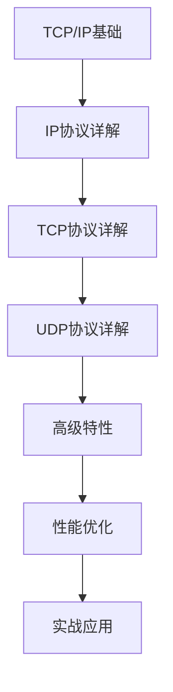

# TCP/IP协议学习笔记

## 📋 学习路径总览



**适用人群**: 有基础网络知识、希望深入理解TCP/IP协议栈的开发者  
**预计学习时间**: 50-80小时  
**前置知识**: 计算机网络基础、网络协议基本概念  
**学习目标**: 深入掌握TCP/IP协议栈的工作原理、能够分析和解决网络问题、具备网络编程和优化能力

---

## 第一章：TCP/IP协议栈概述

### 1.1 TCP/IP模型与OSI模型对比

#### TCP/IP四层模型

```
┌─────────────────────────────────────────────────────────┐
│                      应用层                              │
│  (Application Layer)                                    │
│  HTTP, FTP, SMTP, DNS, SSH, Telnet...                 │
├─────────────────────────────────────────────────────────┤
│                      传输层                              │
│  (Transport Layer)                                      │
│  TCP (可靠传输), UDP (不可靠传输)                        │
├─────────────────────────────────────────────────────────┤
│                      网络层                              │
│  (Internet Layer)                                       │
│  IP, ICMP, ARP, IGMP                                   │
├─────────────────────────────────────────────────────────┤
│                   网络接口层                             │
│  (Network Access Layer)                                 │
│  Ethernet, Wi-Fi, PPP, Token Ring                      │
└─────────────────────────────────────────────────────────┘
```

#### 模型对比分析

| 层次 | OSI模型 | TCP/IP模型 | 主要功能 | 典型协议 |
|------|---------|-----------|---------|---------|
| 7 | 应用层 | **应用层** | 提供网络服务接口 | HTTP, FTP, DNS |
| 6 | 表示层 | ↑ | 数据格式转换 | - |
| 5 | 会话层 | ↑ | 会话管理 | - |
| 4 | 传输层 | **传输层** | 端到端通信 | TCP, UDP |
| 3 | 网络层 | **网络层** | 路由和寻址 | IP, ICMP |
| 2 | 数据链路层 | **网络接口层** | 物理地址和帧 | Ethernet |
| 1 | 物理层 | ↑ | 比特流传输 | - |

### 1.2 TCP/IP协议族架构

#### 协议栈组成

```
应用程序
    ↓
┌─────────────────────────────────────────┐
│         应用层协议                       │
│  HTTP  SMTP  FTP  DNS  SSH  SNMP       │
└─────────────────────────────────────────┘
    ↓
┌─────────────────────────────────────────┐
│         传输层协议                       │
│         TCP          UDP                │
│   (面向连接)    (无连接)                 │
└─────────────────────────────────────────┘
    ↓
┌─────────────────────────────────────────┐
│         网络层协议                       │
│    IP (Internet Protocol)               │
│  ICMP   ARP   IGMP   RARP              │
└─────────────────────────────────────────┘
    ↓
┌─────────────────────────────────────────┐
│       网络接口层                         │
│  设备驱动程序 + 硬件接口                 │
└─────────────────────────────────────────┘
    ↓
物理网络
```

#### 数据封装过程

```
应用层:  [应用数据]
             ↓ 添加TCP/UDP头部
传输层:  [TCP头|应用数据]    (Segment - 段)
             ↓ 添加IP头部
网络层:  [IP头|TCP头|应用数据]    (Packet - 包)
             ↓ 添加帧头和帧尾
链路层:  [帧头|IP头|TCP头|应用数据|帧尾]    (Frame - 帧)
             ↓
物理层:  01010101... (Bits - 比特流)
```

---

## 第二章：IP协议深度解析

### 2.1 IPv4协议

#### IPv4头部结构

```
 0                   1                   2                   3
 0 1 2 3 4 5 6 7 8 9 0 1 2 3 4 5 6 7 8 9 0 1 2 3 4 5 6 7 8 9 0 1
+-+-+-+-+-+-+-+-+-+-+-+-+-+-+-+-+-+-+-+-+-+-+-+-+-+-+-+-+-+-+-+-+
|Version|  IHL  |Type of Service|          Total Length         |
+-+-+-+-+-+-+-+-+-+-+-+-+-+-+-+-+-+-+-+-+-+-+-+-+-+-+-+-+-+-+-+-+
|         Identification        |Flags|      Fragment Offset    |
+-+-+-+-+-+-+-+-+-+-+-+-+-+-+-+-+-+-+-+-+-+-+-+-+-+-+-+-+-+-+-+-+
|  Time to Live |    Protocol   |         Header Checksum       |
+-+-+-+-+-+-+-+-+-+-+-+-+-+-+-+-+-+-+-+-+-+-+-+-+-+-+-+-+-+-+-+-+
|                       Source Address                          |
+-+-+-+-+-+-+-+-+-+-+-+-+-+-+-+-+-+-+-+-+-+-+-+-+-+-+-+-+-+-+-+-+
|                    Destination Address                        |
+-+-+-+-+-+-+-+-+-+-+-+-+-+-+-+-+-+-+-+-+-+-+-+-+-+-+-+-+-+-+-+-+
```

#### 字段详解

| 字段 | 长度 | 描述 |
|------|------|------|
| **Version** | 4 bits | IP版本号，IPv4为4 |
| **IHL** | 4 bits | 头部长度（以32位字为单位），最小值5（20字节） |
| **Type of Service** | 8 bits | 服务质量（现为DiffServ） |
| **Total Length** | 16 bits | 整个IP数据包长度（头部+数据），最大65535字节 |
| **Identification** | 16 bits | 标识符，用于分片重组 |
| **Flags** | 3 bits | DF（不分片）、MF（更多分片） |
| **Fragment Offset** | 13 bits | 分片偏移量，以8字节为单位 |
| **Time to Live** | 8 bits | 生存时间，每经过一个路由器减1 |
| **Protocol** | 8 bits | 上层协议（1=ICMP, 6=TCP, 17=UDP） |
| **Header Checksum** | 16 bits | 头部校验和 |
| **Source Address** | 32 bits | 源IP地址 |
| **Destination Address** | 32 bits | 目标IP地址 |

### 2.2 IP地址与子网

#### IPv4地址分类

```
A类地址: 0.0.0.0    - 127.255.255.255
  格式: [网络(8位)].[主机(24位)]
  默认子网掩码: 255.0.0.0 (/8)
  可用网络数: 128
  每网络主机数: 16,777,214

B类地址: 128.0.0.0  - 191.255.255.255
  格式: [网络(16位)].[主机(16位)]
  默认子网掩码: 255.255.0.0 (/16)
  可用网络数: 16,384
  每网络主机数: 65,534

C类地址: 192.0.0.0  - 223.255.255.255
  格式: [网络(24位)].[主机(8位)]
  默认子网掩码: 255.255.255.0 (/24)
  可用网络数: 2,097,152
  每网络主机数: 254

D类地址: 224.0.0.0  - 239.255.255.255
  用途: 多播地址

E类地址: 240.0.0.0  - 255.255.255.255
  用途: 保留，用于实验
```

#### 特殊IP地址

| IP地址范围 | 用途 | 说明 |
|-----------|------|------|
| 0.0.0.0/8 | 本网络 | 表示"本网络" |
| 10.0.0.0/8 | 私有地址 | A类私有网络 |
| 127.0.0.0/8 | 环回地址 | 本地回环（localhost） |
| 169.254.0.0/16 | 链路本地地址 | DHCP失败时自动配置 |
| 172.16.0.0/12 | 私有地址 | B类私有网络 |
| 192.168.0.0/16 | 私有地址 | C类私有网络 |
| 224.0.0.0/4 | 多播地址 | D类地址 |
| 255.255.255.255 | 广播地址 | 受限广播 |

#### 子网划分实战

**CIDR（无类别域间路由）**

```
CIDR记法：IP地址/前缀长度
例如：192.168.1.0/24

/24 表示前24位是网络位，后8位是主机位
子网掩码：255.255.255.0
可用主机数：2^8 - 2 = 254
```

**子网划分计算示例**

```python
# 示例：将 192.168.1.0/24 划分为4个子网

原网络：192.168.1.0/24
可用主机：254个

划分需求：4个子网
每个子网需要位数：log2(4) = 2位
新前缀长度：24 + 2 = /26

子网掩码：255.255.255.192

子网1：192.168.1.0/26   (192.168.1.0   - 192.168.1.63)
子网2：192.168.1.64/26  (192.168.1.64  - 192.168.1.127)
子网3：192.168.1.128/26 (192.168.1.128 - 192.168.1.191)
子网4：192.168.1.192/26 (192.168.1.192 - 192.168.1.255)

每个子网可用主机：2^6 - 2 = 62个
```

**Python实现子网计算**

```python
import ipaddress

def subnet_calculator(network, num_subnets):
    """计算子网划分"""
    net = ipaddress.IPv4Network(network)

    # 计算需要的前缀长度
    import math
    new_prefix = net.prefixlen + math.ceil(math.log2(num_subnets))

    # 生成子网列表
    subnets = list(net.subnets(new_prefix=new_prefix))

    print(f"原网络: {network}")
    print(f"划分为 {len(subnets)} 个子网")
    print(f"新子网掩码: {subnets[0].netmask}")
    print(f"每个子网可用主机数: {subnets[0].num_addresses - 2}\n")

    for i, subnet in enumerate(subnets, 1):
        print(f"子网{i}: {subnet}")
        print(f"  网络地址: {subnet.network_address}")
        print(f"  广播地址: {subnet.broadcast_address}")
        print(f"  可用范围: {list(subnet.hosts())[0]} - {list(subnet.hosts())[-1]}\n")

# 使用示例
subnet_calculator('192.168.1.0/24', 4)
```

### 2.3 IPv6协议

#### IPv6地址结构

```
IPv6地址长度：128位（16字节）
表示方法：8组，每组4个十六进制数字，用冒号分隔

完整格式：2001:0db8:85a3:0000:0000:8a2e:0370:7334
压缩格式：2001:db8:85a3::8a2e:370:7334

压缩规则：
1. 每组中的前导零可以省略
2. 连续的全零组可以用 :: 替代（只能使用一次）
```

#### IPv6地址类型

| 类型 | 前缀 | 用途 |
|------|------|------|
| **单播（Unicast）** | - | 一对一通信 |
| 全局单播 | 2000::/3 | 全球可路由地址 |
| 链路本地 | fe80::/10 | 本地链路通信 |
| 唯一本地 | fc00::/7 | 私有网络 |
| **组播（Multicast）** | ff00::/8 | 一对多通信 |
| **任播（Anycast）** | - | 发送到最近的一个 |

#### IPv6头部结构

```
 0                   1                   2                   3
 0 1 2 3 4 5 6 7 8 9 0 1 2 3 4 5 6 7 8 9 0 1 2 3 4 5 6 7 8 9 0 1
+-+-+-+-+-+-+-+-+-+-+-+-+-+-+-+-+-+-+-+-+-+-+-+-+-+-+-+-+-+-+-+-+
|Version| Traffic Class |           Flow Label                  |
+-+-+-+-+-+-+-+-+-+-+-+-+-+-+-+-+-+-+-+-+-+-+-+-+-+-+-+-+-+-+-+-+
|         Payload Length        |  Next Header  |   Hop Limit   |
+-+-+-+-+-+-+-+-+-+-+-+-+-+-+-+-+-+-+-+-+-+-+-+-+-+-+-+-+-+-+-+-+
|                                                               |
+                                                               +
|                                                               |
+                         Source Address                        +
|                                                               |
+                                                               +
|                                                               |
+-+-+-+-+-+-+-+-+-+-+-+-+-+-+-+-+-+-+-+-+-+-+-+-+-+-+-+-+-+-+-+-+
|                                                               |
+                                                               +
|                                                               |
+                      Destination Address                      +
|                                                               |
+                                                               +
|                                                               |
+-+-+-+-+-+-+-+-+-+-+-+-+-+-+-+-+-+-+-+-+-+-+-+-+-+-+-+-+-+-+-+-+
```

**IPv6 vs IPv4对比**

| 特性 | IPv4 | IPv6 |
|------|------|------|
| 地址长度 | 32位 | 128位 |
| 地址数量 | 43亿 | 3.4×10³⁸ |
| 地址表示 | 点分十进制 | 冒号十六进制 |
| 头部大小 | 20-60字节 | 40字节（固定） |
| 分片 | 路由器可分片 | 仅源节点分片 |
| 校验和 | 有 | 无（交给上层） |
| 广播 | 有 | 无（用组播替代） |
| 配置 | 手动/DHCP | 自动配置/DHCPv6 |

### 2.4 ICMP协议详解

#### ICMP消息类型

**ICMP (Internet Control Message Protocol)** - 网络层错误报告和诊断协议

```
常见ICMP消息类型：

类型0  - Echo Reply (ping回应)
类型3  - Destination Unreachable (目标不可达)
  代码0: 网络不可达
  代码1: 主机不可达
  代码2: 协议不可达
  代码3: 端口不可达
类型5  - Redirect (重定向)
类型8  - Echo Request (ping请求)
类型11 - Time Exceeded (超时)
  代码0: TTL超时
  代码1: 分片重组超时
类型12 - Parameter Problem (参数问题)
```

#### ICMP实战：ping命令原理

```bash
# ping命令工作流程
ping www.example.com

过程：
1. 发送ICMP Echo Request (类型8)
2. 接收ICMP Echo Reply (类型0)
3. 计算往返时间 (RTT)

示例输出：
PING www.example.com (93.184.216.34): 56 data bytes
64 bytes from 93.184.216.34: icmp_seq=0 ttl=56 time=45.2 ms
64 bytes from 93.184.216.34: icmp_seq=1 ttl=56 time=44.8 ms

字段说明：
- icmp_seq: 序列号
- ttl: 生存时间（剩余跳数）
- time: 往返时间
```

**Python实现简单ping**

```python
import socket
import struct
import time

def checksum(data):
    """计算校验和"""
    s = 0
    for i in range(0, len(data), 2):
        w = (data[i] << 8) + (data[i+1] if i+1 < len(data) else 0)
        s += w
    s = (s >> 16) + (s & 0xffff)
    s = ~s & 0xffff
    return s

def create_icmp_packet(seq):
    """创建ICMP Echo Request包"""
    # ICMP类型8（Echo Request），代码0
    icmp_type = 8
    icmp_code = 0
    icmp_checksum = 0
    icmp_id = 12345
    icmp_seq = seq

    # 构建头部（校验和先填0）
    header = struct.pack('!BBHHH', icmp_type, icmp_code,
                         icmp_checksum, icmp_id, icmp_seq)
    data = b'abcdefghijklmnopqrstuvwxyz'

    # 计算校验和
    icmp_checksum = checksum(header + data)
    header = struct.pack('!BBHHH', icmp_type, icmp_code,
                         icmp_checksum, icmp_id, icmp_seq)

    return header + data

def ping(host):
    """简单ping实现"""
    try:
        # 创建原始套接字（需要root权限）
        sock = socket.socket(socket.AF_INET, socket.SOCK_RAW,
                            socket.IPPROTO_ICMP)
        sock.settimeout(2)

        # 解析主机名
        dest_addr = socket.gethostbyname(host)
        print(f"PING {host} ({dest_addr})")

        for seq in range(4):
            # 发送ICMP包
            packet = create_icmp_packet(seq)
            send_time = time.time()
            sock.sendto(packet, (dest_addr, 0))

            # 接收回复
            try:
                data, addr = sock.recvfrom(1024)
                recv_time = time.time()

                # 解析IP头部获取TTL（IP头部第9个字节）
                ttl = data[8]
                rtt = (recv_time - send_time) * 1000  # 转换为毫秒

                print(f"Reply from {addr[0]}: seq={seq} ttl={ttl} time={rtt:.2f}ms")
            except socket.timeout:
                print(f"Request timeout for seq={seq}")

        sock.close()
    except PermissionError:
        print("需要root权限运行此程序")
    except Exception as e:
        print(f"错误: {e}")

# 使用示例（需要root权限）
# ping('www.baidu.com')
```

### 2.5 ARP协议详解

#### ARP工作原理

**ARP (Address Resolution Protocol)** - 地址解析协议，用于IP地址到MAC地址的映射

```
ARP工作流程：

场景：主机A (192.168.1.10) 要发送数据给主机B (192.168.1.20)

步骤1: 主机A检查ARP缓存表
  - 如果有B的MAC地址，直接使用
  - 如果没有，发送ARP请求

步骤2: 主机A广播ARP请求
  源IP: 192.168.1.10
  源MAC: AA:BB:CC:DD:EE:FF
  目标IP: 192.168.1.20
  目标MAC: FF:FF:FF:FF:FF:FF (广播)
  询问: "谁是192.168.1.20？"

步骤3: 主机B收到ARP请求
  - 发现是询问自己的IP
  - 发送ARP应答（单播）

步骤4: 主机B单播ARP应答
  源IP: 192.168.1.20
  源MAC: 11:22:33:44:55:66
  目标IP: 192.168.1.10
  目标MAC: AA:BB:CC:DD:EE:FF
  回答: "我是192.168.1.20，我的MAC是11:22:33:44:55:66"

步骤5: 主机A更新ARP缓存
  - 保存192.168.1.20 -> 11:22:33:44:55:66的映射
  - 使用该MAC地址发送数据
```

#### ARP缓存管理

```bash
# Linux查看ARP缓存
arp -n
# 或
ip neighbor show

# 输出示例
192.168.1.1 dev eth0 lladdr 00:11:22:33:44:55 REACHABLE
192.168.1.20 dev eth0 lladdr aa:bb:cc:dd:ee:ff STALE

# 删除ARP缓存条目
sudo arp -d 192.168.1.20

# 添加静态ARP条目
sudo arp -s 192.168.1.20 aa:bb:cc:dd:ee:ff

# Windows查看ARP缓存
arp -a
```

#### ARP欺骗与防御

**ARP欺骗原理**

```
攻击场景：中间人攻击

正常通信：
  主机A <----> 网关 <----> 互联网

ARP欺骗后：
  主机A <----> 攻击者 <----> 网关 <----> 互联网

攻击步骤：
1. 攻击者发送伪造的ARP应答给主机A
   声称：网关IP对应的MAC地址是攻击者的MAC
2. 主机A更新ARP缓存（错误映射）
3. 主机A发送给网关的数据都发到攻击者
4. 攻击者可以窃听、篡改数据
```

**防御措施**

```bash
# 1. 使用静态ARP绑定（关键主机）
sudo arp -s 192.168.1.1 00:11:22:33:44:55

# 2. 启用ARP防护（Linux）
# 编辑 /etc/sysctl.conf
net.ipv4.conf.all.arp_ignore = 1
net.ipv4.conf.all.arp_announce = 2

# 3. 使用交换机端口安全
# 绑定MAC地址到交换机端口

# 4. 部署ARP检测工具
# 安装arpwatch监控ARP变化
sudo apt install arpwatch
sudo systemctl start arpwatch
```

---

## 第三章：TCP协议深度解析

### 3.1 TCP基础特性

#### TCP的核心特性

```
┌────────────────────────────────────────────────────┐
│              TCP协议核心特性                        │
├────────────────────────────────────────────────────┤
│ 1. 面向连接 (Connection-Oriented)                  │
│    - 三次握手建立连接                               │
│    - 四次挥手释放连接                               │
│                                                    │
│ 2. 可靠传输 (Reliable Delivery)                    │
│    - 序列号和确认机制                               │
│    - 超时重传                                      │
│    - 重复检测                                      │
│                                                    │
│ 3. 流量控制 (Flow Control)                         │
│    - 滑动窗口机制                                   │
│    - 接收方控制发送速率                             │
│                                                    │
│ 4. 拥塞控制 (Congestion Control)                   │
│    - 慢启动                                        │
│    - 拥塞避免                                      │
│    - 快速重传和快速恢复                             │
│                                                    │
│ 5. 全双工通信 (Full-Duplex)                        │
│    - 双向同时传输                                   │
│                                                    │
│ 6. 字节流服务 (Byte Stream)                        │
│    - 无消息边界                                     │
└────────────────────────────────────────────────────┘
```

### 3.2 TCP头部结构

```
 0                   1                   2                   3
 0 1 2 3 4 5 6 7 8 9 0 1 2 3 4 5 6 7 8 9 0 1 2 3 4 5 6 7 8 9 0 1
+-+-+-+-+-+-+-+-+-+-+-+-+-+-+-+-+-+-+-+-+-+-+-+-+-+-+-+-+-+-+-+-+
|          Source Port          |       Destination Port        |
+-+-+-+-+-+-+-+-+-+-+-+-+-+-+-+-+-+-+-+-+-+-+-+-+-+-+-+-+-+-+-+-+
|                        Sequence Number                        |
+-+-+-+-+-+-+-+-+-+-+-+-+-+-+-+-+-+-+-+-+-+-+-+-+-+-+-+-+-+-+-+-+
|                    Acknowledgment Number                      |
+-+-+-+-+-+-+-+-+-+-+-+-+-+-+-+-+-+-+-+-+-+-+-+-+-+-+-+-+-+-+-+-+
|  Data |           |U|A|P|R|S|F|                               |
| Offset| Reserved  |R|C|S|S|Y|I|            Window             |
|       |           |G|K|H|T|N|N|                               |
+-+-+-+-+-+-+-+-+-+-+-+-+-+-+-+-+-+-+-+-+-+-+-+-+-+-+-+-+-+-+-+-+
|           Checksum            |         Urgent Pointer        |
+-+-+-+-+-+-+-+-+-+-+-+-+-+-+-+-+-+-+-+-+-+-+-+-+-+-+-+-+-+-+-+-+
```

#### 字段详解

| 字段 | 长度 | 描述 |
|------|------|------|
| **Source Port** | 16 bits | 源端口号 |
| **Destination Port** | 16 bits | 目标端口号 |
| **Sequence Number** | 32 bits | 序列号，标识发送的字节流位置 |
| **Acknowledgment Number** | 32 bits | 确认号，期望接收的下一个字节 |
| **Data Offset** | 4 bits | 头部长度（以32位字为单位） |
| **Flags** | 6 bits | URG, ACK, PSH, RST, SYN, FIN |
| **Window** | 16 bits | 接收窗口大小（流量控制） |
| **Checksum** | 16 bits | 校验和 |
| **Urgent Pointer** | 16 bits | 紧急指针 |

### 3.3 TCP三次握手

#### 握手过程

```
客户端                                          服务器
   │                                               │
   │  1. SYN (seq=x)                               │
   │  客户端选择初始序列号x                         │
   ├──────────────────────────────────────────────>│
   │                                               │
   │          2. SYN-ACK (seq=y, ack=x+1)          │
   │          服务器选择初始序列号y                 │
   │<──────────────────────────────────────────────┤
   │                                               │
   │  3. ACK (ack=y+1)                             │
   │  确认服务器的序列号                            │
   ├──────────────────────────────────────────────>│
   │                                               │
   │          连接建立，可以传输数据                │
```

#### 为什么需要三次握手？

**1. 防止旧连接请求**
- 如果只有两次握手，旧的SYN包可能导致错误连接

**2. 确认双方收发能力**
- 第一次：客户端发送能力正常
- 第二次：服务器收发能力正常
- 第三次：客户端接收能力正常

**3. 同步序列号**
- 双方都需要通知对方自己的初始序列号

### 3.4 TCP四次挥手

#### 挥手过程

```
客户端                                          服务器
   │                                               │
   │  1. FIN (seq=u)                               │
   │  客户端主动关闭                                │
   ├──────────────────────────────────────────────>│
   │                                               │
   │          2. ACK (ack=u+1)                     │
   │          服务器确认                            │
   │<──────────────────────────────────────────────┤
   │                                               │
   │          3. FIN (seq=w)                       │
   │          服务器也要关闭了                      │
   │<──────────────────────────────────────────────┤
   │                                               │
   │  4. ACK (ack=w+1)                             │
   │  客户端确认                                    │
   ├──────────────────────────────────────────────>│
   │                                               │
   │          等待2MSL后，连接完全关闭              │
```

#### 为什么需要四次挥手？

**1. TCP是全双工的**
- 每个方向都需要单独关闭
- FIN只关闭一个方向的数据传输

**2. 被动关闭方可能还有数据要发送**
- 收到FIN后，可能还有数据在发送
- 发完数据后再发送自己的FIN

**3. TIME_WAIT状态的作用**
- 确保最后的ACK被对方收到
- 防止旧连接的包干扰新连接

### 3.5 TCP状态机

#### TCP状态转换图

```
                           +---------+
                           |  CLOSED |
                           +---------+
                                |
                      主动打开  | 被动打开(listen)
                                ↓
                           +---------+
                           |  LISTEN |
                           +---------+
                                |
                    收到SYN     | 发送SYN
                                ↓
                        +---------------+
                        | SYN_RECEIVED  |
                        +---------------+
                                |
                    收到ACK     | 发送SYN+ACK
                                ↓
                        +---------------+
                        | ESTABLISHED   |
                        +---------------+
                                |
              主动关闭          | 被动关闭
              发送FIN           | 收到FIN
                                ↓
           +----------+    +------------+
           | FIN_WAIT_1|--->| CLOSE_WAIT |
           +----------+    +------------+
                |                |
         收到ACK |                | 发送FIN
                ↓                ↓
           +----------+    +------------+
           | FIN_WAIT_2|    | LAST_ACK   |
           +----------+    +------------+
                |                |
         收到FIN |         收到ACK|
                ↓                ↓
           +----------+    +---------+
           | TIME_WAIT|    | CLOSED  |
           +----------+    +---------+
                |
       等待2MSL |
                ↓
           +---------+
           | CLOSED  |
           +---------+
```

#### TCP状态详解

| 状态 | 说明 | 常见问题 |
|------|------|---------|
| **CLOSED** | 初始状态，无连接 | - |
| **LISTEN** | 服务器监听状态 | 端口被占用 |
| **SYN_SENT** | 客户端发送SYN后 | 连接超时 |
| **SYN_RECEIVED** | 服务器收到SYN后 | SYN洪水攻击 |
| **ESTABLISHED** | 连接建立，可传输数据 | - |
| **FIN_WAIT_1** | 主动关闭，等待ACK | - |
| **FIN_WAIT_2** | 等待对方FIN | 对方不关闭导致半关闭 |
| **CLOSE_WAIT** | 被动关闭，等待应用关闭 | 应用未关闭socket |
| **LAST_ACK** | 等待最后的ACK | - |
| **TIME_WAIT** | 等待2MSL | 大量TIME_WAIT占用资源 |
| **CLOSING** | 双方同时关闭 | 罕见情况 |

**查看TCP连接状态**

```bash
# Linux查看TCP连接状态统计
netstat -an | awk '/^tcp/ {print $6}' | sort | uniq -c
# 或
ss -tan | awk 'NR>1 {print $1}' | sort | uniq -c

# 输出示例
      5 ESTABLISHED
     12 TIME_WAIT
      3 LISTEN
      1 CLOSE_WAIT

# 查看特定端口的连接
netstat -antp | grep :80
ss -tnp | grep :80
```

### 3.6 TCP流量控制

#### 滑动窗口机制

**窗口概念**

```
发送方视角：
┌────────────────────────────────────────────────────┐
│ 已发送已确认 │ 已发送未确认 │ 可发送 │ 不可发送  │
└────────────────────────────────────────────────────┘
               ├───────────────────┤
                   发送窗口

接收方视角：
┌────────────────────────────────────────────────────┐
│ 已接收已处理 │ 可接收 │ 不可接收                   │
└────────────────────────────────────────────────────┘
               ├───────┤
                接收窗口
```

**窗口滑动过程**

```
时刻1: 发送方窗口大小=8，已发送序号1-4
  发送窗口: [1 2 3 4] [5 6 7 8] | ...
            已发送    可发送

时刻2: 收到序号1-2的ACK，窗口向右滑动2个单位
  发送窗口:     [3 4] [5 6 7 8 9 10] | ...
                已发送    可发送

时刻3: 接收方窗口变小（从8降到4），通告给发送方
  发送窗口:     [3 4] [5 6] | ...
                已发送  可发送
```

**零窗口问题**

```
场景：接收方缓冲区满，通告窗口为0

发送方 ─────> 数据 ─────> 接收方
       <───── WIN=0 <─────  (接收缓冲区满)

发送方停止发送，定期发送探测报文：
发送方 ─────> ZWP (零窗口探测) ─────> 接收方
       <───── WIN=0 <─────  (仍然满)

等待接收方处理数据后：
发送方 <───── WIN>0 <─────  接收方（窗口更新）
       ─────> 继续发送 ─────>
```

### 3.7 TCP拥塞控制深入

#### 拥塞控制算法详解

**1. 慢启动 (Slow Start)**

```
初始状态：
  cwnd (拥塞窗口) = 1 MSS
  ssthresh (慢启动阈值) = 较大值（如64KB）

过程：
  每收到一个ACK，cwnd += 1 MSS
  效果：cwnd呈指数增长 (1 -> 2 -> 4 -> 8 -> 16 ...)

终止条件：
  - cwnd >= ssthresh，进入拥塞避免
  - 发生丢包，执行拥塞处理
```

**2. 拥塞避免 (Congestion Avoidance)**

```
条件：cwnd >= ssthresh

过程：
  每经过一个RTT，cwnd += 1 MSS
  效果：cwnd呈线性增长

目的：
  缓慢探测网络容量，避免突然拥塞
```

**3. 快速重传 (Fast Retransmit)**

```
触发条件：
  收到3个重复ACK

行为：
  立即重传丢失的报文段，不等超时

示例：
发送: 1 2 3 4 5 6
      ↓ ↓ ✗ ↓ ↓ ↓
接收: 1 2 _ 4 5 6
回复: ACK2 ACK2 ACK2 ACK2 (3个重复)

发送方收到3个重复ACK2，立即重传报文3
```

**4. 快速恢复 (Fast Recovery)**

```
触发：快速重传后

TCP Reno算法：
  ssthresh = cwnd / 2
  cwnd = ssthresh + 3
  每收到重复ACK，cwnd += 1
  收到新ACK，cwnd = ssthresh

TCP New Reno改进：
  处理多个丢包情况
  避免重新进入慢启动
```

#### 拥塞控制算法演进

**CUBIC算法（Linux默认）**

```python
# CUBIC窗口增长函数
W(t) = C * (t - K)³ + W_max

其中：
  C = 常数（0.4）
  t = 当前时间
  K = 达到W_max所需时间
  W_max = 拥塞发生时的窗口大小

特点：
1. 窗口增长函数是三次函数
2. 与RTT无关，更公平
3. 高速网络下表现更好
```

**BBR算法（Google开发）**

```
核心思想：
  不依赖丢包判断拥塞
  基于带宽和RTT建模

工作原理：
1. 测量瓶颈带宽 (Bottleneck Bandwidth)
2. 测量往返时延 (Round-Trip Time)
3. 计算最优发送速率

状态机：
  STARTUP    -> 指数增长探测带宽
  DRAIN      -> 排空队列
  PROBE_BW   -> 周期性探测带宽
  PROBE_RTT  -> 周期性探测RTT

优势：
  - 高延迟网络下性能更好
  - 减少缓冲区膨胀
  - 更快的收敛速度
```

**启用BBR算法**

```bash
# 检查内核是否支持BBR（需要Linux 4.9+）
modprobe tcp_bbr
lsmod | grep bbr

# 启用BBR
echo "net.core.default_qdisc=fq" >> /etc/sysctl.conf
echo "net.ipv4.tcp_congestion_control=bbr" >> /etc/sysctl.conf
sysctl -p

# 验证
sysctl net.ipv4.tcp_congestion_control
# 输出: net.ipv4.tcp_congestion_control = bbr
```

### 3.8 TCP重传机制

#### 超时重传

**RTO（重传超时）计算**

```
经典算法（Jacobson/Karels算法）：

1. 计算平滑RTT：
   SRTT = (1 - α) * SRTT + α * RTT_sample
   α = 1/8

2. 计算RTT偏差：
   RTTVAR = (1 - β) * RTTVAR + β * |SRTT - RTT_sample|
   β = 1/4

3. 计算RTO：
   RTO = SRTT + 4 * RTTVAR
   最小值：200ms
   最大值：60s
```

**指数退避**

```
首次超时：RTO = 1s
第1次重传：RTO = 2s  (2¹ * 1s)
第2次重传：RTO = 4s  (2² * 1s)
第3次重传：RTO = 8s  (2³ * 1s)
...
最多重传：默认15次（可配置）

Linux配置：
  net.ipv4.tcp_retries2 = 15  # 重传次数
```

#### 快速重传与SACK

**选择性确认（SACK）**

```
不使用SACK：
  发送: 1 2 3 4 5 6 7 8
  丢失: 3 6
  接收方只能ACK: 2（因为3丢失）
  发送方重传: 3 4 5 6 7 8（全部重传）

使用SACK：
  发送: 1 2 3 4 5 6 7 8
  丢失: 3 6
  接收方SACK: ACK=2, SACK=4-5, SACK=7-8
  发送方重传: 3 6（只重传丢失的）
```

**启用SACK**

```bash
# Linux启用SACK
echo 1 > /proc/sys/net/ipv4/tcp_sack

# 查看SACK状态
cat /proc/sys/net/ipv4/tcp_sack
```

### 3.9 TCP Keepalive机制

#### Keepalive工作原理

```
场景：检测死连接

正常情况：
  客户端 <───────> 服务器
         (长时间无数据传输)

启用Keepalive后：
  时间点1: 空闲time秒后，发送keepalive探测
    客户端 ─────> Keepalive Probe ─────> 服务器
           <───── Keepalive ACK <─────

  如果无响应：
    每隔intvl秒重试一次，共probes次

  如果全部失败：
    关闭连接，通知应用程序
```

**Keepalive配置**

```bash
# Linux系统级配置
net.ipv4.tcp_keepalive_time = 7200   # 空闲多久开始探测（秒）
net.ipv4.tcp_keepalive_intvl = 75    # 探测间隔（秒）
net.ipv4.tcp_keepalive_probes = 9    # 探测次数

# Python套接字级配置
import socket

sock = socket.socket(socket.AF_INET, socket.SOCK_STREAM)

# 启用keepalive
sock.setsockopt(socket.SOL_SOCKET, socket.SO_KEEPALIVE, 1)

# 设置keepalive参数（Linux）
sock.setsockopt(socket.IPPROTO_TCP, socket.TCP_KEEPIDLE, 60)    # 空闲60秒开始
sock.setsockopt(socket.IPPROTO_TCP, socket.TCP_KEEPINTVL, 10)   # 间隔10秒
sock.setsockopt(socket.IPPROTO_TCP, socket.TCP_KEEPCNT, 3)      # 探测3次
```

**应用场景**

```
1. 检测僵尸连接
   - 客户端崩溃未正常关闭
   - 网络中断导致连接断开

2. 保持NAT映射
   - 穿越NAT设备时保持端口映射
   - 防止长时间无数据导致映射失效

3. 负载均衡器连接保持
   - 某些负载均衡器要求定期心跳

注意：
  - Keepalive不是实时的，有延迟
  - 应用层心跳更可靠
  - 避免频繁探测造成网络负担
```

---

## 第四章：UDP协议详解

### 4.1 UDP基础特性

#### UDP的核心特性

```
┌────────────────────────────────────────────────────┐
│              UDP协议核心特性                        │
├────────────────────────────────────────────────────┤
│ 1. 无连接 (Connectionless)                         │
│    - 无需建立连接                                   │
│    - 无连接状态维护                                 │
│                                                    │
│ 2. 不可靠传输 (Unreliable Delivery)                │
│    - 不保证数据到达                                 │
│    - 不保证顺序                                     │
│    - 可能丢失或重复                                 │
│                                                    │
│ 3. 面向数据报 (Datagram-Oriented)                  │
│    - 保留消息边界                                   │
│    - 每个数据报独立处理                             │
│                                                    │
│ 4. 低开销 (Low Overhead)                           │
│    - 头部只有8字节                                  │
│    - 无连接建立开销                                 │
│                                                    │
│ 5. 支持广播和多播                                   │
│    - 一对多通信                                     │
│                                                    │
│ 6. 实时性好                                         │
│    - 无重传延迟                                     │
│    - 适合实时应用                                   │
└────────────────────────────────────────────────────┘
```

### 4.2 UDP头部结构

```
 0                   1                   2                   3
 0 1 2 3 4 5 6 7 8 9 0 1 2 3 4 5 6 7 8 9 0 1 2 3 4 5 6 7 8 9 0 1
+-+-+-+-+-+-+-+-+-+-+-+-+-+-+-+-+-+-+-+-+-+-+-+-+-+-+-+-+-+-+-+-+
|          Source Port          |       Destination Port        |
+-+-+-+-+-+-+-+-+-+-+-+-+-+-+-+-+-+-+-+-+-+-+-+-+-+-+-+-+-+-+-+-+
|            Length             |           Checksum            |
+-+-+-+-+-+-+-+-+-+-+-+-+-+-+-+-+-+-+-+-+-+-+-+-+-+-+-+-+-+-+-+-+
|                             Data                              |
+-+-+-+-+-+-+-+-+-+-+-+-+-+-+-+-+-+-+-+-+-+-+-+-+-+-+-+-+-+-+-+-+
```

### 4.3 TCP vs UDP对比

| 特性 | TCP | UDP |
|------|-----|-----|
| **连接** | 面向连接 | 无连接 |
| **可靠性** | 可靠（确认、重传） | 不可靠 |
| **顺序** | 保证顺序 | 不保证 |
| **速度** | 较慢 | 快速 |
| **头部大小** | 20-60字节 | 8字节 |
| **流量控制** | 有（滑动窗口） | 无 |
| **拥塞控制** | 有 | 无 |
| **适用场景** | 文件传输、Web浏览、邮件 | 视频直播、语音通话、DNS |
| **数据边界** | 字节流，无边界 | 数据报，有边界 |

### 4.4 UDP应用场景

**适合使用UDP的场景**

```
1. 实时音视频传输
   - 直播、视频会议
   - 容忍少量丢包
   - 低延迟要求

2. DNS查询
   - 请求-响应模式
   - 数据量小
   - 快速查询

3. 在线游戏
   - 实时性要求
   - 状态同步
   - 可容忍偶尔丢包

4. IoT设备通信
   - 资源受限设备
   - 简单协议
   - 低开销

5. 广播/多播
   - 一对多通信
   - 视频流分发
```

**基于UDP构建可靠协议**

```
常见可靠UDP协议：

1. QUIC (Quick UDP Internet Connections)
   - Google开发，HTTP/3基础
   - 提供类TCP可靠性
   - 多路复用，无队头阻塞
   - 0-RTT连接建立

2. KCP (快速可靠协议)
   - 专为游戏优化
   - 牺牲带宽换取低延迟
   - 快速重传

3. UDT (UDP-based Data Transfer)
   - 高速数据传输
   - 适合高带宽长距离网络

4. 自定义可靠UDP
   - 序列号
   - ACK机制
   - 超时重传
   - 窗口控制
```

---

## 第五章：网络编程基础

### 5.1 Socket编程基础

#### Socket API概述

**Socket类型**

```python
# TCP Socket（流式套接字）
socket.socket(socket.AF_INET, socket.SOCK_STREAM)

# UDP Socket（数据报套接字）
socket.socket(socket.AF_INET, socket.SOCK_DGRAM)

# 原始套接字（需要root权限）
socket.socket(socket.AF_INET, socket.SOCK_RAW, socket.IPPROTO_ICMP)
```

**地址族**

```python
AF_INET      # IPv4
AF_INET6     # IPv6
AF_UNIX      # Unix域套接字（本地进程间通信）
```

#### TCP服务器编程

**完整TCP服务器示例**

```python
import socket
import threading

class TCPServer:
    def __init__(self, host='0.0.0.0', port=8888):
        self.host = host
        self.port = port
        self.server_socket = None

    def start(self):
        """启动服务器"""
        # 1. 创建socket
        self.server_socket = socket.socket(socket.AF_INET, socket.SOCK_STREAM)

        # 2. 设置socket选项
        self.server_socket.setsockopt(socket.SOL_SOCKET, socket.SO_REUSEADDR, 1)

        # 3. 绑定地址和端口
        self.server_socket.bind((self.host, self.port))

        # 4. 监听连接（backlog=5）
        self.server_socket.listen(5)
        print(f"服务器启动，监听 {self.host}:{self.port}")

        # 5. 接受连接循环
        try:
            while True:
                # 阻塞等待客户端连接
                client_socket, client_address = self.server_socket.accept()
                print(f"新连接来自: {client_address}")

                # 为每个客户端创建新线程
                client_thread = threading.Thread(
                    target=self.handle_client,
                    args=(client_socket, client_address)
                )
                client_thread.start()
        except KeyboardInterrupt:
            print("\n服务器关闭")
        finally:
            self.server_socket.close()

    def handle_client(self, client_socket, client_address):
        """处理客户端请求"""
        try:
            with client_socket:
                while True:
                    # 接收数据（最多1024字节）
                    data = client_socket.recv(1024)
                    if not data:
                        # 客户端关闭连接
                        break

                    print(f"收到来自 {client_address} 的数据: {data.decode('utf-8')}")

                    # 回显数据
                    response = f"Echo: {data.decode('utf-8')}"
                    client_socket.sendall(response.encode('utf-8'))
        except Exception as e:
            print(f"处理客户端 {client_address} 时出错: {e}")
        finally:
            print(f"客户端 {client_address} 断开连接")

# 使用示例
if __name__ == '__main__':
    server = TCPServer()
    server.start()
```

#### TCP客户端编程

**完整TCP客户端示例**

```python
import socket

class TCPClient:
    def __init__(self, server_host, server_port):
        self.server_host = server_host
        self.server_port = server_port
        self.socket = None

    def connect(self):
        """连接到服务器"""
        try:
            # 1. 创建socket
            self.socket = socket.socket(socket.AF_INET, socket.SOCK_STREAM)

            # 2. 设置超时（可选）
            self.socket.settimeout(10)

            # 3. 连接服务器
            print(f"正在连接 {self.server_host}:{self.server_port}...")
            self.socket.connect((self.server_host, self.server_port))
            print("连接成功！")
            return True
        except socket.timeout:
            print("连接超时")
            return False
        except socket.error as e:
            print(f"连接失败: {e}")
            return False

    def send_message(self, message):
        """发送消息"""
        try:
            # 发送数据
            self.socket.sendall(message.encode('utf-8'))

            # 接收响应
            response = self.socket.recv(1024)
            print(f"服务器响应: {response.decode('utf-8')}")
            return response.decode('utf-8')
        except socket.error as e:
            print(f"通信错误: {e}")
            return None

    def close(self):
        """关闭连接"""
        if self.socket:
            self.socket.close()
            print("连接已关闭")

    def interactive_mode(self):
        """交互式模式"""
        if not self.connect():
            return

        try:
            while True:
                message = input("请输入消息（输入'quit'退出）: ")
                if message.lower() == 'quit':
                    break

                self.send_message(message)
        except KeyboardInterrupt:
            print("\n客户端退出")
        finally:
            self.close()

# 使用示例
if __name__ == '__main__':
    client = TCPClient('127.0.0.1', 8888)
    client.interactive_mode()
```

#### UDP编程示例

**UDP服务器**

```python
import socket

class UDPServer:
    def __init__(self, host='0.0.0.0', port=9999):
        self.host = host
        self.port = port
        self.socket = socket.socket(socket.AF_INET, socket.SOCK_DGRAM)

    def start(self):
        """启动UDP服务器"""
        self.socket.bind((self.host, self.port))
        print(f"UDP服务器启动，监听 {self.host}:{self.port}")

        try:
            while True:
                # 接收数据（包含发送方地址）
                data, client_address = self.socket.recvfrom(1024)
                print(f"收到来自 {client_address} 的数据: {data.decode('utf-8')}")

                # 发送响应
                response = f"Echo: {data.decode('utf-8')}"
                self.socket.sendto(response.encode('utf-8'), client_address)
        except KeyboardInterrupt:
            print("\nUDP服务器关闭")
        finally:
            self.socket.close()

# 使用示例
if __name__ == '__main__':
    server = UDPServer()
    server.start()
```

**UDP客户端**

```python
import socket

class UDPClient:
    def __init__(self, server_host, server_port):
        self.server_host = server_host
        self.server_port = server_port
        self.socket = socket.socket(socket.AF_INET, socket.SOCK_DGRAM)
        self.socket.settimeout(5)  # 设置5秒超时

    def send_message(self, message):
        """发送UDP消息"""
        try:
            # 发送数据
            self.socket.sendto(
                message.encode('utf-8'),
                (self.server_host, self.server_port)
            )

            # 接收响应
            data, server = self.socket.recvfrom(1024)
            print(f"服务器响应: {data.decode('utf-8')}")
            return data.decode('utf-8')
        except socket.timeout:
            print("接收超时")
            return None
        except socket.error as e:
            print(f"通信错误: {e}")
            return None

    def close(self):
        """关闭socket"""
        self.socket.close()

# 使用示例
if __name__ == '__main__':
    client = UDPClient('127.0.0.1', 9999)
    try:
        while True:
            message = input("请输入消息（输入'quit'退出）: ")
            if message.lower() == 'quit':
                break
            client.send_message(message)
    finally:
        client.close()
```

### 5.2 Socket选项详解

#### 常用Socket选项

```python
import socket

sock = socket.socket(socket.AF_INET, socket.SOCK_STREAM)

# SO_REUSEADDR - 地址重用（解决TIME_WAIT问题）
sock.setsockopt(socket.SOL_SOCKET, socket.SO_REUSEADDR, 1)

# SO_KEEPALIVE - 启用TCP keepalive
sock.setsockopt(socket.SOL_SOCKET, socket.SO_KEEPALIVE, 1)

# SO_RCVBUF - 接收缓冲区大小
sock.setsockopt(socket.SOL_SOCKET, socket.SO_RCVBUF, 65536)

# SO_SNDBUF - 发送缓冲区大小
sock.setsockopt(socket.SOL_SOCKET, socket.SO_SNDBUF, 65536)

# TCP_NODELAY - 禁用Nagle算法
sock.setsockopt(socket.IPPROTO_TCP, socket.TCP_NODELAY, 1)

# SO_LINGER - 关闭时行为
linger = struct.pack('ii', 1, 0)  # 启用，超时0秒
sock.setsockopt(socket.SOL_SOCKET, socket.SO_LINGER, linger)

# SO_RCVTIMEO / SO_SNDTIMEO - 接收/发送超时
# 使用 settimeout() 方法更简单
sock.settimeout(5.0)  # 5秒超时
```

#### Socket选项详解

| 选项 | 层级 | 说明 | 使用场景 |
|------|------|------|---------|
| **SO_REUSEADDR** | SOL_SOCKET | 允许重用本地地址 | 服务器重启 |
| **SO_REUSEPORT** | SOL_SOCKET | 允许多个进程绑定同一端口 | 负载均衡 |
| **SO_KEEPALIVE** | SOL_SOCKET | 启用TCP keepalive | 检测死连接 |
| **SO_RCVBUF** | SOL_SOCKET | 设置接收缓冲区大小 | 高吞吐量 |
| **SO_SNDBUF** | SOL_SOCKET | 设置发送缓冲区大小 | 高吞吐量 |
| **SO_LINGER** | SOL_SOCKET | 关闭时是否等待数据发送完 | 快速关闭 |
| **TCP_NODELAY** | IPPROTO_TCP | 禁用Nagle算法 | 低延迟应用 |
| **TCP_CORK** | IPPROTO_TCP | 数据积累到一定量再发送 | 批量发送 |

---

## 第六章：TCP/IP性能优化

### 6.1 TCP性能参数

#### 关键性能参数

**1. TCP_NODELAY - Nagle算法**

```python
# Nagle算法目的：减少小包数量
# 规则：如果有未确认的数据，小包会被缓冲，等待ACK或积累更多数据

# 禁用Nagle算法（适用于实时应用）
sock.setsockopt(socket.IPPROTO_TCP, socket.TCP_NODELAY, 1)

# 使用场景：
# - 在线游戏（低延迟）
# - 实时聊天
# - 交易系统

# 不适用场景：
# - 大文件传输
# - 批量数据处理
```

**2. 缓冲区大小调优**

```python
# 计算合理的缓冲区大小
# 公式: Buffer Size = Bandwidth (Mbps) * RTT (ms) / 8

# 例如：带宽100Mbps，RTT=50ms
buffer_size = 100 * 50 / 8  # ≈ 625KB

# 设置缓冲区
sock.setsockopt(socket.SOL_SOCKET, socket.SO_RCVBUF, 655360)  # 640KB
sock.setsockopt(socket.SOL_SOCKET, socket.SO_SNDBUF, 655360)

# 查看实际缓冲区大小
recv_buf = sock.getsockopt(socket.SOL_SOCKET, socket.SO_RCVBUF)
send_buf = sock.getsockopt(socket.SOL_SOCKET, socket.SO_SNDBUF)
print(f"接收缓冲区: {recv_buf}, 发送缓冲区: {send_buf}")
```

**3. SO_REUSEADDR详解**

```python
# 问题：服务器重启时端口被占用（TIME_WAIT状态）
# 解决：启用地址重用

server_socket = socket.socket(socket.AF_INET, socket.SOCK_STREAM)
server_socket.setsockopt(socket.SOL_SOCKET, socket.SO_REUSEADDR, 1)

# 注意事项：
# - 必须在bind()之前设置
# - 允许在TIME_WAIT状态下重用端口
# - 生产环境建议启用
```

### 6.2 系统级TCP优化

#### Linux系统TCP参数优化

```bash
# TCP缓冲区大小（字节：最小值 默认值 最大值）
net.ipv4.tcp_rmem = 4096 87380 16777216   # 接收缓冲区
net.ipv4.tcp_wmem = 4096 65536 16777216   # 发送缓冲区

# TCP连接队列
net.core.somaxconn = 1024                 # listen()的backlog上限
net.ipv4.tcp_max_syn_backlog = 2048       # SYN队列大小

# TCP TIME_WAIT
net.ipv4.tcp_tw_reuse = 1                 # 允许重用TIME_WAIT连接
net.ipv4.tcp_fin_timeout = 30             # FIN_WAIT_2超时时间

# TCP Keep-Alive
net.ipv4.tcp_keepalive_time = 600         # 开始探测前的空闲时间（秒）
net.ipv4.tcp_keepalive_intvl = 10         # 探测间隔（秒）
net.ipv4.tcp_keepalive_probes = 3         # 探测次数

# TCP快速打开（TFO）
net.ipv4.tcp_fastopen = 3                 # 启用TFO（客户端和服务器）

# TCP拥塞控制算法
net.ipv4.tcp_congestion_control = bbr     # 使用BBR算法

# TCP窗口缩放
net.ipv4.tcp_window_scaling = 1           # 启用窗口缩放

# TCP时间戳
net.ipv4.tcp_timestamps = 1               # 启用时间戳（用于RTT计算）

# TCP SYN Cookies（防SYN洪水攻击）
net.ipv4.tcp_syncookies = 1               # 启用SYN cookies
```

**应用优化配置**

```bash
# 高并发服务器优化
cat >> /etc/sysctl.conf << EOF
# 增大连接队列
net.core.somaxconn = 4096
net.ipv4.tcp_max_syn_backlog = 8192

# 增大缓冲区
net.core.rmem_max = 134217728
net.core.wmem_max = 134217728
net.ipv4.tcp_rmem = 4096 87380 67108864
net.ipv4.tcp_wmem = 4096 65536 67108864

# TIME_WAIT优化
net.ipv4.tcp_tw_reuse = 1
net.ipv4.tcp_fin_timeout = 15

# 文件描述符限制
fs.file-max = 2097152
EOF

# 应用配置
sysctl -p

# 修改用户级文件描述符限制
# 编辑 /etc/security/limits.conf
* soft nofile 1048576
* hard nofile 1048576
```

### 6.3 性能监控与调优

#### 网络性能指标

```bash
# 1. 带宽测试（使用iperf3）
# 服务端
iperf3 -s

# 客户端
iperf3 -c server_ip -t 30  # 测试30秒

# 2. 延迟测试
ping -c 100 server_ip | tail -1

# 3. 路由追踪
traceroute server_ip
# 或使用mtr（实时监控）
mtr server_ip

# 4. TCP连接状态监控
watch -n 1 'ss -tan | awk "NR>1 {print \$1}" | sort | uniq -c'

# 5. 网卡流量监控
iftop -i eth0
# 或
nload eth0
```

**Python性能监控工具**

```python
import psutil
import time

def monitor_network():
    """监控网络性能"""
    # 获取网络IO统计
    net_io_start = psutil.net_io_counters()
    time.sleep(1)
    net_io_end = psutil.net_io_counters()

    # 计算速率
    bytes_sent = net_io_end.bytes_sent - net_io_start.bytes_sent
    bytes_recv = net_io_end.bytes_recv - net_io_start.bytes_recv

    print(f"发送速率: {bytes_sent / 1024:.2f} KB/s")
    print(f"接收速率: {bytes_recv / 1024:.2f} KB/s")

    # 获取连接统计
    connections = psutil.net_connections(kind='inet')
    tcp_count = len([c for c in connections if c.type == 1])
    udp_count = len([c for c in connections if c.type == 2])

    print(f"TCP连接数: {tcp_count}")
    print(f"UDP连接数: {udp_count}")

# 使用示例
monitor_network()
```

---

## 第七章：扩展学习

### 7.1 进阶主题导航

本笔记已经覆盖了TCP/IP协议栈的核心内容。为了更深入的学习，以下主题被分离到独立的笔记文件中：

1. **[应用层协议详解](tcpip-protocols.md)**
   - HTTP/HTTPS协议深入
   - DNS协议详解
   - SMTP/POP3/IMAP邮件协议
   - FTP/SFTP文件传输
   - WebSocket实时通信
   - SSH远程登录

2. **[网络编程实战](tcpip-programming.md)**
   - 高性能网络服务器架构
   - I/O多路复用（select/poll/epoll）
   - 异步网络编程
   - 协议设计与实现
   - 网络框架使用（asyncio、Twisted等）
   - 微服务与RPC通信

3. **[网络安全](tcpip-security.md)**
   - TLS/SSL加密通信
   - 常见网络攻击与防御
   - 防火墙与iptables
   - VPN与隧道技术
   - 网络安全最佳实践

4. **[故障诊断与工具](tcpip-troubleshooting.md)**
   - Wireshark抓包分析
   - tcpdump使用技巧
   - 网络故障排查流程
   - 性能问题诊断
   - 常见问题解决方案

5. **[实际案例分析](tcpip-cases.md)**
   - 高并发系统设计
   - CDN原理与实现
   - 负载均衡技术
   - 分布式系统网络优化
   - 真实生产环境案例

---

## 学习验证标准

### 基础知识验证（必须掌握）
- [ ] 理解TCP/IP四层模型和OSI七层模型的对应关系
- [ ] 掌握IPv4地址分类和CIDR子网划分
- [ ] 能够手工计算子网掩码和可用主机数
- [ ] 理解TCP三次握手和四次挥手的详细过程
- [ ] 掌握TCP和UDP的区别及适用场景
- [ ] 能够解析TCP/IP头部各字段含义
- [ ] 理解ARP协议的工作流程
- [ ] 掌握ICMP协议和ping命令原理

### 编程能力验证（核心技能）
- [ ] 能够使用Python/C编写基础TCP服务器和客户端
- [ ] 能够实现UDP通信程序
- [ ] 掌握Socket API的各种选项设置
- [ ] 能够处理网络异常和错误
- [ ] 理解阻塞与非阻塞I/O的区别
- [ ] 能够实现简单的应用层协议
- [ ] 掌握多线程/多进程并发处理

### TCP深入理解（进阶）
- [ ] 理解TCP状态机的11种状态转换
- [ ] 掌握TCP流量控制（滑动窗口）机制
- [ ] 理解TCP拥塞控制算法（慢启动、拥塞避免、快速重传、快速恢复）
- [ ] 了解CUBIC和BBR拥塞控制算法的原理
- [ ] 理解TCP重传机制和RTO计算
- [ ] 掌握SACK选择性确认的作用
- [ ] 理解Nagle算法和TCP_NODELAY选项
- [ ] 掌握TCP Keepalive机制

### 性能优化能力（实战）
- [ ] 能够根据带宽和RTT计算合理的缓冲区大小
- [ ] 了解Linux系统TCP参数调优方法
- [ ] 能够解决TIME_WAIT过多的问题
- [ ] 掌握TCP性能监控和分析方法
- [ ] 了解高并发服务器的优化技巧
- [ ] 能够使用iperf3等工具进行性能测试

### 综合实践项目
- [ ] 实现一个简单的HTTP服务器
- [ ] 实现一个Echo服务器（支持高并发）
- [ ] 实现一个基于UDP的可靠传输协议
- [ ] 编写网络性能监控工具
- [ ] 实现一个简单的聊天室应用

---

## 附录：常用工具和资源

### 网络工具推荐

**1. 抓包分析工具**
- **Wireshark**: 功能最强大的图形化抓包分析工具
- **tcpdump**: Linux命令行抓包工具
- **tshark**: Wireshark的命令行版本

**2. 连接状态查看**
- **netstat**: 传统网络状态查看工具（已过时）
- **ss**: 现代化的socket统计工具（推荐）
- **lsof**: 查看打开的文件和网络连接

**3. 性能测试工具**
- **iperf3**: 网络带宽测试
- **netperf**: 综合网络性能测试
- **ab (Apache Bench)**: HTTP性能测试
- **wrk**: 现代HTTP压测工具

**4. 诊断工具**
- **ping**: ICMP echo测试
- **traceroute/tracepath**: 路由追踪
- **mtr**: 实时路由追踪和统计
- **nc (netcat)**: 网络瑞士军刀
- **nmap**: 端口扫描和网络探测
- **dig/nslookup**: DNS查询工具

**5. 流量监控**
- **iftop**: 实时流量监控
- **nethogs**: 按进程统计流量
- **nload**: 简单的流量显示
- **bmon**: 带宽监控

### RFC文档参考

**核心RFC**
- **RFC 791**: Internet Protocol (IPv4)
- **RFC 793**: Transmission Control Protocol (TCP)
- **RFC 768**: User Datagram Protocol (UDP)
- **RFC 792**: Internet Control Message Protocol (ICMP)
- **RFC 826**: Address Resolution Protocol (ARP)
- **RFC 2460**: Internet Protocol, Version 6 (IPv6)

**高级特性**
- **RFC 1323**: TCP Extensions for High Performance
- **RFC 2018**: TCP Selective Acknowledgment Options
- **RFC 2581**: TCP Congestion Control
- **RFC 7323**: TCP Extensions for High Performance (更新)
- **RFC 8312**: CUBIC for Fast Long-Distance Networks

### 推荐书籍

**经典教材**
1. 《TCP/IP详解 卷1：协议》 - W. Richard Stevens
   - 最经典的TCP/IP协议详解
   - 深入讲解协议细节和实现

2. 《TCP/IP详解 卷2：实现》 - Gary R. Wright & W. Richard Stevens
   - 4.4BSD TCP/IP源码分析
   - 深入理解协议实现

3. 《TCP/IP详解 卷3：TCP事务协议、HTTP、NNTP和UNIX域协议》
   - 应用层协议详解

4. 《计算机网络：自顶向下方法》 - James F. Kurose & Keith W. Ross
   - 现代网络教材
   - 从应用层到物理层的完整讲解

**进阶读物**
5. 《UNIX网络编程 卷1：套接字联网API》 - W. Richard Stevens
   - Socket编程圣经
   - 必读的网络编程书籍

6. 《Linux高性能服务器编程》 - 游双
   - Linux网络编程实战
   - 高性能服务器设计

7. 《性能之巅》 - Brendan Gregg
   - 系统性能分析方法论
   - 包含网络性能分析

### 在线资源

**官方资源**
- RFC Editor: https://www.rfc-editor.org/
- IANA端口号注册: https://www.iana.org/assignments/port-numbers
- Wireshark Wiki: https://wiki.wireshark.org/

**学习网站**
- PacketLife.net: https://packetlife.net/（网络协议速查表）
- Julia Evans' Blog: https://jvns.ca/（网络知识可视化）
- High Scalability: http://highscalability.com/（高性能架构案例）

**实践平台**
- Katacoda: 在线Linux环境练习
- Hack The Box: 网络安全实践
- LeetCode/HackerRank: 算法和网络编程练习

---

## 学习建议

### 学习路径

**第一阶段：基础理论（2-3周）**
1. 理解TCP/IP四层模型
2. 学习IP地址和子网划分
3. 掌握TCP/UDP基本原理
4. 了解常见应用层协议

**第二阶段：编程实践（3-4周）**
1. 学习Socket编程基础
2. 实现简单的TCP/UDP程序
3. 理解阻塞和非阻塞I/O
4. 学习多线程/异步编程

**第三阶段：协议深入（4-6周）**
1. 深入理解TCP状态机
2. 学习TCP流量控制和拥塞控制
3. 理解TCP性能优化方法
4. 学习使用Wireshark分析协议

**第四阶段：性能优化（2-3周）**
1. 学习系统参数调优
2. 理解高性能服务器架构
3. 掌握性能监控和诊断方法
4. 实践性能优化项目

**第五阶段：综合应用（持续）**
1. 研究真实系统架构
2. 参与开源网络项目
3. 解决实际网络问题
4. 分享经验和总结

### 实践建议

**1. 动手实验**
- 使用Wireshark抓包观察协议细节
- 编写并调试网络程序
- 使用工具进行性能测试
- 搭建实验环境模拟各种场景

**2. 深入源码**
- 阅读Linux内核网络栈源码
- 研究高性能网络库（libevent、libev）
- 分析成熟项目的网络实现
- 理解协议栈的具体实现

**3. 问题导向**
- 遇到网络问题主动分析
- 使用抓包和日志定位问题
- 总结问题原因和解决方案
- 建立自己的问题知识库

**4. 持续学习**
- 关注网络技术发展趋势
- 学习新协议和新技术（QUIC、HTTP/3等）
- 参与技术社区讨论
- 定期回顾和总结

---

**最后寄语**: TCP/IP协议栈是互联网的基石，也是每个网络工程师和后端开发者的必修课。理论学习很重要，但更重要的是通过大量的实践和抓包分析来深化理解。记住：**网络是活的，协议是实实在在运行的代码**。只有通过不断的实验、调试和优化，才能真正掌握协议的精髓，成为网络编程的高手！

祝你学习愉快，早日精通TCP/IP！ 🚀
