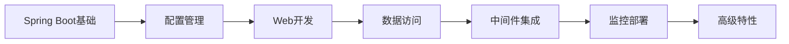

# Spring Boot 技术学习笔记

> **学习目标定位**: 面向0-5年经验的Java开发者，系统掌握Spring Boot框架，从零基础到企业级应用开发
>
> **预期学习成果**:
> - 深入理解Spring Boot核心概念和自动配置原理
> - 熟练使用Spring Boot进行Web开发和数据访问
> - 掌握Spring Boot与主流中间件的集成方法
> - 具备企业级Spring Boot应用的开发和部署能力

---

## 📚 学习路径规划



**建议学习时间**: 15-20天
- 基础入门（1-3天）: 项目创建 + 核心注解 + 配置管理
- Web开发（4-7天）: RESTful API + 异常处理 + 拦截器
- 数据访问（8-10天）: JDBC + JPA + MyBatis
- 中间件集成（11-14天）: Redis + RabbitMQ + 安全框架
- 运维部署（15-17天）: 监控 + 日志 + Docker部署
- 高级进阶（18-20天）: 自动配置原理 + 源码分析

---

## 1. Spring Boot 基础

### 1.1 Spring Boot 简介

#### 什么是Spring Boot？

**Spring Boot** 是基于Spring Framework的快速开发框架，旨在简化Spring应用的初始搭建和开发过程。

**核心理念**：
- **约定优于配置** (Convention over Configuration)
- **开箱即用** (Out of the Box)
- **独立运行** (Standalone)

#### Spring Boot的优势

| 传统Spring开发 | Spring Boot开发 |
|---------------|----------------|
| 繁琐的XML配置 | 零配置或极少配置 |
| 复杂的依赖管理 | 自动依赖管理 |
| 需要外部容器 | 内嵌Servlet容器 |
| 手动整合框架 | 自动配置集成 |
| 部署复杂 | 直接运行JAR包 |

**Spring Boot核心功能**：

```yaml
核心特性:
  1. 自动配置: 根据classpath自动配置Spring和第三方库
  2. Starter依赖: 简化Maven/Gradle依赖配置
  3. 内嵌容器: Tomcat、Jetty、Undertow
  4. 生产就绪: Actuator提供监控、健康检查
  5. 无代码生成: 无需生成代码和XML配置
```

#### Spring Boot与Spring的关系

```
┌──────────────────────────────────────────┐
│         Spring Boot                      │
│  ┌────────────────────────────────────┐  │
│  │   自动配置 + Starter + 内嵌容器    │  │
│  └──────────────┬───────────────────────┘  │
│                 │                          │
│  ┌──────────────▼───────────────────────┐  │
│  │      Spring Framework                │  │
│  │   IOC + AOP + MVC + Data + Security  │  │
│  └──────────────────────────────────────┘  │
└──────────────────────────────────────────┘
```

### 1.2 快速入门

#### 创建Spring Boot项目

**方式1: 使用Spring Initializr (推荐)**

```bash
# 访问 https://start.spring.io/
# 或使用IDEA内置的Spring Initializr

配置:
  - Project: Maven
  - Language: Java
  - Spring Boot: 3.1.5
  - Packaging: Jar
  - Java: 17
  - Dependencies: Spring Web, Lombok
```

**方式2: Maven手动创建**

```xml
<!-- pom.xml -->
<project>
    <modelVersion>4.0.0</modelVersion>

    <parent>
        <groupId>org.springframework.boot</groupId>
        <artifactId>spring-boot-starter-parent</artifactId>
        <version>3.1.5</version>
    </parent>

    <groupId>com.example</groupId>
    <artifactId>demo</artifactId>
    <version>1.0.0</version>

    <properties>
        <java.version>17</java.version>
    </properties>

    <dependencies>
        <!-- Web依赖 -->
        <dependency>
            <groupId>org.springframework.boot</groupId>
            <artifactId>spring-boot-starter-web</artifactId>
        </dependency>

        <!-- 开发工具 -->
        <dependency>
            <groupId>org.springframework.boot</groupId>
            <artifactId>spring-boot-devtools</artifactId>
            <scope>runtime</scope>
            <optional>true</optional>
        </dependency>

        <!-- Lombok -->
        <dependency>
            <groupId>org.projectlombok</groupId>
            <artifactId>lombok</artifactId>
            <optional>true</optional>
        </dependency>

        <!-- 测试 -->
        <dependency>
            <groupId>org.springframework.boot</groupId>
            <artifactId>spring-boot-starter-test</artifactId>
            <scope>test</scope>
        </dependency>
    </dependencies>

    <build>
        <plugins>
            <plugin>
                <groupId>org.springframework.boot</groupId>
                <artifactId>spring-boot-maven-plugin</artifactId>
            </plugin>
        </plugins>
    </build>
</project>
```

#### 项目结构解析

```
demo/
├── src/
│   ├── main/
│   │   ├── java/
│   │   │   └── com/
│   │   │       └── example/
│   │   │           └── demo/
│   │   │               ├── DemoApplication.java    # 启动类
│   │   │               ├── controller/              # 控制器层
│   │   │               ├── service/                 # 服务层
│   │   │               ├── repository/              # 数据访问层
│   │   │               ├── entity/                  # 实体类
│   │   │               └── config/                  # 配置类
│   │   └── resources/
│   │       ├── application.yml                     # 配置文件
│   │       ├── static/                             # 静态资源
│   │       └── templates/                          # 模板文件
│   └── test/                                       # 测试代码
├── pom.xml                                         # Maven配置
└── README.md
```

#### 第一个HelloWorld应用

**1. 启动类**

```java
package com.example.demo;

import org.springframework.boot.SpringApplication;
import org.springframework.boot.autoconfigure.SpringBootApplication;

@SpringBootApplication  // 核心注解，包含3个注解
public class DemoApplication {

    public static void main(String[] args) {
        SpringApplication.run(DemoApplication.class, args);
    }
}
```

**2. Controller**

```java
package com.example.demo.controller;

import org.springframework.web.bind.annotation.GetMapping;
import org.springframework.web.bind.annotation.RestController;

@RestController
public class HelloController {

    @GetMapping("/hello")
    public String hello() {
        return "Hello, Spring Boot!";
    }
}
```

**3. 启动测试**

```bash
# 方式1: IDEA运行DemoApplication
# 方式2: Maven命令
mvn spring-boot:run

# 方式3: 打包后运行
mvn clean package
java -jar target/demo-1.0.0.jar

# 访问: http://localhost:8080/hello
# 输出: Hello, Spring Boot!
```

### 1.3 核心注解

#### @SpringBootApplication

**@SpringBootApplication = 3个注解的组合**:

```java
@SpringBootApplication
public class DemoApplication {
    // 等价于:
    @SpringBootConfiguration    // 标识为配置类
    @EnableAutoConfiguration    // 启用自动配置
    @ComponentScan              // 组件扫描
}
```

**详解**：

```java
// 1. @SpringBootConfiguration: 就是@Configuration
@Configuration
public class MyConfig {
    @Bean
    public MyBean myBean() {
        return new MyBean();
    }
}

// 2. @EnableAutoConfiguration: 自动配置核心
// 会自动扫描spring-boot-autoconfigure包下的配置类
// 根据条件注解决定是否生效

// 3. @ComponentScan: 扫描当前包及子包下的组件
// 默认扫描启动类所在包
```

#### @RestController

```java
@RestController = @Controller + @ResponseBody

@RestController
public class UserController {

    @GetMapping("/user/{id}")
    public User getUser(@PathVariable Long id) {
        // 返回对象自动转JSON
        return userService.findById(id);
    }
}
```

#### @RequestMapping系列

```java
@RestController
@RequestMapping("/api/users")  // 类级别映射
public class UserController {

    // GET请求: /api/users
    @GetMapping
    public List<User> list() { }

    // GET请求: /api/users/{id}
    @GetMapping("/{id}")
    public User get(@PathVariable Long id) { }

    // POST请求: /api/users
    @PostMapping
    public User create(@RequestBody User user) { }

    // PUT请求: /api/users/{id}
    @PutMapping("/{id}")
    public User update(@PathVariable Long id, @RequestBody User user) { }

    // DELETE请求: /api/users/{id}
    @DeleteMapping("/{id}")
    public void delete(@PathVariable Long id) { }
}
```

#### @Autowired依赖注入

```java
// 字段注入（不推荐）
@Autowired
private UserService userService;

// 构造器注入（推荐）
private final UserService userService;

@Autowired
public UserController(UserService userService) {
    this.userService = userService;
}

// Setter注入
private UserService userService;

@Autowired
public void setUserService(UserService userService) {
    this.userService = userService;
}

// 如果只有一个构造器，@Autowired可省略
public UserController(UserService userService) {
    this.userService = userService;
}
```

---

## 2. 配置管理

### 2.1 配置文件

#### application.properties vs application.yml

**application.properties**:

```properties
# 服务器配置
server.port=8080
server.servlet.context-path=/api

# 数据源配置
spring.datasource.url=jdbc:mysql://localhost:3306/demo
spring.datasource.username=root
spring.datasource.password=123456
spring.datasource.driver-class-name=com.mysql.cj.jdbc.Driver
```

**application.yml** (推荐):

```yaml
server:
  port: 8080
  servlet:
    context-path: /api

spring:
  datasource:
    url: jdbc:mysql://localhost:3306/demo
    username: root
    password: 123456
    driver-class-name: com.mysql.cj.jdbc.Driver
```

#### 配置文件优先级

```
优先级从高到低:
1. 命令行参数: java -jar app.jar --server.port=9000
2. SPRING_APPLICATION_JSON环境变量
3. ServletConfig初始化参数
4. ServletContext初始化参数
5. JNDI属性
6. Java系统属性: System.getProperties()
7. 操作系统环境变量
8. RandomValuePropertySource
9. jar包外的application-{profile}.properties/yml
10. jar包内的application-{profile}.properties/yml
11. jar包外的application.properties/yml
12. jar包内的application.properties/yml
13. @Configuration类上的@PropertySource
14. 默认属性: SpringApplication.setDefaultProperties
```

### 2.2 配置绑定

#### @Value注解

```java
@Component
public class AppConfig {

    @Value("${server.port}")
    private int port;

    @Value("${app.name:defaultApp}")  // 默认值
    private String appName;

    @Value("${app.timeout:5000}")
    private long timeout;

    // SpEL表达式
    @Value("#{systemProperties['user.home']}")
    private String userHome;

    @Value("#{T(java.lang.Math).random() * 100}")
    private double randomNumber;
}
```

#### @ConfigurationProperties (推荐)

```yaml
# application.yml
app:
  name: Demo Application
  version: 1.0.0
  timeout: 5000
  servers:
    - dev.example.com
    - prod.example.com
  database:
    url: jdbc:mysql://localhost:3306/demo
    username: root
    password: 123456
```

```java
@Component
@ConfigurationProperties(prefix = "app")
@Data
public class AppProperties {

    private String name;
    private String version;
    private long timeout;
    private List<String> servers;
    private Database database;

    @Data
    public static class Database {
        private String url;
        private String username;
        private String password;
    }
}
```

**使用配置类**:

```java
@Service
public class AppService {

    private final AppProperties appProperties;

    public AppService(AppProperties appProperties) {
        this.appProperties = appProperties;
    }

    public void printConfig() {
        System.out.println("App Name: " + appProperties.getName());
        System.out.println("Servers: " + appProperties.getServers());
        System.out.println("DB URL: " + appProperties.getDatabase().getUrl());
    }
}
```

### 2.3 多环境配置

#### Profile配置

**文件命名规则**: `application-{profile}.yml`

```
resources/
├── application.yml           # 通用配置
├── application-dev.yml       # 开发环境
├── application-test.yml      # 测试环境
└── application-prod.yml      # 生产环境
```

**application.yml (通用配置)**:

```yaml
spring:
  application:
    name: demo-app
  profiles:
    active: dev  # 激活dev环境
```

**application-dev.yml**:

```yaml
server:
  port: 8080

spring:
  datasource:
    url: jdbc:mysql://localhost:3306/demo_dev
    username: root
    password: dev123

logging:
  level:
    root: DEBUG
```

**application-prod.yml**:

```yaml
server:
  port: 80

spring:
  datasource:
    url: jdbc:mysql://prod-db-server:3306/demo_prod
    username: prod_user
    password: ${DB_PASSWORD}  # 从环境变量读取

logging:
  level:
    root: WARN
```

#### 激活Profile的方式

```bash
# 1. 配置文件
spring.profiles.active=dev

# 2. 命令行参数
java -jar app.jar --spring.profiles.active=prod

# 3. 环境变量
export SPRING_PROFILES_ACTIVE=prod
java -jar app.jar

# 4. JVM参数
java -Dspring.profiles.active=prod -jar app.jar

# 5. IDE配置（Run Configuration）
```

#### 条件化配置

```java
@Configuration
@Profile("dev")  // 仅在dev环境生效
public class DevConfig {

    @Bean
    public DataSource dataSource() {
        // 开发环境的数据源配置
        return new EmbeddedDatabaseBuilder()
            .setType(EmbeddedDatabaseType.H2)
            .build();
    }
}

@Configuration
@Profile("prod")  // 仅在prod环境生效
public class ProdConfig {

    @Bean
    public DataSource dataSource() {
        // 生产环境的数据源配置
        HikariDataSource dataSource = new HikariDataSource();
        dataSource.setJdbcUrl("jdbc:mysql://prod-db:3306/demo");
        return dataSource;
    }
}
```

**条件注解**:

```java
@Configuration
public class ConditionalConfig {

    // 当类路径存在指定类时生效
    @Bean
    @ConditionalOnClass(DataSource.class)
    public MyBean myBean1() { }

    // 当不存在指定Bean时生效
    @Bean
    @ConditionalOnMissingBean(DataSource.class)
    public MyBean myBean2() { }

    // 当配置属性匹配时生效
    @Bean
    @ConditionalOnProperty(name = "app.feature.enabled", havingValue = "true")
    public MyFeature myFeature() { }

    // 当指定表达式为true时生效
    @Bean
    @ConditionalOnExpression("${app.enabled:true} and ${app.mode} == 'production'")
    public MyBean myBean3() { }
}
```

---

## 3. Web开发

### 3.1 Spring MVC集成

#### 自动配置原理

**Spring Boot自动配置了以下内容**:

```yaml
自动配置内容:
  1. DispatcherServlet: 核心分发器
  2. 视图解析器:
     - ContentNegotiatingViewResolver
     - BeanNameViewResolver
  3. 静态资源映射:
     - /static
     - /public
     - /resources
     - /META-INF/resources
  4. 转换器和格式化器:
     - HttpMessageConverter: JSON、XML转换
     - Formatter: 日期格式化
  5. 错误处理:
     - ErrorAttributes
     - BasicErrorController
```

**自定义MVC配置**:

```java
@Configuration
public class WebMvcConfig implements WebMvcConfigurer {

    // 跨域配置
    @Override
    public void addCorsMappings(CorsRegistry registry) {
        registry.addMapping("/api/**")
            .allowedOrigins("http://localhost:3000")
            .allowedMethods("GET", "POST", "PUT", "DELETE")
            .allowedHeaders("*")
            .allowCredentials(true)
            .maxAge(3600);
    }

    // 拦截器
    @Override
    public void addInterceptors(InterceptorRegistry registry) {
        registry.addInterceptor(new LogInterceptor())
            .addPathPatterns("/**")
            .excludePathPatterns("/login", "/register");
    }

    // 参数解析器
    @Override
    public void addArgumentResolvers(List<HandlerMethodArgumentResolver> resolvers) {
        resolvers.add(new CustomArgumentResolver());
    }

    // 消息转换器
    @Override
    public void configureMessageConverters(List<HttpMessageConverter<?>> converters) {
        FastJsonHttpMessageConverter converter = new FastJsonHttpMessageConverter();
        converters.add(0, converter);
    }
}
```

#### 静态资源处理

**默认静态资源路径**:

```
classpath:/static/
classpath:/public/
classpath:/resources/
classpath:/META-INF/resources/

访问: http://localhost:8080/css/style.css
对应: src/main/resources/static/css/style.css
```

**自定义静态资源路径**:

```yaml
spring:
  web:
    resources:
      static-locations:
        - classpath:/static/
        - classpath:/public/
        - file:/opt/app/static/  # 外部目录
```

```java
@Configuration
public class StaticResourceConfig implements WebMvcConfigurer {

    @Override
    public void addResourceHandlers(ResourceHandlerRegistry registry) {
        // 映射/img/**到指定目录
        registry.addResourceHandler("/img/**")
            .addResourceLocations("file:/opt/images/")
            .setCacheControl(CacheControl.maxAge(1, TimeUnit.HOURS));
    }
}
```

### 3.2 RESTful API

#### REST风格设计

**RESTful API设计规范**:

```
资源命名: 使用复数名词
GET    /api/users         获取用户列表
GET    /api/users/{id}    获取指定用户
POST   /api/users         创建新用户
PUT    /api/users/{id}    更新指定用户
DELETE /api/users/{id}    删除指定用户

嵌套资源:
GET    /api/users/{userId}/orders        获取用户的订单列表
POST   /api/users/{userId}/orders        为用户创建订单

查询参数:
GET    /api/users?page=1&size=20         分页查询
GET    /api/users?sort=age,desc          排序查询
GET    /api/users?name=张三               搜索查询
```

#### 完整的CRUD示例

**实体类**:

```java
@Data
@Entity
@Table(name = "users")
public class User {
    @Id
    @GeneratedValue(strategy = GenerationType.IDENTITY)
    private Long id;

    @Column(nullable = false, length = 50)
    private String username;

    @Column(nullable = false, length = 100)
    private String email;

    @Column(nullable = false)
    private Integer age;

    @CreationTimestamp
    private LocalDateTime createdAt;

    @UpdateTimestamp
    private LocalDateTime updatedAt;
}
```

**Repository**:

```java
public interface UserRepository extends JpaRepository<User, Long> {
    Optional<User> findByUsername(String username);
    List<User> findByAgeGreaterThan(Integer age);
    Page<User> findByUsernameLike(String username, Pageable pageable);
}
```

**Service**:

```java
@Service
@Transactional
public class UserService {

    private final UserRepository userRepository;

    public UserService(UserRepository userRepository) {
        this.userRepository = userRepository;
    }

    public List<User> findAll() {
        return userRepository.findAll();
    }

    public User findById(Long id) {
        return userRepository.findById(id)
            .orElseThrow(() -> new ResourceNotFoundException("User not found: " + id));
    }

    public User create(User user) {
        if (userRepository.findByUsername(user.getUsername()).isPresent()) {
            throw new BusinessException("Username already exists");
        }
        return userRepository.save(user);
    }

    public User update(Long id, User user) {
        User existingUser = findById(id);
        existingUser.setUsername(user.getUsername());
        existingUser.setEmail(user.getEmail());
        existingUser.setAge(user.getAge());
        return userRepository.save(existingUser);
    }

    public void delete(Long id) {
        User user = findById(id);
        userRepository.delete(user);
    }
}
```

**Controller**:

```java
@RestController
@RequestMapping("/api/users")
@Validated
public class UserController {

    private final UserService userService;

    public UserController(UserService userService) {
        this.userService = userService;
    }

    /**
     * 获取用户列表
     */
    @GetMapping
    public ResponseEntity<List<User>> list() {
        List<User> users = userService.findAll();
        return ResponseEntity.ok(users);
    }

    /**
     * 获取单个用户
     */
    @GetMapping("/{id}")
    public ResponseEntity<User> get(@PathVariable Long id) {
        User user = userService.findById(id);
        return ResponseEntity.ok(user);
    }

    /**
     * 创建用户
     */
    @PostMapping
    public ResponseEntity<User> create(@Valid @RequestBody User user) {
        User createdUser = userService.create(user);
        return ResponseEntity
            .status(HttpStatus.CREATED)
            .body(createdUser);
    }

    /**
     * 更新用户
     */
    @PutMapping("/{id}")
    public ResponseEntity<User> update(
        @PathVariable Long id,
        @Valid @RequestBody User user
    ) {
        User updatedUser = userService.update(id, user);
        return ResponseEntity.ok(updatedUser);
    }

    /**
     * 删除用户
     */
    @DeleteMapping("/{id}")
    public ResponseEntity<Void> delete(@PathVariable Long id) {
        userService.delete(id);
        return ResponseEntity.noContent().build();
    }
}
```

#### 参数绑定

```java
@RestController
@RequestMapping("/api/demo")
public class DemoController {

    // 路径参数
    @GetMapping("/users/{id}")
    public User getUser(@PathVariable Long id) { }

    // 查询参数
    @GetMapping("/users")
    public List<User> listUsers(
        @RequestParam(defaultValue = "0") int page,
        @RequestParam(defaultValue = "10") int size,
        @RequestParam(required = false) String name
    ) { }

    // 请求体
    @PostMapping("/users")
    public User createUser(@RequestBody User user) { }

    // 请求头
    @GetMapping("/info")
    public String getInfo(
        @RequestHeader("User-Agent") String userAgent,
        @RequestHeader(value = "Authorization", required = false) String token
    ) { }

    // Cookie
    @GetMapping("/session")
    public String getSession(@CookieValue("JSESSIONID") String sessionId) { }

    // 多个参数对象
    @GetMapping("/search")
    public List<User> search(UserSearchCriteria criteria) { }
}

@Data
public class UserSearchCriteria {
    private String name;
    private Integer minAge;
    private Integer maxAge;
    private LocalDate startDate;
    private LocalDate endDate;
}
```

### 3.3 异常处理

#### 全局异常处理

```java
@RestControllerAdvice
@Slf4j
public class GlobalExceptionHandler {

    /**
     * 处理业务异常
     */
    @ExceptionHandler(BusinessException.class)
    public ResponseEntity<ErrorResponse> handleBusinessException(BusinessException ex) {
        log.error("Business exception: {}", ex.getMessage());
        ErrorResponse error = ErrorResponse.builder()
            .code(ex.getCode())
            .message(ex.getMessage())
            .timestamp(LocalDateTime.now())
            .build();
        return ResponseEntity
            .status(HttpStatus.BAD_REQUEST)
            .body(error);
    }

    /**
     * 处理资源未找到异常
     */
    @ExceptionHandler(ResourceNotFoundException.class)
    public ResponseEntity<ErrorResponse> handleResourceNotFoundException(
        ResourceNotFoundException ex
    ) {
        log.error("Resource not found: {}", ex.getMessage());
        ErrorResponse error = ErrorResponse.builder()
            .code("RESOURCE_NOT_FOUND")
            .message(ex.getMessage())
            .timestamp(LocalDateTime.now())
            .build();
        return ResponseEntity
            .status(HttpStatus.NOT_FOUND)
            .body(error);
    }

    /**
     * 处理参数校验异常
     */
    @ExceptionHandler(MethodArgumentNotValidException.class)
    public ResponseEntity<ErrorResponse> handleValidationException(
        MethodArgumentNotValidException ex
    ) {
        Map<String, String> errors = new HashMap<>();
        ex.getBindingResult().getFieldErrors().forEach(error ->
            errors.put(error.getField(), error.getDefaultMessage())
        );

        ErrorResponse error = ErrorResponse.builder()
            .code("VALIDATION_ERROR")
            .message("Validation failed")
            .errors(errors)
            .timestamp(LocalDateTime.now())
            .build();

        return ResponseEntity
            .status(HttpStatus.BAD_REQUEST)
            .body(error);
    }

    /**
     * 处理其他所有异常
     */
    @ExceptionHandler(Exception.class)
    public ResponseEntity<ErrorResponse> handleGlobalException(Exception ex) {
        log.error("Unexpected error", ex);
        ErrorResponse error = ErrorResponse.builder()
            .code("INTERNAL_SERVER_ERROR")
            .message("An unexpected error occurred")
            .timestamp(LocalDateTime.now())
            .build();
        return ResponseEntity
            .status(HttpStatus.INTERNAL_SERVER_ERROR)
            .body(error);
    }
}

@Data
@Builder
public class ErrorResponse {
    private String code;
    private String message;
    private Map<String, String> errors;
    private LocalDateTime timestamp;
}
```

**自定义业务异常**:

```java
@Getter
public class BusinessException extends RuntimeException {
    private final String code;

    public BusinessException(String code, String message) {
        super(message);
        this.code = code;
    }

    public BusinessException(String message) {
        this("BUSINESS_ERROR", message);
    }
}

public class ResourceNotFoundException extends RuntimeException {
    public ResourceNotFoundException(String message) {
        super(message);
    }
}
```

---

## 4. 数据访问

### 4.1 JDBC支持

#### 数据源配置

**application.yml**:

```yaml
spring:
  datasource:
    url: jdbc:mysql://localhost:3306/demo?useUnicode=true&characterEncoding=utf8&useSSL=false&serverTimezone=UTC
    username: root
    password: 123456
    driver-class-name: com.mysql.cj.jdbc.Driver

    # HikariCP连接池配置（Spring Boot 2.x默认）
    hikari:
      minimum-idle: 5
      maximum-pool-size: 20
      connection-timeout: 30000
      idle-timeout: 600000
      max-lifetime: 1800000
      connection-test-query: SELECT 1
```

#### JdbcTemplate

```java
@Repository
public class UserDao {

    private final JdbcTemplate jdbcTemplate;

    public UserDao(JdbcTemplate jdbcTemplate) {
        this.jdbcTemplate = jdbcTemplate;
    }

    /**
     * 查询单个对象
     */
    public User findById(Long id) {
        String sql = "SELECT * FROM users WHERE id = ?";
        return jdbcTemplate.queryForObject(sql, new BeanPropertyRowMapper<>(User.class), id);
    }

    /**
     * 查询列表
     */
    public List<User> findAll() {
        String sql = "SELECT * FROM users";
        return jdbcTemplate.query(sql, new BeanPropertyRowMapper<>(User.class));
    }

    /**
     * 插入
     */
    public int insert(User user) {
        String sql = "INSERT INTO users (username, email, age) VALUES (?, ?, ?)";
        return jdbcTemplate.update(sql, user.getUsername(), user.getEmail(), user.getAge());
    }

    /**
     * 更新
     */
    public int update(User user) {
        String sql = "UPDATE users SET username = ?, email = ?, age = ? WHERE id = ?";
        return jdbcTemplate.update(sql,
            user.getUsername(),
            user.getEmail(),
            user.getAge(),
            user.getId()
        );
    }

    /**
     * 删除
     */
    public int delete(Long id) {
        String sql = "DELETE FROM users WHERE id = ?";
        return jdbcTemplate.update(sql, id);
    }

    /**
     * 批量插入
     */
    public int[] batchInsert(List<User> users) {
        String sql = "INSERT INTO users (username, email, age) VALUES (?, ?, ?)";
        return jdbcTemplate.batchUpdate(sql, new BatchPreparedStatementSetter() {
            @Override
            public void setValues(PreparedStatement ps, int i) throws SQLException {
                User user = users.get(i);
                ps.setString(1, user.getUsername());
                ps.setString(2, user.getEmail());
                ps.setInt(3, user.getAge());
            }

            @Override
            public int getBatchSize() {
                return users.size();
            }
        });
    }
}
```

#### 事务管理

```java
@Service
@Transactional  // 类级别：所有方法都开启事务
public class UserService {

    private final UserDao userDao;

    public UserService(UserDao userDao) {
        this.userDao = userDao;
    }

    /**
     * 默认事务配置
     */
    public void createUser(User user) {
        userDao.insert(user);
    }

    /**
     * 只读事务
     */
    @Transactional(readOnly = true)
    public User getUser(Long id) {
        return userDao.findById(id);
    }

    /**
     * 指定异常回滚
     */
    @Transactional(rollbackFor = Exception.class)
    public void updateUser(User user) {
        userDao.update(user);
        // 任何异常都会回滚
    }

    /**
     * 指定传播行为
     */
    @Transactional(propagation = Propagation.REQUIRES_NEW)
    public void createUserInNewTransaction(User user) {
        // 总是在新事务中执行
        userDao.insert(user);
    }
}
```

### 4.2 JPA集成

#### Spring Data JPA配置

**pom.xml**:

```xml
<dependency>
    <groupId>org.springframework.boot</groupId>
    <artifactId>spring-boot-starter-data-jpa</artifactId>
</dependency>
```

**application.yml**:

```yaml
spring:
  jpa:
    hibernate:
      ddl-auto: update  # none, validate, update, create, create-drop
    show-sql: true
    properties:
      hibernate:
        format_sql: true
        dialect: org.hibernate.dialect.MySQL8Dialect
    open-in-view: false  # 关闭OSIV
```

#### 实体类映射

```java
@Entity
@Table(name = "users", indexes = {
    @Index(name = "idx_username", columnList = "username"),
    @Index(name = "idx_email", columnList = "email")
})
@Data
@NoArgsConstructor
@AllArgsConstructor
public class User {

    @Id
    @GeneratedValue(strategy = GenerationType.IDENTITY)
    private Long id;

    @Column(nullable = false, unique = true, length = 50)
    private String username;

    @Column(nullable = false, length = 100)
    private String email;

    @Column(name = "age")
    private Integer age;

    @Enumerated(EnumType.STRING)
    @Column(name = "status", length = 20)
    private UserStatus status;

    @CreatedDate
    @Column(name = "created_at", nullable = false, updatable = false)
    private LocalDateTime createdAt;

    @LastModifiedDate
    @Column(name = "updated_at")
    private LocalDateTime updatedAt;

    // 一对多关系
    @OneToMany(mappedBy = "user", cascade = CascadeType.ALL, orphanRemoval = true)
    private List<Order> orders = new ArrayList<>();

    // 多对一关系
    @ManyToOne(fetch = FetchType.LAZY)
    @JoinColumn(name = "department_id")
    private Department department;

    // 多对多关系
    @ManyToMany
    @JoinTable(
        name = "user_roles",
        joinColumns = @JoinColumn(name = "user_id"),
        inverseJoinColumns = @JoinColumn(name = "role_id")
    )
    private Set<Role> roles = new HashSet<>();
}

public enum UserStatus {
    ACTIVE, INACTIVE, SUSPENDED
}
```

#### Repository接口

```java
public interface UserRepository extends JpaRepository<User, Long>,
                                        JpaSpecificationExecutor<User> {

    // 方法名查询
    Optional<User> findByUsername(String username);

    List<User> findByAgeGreaterThan(Integer age);

    List<User> findByEmailContaining(String email);

    Page<User> findByStatus(UserStatus status, Pageable pageable);

    // @Query查询
    @Query("SELECT u FROM User u WHERE u.username = :username")
    Optional<User> findByUsernameCustom(@Param("username") String username);

    @Query("SELECT u FROM User u WHERE u.age BETWEEN :minAge AND :maxAge")
    List<User> findByAgeBetween(@Param("minAge") Integer minAge,
                                 @Param("maxAge") Integer maxAge);

    // 原生SQL
    @Query(value = "SELECT * FROM users WHERE email LIKE %:keyword%", nativeQuery = true)
    List<User> searchByEmail(@Param("keyword") String keyword);

    // 更新操作
    @Modifying
    @Query("UPDATE User u SET u.status = :status WHERE u.id = :id")
    int updateStatus(@Param("id") Long id, @Param("status") UserStatus status);

    // 删除操作
    @Modifying
    @Query("DELETE FROM User u WHERE u.status = :status")
    int deleteByStatus(@Param("status") UserStatus status);

    // 投影查询
    @Query("SELECT new com.example.demo.dto.UserDTO(u.id, u.username, u.email) " +
           "FROM User u WHERE u.status = :status")
    List<UserDTO> findUserDTOsByStatus(@Param("status") UserStatus status);
}
```

**动态查询 (Specification)**:

```java
@Service
public class UserService {

    private final UserRepository userRepository;

    public List<User> findUsers(UserSearchCriteria criteria) {
        return userRepository.findAll((root, query, cb) -> {
            List<Predicate> predicates = new ArrayList<>();

            if (criteria.getUsername() != null) {
                predicates.add(cb.like(root.get("username"), "%" + criteria.getUsername() + "%"));
            }

            if (criteria.getMinAge() != null) {
                predicates.add(cb.greaterThanOrEqualTo(root.get("age"), criteria.getMinAge()));
            }

            if (criteria.getMaxAge() != null) {
                predicates.add(cb.lessThanOrEqualTo(root.get("age"), criteria.getMaxAge()));
            }

            if (criteria.getStatus() != null) {
                predicates.add(cb.equal(root.get("status"), criteria.getStatus()));
            }

            return cb.and(predicates.toArray(new Predicate[0]));
        });
    }
}
```

### 4.3 MyBatis集成

#### MyBatis配置

**pom.xml**:

```xml
<dependency>
    <groupId>org.mybatis.spring.boot</groupId>
    <artifactId>mybatis-spring-boot-starter</artifactId>
    <version>3.0.2</version>
</dependency>
```

**application.yml**:

```yaml
mybatis:
  type-aliases-package: com.example.demo.entity
  mapper-locations: classpath:mapper/*.xml
  configuration:
    map-underscore-to-camel-case: true  # 驼峰命名转换
    cache-enabled: true                  # 开启二级缓存
    lazy-loading-enabled: true           # 开启延迟加载
    log-impl: org.apache.ibatis.logging.stdout.StdOutImpl
```

#### Mapper接口

```java
@Mapper
public interface UserMapper {

    /**
     * 注解方式
     */
    @Select("SELECT * FROM users WHERE id = #{id}")
    User findById(@Param("id") Long id);

    @Select("SELECT * FROM users")
    List<User> findAll();

    @Insert("INSERT INTO users (username, email, age) VALUES (#{username}, #{email}, #{age})")
    @Options(useGeneratedKeys = true, keyProperty = "id")
    int insert(User user);

    @Update("UPDATE users SET username = #{username}, email = #{email}, age = #{age} WHERE id = #{id}")
    int update(User user);

    @Delete("DELETE FROM users WHERE id = #{id}")
    int delete(@Param("id") Long id);

    /**
     * XML方式（推荐）
     */
    User findByUsername(@Param("username") String username);

    List<User> findByCondition(UserSearchCriteria criteria);

    int batchInsert(@Param("users") List<User> users);
}
```

#### SQL映射文件

```xml
<?xml version="1.0" encoding="UTF-8"?>
<!DOCTYPE mapper PUBLIC "-//mybatis.org//DTD Mapper 3.0//EN"
        "http://mybatis.org/dtd/mybatis-3-mapper.dtd">

<mapper namespace="com.example.demo.mapper.UserMapper">

    <!-- 结果映射 -->
    <resultMap id="BaseResultMap" type="User">
        <id property="id" column="id"/>
        <result property="username" column="username"/>
        <result property="email" column="email"/>
        <result property="age" column="age"/>
        <result property="createdAt" column="created_at"/>
        <result property="updatedAt" column="updated_at"/>
    </resultMap>

    <!-- 根据用户名查询 -->
    <select id="findByUsername" resultMap="BaseResultMap">
        SELECT * FROM users WHERE username = #{username}
    </select>

    <!-- 动态SQL查询 -->
    <select id="findByCondition" resultMap="BaseResultMap">
        SELECT * FROM users
        <where>
            <if test="username != null and username != ''">
                AND username LIKE CONCAT('%', #{username}, '%')
            </if>
            <if test="minAge != null">
                AND age &gt;= #{minAge}
            </if>
            <if test="maxAge != null">
                AND age &lt;= #{maxAge}
            </if>
            <if test="status != null">
                AND status = #{status}
            </if>
        </where>
        ORDER BY created_at DESC
    </select>

    <!-- 批量插入 -->
    <insert id="batchInsert" useGeneratedKeys="true" keyProperty="id">
        INSERT INTO users (username, email, age)
        VALUES
        <foreach collection="users" item="user" separator=",">
            (#{user.username}, #{user.email}, #{user.age})
        </foreach>
    </insert>

    <!-- 关联查询 -->
    <select id="findWithOrders" resultMap="UserWithOrdersMap">
        SELECT u.*, o.id as order_id, o.order_no, o.amount
        FROM users u
        LEFT JOIN orders o ON u.id = o.user_id
        WHERE u.id = #{id}
    </select>

    <resultMap id="UserWithOrdersMap" type="User">
        <id property="id" column="id"/>
        <result property="username" column="username"/>
        <collection property="orders" ofType="Order">
            <id property="id" column="order_id"/>
            <result property="orderNo" column="order_no"/>
            <result property="amount" column="amount"/>
        </collection>
    </resultMap>

</mapper>
```

---

## 5. 安全管理

### 5.1 Spring Security集成

#### 依赖配置

```xml
<dependency>
    <groupId>org.springframework.boot</groupId>
    <artifactId>spring-boot-starter-security</artifactId>
</dependency>
```

#### 基础配置

```java
@Configuration
@EnableWebSecurity
public class SecurityConfig {

    @Bean
    public SecurityFilterChain filterChain(HttpSecurity http) throws Exception {
        http
            .authorizeHttpRequests(authorize -> authorize
                .requestMatchers("/api/public/**").permitAll()
                .requestMatchers("/api/admin/**").hasRole("ADMIN")
                .requestMatchers("/api/user/**").hasAnyRole("USER", "ADMIN")
                .anyRequest().authenticated()
            )
            .formLogin(form -> form
                .loginPage("/login")
                .defaultSuccessUrl("/home")
                .permitAll()
            )
            .logout(logout -> logout
                .logoutUrl("/logout")
                .logoutSuccessUrl("/login")
                .permitAll()
            )
            .csrf(csrf -> csrf.disable())  // 开发环境可禁用
            .httpBasic(Customizer.withDefaults());

        return http.build();
    }

    @Bean
    public PasswordEncoder passwordEncoder() {
        return new BCryptPasswordEncoder();
    }
}
```

#### 用户认证

```java
@Service
public class UserDetailsServiceImpl implements UserDetailsService {

    private final UserRepository userRepository;

    public UserDetailsServiceImpl(UserRepository userRepository) {
        this.userRepository = userRepository;
    }

    @Override
    public UserDetails loadUserByUsername(String username) throws UsernameNotFoundException {
        User user = userRepository.findByUsername(username)
            .orElseThrow(() -> new UsernameNotFoundException("User not found: " + username));

        return org.springframework.security.core.userdetails.User
            .withUsername(user.getUsername())
            .password(user.getPassword())
            .authorities(getAuthorities(user))
            .accountExpired(false)
            .accountLocked(false)
            .credentialsExpired(false)
            .disabled(false)
            .build();
    }

    private Collection<? extends GrantedAuthority> getAuthorities(User user) {
        return user.getRoles().stream()
            .map(role -> new SimpleGrantedAuthority("ROLE_" + role.getName()))
            .collect(Collectors.toList());
    }
}
```

### 5.2 JWT认证

#### JWT工具类

```java
@Component
public class JwtTokenProvider {

    @Value("${app.jwt.secret}")
    private String jwtSecret;

    @Value("${app.jwt.expiration}")
    private long jwtExpiration;

    /**
     * 生成Token
     */
    public String generateToken(Authentication authentication) {
        UserDetails userDetails = (UserDetails) authentication.getPrincipal();
        Date now = new Date();
        Date expiryDate = new Date(now.getTime() + jwtExpiration);

        return Jwts.builder()
            .setSubject(userDetails.getUsername())
            .setIssuedAt(now)
            .setExpiration(expiryDate)
            .signWith(SignatureAlgorithm.HS512, jwtSecret)
            .compact();
    }

    /**
     * 从Token获取用户名
     */
    public String getUsernameFromToken(String token) {
        Claims claims = Jwts.parser()
            .setSigningKey(jwtSecret)
            .parseClaimsJws(token)
            .getBody();

        return claims.getSubject();
    }

    /**
     * 验证Token
     */
    public boolean validateToken(String token) {
        try {
            Jwts.parser().setSigningKey(jwtSecret).parseClaimsJws(token);
            return true;
        } catch (SignatureException ex) {
            log.error("Invalid JWT signature");
        } catch (MalformedJwtException ex) {
            log.error("Invalid JWT token");
        } catch (ExpiredJwtException ex) {
            log.error("Expired JWT token");
        } catch (UnsupportedJwtException ex) {
            log.error("Unsupported JWT token");
        } catch (IllegalArgumentException ex) {
            log.error("JWT claims string is empty");
        }
        return false;
    }
}
```

#### JWT过滤器

```java
@Component
public class JwtAuthenticationFilter extends OncePerRequestFilter {

    @Autowired
    private JwtTokenProvider tokenProvider;

    @Autowired
    private UserDetailsService userDetailsService;

    @Override
    protected void doFilterInternal(
        HttpServletRequest request,
        HttpServletResponse response,
        FilterChain filterChain
    ) throws ServletException, IOException {
        try {
            String jwt = getJwtFromRequest(request);

            if (StringUtils.hasText(jwt) && tokenProvider.validateToken(jwt)) {
                String username = tokenProvider.getUsernameFromToken(jwt);
                UserDetails userDetails = userDetailsService.loadUserByUsername(username);

                UsernamePasswordAuthenticationToken authentication =
                    new UsernamePasswordAuthenticationToken(
                        userDetails,
                        null,
                        userDetails.getAuthorities()
                    );

                authentication.setDetails(
                    new WebAuthenticationDetailsSource().buildDetails(request)
                );

                SecurityContextHolder.getContext().setAuthentication(authentication);
            }
        } catch (Exception ex) {
            logger.error("Could not set user authentication in security context", ex);
        }

        filterChain.doFilter(request, response);
    }

    private String getJwtFromRequest(HttpServletRequest request) {
        String bearerToken = request.getHeader("Authorization");
        if (StringUtils.hasText(bearerToken) && bearerToken.startsWith("Bearer ")) {
            return bearerToken.substring(7);
        }
        return null;
    }
}
```

#### 认证接口

```java
@RestController
@RequestMapping("/api/auth")
public class AuthController {

    @Autowired
    private AuthenticationManager authenticationManager;

    @Autowired
    private JwtTokenProvider tokenProvider;

    @Autowired
    private UserRepository userRepository;

    @Autowired
    private PasswordEncoder passwordEncoder;

    /**
     * 登录
     */
    @PostMapping("/login")
    public ResponseEntity<?> login(@Valid @RequestBody LoginRequest loginRequest) {
        Authentication authentication = authenticationManager.authenticate(
            new UsernamePasswordAuthenticationToken(
                loginRequest.getUsername(),
                loginRequest.getPassword()
            )
        );

        SecurityContextHolder.getContext().setAuthentication(authentication);
        String token = tokenProvider.generateToken(authentication);

        return ResponseEntity.ok(new JwtAuthenticationResponse(token));
    }

    /**
     * 注册
     */
    @PostMapping("/register")
    public ResponseEntity<?> register(@Valid @RequestBody RegisterRequest registerRequest) {
        if (userRepository.existsByUsername(registerRequest.getUsername())) {
            return ResponseEntity
                .badRequest()
                .body(new ApiResponse(false, "Username is already taken"));
        }

        User user = new User();
        user.setUsername(registerRequest.getUsername());
        user.setEmail(registerRequest.getEmail());
        user.setPassword(passwordEncoder.encode(registerRequest.getPassword()));

        userRepository.save(user);

        return ResponseEntity.ok(new ApiResponse(true, "User registered successfully"));
    }
}
```

---

## 6. 缓存管理

### 6.1 Spring Cache

#### 依赖配置

```xml
<dependency>
    <groupId>org.springframework.boot</groupId>
    <artifactId>spring-boot-starter-cache</artifactId>
</dependency>
```

#### 启用缓存

```java
@SpringBootApplication
@EnableCaching
public class DemoApplication {
    public static void main(String[] args) {
        SpringApplication.run(DemoApplication.class, args);
    }
}
```

#### 缓存注解

```java
@Service
@CacheConfig(cacheNames = "users")
public class UserService {

    private final UserRepository userRepository;

    /**
     * 缓存查询结果
     */
    @Cacheable(key = "#id")
    public User findById(Long id) {
        System.out.println("Fetching user from database: " + id);
        return userRepository.findById(id).orElse(null);
    }

    /**
     * 条件缓存
     */
    @Cacheable(key = "#username", condition = "#username.length() > 3")
    public User findByUsername(String username) {
        return userRepository.findByUsername(username).orElse(null);
    }

    /**
     * 更新缓存
     */
    @CachePut(key = "#user.id")
    public User update(User user) {
        return userRepository.save(user);
    }

    /**
     * 删除缓存
     */
    @CacheEvict(key = "#id")
    public void delete(Long id) {
        userRepository.deleteById(id);
    }

    /**
     * 清空所有缓存
     */
    @CacheEvict(allEntries = true)
    public void deleteAll() {
        userRepository.deleteAll();
    }

    /**
     * 多缓存操作
     */
    @Caching(
        evict = {
            @CacheEvict(value = "users", key = "#user.id"),
            @CacheEvict(value = "userList", allEntries = true)
        }
    )
    public void complexUpdate(User user) {
        userRepository.save(user);
    }
}
```

### 6.2 Redis缓存

#### Redis配置

```yaml
spring:
  redis:
    host: localhost
    port: 6379
    password:
    database: 0
    timeout: 3000ms
    lettuce:
      pool:
        max-active: 8
        max-idle: 8
        min-idle: 0
        max-wait: -1ms
  cache:
    type: redis
    redis:
      time-to-live: 600000  # 10分钟过期
```

```java
@Configuration
@EnableCaching
public class RedisConfig {

    @Bean
    public RedisTemplate<String, Object> redisTemplate(
        RedisConnectionFactory connectionFactory
    ) {
        RedisTemplate<String, Object> template = new RedisTemplate<>();
        template.setConnectionFactory(connectionFactory);

        // JSON序列化
        Jackson2JsonRedisSerializer<Object> serializer =
            new Jackson2JsonRedisSerializer<>(Object.class);
        ObjectMapper om = new ObjectMapper();
        om.setVisibility(PropertyAccessor.ALL, JsonAutoDetect.Visibility.ANY);
        om.activateDefaultTyping(
            LaissezFaireSubTypeValidator.instance,
            ObjectMapper.DefaultTyping.NON_FINAL
        );
        serializer.setObjectMapper(om);

        template.setKeySerializer(new StringRedisSerializer());
        template.setValueSerializer(serializer);
        template.setHashKeySerializer(new StringRedisSerializer());
        template.setHashValueSerializer(serializer);
        template.afterPropertiesSet();

        return template;
    }

    @Bean
    public CacheManager cacheManager(RedisConnectionFactory connectionFactory) {
        RedisCacheConfiguration config = RedisCacheConfiguration.defaultCacheConfig()
            .entryTtl(Duration.ofMinutes(10))
            .serializeKeysWith(
                RedisSerializationContext.SerializationPair.fromSerializer(
                    new StringRedisSerializer()
                )
            )
            .serializeValuesWith(
                RedisSerializationContext.SerializationPair.fromSerializer(
                    new GenericJackson2JsonRedisSerializer()
                )
            )
            .disableCachingNullValues();

        return RedisCacheManager.builder(connectionFactory)
            .cacheDefaults(config)
            .build();
    }
}
```

---

## 7. 监控与运维

### 7.1 Spring Boot Actuator

#### 依赖配置

```xml
<dependency>
    <groupId>org.springframework.boot</groupId>
    <artifactId>spring-boot-starter-actuator</artifactId>
</dependency>
```

#### 配置

```yaml
management:
  endpoints:
    web:
      exposure:
        include: "*"  # 暴露所有端点
      base-path: /actuator
  endpoint:
    health:
      show-details: always
    shutdown:
      enabled: true
  metrics:
    export:
      prometheus:
        enabled: true
```

#### 常用端点

```bash
# 健康检查
GET /actuator/health

# 应用信息
GET /actuator/info

# 指标信息
GET /actuator/metrics
GET /actuator/metrics/jvm.memory.used

# 环境配置
GET /actuator/env

# Bean信息
GET /actuator/beans

# 日志配置
GET /actuator/loggers
POST /actuator/loggers/com.example.demo

# 线程转储
GET /actuator/threaddump

# 堆转储
GET /actuator/heapdump

# 关闭应用（需要启用）
POST /actuator/shutdown
```

#### 自定义Health Indicator

```java
@Component
public class CustomHealthIndicator implements HealthIndicator {

    @Override
    public Health health() {
        // 检查自定义健康指标
        if (checkCustomCondition()) {
            return Health.up()
                .withDetail("status", "Available")
                .withDetail("message", "Custom service is running")
                .build();
        } else {
            return Health.down()
                .withDetail("status", "Unavailable")
                .withDetail("message", "Custom service is down")
                .build();
        }
    }

    private boolean checkCustomCondition() {
        // 实际检查逻辑
        return true;
    }
}
```

#### 自定义端点

```java
@Component
@Endpoint(id = "custom")
public class CustomEndpoint {

    @ReadOperation
    public Map<String, Object> customInfo() {
        Map<String, Object> info = new HashMap<>();
        info.put("appName", "Demo Application");
        info.put("version", "1.0.0");
        info.put("timestamp", System.currentTimeMillis());
        return info;
    }

    @WriteOperation
    public void updateSetting(@Selector String name, String value) {
        // 更新配置
        System.out.println("Updating " + name + " to " + value);
    }

    @DeleteOperation
    public void clearCache() {
        // 清除缓存
        System.out.println("Cache cleared");
    }
}
```

### 7.2 日志管理

#### Logback配置

**logback-spring.xml**:

```xml
<?xml version="1.0" encoding="UTF-8"?>
<configuration>
    <!-- 控制台输出 -->
    <appender name="CONSOLE" class="ch.qos.logback.core.ConsoleAppender">
        <encoder>
            <pattern>%d{yyyy-MM-dd HH:mm:ss.SSS} [%thread] %-5level %logger{50} - %msg%n</pattern>
            <charset>UTF-8</charset>
        </encoder>
    </appender>

    <!-- 文件输出 -->
    <appender name="FILE" class="ch.qos.logback.core.rolling.RollingFileAppender">
        <file>logs/application.log</file>
        <rollingPolicy class="ch.qos.logback.core.rolling.TimeBasedRollingPolicy">
            <fileNamePattern>logs/application-%d{yyyy-MM-dd}.%i.log</fileNamePattern>
            <timeBasedFileNamingAndTriggeringPolicy
                class="ch.qos.logback.core.rolling.SizeAndTimeBasedFNATP">
                <maxFileSize>100MB</maxFileSize>
            </timeBasedFileNamingAndTriggeringPolicy>
            <maxHistory>30</maxHistory>
        </rollingPolicy>
        <encoder>
            <pattern>%d{yyyy-MM-dd HH:mm:ss.SSS} [%thread] %-5level %logger{50} - %msg%n</pattern>
        </encoder>
    </appender>

    <!-- 错误日志 -->
    <appender name="ERROR" class="ch.qos.logback.core.rolling.RollingFileAppender">
        <file>logs/error.log</file>
        <filter class="ch.qos.logback.classic.filter.LevelFilter">
            <level>ERROR</level>
            <onMatch>ACCEPT</onMatch>
            <onMismatch>DENY</onMismatch>
        </filter>
        <rollingPolicy class="ch.qos.logback.core.rolling.TimeBasedRollingPolicy">
            <fileNamePattern>logs/error-%d{yyyy-MM-dd}.log</fileNamePattern>
            <maxHistory>30</maxHistory>
        </rollingPolicy>
        <encoder>
            <pattern>%d{yyyy-MM-dd HH:mm:ss.SSS} [%thread] %-5level %logger{50} - %msg%n</pattern>
        </encoder>
    </appender>

    <!-- 异步日志 -->
    <appender name="ASYNC_FILE" class="ch.qos.logback.classic.AsyncAppender">
        <queueSize>512</queueSize>
        <appender-ref ref="FILE"/>
    </appender>

    <!-- Root Logger -->
    <root level="INFO">
        <appender-ref ref="CONSOLE"/>
        <appender-ref ref="ASYNC_FILE"/>
        <appender-ref ref="ERROR"/>
    </root>

    <!-- 特定包日志级别 -->
    <logger name="com.example.demo" level="DEBUG"/>
    <logger name="org.springframework.web" level="INFO"/>
    <logger name="org.hibernate.SQL" level="DEBUG"/>
</configuration>
```

#### 应用中使用日志

```java
@Service
@Slf4j
public class UserService {

    public User findById(Long id) {
        log.debug("Finding user by id: {}", id);

        try {
            User user = userRepository.findById(id).orElse(null);
            if (user == null) {
                log.warn("User not found: {}", id);
            } else {
                log.info("User found: {}", user.getUsername());
            }
            return user;
        } catch (Exception e) {
            log.error("Error finding user: {}", id, e);
            throw e;
        }
    }
}
```

---

## 8. 测试

### 8.1 单元测试

#### 基础测试

```java
@SpringBootTest
class UserServiceTest {

    @Autowired
    private UserService userService;

    @MockBean
    private UserRepository userRepository;

    @Test
    void testFindById() {
        // Given
        Long userId = 1L;
        User mockUser = new User();
        mockUser.setId(userId);
        mockUser.setUsername("test");

        when(userRepository.findById(userId))
            .thenReturn(Optional.of(mockUser));

        // When
        User result = userService.findById(userId);

        // Then
        assertNotNull(result);
        assertEquals("test", result.getUsername());
        verify(userRepository, times(1)).findById(userId);
    }

    @Test
    void testFindByIdNotFound() {
        // Given
        Long userId = 999L;
        when(userRepository.findById(userId))
            .thenReturn(Optional.empty());

        // When & Then
        assertThrows(ResourceNotFoundException.class, () -> {
            userService.findById(userId);
        });
    }
}
```

### 8.2 集成测试

```java
@SpringBootTest(webEnvironment = SpringBootTest.WebEnvironment.RANDOM_PORT)
@AutoConfigureMockMvc
class UserControllerIntegrationTest {

    @Autowired
    private MockMvc mockMvc;

    @Autowired
    private ObjectMapper objectMapper;

    @Test
    void testCreateUser() throws Exception {
        User user = new User();
        user.setUsername("newuser");
        user.setEmail("newuser@example.com");
        user.setAge(25);

        mockMvc.perform(post("/api/users")
                .contentType(MediaType.APPLICATION_JSON)
                .content(objectMapper.writeValueAsString(user)))
            .andExpect(status().isCreated())
            .andExpect(jsonPath("$.username").value("newuser"))
            .andExpect(jsonPath("$.email").value("newuser@example.com"));
    }

    @Test
    void testGetUser() throws Exception {
        mockMvc.perform(get("/api/users/1"))
            .andExpect(status().isOk())
            .andExpect(content().contentType(MediaType.APPLICATION_JSON))
            .andExpect(jsonPath("$.id").value(1));
    }
}
```

### 8.3 数据库测试

```java
@DataJpaTest
@AutoConfigureTestDatabase(replace = AutoConfigureTestDatabase.Replace.NONE)
class UserRepositoryTest {

    @Autowired
    private UserRepository userRepository;

    @Autowired
    private TestEntityManager entityManager;

    @Test
    void testFindByUsername() {
        // Given
        User user = new User();
        user.setUsername("testuser");
        user.setEmail("test@example.com");
        user.setAge(30);
        entityManager.persist(user);
        entityManager.flush();

        // When
        Optional<User> found = userRepository.findByUsername("testuser");

        // Then
        assertTrue(found.isPresent());
        assertEquals("testuser", found.get().getUsername());
    }
}
```

---

## 9. 部署

### 9.1 打包部署

#### Maven打包

```bash
# 打包
mvn clean package

# 跳过测试打包
mvn clean package -DskipTests

# 打包后运行
java -jar target/demo-1.0.0.jar

# 指定配置文件
java -jar target/demo-1.0.0.jar --spring.profiles.active=prod

# 指定外部配置文件
java -jar target/demo-1.0.0.jar --spring.config.location=/opt/config/application.yml
```

### 9.2 Docker部署

#### Dockerfile

```dockerfile
FROM openjdk:17-jdk-alpine
VOLUME /tmp
ARG JAR_FILE=target/*.jar
COPY ${JAR_FILE} app.jar
ENTRYPOINT ["java","-jar","/app.jar"]
```

#### 多阶段构建

```dockerfile
# 第一阶段：构建
FROM maven:3.8-openjdk-17 AS builder
WORKDIR /app
COPY pom.xml .
COPY src ./src
RUN mvn clean package -DskipTests

# 第二阶段：运行
FROM openjdk:17-jdk-alpine
VOLUME /tmp
COPY --from=builder /app/target/*.jar app.jar
ENTRYPOINT ["java","-jar","/app.jar"]
```

#### Docker Compose

```yaml
version: '3.8'

services:
  app:
    build: .
    ports:
      - "8080:8080"
    environment:
      SPRING_PROFILES_ACTIVE: prod
      SPRING_DATASOURCE_URL: jdbc:mysql://mysql:3306/demo
    depends_on:
      - mysql
      - redis

  mysql:
    image: mysql:8.0
    environment:
      MYSQL_ROOT_PASSWORD: root123
      MYSQL_DATABASE: demo
    ports:
      - "3306:3306"
    volumes:
      - mysql_data:/var/lib/mysql

  redis:
    image: redis:7-alpine
    ports:
      - "6379:6379"

volumes:
  mysql_data:
```

---

## 10. 高级特性

### 10.1 自动配置原理

#### 自动配置类分析

```java
@Configuration
@ConditionalOnClass(DataSource.class)
@EnableConfigurationProperties(DataSourceProperties.class)
public class DataSourceAutoConfiguration {

    @Bean
    @ConditionalOnMissingBean
    public DataSource dataSource(DataSourceProperties properties) {
        return properties.initializeDataSourceBuilder().build();
    }
}
```

**工作原理**:

```
1. @SpringBootApplication
   └── @EnableAutoConfiguration
       └── @Import(AutoConfigurationImportSelector.class)
           └── 读取 META-INF/spring.factories
               └── 加载所有自动配置类
                   └── 根据条件注解决定是否生效
```

#### 自定义Starter

**项目结构**:

```
my-spring-boot-starter/
├── pom.xml
└── src/main/
    ├── java/com/example/starter/
    │   ├── MyServiceAutoConfiguration.java
    │   ├── MyService.java
    │   └── MyServiceProperties.java
    └── resources/
        └── META-INF/
            └── spring.factories
```

**自动配置类**:

```java
@Configuration
@EnableConfigurationProperties(MyServiceProperties.class)
@ConditionalOnClass(MyService.class)
public class MyServiceAutoConfiguration {

    @Bean
    @ConditionalOnMissingBean
    public MyService myService(MyServiceProperties properties) {
        return new MyService(properties);
    }
}
```

**spring.factories**:

```properties
org.springframework.boot.autoconfigure.EnableAutoConfiguration=\
com.example.starter.MyServiceAutoConfiguration
```

### 10.2 事件机制

#### 应用事件

```java
// 自定义事件
public class UserRegisteredEvent extends ApplicationEvent {
    private final User user;

    public UserRegisteredEvent(Object source, User user) {
        super(source);
        this.user = user;
    }

    public User getUser() {
        return user;
    }
}

// 事件发布
@Service
public class UserService {

    @Autowired
    private ApplicationEventPublisher eventPublisher;

    public User register(User user) {
        User savedUser = userRepository.save(user);

        // 发布事件
        eventPublisher.publishEvent(
            new UserRegisteredEvent(this, savedUser)
        );

        return savedUser;
    }
}

// 事件监听
@Component
public class UserEventListener {

    @EventListener
    public void handleUserRegistered(UserRegisteredEvent event) {
        User user = event.getUser();
        System.out.println("User registered: " + user.getUsername());

        // 发送欢迎邮件
        sendWelcomeEmail(user);
    }

    @Async
    @EventListener
    @Order(1)
    public void handleUserRegisteredAsync(UserRegisteredEvent event) {
        // 异步处理
    }

    private void sendWelcomeEmail(User user) {
        // 发送邮件逻辑
    }
}
```

### 10.3 异步处理

```java
@Configuration
@EnableAsync
public class AsyncConfig implements AsyncConfigurer {

    @Override
    public Executor getAsyncExecutor() {
        ThreadPoolTaskExecutor executor = new ThreadPoolTaskExecutor();
        executor.setCorePoolSize(5);
        executor.setMaxPoolSize(10);
        executor.setQueueCapacity(100);
        executor.setThreadNamePrefix("async-");
        executor.initialize();
        return executor;
    }

    @Override
    public AsyncUncaughtExceptionHandler getAsyncUncaughtExceptionHandler() {
        return (ex, method, params) -> {
            System.err.println("Async method error: " + method.getName());
            ex.printStackTrace();
        };
    }
}

@Service
public class AsyncService {

    @Async
    public CompletableFuture<String> processAsync(String input) {
        // 异步处理
        try {
            Thread.sleep(1000);
            return CompletableFuture.completedFuture("Processed: " + input);
        } catch (InterruptedException e) {
            return CompletableFuture.failedFuture(e);
        }
    }

    @Async
    public void processWithoutReturn() {
        // 无返回值的异步方法
        System.out.println("Processing asynchronously");
    }
}
```

---

## 11. 学习验证标准

完成本笔记学习后，你应该能够：

### 验证标准1: 基础知识（必须）

**测试任务**:
- [ ] 创建Spring Boot项目并运行HelloWorld
- [ ] 理解@SpringBootApplication三大核心注解
- [ ] 配置application.yml并使用多环境
- [ ] 使用@Value和@ConfigurationProperties绑定配置

**验证方式**: 从零创建项目并完成基础配置

### 验证标准2: Web开发（必须）

**测试任务**:
- [ ] 实现完整的RESTful CRUD API
- [ ] 配置全局异常处理
- [ ] 实现参数校验
- [ ] 配置CORS跨域

**验证方式**: 完成用户管理模块的开发

### 验证标准3: 数据访问（必须）

**测试任务**:
- [ ] 使用JPA实现数据访问
- [ ] 使用MyBatis实现复杂查询
- [ ] 配置事务管理
- [ ] 实现动态查询

**验证方式**: 完成包含关联查询的数据访问层

### 验证标准4: 安全与缓存（推荐）

**测试任务**:
- [ ] 集成Spring Security
- [ ] 实现JWT认证
- [ ] 配置Redis缓存
- [ ] 使用缓存注解

**验证方式**: 实现带认证和缓存的完整功能

### 验证标准5: 部署与运维（进阶）

**测试任务**:
- [ ] 打包Spring Boot应用
- [ ] 编写Dockerfile
- [ ] 配置Actuator监控
- [ ] 查看应用指标

**验证方式**: 将应用部署到Docker容器

---

## 12. 扩展资源

### 官方文档
- Spring Boot官方文档: https://spring.io/projects/spring-boot
- Spring Boot参考指南: https://docs.spring.io/spring-boot/docs/current/reference/html/
- Spring Data JPA文档: https://spring.io/projects/spring-data-jpa

### 推荐书籍
- 《Spring Boot实战》
- 《Spring Boot编程思想》
- 《Spring Boot微服务实战》

### 视频教程
- 尚硅谷Spring Boot教程
- 黑马程序员Spring Boot专题
- Bilibili Spring Boot实战系列

### 实践项目
1. 个人博客系统
2. 电商后台管理系统
3. 在线教育平台

### 进阶主题
- Spring Boot源码分析
- 自定义Starter开发
- Spring Boot性能优化
- 微服务架构设计

---

## 📝 学习记录

```yaml
学习日志模板:
  日期: 2024-01-15
  学习内容: Spring Boot Web开发
  实践案例:
    - 完成了用户CRUD接口
    - 实现了全局异常处理
    - 配置了参数校验
  遇到的问题:
    - JPA懒加载导致session关闭异常
    - 解决方案: 配置open-in-view或使用DTO
  心得体会:
    - Spring Boot约定优于配置大大简化了开发
    - 需要理解自动配置原理才能更好地定制
  下一步计划:
    - 学习Spring Security
    - 集成Redis缓存
```

---

## 🎯 总结

Spring Boot是现代Java开发的首选框架：
- 🚀 **快速开发**: 开箱即用，专注业务
- 🔧 **灵活配置**: 约定优于配置，按需定制
- 🏭 **生产就绪**: 内置监控、健康检查
- 🌐 **生态完善**: 与Spring Cloud无缝集成

**关键要点**：
1. **掌握核心注解**: @SpringBootApplication、@RestController、@Autowired
2. **理解自动配置**: 知其然知其所以然
3. **善用Starter**: 快速集成第三方库
4. **生产实践**: 监控、日志、安全一个不能少

祝你学习顺利，成为Spring Boot高手！🎉
