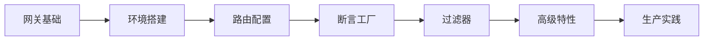

# Spring Cloud Gateway 技术学习笔记

> **学习目标定位**: 面向0-5年经验的微服务开发者，系统掌握Spring Cloud Gateway API网关，从基础到企业级应用
>
> **预期学习成果**:
> - 深入理解API网关的作用和Spring Cloud Gateway架构
> - 掌握路由配置、断言和过滤器的使用
> - 能够实现限流、熔断、认证等高级功能
> - 具备生产环境部署和性能优化能力

---

## 📚 学习路径规划



**建议学习时间**: 8-12天
- 基础阶段（1-2天）: 网关概念 + Gateway架构理解
- 环境搭建（3天）: 项目创建 + 基础配置
- 核心功能（4-7天）: 路由 + 断言 + 过滤器
- 高级特性（8-10天）: 限流 + 熔断 + 认证
- 生产部署（11-12天）: 监控 + 优化 + 故障处理

---

## 1. Spring Cloud Gateway 基础

### 1.1 什么是 API 网关

**API网关**是微服务架构中的统一入口，负责请求路由、协议转换、安全认证、流量控制等功能。

#### 网关的核心作用

```
传统架构（无网关）:
┌──────────┐
│ 客户端    │
└────┬─────┘
     │
     ├──────► 订单服务 (http://order-service:8001)
     ├──────► 用户服务 (http://user-service:8002)
     ├──────► 商品服务 (http://product-service:8003)
     └──────► 支付服务 (http://payment-service:8004)

问题:
- 客户端需要维护多个服务地址
- 跨域配置复杂
- 安全认证分散
- 无法统一限流和监控

微服务架构（有网关）:
┌──────────┐
│ 客户端    │
└────┬─────┘
     │
     ▼
┌─────────────────────────────────────┐
│   API Gateway (网关)                 │
│   - 统一入口: http://gateway:8080   │
│   - 路由转发                         │
│   - 认证鉴权                         │
│   - 限流熔断                         │
│   - 日志监控                         │
└───┬─────────────┬─────────────┬─────┘
    │             │             │
    ▼             ▼             ▼
┌────────┐   ┌────────┐   ┌────────┐
│订单服务 │   │用户服务 │   │商品服务 │
└────────┘   └────────┘   └────────┘
```

#### 网关的核心功能

| 功能类别 | 具体功能 | 价值 |
|---------|---------|------|
| **路由转发** | 动态路由、负载均衡 | 统一入口，简化客户端调用 |
| **安全控制** | 认证、鉴权、防刷 | 保护后端服务安全 |
| **流量控制** | 限流、熔断、降级 | 保障系统稳定性 |
| **协议转换** | HTTP/WebSocket/gRPC | 支持多协议访问 |
| **监控日志** | 访问日志、性能监控 | 统一监控和分析 |

### 1.2 Gateway vs Zuul

#### 技术对比

| 特性 | Spring Cloud Gateway | Netflix Zuul 1.x | Netflix Zuul 2.x |
|-----|---------------------|------------------|------------------|
| **基础框架** | Spring WebFlux (Reactor) | Servlet (同步阻塞) | Netty (异步非阻塞) |
| **异步支持** | 原生异步 | 不支持 | 支持 |
| **性能** | 高 | 中等 | 高 |
| **Spring生态** | 完美集成 | 良好 | 停止维护 |
| **编程模型** | 响应式编程 | 传统编程 | 异步编程 |
| **学习曲线** | 陡峭 | 平缓 | 陡峭 |
| **社区活跃度** | 非常高 | 低 | 已停维 |

**选择Gateway的理由**:
- ✅ Netflix已停止维护Zuul，Spring官方推荐Gateway
- ✅ 基于Spring Boot 2.x和Project Reactor，性能更好
- ✅ 原生支持Spring Cloud生态（Nacos、Sentinel等）
- ✅ 灵活的路由配置和过滤器机制

### 1.3 Gateway 架构原理

#### 核心组件

```yaml
Gateway核心组件:
  Route (路由):
    - 网关的基本构建块
    - 包含：ID、目标URI、断言集合、过滤器集合
    - 作用：定义请求如何被转发

  Predicate (断言):
    - 匹配HTTP请求的条件
    - 包含：路径、方法、Header、参数等
    - 作用：判断请求是否满足路由条件

  Filter (过滤器):
    - 对请求和响应进行修改
    - 分类：Pre Filter(前置)、Post Filter(后置)
    - 作用：实现请求/响应的处理逻辑
```

#### 请求处理流程

```
┌─────────────────────────────────────────────────────┐
│          Spring Cloud Gateway 处理流程               │
└─────────────────────────────────────────────────────┘

1. 客户端请求
   │
   ▼
2. Gateway Handler Mapping
   ├─ 匹配路由 (Route Predicate)
   │  - Path=/api/users/**
   │  - Method=GET
   │  - Header=X-Request-Id
   │
   ▼
3. Gateway Web Handler
   │
   ▼
4. Pre Filter Chain (前置过滤器)
   ├─ AddRequestHeader Filter
   ├─ AddRequestParameter Filter
   ├─ Retry Filter
   ├─ RequestRateLimiter Filter
   │
   ▼
5. Proxied Service (代理服务)
   ├─ LoadBalancer (负载均衡)
   ├─ 转发请求到目标服务
   │
   ▼
6. Post Filter Chain (后置过滤器)
   ├─ AddResponseHeader Filter
   ├─ ModifyResponseBody Filter
   │
   ▼
7. 返回响应给客户端
```

#### 响应式编程模型

**Gateway基于Project Reactor实现响应式编程**：

```java
// 传统同步阻塞方式 (Zuul 1.x)
public String blockingCall() {
    String user = userService.getUser();      // 阻塞等待
    String order = orderService.getOrder();   // 阻塞等待
    return user + order;
}

// 响应式异步方式 (Gateway)
public Mono<String> reactiveCall() {
    Mono<String> userMono = userService.getUserAsync();
    Mono<String> orderMono = orderService.getOrderAsync();

    return Mono.zip(userMono, orderMono)
        .map(tuple -> tuple.getT1() + tuple.getT2());
    // 非阻塞，并行执行
}
```

---

## 2. 环境搭建

### 2.1 创建 Gateway 项目

#### Maven 依赖

```xml
<?xml version="1.0" encoding="UTF-8"?>
<project xmlns="http://maven.apache.org/POM/4.0.0"
         xmlns:xsi="http://www.w3.org/2001/XMLSchema-instance"
         xsi:schemaLocation="http://maven.apache.org/POM/4.0.0
         http://maven.apache.org/xsd/maven-4.0.0.xsd">
    <modelVersion>4.0.0</modelVersion>

    <parent>
        <groupId>org.springframework.boot</groupId>
        <artifactId>spring-boot-starter-parent</artifactId>
        <version>2.7.10</version>
        <relativePath/>
    </parent>

    <groupId>com.example</groupId>
    <artifactId>api-gateway</artifactId>
    <version>1.0.0</version>

    <properties>
        <java.version>1.8</java.version>
        <spring-cloud.version>2021.0.5</spring-cloud.version>
    </properties>

    <dependencies>
        <!-- Spring Cloud Gateway -->
        <dependency>
            <groupId>org.springframework.cloud</groupId>
            <artifactId>spring-cloud-starter-gateway</artifactId>
        </dependency>

        <!-- Nacos 服务发现 -->
        <dependency>
            <groupId>com.alibaba.cloud</groupId>
            <artifactId>spring-cloud-starter-alibaba-nacos-discovery</artifactId>
            <version>2021.0.5.0</version>
        </dependency>

        <!-- LoadBalancer 负载均衡 -->
        <dependency>
            <groupId>org.springframework.cloud</groupId>
            <artifactId>spring-cloud-starter-loadbalancer</artifactId>
        </dependency>

        <!-- Redis (用于限流) -->
        <dependency>
            <groupId>org.springframework.boot</groupId>
            <artifactId>spring-boot-starter-data-redis-reactive</artifactId>
        </dependency>

        <!-- Actuator 监控 -->
        <dependency>
            <groupId>org.springframework.boot</groupId>
            <artifactId>spring-boot-starter-actuator</artifactId>
        </dependency>
    </dependencies>

    <dependencyManagement>
        <dependencies>
            <dependency>
                <groupId>org.springframework.cloud</groupId>
                <artifactId>spring-cloud-dependencies</artifactId>
                <version>${spring-cloud.version}</version>
                <type>pom</type>
                <scope>import</scope>
            </dependency>
        </dependencies>
    </dependencyManagement>

    <build>
        <plugins>
            <plugin>
                <groupId>org.springframework.boot</groupId>
                <artifactId>spring-boot-maven-plugin</artifactId>
            </plugin>
        </plugins>
    </build>
</project>
```

#### 启动类

```java
package com.example.gateway;

import org.springframework.boot.SpringApplication;
import org.springframework.boot.autoconfigure.SpringBootApplication;
import org.springframework.cloud.client.discovery.EnableDiscoveryClient;

@SpringBootApplication
@EnableDiscoveryClient  // 启用服务发现
public class GatewayApplication {

    public static void main(String[] args) {
        SpringApplication.run(GatewayApplication.class, args);
        System.out.println("API Gateway Started Successfully!");
    }
}
```

### 2.2 基础配置

**application.yml**:

```yaml
server:
  port: 8080  # Gateway端口

spring:
  application:
    name: api-gateway

  # Nacos 注册中心
  cloud:
    nacos:
      discovery:
        server-addr: localhost:8848

    # Gateway 配置
    gateway:
      # 全局跨域配置
      globalcors:
        cors-configurations:
          '[/**]':
            allowedOrigins: "*"
            allowedMethods:
              - GET
              - POST
              - PUT
              - DELETE
              - OPTIONS
            allowedHeaders: "*"
            allowCredentials: true
            maxAge: 3600

      # 路由配置
      routes:
        # 路由1: 用户服务
        - id: user-service-route
          uri: lb://user-service  # lb:// 表示从Nacos获取服务
          predicates:
            - Path=/api/users/**  # 路径断言
          filters:
            - StripPrefix=1        # 去掉第一层路径前缀

        # 路由2: 订单服务
        - id: order-service-route
          uri: lb://order-service
          predicates:
            - Path=/api/orders/**
          filters:
            - StripPrefix=1

# Actuator 监控
management:
  endpoints:
    web:
      exposure:
        include: "*"
  endpoint:
    health:
      show-details: always
    gateway:
      enabled: true  # 启用Gateway端点

# 日志配置
logging:
  level:
    root: INFO
    org.springframework.cloud.gateway: DEBUG
    org.springframework.cloud.loadbalancer: DEBUG
```

### 2.3 测试验证

```bash
# 1. 启动Gateway
mvn spring-boot:run

# 2. 访问Gateway监控端点
curl http://localhost:8080/actuator/gateway/routes

# 3. 测试路由
curl http://localhost:8080/api/users/1
# 请求会被转发到 http://user-service/users/1
```

---

## 3. 路由配置 (Route)

### 3.1 路由配置方式

#### 方式1: YAML 配置（推荐）

```yaml
spring:
  cloud:
    gateway:
      routes:
        - id: user-route              # 路由唯一标识
          uri: http://localhost:8001  # 目标服务地址
          predicates:                  # 断言条件
            - Path=/users/**
          filters:                     # 过滤器
            - AddRequestHeader=X-Request-Source, gateway

        - id: order-route
          uri: lb://order-service      # 从注册中心获取
          predicates:
            - Path=/orders/**
            - Method=GET,POST
          filters:
            - StripPrefix=1
```

#### 方式2: Java 代码配置

```java
package com.example.gateway.config;

import org.springframework.cloud.gateway.route.RouteLocator;
import org.springframework.cloud.gateway.route.builder.RouteLocatorBuilder;
import org.springframework.context.annotation.Bean;
import org.springframework.context.annotation.Configuration;

@Configuration
public class GatewayRoutesConfig {

    @Bean
    public RouteLocator customRouteLocator(RouteLocatorBuilder builder) {
        return builder.routes()
            // 路由1: 用户服务
            .route("user-route", r -> r
                .path("/users/**")
                .filters(f -> f
                    .addRequestHeader("X-Request-Source", "gateway")
                    .addResponseHeader("X-Response-Time", String.valueOf(System.currentTimeMillis()))
                )
                .uri("lb://user-service")
            )
            // 路由2: 订单服务 (带条件)
            .route("order-route", r -> r
                .path("/orders/**")
                .and()
                .method("GET", "POST")
                .filters(f -> f
                    .stripPrefix(1)
                    .retry(config -> config
                        .setRetries(3)
                        .setStatuses(org.springframework.http.HttpStatus.INTERNAL_SERVER_ERROR)
                    )
                )
                .uri("lb://order-service")
            )
            // 路由3: 重定向
            .route("redirect-route", r -> r
                .path("/old-api/**")
                .filters(f -> f
                    .redirect(302, "http://new-api.example.com")
                )
                .uri("no://op")
            )
            .build();
    }
}
```

### 3.2 动态路由

**从配置中心动态加载路由**:

```java
package com.example.gateway.config;

import org.springframework.cloud.gateway.event.RefreshRoutesEvent;
import org.springframework.cloud.gateway.route.RouteDefinition;
import org.springframework.cloud.gateway.route.RouteDefinitionWriter;
import org.springframework.cloud.gateway.support.NotFoundException;
import org.springframework.context.ApplicationEventPublisher;
import org.springframework.stereotype.Service;
import reactor.core.publisher.Mono;

import java.util.List;

@Service
public class DynamicRouteService {

    private final RouteDefinitionWriter routeDefinitionWriter;
    private final ApplicationEventPublisher publisher;

    public DynamicRouteService(RouteDefinitionWriter routeDefinitionWriter,
                                ApplicationEventPublisher publisher) {
        this.routeDefinitionWriter = routeDefinitionWriter;
        this.publisher = publisher;
    }

    /**
     * 添加路由
     */
    public String addRoute(RouteDefinition definition) {
        routeDefinitionWriter.save(Mono.just(definition)).subscribe();
        // 发布路由刷新事件
        publisher.publishEvent(new RefreshRoutesEvent(this));
        return "success";
    }

    /**
     * 更新路由
     */
    public String updateRoute(RouteDefinition definition) {
        try {
            deleteRoute(definition.getId());
        } catch (Exception e) {
            return "update failed";
        }
        return addRoute(definition);
    }

    /**
     * 删除路由
     */
    public String deleteRoute(String id) {
        routeDefinitionWriter.delete(Mono.just(id)).subscribe();
        publisher.publishEvent(new RefreshRoutesEvent(this));
        return "success";
    }
}
```

**动态路由管理接口**:

```java
@RestController
@RequestMapping("/gateway/routes")
public class RouteController {

    @Autowired
    private DynamicRouteService dynamicRouteService;

    @PostMapping("/add")
    public String addRoute(@RequestBody RouteDefinition routeDefinition) {
        return dynamicRouteService.addRoute(routeDefinition);
    }

    @PutMapping("/update")
    public String updateRoute(@RequestBody RouteDefinition routeDefinition) {
        return dynamicRouteService.updateRoute(routeDefinition);
    }

    @DeleteMapping("/delete/{id}")
    public String deleteRoute(@PathVariable String id) {
        return dynamicRouteService.deleteRoute(id);
    }
}
```

---

## 4. 断言工厂 (Predicate)

### 4.1 内置断言工厂

#### Path 路径断言

```yaml
spring:
  cloud:
    gateway:
      routes:
        - id: path-route
          uri: lb://user-service
          predicates:
            # 精确匹配
            - Path=/api/users/{id}
            # 通配符匹配
            - Path=/api/users/**
```

#### Method 方法断言

```yaml
predicates:
  - Method=GET,POST  # 只匹配GET和POST请求
```

#### Header 请求头断言

```yaml
predicates:
  # 请求头必须包含X-Request-Id
  - Header=X-Request-Id, \d+  # 正则表达式验证值
```

#### Query 查询参数断言

```yaml
predicates:
  - Query=name, \w+  # 必须有name参数且匹配正则
```

#### Cookie 断言

```yaml
predicates:
  - Cookie=sessionId, \w+  # 必须有sessionId cookie
```

#### Host 主机断言

```yaml
predicates:
  - Host=**.example.com  # 匹配任意example.com的子域名
```

#### RemoteAddr IP地址断言

```yaml
predicates:
  - RemoteAddr=192.168.1.0/24  # 只允许特定IP段访问
```

#### Time 时间断言

```yaml
predicates:
  # 在指定时间之后生效
  - After=2024-01-01T00:00:00+08:00[Asia/Shanghai]
  # 在指定时间之前生效
  - Before=2024-12-31T23:59:59+08:00[Asia/Shanghai]
  # 在时间段内生效
  - Between=2024-01-01T00:00:00+08:00[Asia/Shanghai],2024-12-31T23:59:59+08:00[Asia/Shanghai]
```

#### Weight 权重断言（金丝雀发布）

```yaml
spring:
  cloud:
    gateway:
      routes:
        # V1版本：90%流量
        - id: service-v1
          uri: lb://service-v1
          predicates:
            - Path=/api/**
            - Weight=group1, 9

        # V2版本：10%流量（金丝雀）
        - id: service-v2
          uri: lb://service-v2
          predicates:
            - Path=/api/**
            - Weight=group1, 1
```

### 4.2 自定义断言工厂

```java
package com.example.gateway.predicate;

import org.springframework.cloud.gateway.handler.predicate.AbstractRoutePredicateFactory;
import org.springframework.stereotype.Component;
import org.springframework.web.server.ServerWebExchange;

import java.util.Arrays;
import java.util.List;
import java.util.function.Predicate;

/**
 * 自定义断言：检查请求是否来自移动端
 */
@Component
public class MobileRoutePredicateFactory
    extends AbstractRoutePredicateFactory<MobileRoutePredicateFactory.Config> {

    public MobileRoutePredicateFactory() {
        super(Config.class);
    }

    @Override
    public Predicate<ServerWebExchange> apply(Config config) {
        return exchange -> {
            String userAgent = exchange.getRequest()
                .getHeaders()
                .getFirst("User-Agent");

            if (userAgent == null) {
                return false;
            }

            // 判断是否为移动端
            boolean isMobile = userAgent.toLowerCase().contains("mobile") ||
                               userAgent.toLowerCase().contains("android") ||
                               userAgent.toLowerCase().contains("iphone");

            return config.isMatchMobile() == isMobile;
        };
    }

    @Override
    public List<String> shortcutFieldOrder() {
        return Arrays.asList("matchMobile");
    }

    public static class Config {
        private boolean matchMobile = true;

        public boolean isMatchMobile() {
            return matchMobile;
        }

        public void setMatchMobile(boolean matchMobile) {
            this.matchMobile = matchMobile;
        }
    }
}
```

**使用自定义断言**:

```yaml
spring:
  cloud:
    gateway:
      routes:
        # 移动端路由
        - id: mobile-route
          uri: lb://mobile-service
          predicates:
            - Path=/api/**
            - Mobile=true  # 使用自定义断言

        # PC端路由
        - id: pc-route
          uri: lb://pc-service
          predicates:
            - Path=/api/**
            - Mobile=false
```

---

## 5. 过滤器 (Filter)

### 5.1 内置过滤器

#### AddRequestHeader / AddResponseHeader

```yaml
filters:
  - AddRequestHeader=X-Request-Source, gateway
  - AddResponseHeader=X-Response-Time, 2024-01-15
```

#### AddRequestParameter

```yaml
filters:
  - AddRequestParameter=source, gateway
```

#### RewritePath 路径重写

```yaml
filters:
  # /api/users/1 → /users/1
  - RewritePath=/api(?<segment>/?.*), $\{segment}
```

#### StripPrefix 去除路径前缀

```yaml
filters:
  # /api/users/1 → /users/1 (去掉第一层路径)
  - StripPrefix=1
  # /v1/api/users/1 → /users/1 (去掉两层路径)
  - StripPrefix=2
```

#### Retry 重试

```yaml
filters:
  - name: Retry
    args:
      retries: 3                # 重试次数
      statuses: INTERNAL_SERVER_ERROR  # 触发重试的状态码
      methods: GET,POST         # 重试的方法
      backoff:
        firstBackoff: 50ms      # 第一次重试等待时间
        maxBackoff: 500ms       # 最大等待时间
        factor: 2               # 退避因子
        basedOnPreviousValue: true
```

#### RequestRateLimiter 限流

```yaml
spring:
  redis:
    host: localhost
    port: 6379

  cloud:
    gateway:
      routes:
        - id: limited-route
          uri: lb://user-service
          predicates:
            - Path=/api/users/**
          filters:
            - name: RequestRateLimiter
              args:
                redis-rate-limiter.replenishRate: 10  # 令牌桶每秒填充速率
                redis-rate-limiter.burstCapacity: 20  # 令牌桶容量
                key-resolver: "#{@ipKeyResolver}"     # 限流维度
```

**自定义限流Key解析器**:

```java
@Configuration
public class RateLimiterConfig {

    /**
     * 基于IP限流
     */
    @Bean
    public KeyResolver ipKeyResolver() {
        return exchange -> Mono.just(
            exchange.getRequest()
                .getRemoteAddress()
                .getAddress()
                .getHostAddress()
        );
    }

    /**
     * 基于用户ID限流
     */
    @Bean
    public KeyResolver userKeyResolver() {
        return exchange -> Mono.just(
            exchange.getRequest()
                .getHeaders()
                .getFirst("X-User-Id")
        );
    }

    /**
     * 基于路径限流
     */
    @Bean
    public KeyResolver pathKeyResolver() {
        return exchange -> Mono.just(
            exchange.getRequest().getPath().value()
        );
    }
}
```

### 5.2 自定义全局过滤器

#### 示例1: 统一认证过滤器

```java
package com.example.gateway.filter;

import org.springframework.cloud.gateway.filter.GatewayFilterChain;
import org.springframework.cloud.gateway.filter.GlobalFilter;
import org.springframework.core.Ordered;
import org.springframework.http.HttpStatus;
import org.springframework.http.server.reactive.ServerHttpRequest;
import org.springframework.http.server.reactive.ServerHttpResponse;
import org.springframework.stereotype.Component;
import org.springframework.web.server.ServerWebExchange;
import reactor.core.publisher.Mono;

/**
 * 全局认证过滤器
 */
@Component
public class AuthenticationFilter implements GlobalFilter, Ordered {

    private static final String TOKEN_HEADER = "Authorization";

    @Override
    public Mono<Void> filter(ServerWebExchange exchange, GatewayFilterChain chain) {
        ServerHttpRequest request = exchange.getRequest();
        ServerHttpResponse response = exchange.getResponse();

        // 白名单：登录、注册等接口不需要认证
        String path = request.getPath().value();
        if (isWhiteList(path)) {
            return chain.filter(exchange);
        }

        // 获取Token
        String token = request.getHeaders().getFirst(TOKEN_HEADER);

        // 验证Token
        if (token == null || !validateToken(token)) {
            response.setStatusCode(HttpStatus.UNAUTHORIZED);
            return response.setComplete();
        }

        // 解析用户信息并传递给下游服务
        String userId = extractUserId(token);
        ServerHttpRequest mutatedRequest = request.mutate()
            .header("X-User-Id", userId)
            .build();

        ServerWebExchange mutatedExchange = exchange.mutate()
            .request(mutatedRequest)
            .build();

        return chain.filter(mutatedExchange);
    }

    @Override
    public int getOrder() {
        return -100;  // 优先级高，先执行
    }

    private boolean isWhiteList(String path) {
        return path.startsWith("/api/auth/") ||
               path.startsWith("/api/public/");
    }

    private boolean validateToken(String token) {
        // TODO: 实际项目中应该调用认证服务验证Token
        return token.startsWith("Bearer ");
    }

    private String extractUserId(String token) {
        // TODO: 从Token中解析用户ID
        return "user123";
    }
}
```

#### 示例2: 请求日志过滤器

```java
package com.example.gateway.filter;

import org.slf4j.Logger;
import org.slf4j.LoggerFactory;
import org.springframework.cloud.gateway.filter.GatewayFilterChain;
import org.springframework.cloud.gateway.filter.GlobalFilter;
import org.springframework.core.Ordered;
import org.springframework.http.server.reactive.ServerHttpRequest;
import org.springframework.stereotype.Component;
import org.springframework.web.server.ServerWebExchange;
import reactor.core.publisher.Mono;

/**
 * 请求日志过滤器
 */
@Component
public class RequestLogFilter implements GlobalFilter, Ordered {

    private static final Logger logger = LoggerFactory.getLogger(RequestLogFilter.class);

    @Override
    public Mono<Void> filter(ServerWebExchange exchange, GatewayFilterChain chain) {
        ServerHttpRequest request = exchange.getRequest();

        long startTime = System.currentTimeMillis();

        // 记录请求信息
        logger.info("Gateway Request: method={}, path={}, query={}, remoteAddr={}",
            request.getMethod(),
            request.getPath().value(),
            request.getQueryParams(),
            request.getRemoteAddress()
        );

        return chain.filter(exchange).then(
            Mono.fromRunnable(() -> {
                long endTime = System.currentTimeMillis();
                long duration = endTime - startTime;

                // 记录响应信息
                logger.info("Gateway Response: status={}, duration={}ms",
                    exchange.getResponse().getStatusCode(),
                    duration
                );
            })
        );
    }

    @Override
    public int getOrder() {
        return Ordered.LOWEST_PRECEDENCE;  // 最低优先级，最后执行
    }
}
```

#### 示例3: 自定义Gateway Filter Factory

```java
package com.example.gateway.filter;

import org.springframework.cloud.gateway.filter.GatewayFilter;
import org.springframework.cloud.gateway.filter.factory.AbstractGatewayFilterFactory;
import org.springframework.http.server.reactive.ServerHttpRequest;
import org.springframework.stereotype.Component;

/**
 * 自定义过滤器工厂：添加请求时间戳
 */
@Component
public class RequestTimeGatewayFilterFactory
    extends AbstractGatewayFilterFactory<RequestTimeGatewayFilterFactory.Config> {

    public RequestTimeGatewayFilterFactory() {
        super(Config.class);
    }

    @Override
    public GatewayFilter apply(Config config) {
        return (exchange, chain) -> {
            if (config.isEnabled()) {
                ServerHttpRequest request = exchange.getRequest().mutate()
                    .header("X-Request-Time", String.valueOf(System.currentTimeMillis()))
                    .build();

                return chain.filter(exchange.mutate().request(request).build());
            }
            return chain.filter(exchange);
        };
    }

    public static class Config {
        private boolean enabled = true;

        public boolean isEnabled() {
            return enabled;
        }

        public void setEnabled(boolean enabled) {
            this.enabled = enabled;
        }
    }
}
```

**使用自定义Filter Factory**:

```yaml
filters:
  - name: RequestTime
    args:
      enabled: true
```

---

## 6. 服务发现与负载均衡

### 6.1 集成 Nacos

**配置示例**:

```yaml
spring:
  application:
    name: api-gateway
  cloud:
    nacos:
      discovery:
        server-addr: localhost:8848
        namespace: dev
        group: DEFAULT_GROUP

    gateway:
      routes:
        # 从Nacos获取服务实例
        - id: user-service
          uri: lb://user-service  # lb:// 表示负载均衡
          predicates:
            - Path=/api/users/**

      # 自动从Nacos发现服务并创建路由
      discovery:
        locator:
          enabled: true                    # 启用服务发现
          lower-case-service-id: true      # 服务名转小写
          predicates:
            - Path=/api/{service}/**       # 自动路由规则
          filters:
            - StripPrefix=1
```

### 6.2 负载均衡配置

```yaml
spring:
  cloud:
    loadbalancer:
      # 负载均衡策略
      configurations: default
      ribbon:
        enabled: false  # 禁用Ribbon，使用Spring Cloud LoadBalancer

    gateway:
      routes:
        - id: load-balanced-route
          uri: lb://user-service
          predicates:
            - Path=/users/**
```

**自定义负载均衡策略**:

```java
package com.example.gateway.loadbalancer;

import org.springframework.beans.factory.ObjectProvider;
import org.springframework.cloud.client.ServiceInstance;
import org.springframework.cloud.client.loadbalancer.DefaultResponse;
import org.springframework.cloud.client.loadbalancer.Request;
import org.springframework.cloud.client.loadbalancer.Response;
import org.springframework.cloud.loadbalancer.core.ReactorServiceInstanceLoadBalancer;
import org.springframework.cloud.loadbalancer.core.ServiceInstanceListSupplier;
import reactor.core.publisher.Mono;

import java.util.List;
import java.util.Random;

/**
 * 自定义负载均衡：随机策略
 */
public class CustomLoadBalancer implements ReactorServiceInstanceLoadBalancer {

    private final ObjectProvider<ServiceInstanceListSupplier> serviceInstanceListSupplierProvider;
    private final String serviceId;
    private final Random random = new Random();

    public CustomLoadBalancer(
        ObjectProvider<ServiceInstanceListSupplier> serviceInstanceListSupplierProvider,
        String serviceId) {
        this.serviceInstanceListSupplierProvider = serviceInstanceListSupplierProvider;
        this.serviceId = serviceId;
    }

    @Override
    public Mono<Response<ServiceInstance>> choose(Request request) {
        ServiceInstanceListSupplier supplier = serviceInstanceListSupplierProvider.getIfAvailable();
        return supplier.get().next()
            .map(instances -> getInstanceResponse(instances));
    }

    private Response<ServiceInstance> getInstanceResponse(List<ServiceInstance> instances) {
        if (instances.isEmpty()) {
            return new DefaultResponse(null);
        }

        int index = random.nextInt(instances.size());
        return new DefaultResponse(instances.get(index));
    }
}
```

---

## 7. 限流与熔断

### 7.1 基于 Redis 的限流

**配置Redis**:

```yaml
spring:
  redis:
    host: localhost
    port: 6379
    password:
    database: 0

  cloud:
    gateway:
      routes:
        - id: rate-limited-route
          uri: lb://user-service
          predicates:
            - Path=/api/users/**
          filters:
            - name: RequestRateLimiter
              args:
                # 令牌桶算法参数
                redis-rate-limiter.replenishRate: 10  # 每秒允许的请求数
                redis-rate-limiter.burstCapacity: 20  # 令牌桶容量
                redis-rate-limiter.requestedTokens: 1 # 每个请求消耗的令牌数
                key-resolver: "#{@ipKeyResolver}"     # 限流维度
```

### 7.2 集成 Sentinel

**添加依赖**:

```xml
<dependency>
    <groupId>com.alibaba.cloud</groupId>
    <artifactId>spring-cloud-starter-alibaba-sentinel</artifactId>
    <version>2021.0.5.0</version>
</dependency>

<dependency>
    <groupId>com.alibaba.cloud</groupId>
    <artifactId>spring-cloud-alibaba-sentinel-gateway</artifactId>
    <version>2021.0.5.0</version>
</dependency>
```

**配置Sentinel**:

```yaml
spring:
  cloud:
    sentinel:
      transport:
        dashboard: localhost:8080  # Sentinel控制台地址
        port: 8719
      eager: true  # 启动时连接

      # Gateway限流规则
      scg:
        fallback:
          mode: response
          response-body: '{"code": 429, "message": "Too Many Requests"}'
        order: -100
```

**自定义降级处理器**:

```java
package com.example.gateway.handler;

import com.alibaba.csp.sentinel.adapter.gateway.sc.callback.BlockRequestHandler;
import com.alibaba.fastjson.JSON;
import org.springframework.http.HttpStatus;
import org.springframework.http.MediaType;
import org.springframework.stereotype.Component;
import org.springframework.web.reactive.function.server.ServerResponse;
import org.springframework.web.server.ServerWebExchange;
import reactor.core.publisher.Mono;

import java.util.HashMap;
import java.util.Map;

@Component
public class CustomBlockRequestHandler implements BlockRequestHandler {

    @Override
    public Mono<ServerResponse> handleRequest(ServerWebExchange exchange, Throwable t) {
        Map<String, Object> result = new HashMap<>();
        result.put("code", 429);
        result.put("message", "请求过于频繁，请稍后再试");
        result.put("timestamp", System.currentTimeMillis());

        return ServerResponse.status(HttpStatus.TOO_MANY_REQUESTS)
            .contentType(MediaType.APPLICATION_JSON)
            .bodyValue(JSON.toJSONString(result));
    }
}
```

---

## 8. 安全认证

### 8.1 JWT 认证

**JWT工具类**:

```java
package com.example.gateway.util;

import io.jsonwebtoken.Claims;
import io.jsonwebtoken.Jwts;
import io.jsonwebtoken.SignatureAlgorithm;
import org.springframework.stereotype.Component;

import java.util.Date;

@Component
public class JwtUtil {

    private static final String SECRET_KEY = "my-secret-key-for-jwt-token-generation";
    private static final long EXPIRATION_TIME = 86400000; // 24小时

    /**
     * 生成Token
     */
    public String generateToken(String userId) {
        return Jwts.builder()
            .setSubject(userId)
            .setIssuedAt(new Date())
            .setExpiration(new Date(System.currentTimeMillis() + EXPIRATION_TIME))
            .signWith(SignatureAlgorithm.HS512, SECRET_KEY)
            .compact();
    }

    /**
     * 验证Token
     */
    public boolean validateToken(String token) {
        try {
            Jwts.parser().setSigningKey(SECRET_KEY).parseClaimsJws(token);
            return true;
        } catch (Exception e) {
            return false;
        }
    }

    /**
     * 从Token获取用户ID
     */
    public String getUserIdFromToken(String token) {
        Claims claims = Jwts.parser()
            .setSigningKey(SECRET_KEY)
            .parseClaimsJws(token)
            .getBody();
        return claims.getSubject();
    }

    /**
     * 判断Token是否过期
     */
    public boolean isTokenExpired(String token) {
        try {
            Claims claims = Jwts.parser()
                .setSigningKey(SECRET_KEY)
                .parseClaimsJws(token)
                .getBody();
            return claims.getExpiration().before(new Date());
        } catch (Exception e) {
            return true;
        }
    }
}
```

**JWT认证过滤器**:

```java
package com.example.gateway.filter;

import com.example.gateway.util.JwtUtil;
import org.springframework.beans.factory.annotation.Autowired;
import org.springframework.cloud.gateway.filter.GatewayFilterChain;
import org.springframework.cloud.gateway.filter.GlobalFilter;
import org.springframework.core.Ordered;
import org.springframework.http.HttpStatus;
import org.springframework.http.server.reactive.ServerHttpRequest;
import org.springframework.http.server.reactive.ServerHttpResponse;
import org.springframework.stereotype.Component;
import org.springframework.web.server.ServerWebExchange;
import reactor.core.publisher.Mono;

@Component
public class JwtAuthenticationFilter implements GlobalFilter, Ordered {

    @Autowired
    private JwtUtil jwtUtil;

    @Override
    public Mono<Void> filter(ServerWebExchange exchange, GatewayFilterChain chain) {
        ServerHttpRequest request = exchange.getRequest();
        ServerHttpResponse response = exchange.getResponse();

        // 白名单
        String path = request.getPath().value();
        if (isWhiteList(path)) {
            return chain.filter(exchange);
        }

        // 获取Token
        String token = request.getHeaders().getFirst("Authorization");
        if (token != null && token.startsWith("Bearer ")) {
            token = token.substring(7);
        }

        // 验证Token
        if (token == null || !jwtUtil.validateToken(token) || jwtUtil.isTokenExpired(token)) {
            response.setStatusCode(HttpStatus.UNAUTHORIZED);
            return response.setComplete();
        }

        // 提取用户信息并传递给下游服务
        String userId = jwtUtil.getUserIdFromToken(token);
        ServerHttpRequest mutatedRequest = request.mutate()
            .header("X-User-Id", userId)
            .build();

        return chain.filter(exchange.mutate().request(mutatedRequest).build());
    }

    @Override
    public int getOrder() {
        return -100;
    }

    private boolean isWhiteList(String path) {
        return path.startsWith("/api/auth/login") ||
               path.startsWith("/api/auth/register") ||
               path.startsWith("/api/public/");
    }
}
```

### 8.2 CORS 跨域配置

```yaml
spring:
  cloud:
    gateway:
      globalcors:
        cors-configurations:
          '[/**]':
            allowedOrigins:
              - "http://localhost:3000"
              - "https://www.example.com"
            allowedMethods:
              - GET
              - POST
              - PUT
              - DELETE
              - OPTIONS
            allowedHeaders: "*"
            exposedHeaders:
              - Authorization
              - Content-Type
            allowCredentials: true
            maxAge: 3600
```

---

## 9. 监控与运维

### 9.1 Actuator 监控

```yaml
management:
  endpoints:
    web:
      exposure:
        include:
          - gateway
          - health
          - metrics
          - prometheus
  endpoint:
    gateway:
      enabled: true
    health:
      show-details: always
  metrics:
    export:
      prometheus:
        enabled: true
```

**常用监控端点**:

```bash
# 查看所有路由
curl http://localhost:8080/actuator/gateway/routes

# 查看全局过滤器
curl http://localhost:8080/actuator/gateway/globalfilters

# 查看路由过滤器
curl http://localhost:8080/actuator/gateway/routefilters

# 刷新路由
curl -X POST http://localhost:8080/actuator/gateway/refresh

# 健康检查
curl http://localhost:8080/actuator/health
```

### 9.2 日志配置

**logback-spring.xml**:

```xml
<?xml version="1.0" encoding="UTF-8"?>
<configuration>
    <appender name="CONSOLE" class="ch.qos.logback.core.ConsoleAppender">
        <encoder>
            <pattern>%d{yyyy-MM-dd HH:mm:ss.SSS} [%thread] %-5level %logger{50} - %msg%n</pattern>
        </encoder>
    </appender>

    <appender name="FILE" class="ch.qos.logback.core.rolling.RollingFileAppender">
        <file>logs/gateway.log</file>
        <rollingPolicy class="ch.qos.logback.core.rolling.TimeBasedRollingPolicy">
            <fileNamePattern>logs/gateway.%d{yyyy-MM-dd}.log</fileNamePattern>
            <maxHistory>30</maxHistory>
        </rollingPolicy>
        <encoder>
            <pattern>%d{yyyy-MM-dd HH:mm:ss.SSS} [%thread] %-5level %logger{50} - %msg%n</pattern>
        </encoder>
    </appender>

    <logger name="org.springframework.cloud.gateway" level="DEBUG"/>
    <logger name="org.springframework.cloud.loadbalancer" level="DEBUG"/>

    <root level="INFO">
        <appender-ref ref="CONSOLE"/>
        <appender-ref ref="FILE"/>
    </root>
</configuration>
```

---

## 10. 性能优化

### 10.1 连接池优化

```yaml
spring:
  cloud:
    gateway:
      httpclient:
        # 连接超时
        connect-timeout: 1000
        # 响应超时
        response-timeout: 5s
        # 连接池配置
        pool:
          type: FIXED
          max-connections: 500        # 最大连接数
          max-idle-time: 30s          # 空闲超时
          max-life-time: 60s          # 最大存活时间
          acquire-timeout: 45000      # 获取连接超时
```

### 10.2 内存优化

```yaml
# JVM参数
java -Xms2g -Xmx2g \
     -XX:+UseG1GC \
     -XX:MaxGCPauseMillis=200 \
     -Dreactor.netty.ioWorkerCount=16 \
     -jar gateway.jar
```

### 10.3 缓存策略

```java
@Configuration
public class CacheConfig {

    @Bean
    public RouteLocator cacheRouteLocator(RouteLocatorBuilder builder) {
        return builder.routes()
            .route("cache-route", r -> r
                .path("/api/products/**")
                .filters(f -> f
                    .setResponseHeader("Cache-Control", "max-age=3600")
                    .setResponseHeader("Pragma", "cache")
                )
                .uri("lb://product-service")
            )
            .build();
    }
}
```

---

## 11. 最佳实践

### 11.1 统一异常处理

```java
package com.example.gateway.exception;

import org.springframework.boot.web.reactive.error.ErrorWebExceptionHandler;
import org.springframework.core.io.buffer.DataBufferFactory;
import org.springframework.http.HttpStatus;
import org.springframework.http.MediaType;
import org.springframework.http.server.reactive.ServerHttpResponse;
import org.springframework.stereotype.Component;
import org.springframework.web.server.ResponseStatusException;
import org.springframework.web.server.ServerWebExchange;
import reactor.core.publisher.Mono;

@Component
public class GlobalExceptionHandler implements ErrorWebExceptionHandler {

    @Override
    public Mono<Void> handle(ServerWebExchange exchange, Throwable ex) {
        ServerHttpResponse response = exchange.getResponse();

        if (response.isCommitted()) {
            return Mono.error(ex);
        }

        response.getHeaders().setContentType(MediaType.APPLICATION_JSON);

        if (ex instanceof ResponseStatusException) {
            response.setStatusCode(((ResponseStatusException) ex).getStatus());
        } else {
            response.setStatusCode(HttpStatus.INTERNAL_SERVER_ERROR);
        }

        return response.writeWith(Mono.fromSupplier(() -> {
            DataBufferFactory bufferFactory = response.bufferFactory();
            String errorMsg = String.format("{\"code\": %d, \"message\": \"%s\"}",
                response.getStatusCode().value(),
                ex.getMessage());
            return bufferFactory.wrap(errorMsg.getBytes());
        }));
    }
}
```

### 11.2 灰度发布策略

```yaml
spring:
  cloud:
    gateway:
      routes:
        # 稳定版本
        - id: service-stable
          uri: lb://service-v1
          predicates:
            - Path=/api/**
            - Header=X-Version, v1
            - Weight=version, 8

        # 灰度版本
        - id: service-canary
          uri: lb://service-v2
          predicates:
            - Path=/api/**
            - Header=X-Canary, true
            - Weight=version, 2
```

---

## 12. 学习验证标准

完成本笔记学习后，你应该能够：

### 验证标准1: 基础知识（必须）

**测试任务**:
- [ ] 解释API网关的作用和价值
- [ ] 说明Gateway的架构和核心组件
- [ ] 对比Gateway与Zuul的区别
- [ ] 搭建一个基础的Gateway项目

**验证方式**: 完成Gateway项目搭建并能访问下游服务

### 验证标准2: 路由与断言（必须）

**测试任务**:
- [ ] 配置基于路径、方法、Header的路由
- [ ] 使用多种断言工厂组合路由条件
- [ ] 实现动态路由管理
- [ ] 配置权重路由实现金丝雀发布

**验证方式**: 实现3种以上断言组合的路由配置

### 验证标准3: 过滤器开发（必须）

**测试任务**:
- [ ] 使用5种以上内置过滤器
- [ ] 开发自定义GlobalFilter
- [ ] 开发自定义GatewayFilterFactory
- [ ] 实现请求日志记录和统一认证

**验证方式**: 完成认证过滤器和日志过滤器开发

### 验证标准4: 高级特性（推荐）

**测试任务**:
- [ ] 配置Redis限流
- [ ] 集成Sentinel熔断降级
- [ ] 实现JWT认证
- [ ] 配置CORS跨域

**验证方式**: 压测验证限流和熔断效果

### 验证标准5: 生产实践（进阶）

**测试任务**:
- [ ] 配置Actuator监控
- [ ] 优化连接池和内存参数
- [ ] 实现灰度发布
- [ ] 排查并解决一个性能问题

**验证方式**: 在生产环境部署Gateway并监控运行

---

## 13. 扩展资源

### 官方文档
- Spring Cloud Gateway: https://spring.io/projects/spring-cloud-gateway
- 官方文档: https://docs.spring.io/spring-cloud-gateway/docs/current/reference/html/
- GitHub: https://github.com/spring-cloud/spring-cloud-gateway

### 推荐书籍
- 《Spring Cloud微服务实战》
- 《Spring Cloud Gateway实战》
- 《微服务架构设计模式》

### 视频教程
- 尚硅谷Spring Cloud Gateway教程
- 黑马程序员微服务网关专题
- Bilibili Spring Cloud实战系列

### 实践项目
1. 电商系统API网关
2. 统一认证网关
3. 微服务聚合网关

### 进阶主题
- Gateway源码分析
- WebFlux响应式编程
- Gateway与Istio对比
- Gateway性能极限优化

---

## 📝 学习记录

```yaml
学习日志模板:
  日期: 2024-01-15
  学习内容: Spring Cloud Gateway路由和过滤器
  实践案例:
    - 配置了基于路径和Header的路由
    - 开发了JWT认证过滤器
    - 实现了Redis限流
  遇到的问题:
    - WebFlux响应式编程理解困难
    - 解决方案: 学习Project Reactor基础
  心得体会:
    - Gateway的过滤器机制非常灵活
    - 响应式编程需要转变思维方式
  下一步计划:
    - 学习Sentinel集成
    - 研究性能优化方案
```

---

## 🎯 总结

Spring Cloud Gateway是Spring Cloud生态的新一代API网关：
- 🚀 **高性能**: 基于WebFlux和Reactor，异步非阻塞
- 🔧 **灵活**: 丰富的断言和过滤器，易于扩展
- 🛡️ **完善**: 支持限流、熔断、认证等企业级功能
- 📊 **集成**: 与Spring Cloud生态无缝集成

**关键要点**：
1. **理解响应式**: 掌握WebFlux和Reactor编程模型
2. **灵活配置**: 熟练使用路由、断言、过滤器
3. **安全认证**: 实现统一的认证鉴权机制
4. **性能优化**: 合理配置连接池和JVM参数

祝你学习顺利，成为Gateway专家！🎉
