# Spring Cloud 技术学习笔记

> **学习目标定位**: 面向0-5年经验的Java开发者,系统掌握Spring Cloud微服务生态,从零基础到企业级微服务架构设计
>
> **预期学习成果**:
> - 深入理解微服务架构设计原则和最佳实践
> - 掌握Spring Cloud核心组件的使用和原理
> - 能够设计和实现完整的微服务系统
> - 具备生产环境微服务部署和运维能力

---

## 📚 学习路径规划

```mermaid
graph LR
    A[微服务架构] --> B[服务注册发现]
    B --> C[服务调用]
    C --> D[负载均衡]
    D --> E[熔断降级]
    E --> F[API网关]
    F --> G[配置中心]
    G --> H[分布式事务]
    H --> I[链路追踪]
    I --> J[安全认证]
    J --> K[容器化部署]
```



**建议学习时间**: 20-30天
- 基础理论（1-3天）: 微服务架构 + Spring Cloud概览
- 服务治理（4-8天）: Nacos + OpenFeign + LoadBalancer
- 稳定性保障（9-12天）: Sentinel + Gateway + 配置中心
- 高级特性（13-18天）: 分布式事务 + 链路追踪 + 安全认证
- 部署运维（19-25天）: 监控 + 日志 + Docker/K8s部署
- 实战项目（26-30天）: 电商微服务系统实战

---

## 1. 微服务架构基础

### 1.1 什么是微服务

**微服务架构**是一种将单一应用程序划分为一组小的服务的方法,每个服务运行在其独立的进程中,服务间采用轻量级通信机制(通常是HTTP RESTful API)。

#### 单体架构 vs 微服务架构

```
单体架构 (Monolithic):
┌─────────────────────────────────────┐
│         单体应用程序                  │
│  ┌─────────────────────────────┐    │
│  │       UI层                   │    │
│  ├─────────────────────────────┤    │
│  │     业务逻辑层                │    │
│  │  ├─用户模块                   │    │
│  │  ├─订单模块                   │    │
│  │  ├─商品模块                   │    │
│  │  └─支付模块                   │    │
│  ├─────────────────────────────┤    │
│  │      数据访问层                │    │
│  └─────────────────────────────┘    │
│                │                     │
│                ▼                     │
│        ┌─────────────┐               │
│        │  单一数据库  │               │
│        └─────────────┘               │
└─────────────────────────────────────┘

问题:
- 部署成本高,修改一处需要整体部署
- 扩展困难,只能整体扩展
- 技术栈固定,难以引入新技术
- 代码耦合严重,维护困难

微服务架构 (Microservices):
                  ┌─────────────┐
                  │  API Gateway │
                  └──────┬──────┘
                         │
        ┌────────────────┼────────────────┐
        │                │                │
        ▼                ▼                ▼
┌──────────────┐ ┌──────────────┐ ┌──────────────┐
│ 用户服务      │ │ 订单服务      │ │ 商品服务      │
│  ├─API       │ │  ├─API       │ │  ├─API       │
│  ├─业务      │ │  ├─业务      │ │  ├─业务      │
│  └─DB        │ │  └─DB        │ │  └─DB        │
└──────────────┘ └──────────────┘ └──────────────┘
        │                │                │
        ▼                ▼                ▼
   ┌────────┐      ┌────────┐      ┌────────┐
   │用户DB  │      │订单DB  │      │商品DB  │
   └────────┘      └────────┘      └────────┘

优势:
✅ 独立部署,快速迭代
✅ 按需扩展,资源利用率高
✅ 技术栈多样化
✅ 故障隔离,容错性强
```

#### 微服务架构特点

| 特性 | 说明 | 价值 |
|-----|------|------|
| **服务独立** | 每个服务独立开发、部署、运行 | 提高开发效率 |
| **技术异构** | 不同服务可使用不同技术栈 | 技术选型灵活 |
| **数据独立** | 每个服务拥有独立的数据库 | 数据隔离,避免耦合 |
| **轻量通信** | 通过HTTP/RPC进行通信 | 松耦合 |
| **自动化** | CI/CD自动化部署 | 快速交付 |

### 1.2 微服务设计原则

#### 服务拆分策略

**按业务能力拆分**:

```yaml
电商系统服务拆分:
  核心业务服务:
    - 用户服务: 用户注册、登录、个人信息管理
    - 商品服务: 商品管理、分类管理、库存管理
    - 订单服务: 订单创建、订单查询、订单状态管理
    - 支付服务: 支付接口、支付回调、退款处理
    - 营销服务: 优惠券、促销活动、积分管理

  支撑服务:
    - 消息服务: 短信、邮件、站内信
    - 搜索服务: 商品搜索、订单搜索
    - 文件服务: 图片上传、文件管理
    - 日志服务: 日志收集、日志查询

  基础设施:
    - 网关服务: 路由、鉴权、限流
    - 配置中心: 配置管理、动态刷新
    - 注册中心: 服务注册、服务发现
    - 监控中心: 服务监控、链路追踪
```

**服务拆分粒度把握**:

```
太细 (过度拆分):
❌ 服务数量过多,运维成本高
❌ 服务间调用链路复杂
❌ 分布式事务处理困难

太粗 (拆分不足):
❌ 服务耦合度高
❌ 部署成本依然很高
❌ 扩展困难

合适的粒度:
✅ 单一职责,边界清晰
✅ 可独立部署和扩展
✅ 团队规模适中(2-8人)
✅ 调用链路不超过3层
```

#### 数据库设计模式

**每个服务独立数据库**:

```sql
-- 用户服务数据库 (user_db)
CREATE TABLE users (
    id BIGINT PRIMARY KEY,
    username VARCHAR(50) NOT NULL,
    email VARCHAR(100),
    phone VARCHAR(20),
    created_at TIMESTAMP
);

-- 订单服务数据库 (order_db)
CREATE TABLE orders (
    id BIGINT PRIMARY KEY,
    user_id BIGINT NOT NULL,  -- 不通过外键关联,使用业务ID
    order_no VARCHAR(50) NOT NULL,
    total_amount DECIMAL(10,2),
    status VARCHAR(20),
    created_at TIMESTAMP
);

-- 商品服务数据库 (product_db)
CREATE TABLE products (
    id BIGINT PRIMARY KEY,
    name VARCHAR(200) NOT NULL,
    price DECIMAL(10,2),
    stock INT,
    created_at TIMESTAMP
);
```

**跨服务数据访问策略**:

```java
// ❌ 错误方式: 直接跨库查询
@Service
public class OrderService {
    @Autowired
    private UserMapper userMapper;  // 直接访问用户服务的数据库

    public Order createOrder(OrderDTO orderDTO) {
        User user = userMapper.selectById(orderDTO.getUserId());  // 跨库查询
        // ...
    }
}

// ✅ 正确方式1: 通过服务调用
@Service
public class OrderService {
    @Autowired
    private UserServiceClient userServiceClient;  // Feign客户端

    public Order createOrder(OrderDTO orderDTO) {
        User user = userServiceClient.getUserById(orderDTO.getUserId());
        // ...
    }
}

// ✅ 正确方式2: 数据冗余
@Entity
@Table(name = "orders")
public class Order {
    @Id
    private Long id;

    // 冗余用户基本信息,避免每次都调用用户服务
    private Long userId;
    private String username;
    private String userPhone;

    // 其他订单信息...
}
```

### 1.3 微服务架构挑战

```yaml
技术挑战:
  服务治理:
    - 服务注册与发现
    - 服务调用与负载均衡
    - 服务熔断与降级

  数据一致性:
    - 分布式事务处理
    - 最终一致性保证
    - 数据同步方案

  运维复杂度:
    - 服务部署和升级
    - 故障定位和排查
    - 性能监控和优化

  网络通信:
    - 网络延迟
    - 超时和重试
    - 服务间依赖管理

Spring Cloud解决方案:
  服务治理: Nacos + OpenFeign + LoadBalancer + Sentinel + Gateway
  数据一致性: Seata分布式事务 + 事件驱动架构
  运维监控: Actuator + Admin + Skywalking + ELK
  配置管理: Nacos Config + Apollo
  安全认证: Spring Security + OAuth2 + JWT
```

---

## 2. Spring Cloud 生态概览

### 2.1 Spring Cloud 简介

**Spring Cloud**是一系列框架的有序集合,基于Spring Boot提供微服务开发的完整解决方案。

#### Spring Cloud 核心组件

```
┌─────────────────────────────────────────────────────────────┐
│                    Spring Cloud 生态系统                      │
├─────────────────────────────────────────────────────────────┤
│  服务治理层:                                                  │
│  ┌─────────────┐  ┌─────────────┐  ┌─────────────┐         │
│  │   Nacos     │  │  OpenFeign  │  │LoadBalancer │         │
│  │ 注册与发现   │  │  服务调用    │  │  负载均衡   │         │
│  └─────────────┘  └─────────────┘  └─────────────┘         │
├─────────────────────────────────────────────────────────────┤
│  流量控制层:                                                  │
│  ┌─────────────┐  ┌─────────────┐                          │
│  │  Sentinel   │  │   Gateway   │                          │
│  │ 熔断限流降级 │  │  API网关    │                          │
│  └─────────────┘  └─────────────┘                          │
├─────────────────────────────────────────────────────────────┤
│  配置管理层:                                                  │
│  ┌─────────────┐  ┌─────────────┐                          │
│  │ Nacos Config│  │   Apollo    │                          │
│  │  配置中心    │  │  配置中心    │                          │
│  └─────────────┘  └─────────────┘                          │
├─────────────────────────────────────────────────────────────┤
│  数据管理层:                                                  │
│  ┌─────────────┐  ┌─────────────┐                          │
│  │    Seata    │  │    RabbitMQ │                          │
│  │  分布式事务  │  │   消息队列   │                          │
│  └─────────────┘  └─────────────┘                          │
├─────────────────────────────────────────────────────────────┤
│  监控运维层:                                                  │
│  ┌─────────────┐  ┌─────────────┐  ┌─────────────┐         │
│  │  Actuator   │  │ Skywalking  │  │     ELK     │         │
│  │  应用监控    │  │  链路追踪    │  │   日志分析   │         │
│  └─────────────┘  └─────────────┘  └─────────────┘         │
├─────────────────────────────────────────────────────────────┤
│  安全认证层:                                                  │
│  ┌─────────────┐  ┌─────────────┐                          │
│  │   Security  │  │   OAuth2    │                          │
│  │  安全框架    │  │  认证授权    │                          │
│  └─────────────┘  └─────────────┘                          │
└─────────────────────────────────────────────────────────────┘
```

#### 版本对应关系

```yaml
Spring Cloud版本:
  2021.x (Hoxton):
    Spring Boot: 2.7.x
    Spring Cloud Alibaba: 2021.0.5.0
    Java: 8+

  2022.x (2022.0.x):
    Spring Boot: 3.0.x
    Spring Cloud Alibaba: 2022.0.0.0
    Java: 17+

推荐组合 (生产稳定):
  Spring Boot: 2.7.18
  Spring Cloud: 2021.0.8
  Spring Cloud Alibaba: 2021.0.5.0
  Nacos: 2.2.0
  Seata: 1.7.0
  Sentinel: 1.8.6
```

### 2.2 快速开始

#### 创建父工程

**pom.xml**:

```xml
<?xml version="1.0" encoding="UTF-8"?>
<project xmlns="http://maven.apache.org/POM/4.0.0"
         xmlns:xsi="http://www.w3.org/2001/XMLSchema-instance"
         xsi:schemaLocation="http://maven.apache.org/POM/4.0.0
         http://maven.apache.org/xsd/maven-4.0.0.xsd">
    <modelVersion>4.0.0</modelVersion>

    <groupId>com.example</groupId>
    <artifactId>spring-cloud-demo</artifactId>
    <version>1.0.0</version>
    <packaging>pom</packaging>

    <properties>
        <java.version>1.8</java.version>
        <spring-boot.version>2.7.18</spring-boot.version>
        <spring-cloud.version>2021.0.8</spring-cloud.version>
        <spring-cloud-alibaba.version>2021.0.5.0</spring-cloud-alibaba.version>
        <maven.compiler.source>1.8</maven.compiler.source>
        <maven.compiler.target>1.8</maven.compiler.target>
        <project.build.sourceEncoding>UTF-8</project.build.sourceEncoding>
    </properties>

    <modules>
        <module>user-service</module>
        <module>order-service</module>
        <module>product-service</module>
        <module>gateway-service</module>
    </modules>

    <dependencyManagement>
        <dependencies>
            <!-- Spring Boot -->
            <dependency>
                <groupId>org.springframework.boot</groupId>
                <artifactId>spring-boot-dependencies</artifactId>
                <version>${spring-boot.version}</version>
                <type>pom</type>
                <scope>import</scope>
            </dependency>

            <!-- Spring Cloud -->
            <dependency>
                <groupId>org.springframework.cloud</groupId>
                <artifactId>spring-cloud-dependencies</artifactId>
                <version>${spring-cloud.version}</version>
                <type>pom</type>
                <scope>import</scope>
            </dependency>

            <!-- Spring Cloud Alibaba -->
            <dependency>
                <groupId>com.alibaba.cloud</groupId>
                <artifactId>spring-cloud-alibaba-dependencies</artifactId>
                <version>${spring-cloud-alibaba.version}</version>
                <type>pom</type>
                <scope>import</scope>
            </dependency>
        </dependencies>
    </dependencyManagement>

    <build>
        <plugins>
            <plugin>
                <groupId>org.springframework.boot</groupId>
                <artifactId>spring-boot-maven-plugin</artifactId>
                <version>${spring-boot.version}</version>
            </plugin>
        </plugins>
    </build>
</project>
```

#### 项目结构

```
spring-cloud-demo/
├── pom.xml                     # 父工程POM
├── gateway-service/            # 网关服务
│   ├── src/main/
│   │   ├── java/
│   │   │   └── com/example/gateway/
│   │   │       └── GatewayApplication.java
│   │   └── resources/
│   │       └── application.yml
│   └── pom.xml
├── user-service/               # 用户服务
│   ├── src/main/
│   │   ├── java/
│   │   │   └── com/example/user/
│   │   │       ├── UserServiceApplication.java
│   │   │       ├── controller/
│   │   │       ├── service/
│   │   │       └── repository/
│   │   └── resources/
│   │       └── application.yml
│   └── pom.xml
├── order-service/              # 订单服务
│   └── ...
└── product-service/            # 商品服务
    └── ...
```

---

## 3. 服务注册与发现 - Nacos

### 3.1 Nacos 简介

**Nacos** (Dynamic Naming and Configuration Service) 是阿里巴巴开源的服务发现和配置管理平台。

#### Nacos 核心功能

```yaml
核心功能:
  服务注册与发现:
    - 服务实例注册
    - 服务实例健康检查
    - 服务实例上下线通知

  配置管理:
    - 动态配置推送
    - 配置版本管理
    - 灰度发布

  其他功能:
    - 命名空间隔离
    - 服务分组
    - 权重路由
    - 保护阈值
```

### 3.2 Nacos 安装部署

#### 单机模式安装

```bash
# 1. 下载Nacos
wget https://github.com/alibaba/nacos/releases/download/2.2.0/nacos-server-2.2.0.tar.gz

# 2. 解压
tar -zxvf nacos-server-2.2.0.tar.gz
cd nacos

# 3. 配置数据库 (可选,默认使用Derby内嵌数据库)
vim conf/application.properties

### 数据库配置 ###
spring.datasource.platform=mysql
db.num=1
db.url.0=jdbc:mysql://localhost:3306/nacos?characterEncoding=utf8&connectTimeout=1000&socketTimeout=3000&autoReconnect=true&useSSL=false
db.user=root
db.password=123456

# 4. 导入数据库脚本
mysql -u root -p nacos < conf/nacos-mysql.sql

# 5. 启动Nacos (单机模式)
sh bin/startup.sh -m standalone

# 6. 访问控制台
# http://localhost:8848/nacos
# 默认账号密码: nacos/nacos

# 7. 停止Nacos
sh bin/shutdown.sh
```

#### 集群模式部署

```bash
# 1. 修改集群配置
vim conf/cluster.conf

# 配置集群节点IP:PORT
192.168.1.101:8848
192.168.1.102:8848
192.168.1.103:8848

# 2. 配置Nginx负载均衡
upstream nacos-cluster {
    server 192.168.1.101:8848;
    server 192.168.1.102:8848;
    server 192.168.1.103:8848;
}

server {
    listen 80;
    server_name nacos.example.com;

    location / {
        proxy_pass http://nacos-cluster;
    }
}

# 3. 启动集群 (每个节点执行)
sh bin/startup.sh
```

### 3.3 服务注册

#### Maven 依赖

```xml
<dependency>
    <groupId>com.alibaba.cloud</groupId>
    <artifactId>spring-cloud-starter-alibaba-nacos-discovery</artifactId>
</dependency>
```

#### 配置文件

**application.yml**:

```yaml
server:
  port: 8001

spring:
  application:
    name: user-service

  cloud:
    nacos:
      discovery:
        server-addr: localhost:8848
        # 命名空间 (用于环境隔离)
        namespace: dev
        # 分组 (用于服务分组)
        group: DEFAULT_GROUP
        # 集群名称
        cluster-name: DEFAULT
        # 权重 (0-1之间,用于负载均衡)
        weight: 1
        # 元数据
        metadata:
          version: 1.0.0
          region: beijing
```

#### 启动类

```java
package com.example.user;

import org.springframework.boot.SpringApplication;
import org.springframework.boot.autoconfigure.SpringBootApplication;
import org.springframework.cloud.client.discovery.EnableDiscoveryClient;

@SpringBootApplication
@EnableDiscoveryClient  // 启用服务发现
public class UserServiceApplication {
    public static void main(String[] args) {
        SpringApplication.run(UserServiceApplication.class, args);
        System.out.println("User Service Started!");
    }
}
```

#### 验证服务注册

```bash
# 1. 启动服务
mvn spring-boot:run

# 2. 访问Nacos控制台查看服务列表
# http://localhost:8848/nacos

# 3. 使用API查询服务
curl -X GET 'http://localhost:8848/nacos/v1/ns/instance/list?serviceName=user-service'
```

### 3.4 服务发现

#### 方式1: 使用 DiscoveryClient

```java
@RestController
@RequestMapping("/discovery")
public class DiscoveryController {

    @Autowired
    private DiscoveryClient discoveryClient;

    /**
     * 获取所有服务
     */
    @GetMapping("/services")
    public List<String> getServices() {
        return discoveryClient.getServices();
    }

    /**
     * 获取指定服务的实例列表
     */
    @GetMapping("/instances/{serviceName}")
    public List<ServiceInstance> getInstances(@PathVariable String serviceName) {
        return discoveryClient.getInstances(serviceName);
    }

    /**
     * 手动调用服务实例
     */
    @GetMapping("/call/{serviceName}")
    public String callService(@PathVariable String serviceName) {
        // 获取服务实例列表
        List<ServiceInstance> instances = discoveryClient.getInstances(serviceName);
        if (instances.isEmpty()) {
            return "No available instances";
        }

        // 简单负载均衡: 随机选择
        ServiceInstance instance = instances.get(
            new Random().nextInt(instances.size())
        );

        // 构造URL
        String url = "http://" + instance.getHost() + ":" +
                     instance.getPort() + "/api/test";

        // 发起HTTP调用
        RestTemplate restTemplate = new RestTemplate();
        return restTemplate.getForObject(url, String.class);
    }
}
```

#### 方式2: 使用 @LoadBalanced RestTemplate

```java
@Configuration
public class RestTemplateConfig {

    @Bean
    @LoadBalanced  // 启用负载均衡
    public RestTemplate restTemplate() {
        return new RestTemplate();
    }
}

@Service
public class UserService {

    @Autowired
    private RestTemplate restTemplate;

    /**
     * 通过服务名调用
     */
    public String callOrderService() {
        // 直接使用服务名,会自动负载均衡
        String url = "http://order-service/api/orders/list";
        return restTemplate.getForObject(url, String.class);
    }
}
```

---

## 4. 服务调用 - OpenFeign

### 4.1 OpenFeign 简介

**OpenFeign** 是一个声明式的HTTP客户端,简化服务间的HTTP调用。

**核心特性**:
- 声明式服务调用: 通过注解定义接口
- 集成负载均衡: 与Spring Cloud LoadBalancer集成
- 支持多种编码器: JSON、XML等
- 集成Sentinel: 服务降级和限流

### 4.2 OpenFeign 集成

#### Maven 依赖

```xml
<dependency>
    <groupId>org.springframework.cloud</groupId>
    <artifactId>spring-cloud-starter-openfeign</artifactId>
</dependency>

<!-- 支持HTTP客户端 -->
<dependency>
    <groupId>io.github.openfeign</groupId>
    <artifactId>feign-httpclient</artifactId>
</dependency>
```

#### 启用 Feign

```java
@SpringBootApplication
@EnableDiscoveryClient
@EnableFeignClients  // 启用Feign客户端
public class OrderServiceApplication {
    public static void main(String[] args) {
        SpringApplication.run(OrderServiceApplication.class, args);
    }
}
```

#### 定义 Feign 客户端

```java
package com.example.order.client;

import com.example.order.dto.User;
import org.springframework.cloud.openfeign.FeignClient;
import org.springframework.web.bind.annotation.*;

/**
 * 用户服务Feign客户端
 *
 * @FeignClient:
 *   - value: 服务名称
 *   - path: 统一前缀
 *   - fallback: 降级处理类
 *   - configuration: 自定义配置
 */
@FeignClient(
    value = "user-service",
    path = "/api/users",
    fallback = UserServiceFallback.class
)
public interface UserServiceClient {

    /**
     * 根据ID查询用户
     */
    @GetMapping("/{id}")
    User getUserById(@PathVariable("id") Long id);

    /**
     * 根据用户名查询用户
     */
    @GetMapping("/username/{username}")
    User getUserByUsername(@PathVariable("username") String username);

    /**
     * 创建用户
     */
    @PostMapping
    User createUser(@RequestBody User user);

    /**
     * 更新用户
     */
    @PutMapping("/{id}")
    User updateUser(@PathVariable("id") Long id, @RequestBody User user);

    /**
     * 删除用户
     */
    @DeleteMapping("/{id}")
    void deleteUser(@PathVariable("id") Long id);
}
```

#### 使用 Feign 客户端

```java
@Service
public class OrderService {

    @Autowired
    private UserServiceClient userServiceClient;

    /**
     * 创建订单
     */
    public Order createOrder(CreateOrderRequest request) {
        // 调用用户服务获取用户信息
        User user = userServiceClient.getUserById(request.getUserId());

        if (user == null) {
            throw new BusinessException("User not found");
        }

        // 创建订单
        Order order = new Order();
        order.setUserId(user.getId());
        order.setUsername(user.getUsername());
        order.setProductId(request.getProductId());
        order.setQuantity(request.getQuantity());

        return orderRepository.save(order);
    }
}
```

### 4.3 Feign 配置

#### 全局配置

**application.yml**:

```yaml
feign:
  # 客户端配置
  client:
    config:
      default:  # 全局配置
        connectTimeout: 5000      # 连接超时
        readTimeout: 5000         # 读取超时
        loggerLevel: FULL         # 日志级别: NONE, BASIC, HEADERS, FULL
        # 请求拦截器
        requestInterceptors:
          - com.example.config.FeignRequestInterceptor
        # 错误解码器
        errorDecoder: com.example.config.FeignErrorDecoder
        # 重试策略
        retryer: com.example.config.FeignRetryer

  # HTTP客户端配置
  httpclient:
    enabled: true
    max-connections: 200          # 最大连接数
    max-connections-per-route: 50 # 每个路由最大连接数
    connection-timeout: 2000      # 连接超时

  # 压缩配置
  compression:
    request:
      enabled: true
      mime-types: text/xml,application/xml,application/json
      min-request-size: 2048
    response:
      enabled: true
```

#### 针对特定服务配置

```yaml
feign:
  client:
    config:
      user-service:  # 针对user-service的配置
        connectTimeout: 3000
        readTimeout: 3000
        loggerLevel: BASIC

      product-service:  # 针对product-service的配置
        connectTimeout: 10000
        readTimeout: 10000
```

#### Java 代码配置

```java
@Configuration
public class FeignConfig {

    /**
     * 日志级别配置
     */
    @Bean
    public Logger.Level feignLoggerLevel() {
        return Logger.Level.FULL;
    }

    /**
     * 请求拦截器
     */
    @Bean
    public RequestInterceptor requestInterceptor() {
        return requestTemplate -> {
            // 添加通用请求头
            requestTemplate.header("X-Request-Source", "feign");

            // 传递认证信息
            ServletRequestAttributes attributes =
                (ServletRequestAttributes) RequestContextHolder.getRequestAttributes();
            if (attributes != null) {
                HttpServletRequest request = attributes.getRequest();
                String token = request.getHeader("Authorization");
                if (token != null) {
                    requestTemplate.header("Authorization", token);
                }
            }
        };
    }

    /**
     * 自定义重试策略
     */
    @Bean
    public Retryer feignRetryer() {
        // 最大重试次数3次,间隔100ms,最大间隔1000ms
        return new Retryer.Default(100, 1000, 3);
    }

    /**
     * 错误解码器
     */
    @Bean
    public ErrorDecoder errorDecoder() {
        return (methodKey, response) -> {
            if (response.status() >= 400 && response.status() < 500) {
                // 客户端错误
                return new BusinessException("Client error: " + response.status());
            }
            if (response.status() >= 500) {
                // 服务器错误
                return new ServiceException("Server error: " + response.status());
            }
            return new Exception("Unknown error");
        };
    }
}
```

### 4.4 服务降级

#### Fallback 实现

```java
/**
 * UserServiceClient 降级处理
 */
@Component
public class UserServiceFallback implements UserServiceClient {

    private static final Logger logger = LoggerFactory.getLogger(UserServiceFallback.class);

    @Override
    public User getUserById(Long id) {
        logger.warn("Fallback: getUserById, id={}", id);

        // 返回默认用户
        User user = new User();
        user.setId(id);
        user.setUsername("Default User");
        user.setEmail("default@example.com");
        return user;
    }

    @Override
    public User getUserByUsername(String username) {
        logger.warn("Fallback: getUserByUsername, username={}", username);
        return new User();
    }

    @Override
    public User createUser(User user) {
        logger.error("Fallback: createUser failed");
        throw new BusinessException("User service unavailable");
    }

    @Override
    public User updateUser(Long id, User user) {
        logger.error("Fallback: updateUser failed, id={}", id);
        throw new BusinessException("User service unavailable");
    }

    @Override
    public void deleteUser(Long id) {
        logger.error("Fallback: deleteUser failed, id={}", id);
        throw new BusinessException("User service unavailable");
    }
}
```

#### FallbackFactory 实现

```java
/**
 * UserServiceClient 降级工厂
 * 可以获取异常信息
 */
@Component
public class UserServiceFallbackFactory implements FallbackFactory<UserServiceClient> {

    @Override
    public UserServiceClient create(Throwable cause) {
        return new UserServiceClient() {
            @Override
            public User getUserById(Long id) {
                // 根据异常类型返回不同的降级结果
                if (cause instanceof TimeoutException) {
                    throw new BusinessException("Request timeout");
                }
                if (cause instanceof ServiceException) {
                    throw new BusinessException("Service unavailable");
                }

                // 默认降级
                User user = new User();
                user.setId(id);
                user.setUsername("Default User");
                return user;
            }

            // 其他方法...
        };
    }
}

// 在FeignClient中使用FallbackFactory
@FeignClient(
    value = "user-service",
    path = "/api/users",
    fallbackFactory = UserServiceFallbackFactory.class  // 使用FallbackFactory
)
public interface UserServiceClient {
    // ...
}
```

---

## 5. 负载均衡 - Spring Cloud LoadBalancer

### 5.1 LoadBalancer 简介

**Spring Cloud LoadBalancer** 是Spring Cloud提供的客户端负载均衡器,替代已停止维护的Ribbon。

### 5.2 负载均衡策略

#### 内置策略

```java
/**
 * 轮询策略 (默认)
 */
@Bean
public ReactorLoadBalancer<ServiceInstance> randomLoadBalancer(
    Environment environment,
    LoadBalancerClientFactory loadBalancerClientFactory
) {
    String name = environment.getProperty(LoadBalancerClientFactory.PROPERTY_NAME);
    return new RoundRobinLoadBalancer(
        loadBalancerClientFactory.getLazyProvider(name, ServiceInstanceListSupplier.class),
        name
    );
}

/**
 * 随机策略
 */
@Bean
public ReactorLoadBalancer<ServiceInstance> randomLoadBalancer(
    Environment environment,
    LoadBalancerClientFactory loadBalancerClientFactory
) {
    String name = environment.getProperty(LoadBalancerClientFactory.PROPERTY_NAME);
    return new RandomLoadBalancer(
        loadBalancerClientFactory.getLazyProvider(name, ServiceInstanceListSupplier.class),
        name
    );
}
```

#### 自定义负载均衡策略

```java
/**
 * 自定义负载均衡: 基于权重
 */
public class WeightedLoadBalancer implements ReactorServiceInstanceLoadBalancer {

    private final ObjectProvider<ServiceInstanceListSupplier> serviceInstanceListSupplierProvider;
    private final String serviceId;

    public WeightedLoadBalancer(
        ObjectProvider<ServiceInstanceListSupplier> serviceInstanceListSupplierProvider,
        String serviceId
    ) {
        this.serviceInstanceListSupplierProvider = serviceInstanceListSupplierProvider;
        this.serviceId = serviceId;
    }

    @Override
    public Mono<Response<ServiceInstance>> choose(Request request) {
        ServiceInstanceListSupplier supplier =
            serviceInstanceListSupplierProvider.getIfAvailable();

        return supplier.get().next()
            .map(this::getInstanceResponse);
    }

    private Response<ServiceInstance> getInstanceResponse(
        List<ServiceInstance> instances
    ) {
        if (instances.isEmpty()) {
            return new EmptyResponse();
        }

        // 计算总权重
        int totalWeight = instances.stream()
            .mapToInt(instance -> {
                String weight = instance.getMetadata().get("weight");
                return weight != null ? Integer.parseInt(weight) : 1;
            })
            .sum();

        // 随机选择
        int randomWeight = ThreadLocalRandom.current().nextInt(totalWeight);
        int currentWeight = 0;

        for (ServiceInstance instance : instances) {
            String weight = instance.getMetadata().get("weight");
            int instanceWeight = weight != null ? Integer.parseInt(weight) : 1;
            currentWeight += instanceWeight;

            if (randomWeight < currentWeight) {
                return new DefaultResponse(instance);
            }
        }

        return new DefaultResponse(instances.get(0));
    }
}

/**
 * 配置类
 */
@Configuration
public class LoadBalancerConfig {

    @Bean
    public ReactorLoadBalancer<ServiceInstance> weightedLoadBalancer(
        Environment environment,
        LoadBalancerClientFactory loadBalancerClientFactory
    ) {
        String name = environment.getProperty(LoadBalancerClientFactory.PROPERTY_NAME);
        return new WeightedLoadBalancer(
            loadBalancerClientFactory.getLazyProvider(name, ServiceInstanceListSupplier.class),
            name
        );
    }
}
```

### 5.3 健康检查

```yaml
spring:
  cloud:
    loadbalancer:
      health-check:
        initial-delay: 0  # 初始延迟
        interval: 25s     # 检查间隔
```

---

## 6. 熔断降级 - Sentinel

### 6.1 Sentinel 简介

**Sentinel** 是阿里巴巴开源的流量控制和熔断降级组件,提供实时监控、流量控制、熔断降级等功能。

#### 核心概念

```yaml
核心概念:
  资源 (Resource):
    - 需要保护的对象: 接口、方法、代码块

  规则 (Rule):
    - 流控规则: 限制QPS/线程数
    - 降级规则: 慢调用比例、异常比例、异常数
    - 热点规则: 热点参数限流
    - 系统规则: 系统级别保护
    - 授权规则: 黑白名单

  指标 (Metric):
    - QPS: 每秒请求数
    - RT: 响应时间
    - 线程数: 并发线程数
    - 异常数: 异常统计
```

### 6.2 Sentinel 集成

#### Maven 依赖

```xml
<dependency>
    <groupId>com.alibaba.cloud</groupId>
    <artifactId>spring-cloud-starter-alibaba-sentinel</artifactId>
</dependency>

<!-- Sentinel控制台通信 -->
<dependency>
    <groupId>com.alibaba.csp</groupId>
    <artifactId>sentinel-transport-simple-http</artifactId>
</dependency>
```

#### 配置

**application.yml**:

```yaml
spring:
  cloud:
    sentinel:
      transport:
        dashboard: localhost:8080  # Sentinel控制台地址
        port: 8719                 # 与控制台通信端口

      # 饥饿加载 (启动时连接控制台)
      eager: true

      # 数据源配置 (持久化规则)
      datasource:
        # 流控规则
        flow:
          nacos:
            server-addr: localhost:8848
            dataId: ${spring.application.name}-flow-rules
            groupId: SENTINEL_GROUP
            rule-type: flow

        # 降级规则
        degrade:
          nacos:
            server-addr: localhost:8848
            dataId: ${spring.application.name}-degrade-rules
            groupId: SENTINEL_GROUP
            rule-type: degrade

# Feign集成Sentinel
feign:
  sentinel:
    enabled: true  # 启用Sentinel支持
```

### 6.3 流量控制

#### 代码方式配置

```java
@Configuration
public class SentinelConfig {

    @PostConstruct
    public void initFlowRules() {
        List<FlowRule> rules = new ArrayList<>();

        // 规则1: 限制 /api/users 接口QPS为10
        FlowRule rule1 = new FlowRule();
        rule1.setResource("/api/users");
        rule1.setGrade(RuleConstant.FLOW_GRADE_QPS);
        rule1.setCount(10);
        rule1.setStrategy(RuleConstant.STRATEGY_DIRECT);
        rule1.setControlBehavior(RuleConstant.CONTROL_BEHAVIOR_DEFAULT);
        rules.add(rule1);

        // 规则2: 限制 getUserById 方法并发线程数为5
        FlowRule rule2 = new FlowRule();
        rule2.setResource("getUserById");
        rule2.setGrade(RuleConstant.FLOW_GRADE_THREAD);
        rule2.setCount(5);
        rules.add(rule2);

        // 规则3: 关联限流
        FlowRule rule3 = new FlowRule();
        rule3.setResource("createOrder");
        rule3.setGrade(RuleConstant.FLOW_GRADE_QPS);
        rule3.setCount(20);
        rule3.setStrategy(RuleConstant.STRATEGY_RELATE);
        rule3.setRefResource("updateOrder");  // 关联资源
        rules.add(rule3);

        FlowRuleManager.loadRules(rules);
    }
}
```

#### 注解方式

```java
@RestController
@RequestMapping("/api/users")
public class UserController {

    @Autowired
    private UserService userService;

    /**
     * @SentinelResource:
     *   - value: 资源名称
     *   - blockHandler: 流控降级处理方法
     *   - fallback: 异常降级处理方法
     */
    @GetMapping("/{id}")
    @SentinelResource(
        value = "getUserById",
        blockHandler = "handleBlock",
        fallback = "handleFallback"
    )
    public User getUserById(@PathVariable Long id) {
        return userService.getUserById(id);
    }

    /**
     * 流控降级处理
     */
    public User handleBlock(Long id, BlockException ex) {
        User user = new User();
        user.setId(id);
        user.setUsername("Blocked User");
        return user;
    }

    /**
     * 异常降级处理
     */
    public User handleFallback(Long id, Throwable ex) {
        User user = new User();
        user.setId(id);
        user.setUsername("Fallback User");
        return user;
    }
}
```

### 6.4 熔断降级

```java
@PostConstruct
public void initDegradeRules() {
    List<DegradeRule> rules = new ArrayList<>();

    // 慢调用比例策略
    DegradeRule rule1 = new DegradeRule();
    rule1.setResource("getUserById");
    rule1.setGrade(RuleConstant.DEGRADE_GRADE_RT);
    rule1.setCount(100);           // 响应时间阈值(ms)
    rule1.setTimeWindow(10);       // 熔断时长(s)
    rule1.setMinRequestAmount(5);  // 最小请求数
    rule1.setSlowRatioThreshold(0.5);  // 慢调用比例阈值
    rules.add(rule1);

    // 异常比例策略
    DegradeRule rule2 = new DegradeRule();
    rule2.setResource("createOrder");
    rule2.setGrade(RuleConstant.DEGRADE_GRADE_EXCEPTION_RATIO);
    rule2.setCount(0.5);           // 异常比例阈值(50%)
    rule2.setTimeWindow(10);
    rule2.setMinRequestAmount(5);
    rules.add(rule2);

    // 异常数策略
    DegradeRule rule3 = new DegradeRule();
    rule3.setResource("updateOrder");
    rule3.setGrade(RuleConstant.DEGRADE_GRADE_EXCEPTION_COUNT);
    rule3.setCount(10);            // 异常数阈值
    rule3.setTimeWindow(10);
    rule3.setMinRequestAmount(5);
    rules.add(rule3);

    DegradeRuleManager.loadRules(rules);
}
```

### 6.5 OpenFeign 集成

```java
/**
 * Feign客户端
 */
@FeignClient(
    value = "user-service",
    fallback = UserServiceFallback.class  // Sentinel会自动触发fallback
)
public interface UserServiceClient {
    @GetMapping("/api/users/{id}")
    User getUserById(@PathVariable("id") Long id);
}

/**
 * Fallback实现
 */
@Component
public class UserServiceFallback implements UserServiceClient {
    @Override
    public User getUserById(Long id) {
        // Sentinel熔断后的降级逻辑
        User user = new User();
        user.setId(id);
        user.setUsername("Sentinel Fallback");
        return user;
    }
}
```

### 6.6 Sentinel 控制台

#### 下载和启动

```bash
# 1. 下载Sentinel控制台
wget https://github.com/alibaba/Sentinel/releases/download/1.8.6/sentinel-dashboard-1.8.6.jar

# 2. 启动控制台
java -Dserver.port=8080 \
     -Dcsp.sentinel.dashboard.server=localhost:8080 \
     -Dproject.name=sentinel-dashboard \
     -jar sentinel-dashboard-1.8.6.jar

# 3. 访问控制台
# http://localhost:8080
# 默认账号密码: sentinel/sentinel
```

#### 控制台功能

```yaml
控制台功能:
  实时监控:
    - 查看QPS、RT、并发线程数
    - 查看资源调用链路

  规则配置:
    - 流控规则配置
    - 降级规则配置
    - 热点规则配置
    - 系统规则配置
    - 授权规则配置

  集群流控:
    - Token Server配置
    - Token Client配置
```

---

## 7. 配置中心 - Nacos Config

### 7.1 Nacos Config 简介

**Nacos Config** 提供集中化的外部配置管理,支持配置的动态刷新。

### 7.2 集成配置

#### Maven 依赖

```xml
<dependency>
    <groupId>com.alibaba.cloud</groupId>
    <artifactId>spring-cloud-starter-alibaba-nacos-config</artifactId>
</dependency>

<!-- Bootstrap配置支持 -->
<dependency>
    <groupId>org.springframework.cloud</groupId>
    <artifactId>spring-cloud-starter-bootstrap</artifactId>
</dependency>
```

#### Bootstrap 配置

**bootstrap.yml**:

```yaml
spring:
  application:
    name: user-service

  cloud:
    nacos:
      # 配置中心
      config:
        server-addr: localhost:8848
        namespace: dev
        group: DEFAULT_GROUP
        file-extension: yaml

        # 共享配置
        shared-configs:
          - dataId: common-mysql.yaml
            group: COMMON_GROUP
            refresh: true
          - dataId: common-redis.yaml
            group: COMMON_GROUP
            refresh: true

        # 扩展配置
        extension-configs:
          - dataId: user-service-db.yaml
            group: DEFAULT_GROUP
            refresh: true
```

### 7.3 配置管理

#### 在 Nacos 控制台创建配置

```yaml
# DataId: user-service-dev.yaml
# Group: DEFAULT_GROUP

server:
  port: 8001

spring:
  datasource:
    url: jdbc:mysql://localhost:3306/user_db
    username: root
    password: 123456
    driver-class-name: com.mysql.cj.jdbc.Driver

# 业务配置
app:
  name: User Service
  version: 1.0.0
  feature:
    cache-enabled: true
    log-level: DEBUG
```

#### 使用配置

```java
@RestController
@RequestMapping("/config")
@RefreshScope  // 支持配置动态刷新
public class ConfigController {

    @Value("${app.name}")
    private String appName;

    @Value("${app.version}")
    private String appVersion;

    @Value("${app.feature.cache-enabled}")
    private boolean cacheEnabled;

    @GetMapping("/info")
    public Map<String, Object> getConfigInfo() {
        Map<String, Object> info = new HashMap<>();
        info.put("appName", appName);
        info.put("appVersion", appVersion);
        info.put("cacheEnabled", cacheEnabled);
        return info;
    }
}
```

#### 配置属性类

```java
@Component
@ConfigurationProperties(prefix = "app")
@RefreshScope
@Data
public class AppProperties {
    private String name;
    private String version;
    private Feature feature;

    @Data
    public static class Feature {
        private boolean cacheEnabled;
        private String logLevel;
    }
}

@RestController
@RequestMapping("/config")
public class ConfigController {

    @Autowired
    private AppProperties appProperties;

    @GetMapping("/properties")
    public AppProperties getProperties() {
        return appProperties;
    }
}
```

### 7.4 配置动态刷新

```java
@Component
public class ConfigRefreshListener {

    private static final Logger logger = LoggerFactory.getLogger(ConfigRefreshListener.class);

    /**
     * 监听配置刷新事件
     */
    @EventListener
    public void onRefresh(RefreshScopeRefreshedEvent event) {
        logger.info("Configuration refreshed: {}", event);
    }
}
```

#### 手动刷新配置

```bash
# 通过Actuator端点刷新配置
curl -X POST http://localhost:8001/actuator/refresh
```

### 7.5 配置优先级

```
配置优先级 (从高到低):
1. 命令行参数
2. Java系统属性
3. 操作系统环境变量
4. application-{profile}.properties/yml
5. application.properties/yml
6. Nacos配置中心 (extension-configs)
7. Nacos配置中心 (shared-configs)
8. Nacos配置中心 (主配置)
```

---

## 8. 分布式事务 - Seata

### 8.1 Seata 简介

**Seata** 是阿里巴巴开源的分布式事务解决方案,提供高性能和简单易用的分布式事务服务。

#### 事务模式

```yaml
Seata事务模式:
  AT模式 (Auto Transaction):
    - 基于支持本地ACID事务的关系型数据库
    - 自动生成回滚日志
    - 无侵入,性能好
    - 适用场景: 大部分业务场景

  TCC模式 (Try-Confirm-Cancel):
    - 两阶段提交
    - 业务侵入性强
    - 性能较好
    - 适用场景: 对一致性要求高的核心业务

  Saga模式:
    - 长事务解决方案
    - 正向服务 + 补偿服务
    - 适用场景: 长流程业务

  XA模式:
    - 基于数据库XA协议
    - 强一致性
    - 性能较差
    - 适用场景: 数据一致性要求极高的场景
```

### 8.2 Seata Server 部署

#### 下载和配置

```bash
# 1. 下载Seata Server
wget https://github.com/seata/seata/releases/download/v1.7.0/seata-server-1.7.0.tar.gz

# 2. 解压
tar -zxvf seata-server-1.7.0.tar.gz
cd seata

# 3. 修改配置 (使用Nacos作为配置和注册中心)
vim conf/application.yml

seata:
  config:
    type: nacos
    nacos:
      server-addr: localhost:8848
      group: SEATA_GROUP
      namespace: dev
      dataId: seataServer.properties

  registry:
    type: nacos
    nacos:
      server-addr: localhost:8848
      group: SEATA_GROUP
      namespace: dev
      cluster: default
      application: seata-server

# 4. 创建Seata数据库表
mysql -u root -p seata < script/server/db/mysql.sql

# 5. 启动Seata Server
sh bin/seata-server.sh
```

### 8.3 AT 模式使用

#### Maven 依赖

```xml
<dependency>
    <groupId>com.alibaba.cloud</groupId>
    <artifactId>spring-cloud-starter-alibaba-seata</artifactId>
</dependency>

<dependency>
    <groupId>io.seata</groupId>
    <artifactId>seata-spring-boot-starter</artifactId>
    <version>1.7.0</version>
</dependency>
```

#### 创建 undo_log 表

```sql
-- 在每个业务数据库中创建undo_log表
CREATE TABLE `undo_log` (
  `id` bigint(20) NOT NULL AUTO_INCREMENT,
  `branch_id` bigint(20) NOT NULL,
  `xid` varchar(100) NOT NULL,
  `context` varchar(128) NOT NULL,
  `rollback_info` longblob NOT NULL,
  `log_status` int(11) NOT NULL,
  `log_created` datetime NOT NULL,
  `log_modified` datetime NOT NULL,
  PRIMARY KEY (`id`),
  UNIQUE KEY `ux_undo_log` (`xid`,`branch_id`)
) ENGINE=InnoDB DEFAULT CHARSET=utf8;
```

#### 配置

**application.yml**:

```yaml
seata:
  enabled: true
  application-id: ${spring.application.name}
  tx-service-group: default_tx_group

  # 配置中心
  config:
    type: nacos
    nacos:
      server-addr: localhost:8848
      group: SEATA_GROUP
      namespace: dev

  # 注册中心
  registry:
    type: nacos
    nacos:
      server-addr: localhost:8848
      group: SEATA_GROUP
      namespace: dev
      application: seata-server

  # 数据源代理
  data-source-proxy-mode: AT
```

#### 分布式事务示例

**订单服务 (事务发起方)**:

```java
@Service
public class OrderService {

    @Autowired
    private OrderMapper orderMapper;

    @Autowired
    private StorageServiceClient storageServiceClient;

    @Autowired
    private AccountServiceClient accountServiceClient;

    /**
     * 创建订单 (分布式事务)
     *
     * @GlobalTransactional: 开启全局事务
     *   - name: 事务名称
     *   - rollbackFor: 回滚异常
     *   - timeoutMills: 超时时间
     */
    @GlobalTransactional(
        name = "create-order",
        rollbackFor = Exception.class,
        timeoutMills = 30000
    )
    public void createOrder(CreateOrderRequest request) {
        // 1. 创建订单
        Order order = new Order();
        order.setUserId(request.getUserId());
        order.setProductId(request.getProductId());
        order.setCount(request.getCount());
        order.setMoney(request.getMoney());
        order.setStatus("CREATING");
        orderMapper.insert(order);

        // 2. 扣减库存 (调用库存服务)
        storageServiceClient.deduct(
            request.getProductId(),
            request.getCount()
        );

        // 3. 扣减账户余额 (调用账户服务)
        accountServiceClient.deduct(
            request.getUserId(),
            request.getMoney()
        );

        // 4. 更新订单状态
        order.setStatus("SUCCESS");
        orderMapper.updateById(order);

        // 模拟异常,测试回滚
        // if (true) {
        //     throw new RuntimeException("Test rollback");
        // }
    }
}
```

**库存服务**:

```java
@Service
public class StorageService {

    @Autowired
    private StorageMapper storageMapper;

    /**
     * 扣减库存
     */
    public void deduct(Long productId, Integer count) {
        Storage storage = storageMapper.selectById(productId);

        if (storage == null) {
            throw new BusinessException("Product not found");
        }

        if (storage.getStock() < count) {
            throw new BusinessException("Insufficient stock");
        }

        storage.setStock(storage.getStock() - count);
        storageMapper.updateById(storage);
    }
}

@RestController
@RequestMapping("/storage")
public class StorageController {

    @Autowired
    private StorageService storageService;

    @PostMapping("/deduct")
    public void deduct(@RequestParam Long productId, @RequestParam Integer count) {
        storageService.deduct(productId, count);
    }
}
```

**账户服务**:

```java
@Service
public class AccountService {

    @Autowired
    private AccountMapper accountMapper;

    /**
     * 扣减账户余额
     */
    public void deduct(Long userId, BigDecimal money) {
        Account account = accountMapper.selectById(userId);

        if (account == null) {
            throw new BusinessException("Account not found");
        }

        if (account.getBalance().compareTo(money) < 0) {
            throw new BusinessException("Insufficient balance");
        }

        account.setBalance(account.getBalance().subtract(money));
        accountMapper.updateById(account);
    }
}

@RestController
@RequestMapping("/account")
public class AccountController {

    @Autowired
    private AccountService accountService;

    @PostMapping("/deduct")
    public void deduct(@RequestParam Long userId, @RequestParam BigDecimal money) {
        accountService.deduct(userId, money);
    }
}
```

---

## 9. 链路追踪 - SkyWalking

### 9.1 SkyWalking 简介

**Apache SkyWalking** 是分布式系统的应用程序性能监控工具,提供分布式追踪、性能指标分析、应用拓扑图等功能。

### 9.2 SkyWalking 部署

```bash
# 1. 下载SkyWalking
wget https://archive.apache.org/dist/skywalking/8.15.0/apache-skywalking-apm-8.15.0.tar.gz

# 2. 解压
tar -zxvf apache-skywalking-apm-8.15.0.tar.gz
cd apache-skywalking-apm-bin

# 3. 配置 (可选,默认使用H2数据库)
vim config/application.yml

storage:
  selector: mysql
  mysql:
    properties:
      jdbcUrl: jdbc:mysql://localhost:3306/skywalking?serverTimezone=UTC
      dataSource.user: root
      dataSource.password: 123456

# 4. 启动OAP Server (后端服务)
sh bin/oapService.sh

# 5. 启动UI (前端界面)
sh bin/webappService.sh

# 6. 访问UI
# http://localhost:8080
```

### 9.3 应用集成

#### Agent 配置

```bash
# 1. 下载Agent (已包含在SkyWalking包中)
# agent目录: apache-skywalking-apm-bin/agent

# 2. 启动应用时添加Agent
java -javaagent:/path/to/skywalking-agent/skywalking-agent.jar \
     -Dskywalking.agent.service_name=user-service \
     -Dskywalking.collector.backend_service=localhost:11800 \
     -jar user-service.jar

# 3. Docker方式
FROM openjdk:8-jdk-alpine
COPY skywalking-agent /skywalking-agent
COPY target/user-service.jar /app.jar
ENTRYPOINT ["java", \
    "-javaagent:/skywalking-agent/skywalking-agent.jar", \
    "-Dskywalking.agent.service_name=user-service", \
    "-Dskywalking.collector.backend_service=skywalking-oap:11800", \
    "-jar", "/app.jar"]
```

#### 自定义 Trace

```java
@Service
public class OrderService {

    /**
     * 自定义Trace标签
     */
    @Trace
    @Tag(key = "order.id", value = "arg[0]")
    @Tag(key = "order.status", value = "returnedObj.status")
    public Order createOrder(Long orderId) {
        // 业务逻辑
        Order order = new Order();
        order.setId(orderId);
        order.setStatus("SUCCESS");
        return order;
    }

    /**
     * 手动创建Span
     */
    public void processOrder(Long orderId) {
        // 创建Span
        AbstractSpan span = ContextManager.createLocalSpan("processOrder");
        span.tag("orderId", String.valueOf(orderId));

        try {
            // 业务逻辑
            doProcess(orderId);
        } catch (Exception e) {
            // 记录异常
            span.log(e);
            throw e;
        } finally {
            // 结束Span
            ContextManager.stopSpan();
        }
    }
}
```

---

## 10. 安全认证

### 10.1 OAuth2 + JWT

#### 认证服务器

```java
@Configuration
@EnableAuthorizationServer
public class AuthorizationServerConfig extends AuthorizationServerConfigurerAdapter {

    @Autowired
    private AuthenticationManager authenticationManager;

    @Autowired
    private UserDetailsService userDetailsService;

    @Autowired
    private PasswordEncoder passwordEncoder;

    /**
     * 配置客户端
     */
    @Override
    public void configure(ClientDetailsServiceConfigurer clients) throws Exception {
        clients.inMemory()
            .withClient("web-client")
            .secret(passwordEncoder.encode("web-secret"))
            .authorizedGrantTypes("password", "refresh_token", "authorization_code")
            .scopes("read", "write")
            .accessTokenValiditySeconds(3600)
            .refreshTokenValiditySeconds(86400);
    }

    /**
     * 配置端点
     */
    @Override
    public void configure(AuthorizationServerEndpointsConfigurer endpoints) {
        endpoints
            .authenticationManager(authenticationManager)
            .userDetailsService(userDetailsService)
            .tokenStore(tokenStore())
            .accessTokenConverter(jwtAccessTokenConverter());
    }

    /**
     * 配置安全约束
     */
    @Override
    public void configure(AuthorizationServerSecurityConfigurer security) {
        security
            .tokenKeyAccess("permitAll()")
            .checkTokenAccess("isAuthenticated()")
            .allowFormAuthenticationForClients();
    }

    @Bean
    public TokenStore tokenStore() {
        return new JwtTokenStore(jwtAccessTokenConverter());
    }

    @Bean
    public JwtAccessTokenConverter jwtAccessTokenConverter() {
        JwtAccessTokenConverter converter = new JwtAccessTokenConverter();
        converter.setSigningKey("jwt-secret-key");
        return converter;
    }
}
```

#### 资源服务器

```java
@Configuration
@EnableResourceServer
public class ResourceServerConfig extends ResourceServerConfigurerAdapter {

    @Override
    public void configure(HttpSecurity http) throws Exception {
        http
            .authorizeRequests()
            .antMatchers("/api/public/**").permitAll()
            .antMatchers("/api/admin/**").hasRole("ADMIN")
            .anyRequest().authenticated()
            .and()
            .csrf().disable();
    }

    @Override
    public void configure(ResourceServerSecurityConfigurer resources) {
        resources
            .tokenStore(tokenStore())
            .resourceId("api-resource");
    }

    @Bean
    public TokenStore tokenStore() {
        return new JwtTokenStore(jwtAccessTokenConverter());
    }

    @Bean
    public JwtAccessTokenConverter jwtAccessTokenConverter() {
        JwtAccessTokenConverter converter = new JwtAccessTokenConverter();
        converter.setSigningKey("jwt-secret-key");
        return converter;
    }
}
```

---

## 11. 监控与运维

### 11.1 Spring Boot Admin

#### Admin Server

```xml
<dependency>
    <groupId>de.codecentric</groupId>
    <artifactId>spring-boot-admin-starter-server</artifactId>
    <version>2.7.10</version>
</dependency>
```

```java
@SpringBootApplication
@EnableAdminServer  // 启用Admin Server
public class AdminServerApplication {
    public static void main(String[] args) {
        SpringApplication.run(AdminServerApplication.class, args);
    }
}
```

```yaml
server:
  port: 9000

spring:
  application:
    name: admin-server

  # 安全配置
  security:
    user:
      name: admin
      password: admin123
```

#### Admin Client

```xml
<dependency>
    <groupId>de.codecentric</groupId>
    <artifactId>spring-boot-admin-starter-client</artifactId>
    <version>2.7.10</version>
</dependency>
```

```yaml
spring:
  boot:
    admin:
      client:
        url: http://localhost:9000  # Admin Server地址
        username: admin
        password: admin123
        instance:
          prefer-ip: true

management:
  endpoints:
    web:
      exposure:
        include: "*"
  endpoint:
    health:
      show-details: always
```

---

## 12. 部署

### 12.1 Docker Compose 部署

**docker-compose.yml**:

```yaml
version: '3.8'

services:
  # Nacos
  nacos:
    image: nacos/nacos-server:v2.2.0
    container_name: nacos
    environment:
      MODE: standalone
      SPRING_DATASOURCE_PLATFORM: mysql
      MYSQL_SERVICE_HOST: mysql
      MYSQL_SERVICE_DB_NAME: nacos
      MYSQL_SERVICE_USER: root
      MYSQL_SERVICE_PASSWORD: root123
    ports:
      - "8848:8848"
      - "9848:9848"
    depends_on:
      - mysql
    networks:
      - microservices

  # MySQL
  mysql:
    image: mysql:8.0
    container_name: mysql
    environment:
      MYSQL_ROOT_PASSWORD: root123
      MYSQL_DATABASE: nacos
    ports:
      - "3306:3306"
    volumes:
      - mysql_data:/var/lib/mysql
    networks:
      - microservices

  # Redis
  redis:
    image: redis:7-alpine
    container_name: redis
    ports:
      - "6379:6379"
    networks:
      - microservices

  # Sentinel Dashboard
  sentinel:
    image: bladex/sentinel-dashboard:1.8.6
    container_name: sentinel
    ports:
      - "8858:8858"
    networks:
      - microservices

  # Gateway
  gateway:
    build: ./gateway-service
    container_name: gateway
    environment:
      SPRING_PROFILES_ACTIVE: docker
      NACOS_SERVER: nacos:8848
    ports:
      - "8080:8080"
    depends_on:
      - nacos
    networks:
      - microservices

  # User Service
  user-service:
    build: ./user-service
    container_name: user-service
    environment:
      SPRING_PROFILES_ACTIVE: docker
      NACOS_SERVER: nacos:8848
      MYSQL_HOST: mysql
      REDIS_HOST: redis
    depends_on:
      - nacos
      - mysql
      - redis
    networks:
      - microservices

  # Order Service
  order-service:
    build: ./order-service
    container_name: order-service
    environment:
      SPRING_PROFILES_ACTIVE: docker
      NACOS_SERVER: nacos:8848
      MYSQL_HOST: mysql
    depends_on:
      - nacos
      - mysql
    networks:
      - microservices

volumes:
  mysql_data:

networks:
  microservices:
    driver: bridge
```

### 12.2 Kubernetes 部署

**deployment.yaml**:

```yaml
apiVersion: apps/v1
kind: Deployment
metadata:
  name: user-service
  labels:
    app: user-service
spec:
  replicas: 3
  selector:
    matchLabels:
      app: user-service
  template:
    metadata:
      labels:
        app: user-service
    spec:
      containers:
      - name: user-service
        image: registry.example.com/user-service:1.0.0
        ports:
        - containerPort: 8001
        env:
        - name: SPRING_PROFILES_ACTIVE
          value: "k8s"
        - name: NACOS_SERVER
          value: "nacos-service:8848"
        resources:
          requests:
            memory: "512Mi"
            cpu: "500m"
          limits:
            memory: "1Gi"
            cpu: "1000m"
        livenessProbe:
          httpGet:
            path: /actuator/health/liveness
            port: 8001
          initialDelaySeconds: 60
          periodSeconds: 10
        readinessProbe:
          httpGet:
            path: /actuator/health/readiness
            port: 8001
          initialDelaySeconds: 30
          periodSeconds: 5

---
apiVersion: v1
kind: Service
metadata:
  name: user-service
spec:
  selector:
    app: user-service
  ports:
  - protocol: TCP
    port: 8001
    targetPort: 8001
  type: ClusterIP
```

---

## 13. 最佳实践

### 13.1 服务拆分原则

```yaml
拆分原则:
  单一职责:
    ✅ 每个服务只负责一个业务领域
    ✅ 服务边界清晰,职责明确
    ❌ 避免服务职责重叠

  高内聚低耦合:
    ✅ 服务内部功能高度相关
    ✅ 服务间依赖最小化
    ❌ 避免循环依赖

  可独立部署:
    ✅ 服务可独立编译、测试、部署
    ✅ 不影响其他服务

  团队规模:
    ✅ 2-8人的团队能够维护
    ❌ 避免过度拆分导致运维成本激增
```

### 13.2 接口设计规范

```java
/**
 * RESTful API设计规范
 */
@RestController
@RequestMapping("/api/v1/users")
public class UserController {

    // ✅ 好的设计
    @GetMapping                    // GET /api/v1/users
    public List<User> list() {}

    @GetMapping("/{id}")           // GET /api/v1/users/123
    public User get(@PathVariable Long id) {}

    @PostMapping                   // POST /api/v1/users
    public User create(@RequestBody User user) {}

    @PutMapping("/{id}")           // PUT /api/v1/users/123
    public User update(@PathVariable Long id, @RequestBody User user) {}

    @DeleteMapping("/{id}")        // DELETE /api/v1/users/123
    public void delete(@PathVariable Long id) {}

    // ❌ 不好的设计
    @GetMapping("/getUserById")    // 使用动词
    public User getUserById(@RequestParam Long id) {}

    @PostMapping("/deleteUser")    // 使用POST删除
    public void deleteUser(@RequestBody Long id) {}
}
```

### 13.3 异常处理

```java
/**
 * 统一异常处理
 */
@RestControllerAdvice
public class GlobalExceptionHandler {

    /**
     * 业务异常
     */
    @ExceptionHandler(BusinessException.class)
    public ResponseEntity<ErrorResponse> handleBusinessException(BusinessException ex) {
        ErrorResponse error = ErrorResponse.builder()
            .code(ex.getCode())
            .message(ex.getMessage())
            .timestamp(LocalDateTime.now())
            .build();
        return ResponseEntity.status(HttpStatus.BAD_REQUEST).body(error);
    }

    /**
     * Feign调用异常
     */
    @ExceptionHandler(FeignException.class)
    public ResponseEntity<ErrorResponse> handleFeignException(FeignException ex) {
        ErrorResponse error = ErrorResponse.builder()
            .code("REMOTE_SERVICE_ERROR")
            .message("Remote service call failed: " + ex.getMessage())
            .timestamp(LocalDateTime.now())
            .build();
        return ResponseEntity.status(HttpStatus.SERVICE_UNAVAILABLE).body(error);
    }

    /**
     * 其他异常
     */
    @ExceptionHandler(Exception.class)
    public ResponseEntity<ErrorResponse> handleException(Exception ex) {
        log.error("Unexpected error", ex);
        ErrorResponse error = ErrorResponse.builder()
            .code("INTERNAL_SERVER_ERROR")
            .message("An unexpected error occurred")
            .timestamp(LocalDateTime.now())
            .build();
        return ResponseEntity.status(HttpStatus.INTERNAL_SERVER_ERROR).body(error);
    }
}
```

### 13.4 日志规范

```java
@Service
@Slf4j
public class OrderService {

    /**
     * 日志规范
     */
    public Order createOrder(CreateOrderRequest request) {
        // 入口日志
        log.info("Creating order, userId={}, productId={}, count={}",
            request.getUserId(), request.getProductId(), request.getCount());

        try {
            // 关键步骤日志
            log.debug("Validating order request: {}", request);
            validateRequest(request);

            log.debug("Calling storage service to deduct stock");
            storageService.deduct(request.getProductId(), request.getCount());

            log.debug("Calling account service to deduct balance");
            accountService.deduct(request.getUserId(), request.getMoney());

            Order order = saveOrder(request);

            // 成功日志
            log.info("Order created successfully, orderId={}", order.getId());
            return order;

        } catch (Exception e) {
            // 异常日志
            log.error("Failed to create order, userId={}, error={}",
                request.getUserId(), e.getMessage(), e);
            throw e;
        }
    }
}
```

---

## 14. 学习验证标准

完成本笔记学习后,你应该能够:

### 验证标准1: 基础理论（必须）

**测试任务**:
- [ ] 理解微服务架构优缺点
- [ ] 说明Spring Cloud核心组件及作用
- [ ] 解释服务注册与发现原理
- [ ] 对比单体架构与微服务架构

**验证方式**: 画出微服务架构图并说明各组件作用

### 验证标准2: 服务治理（必须）

**测试任务**:
- [ ] 搭建Nacos注册中心
- [ ] 实现服务注册与发现
- [ ] 使用OpenFeign进行服务调用
- [ ] 配置Sentinel流控和降级规则

**验证方式**: 完成用户、订单、商品三个服务的注册和调用

### 验证标准3: 网关与配置（必须）

**测试任务**:
- [ ] 搭建Spring Cloud Gateway
- [ ] 配置路由、断言、过滤器
- [ ] 集成Nacos配置中心
- [ ] 实现配置动态刷新

**验证方式**: 完成统一网关和配置中心集成

### 验证标准4: 分布式事务（推荐）

**测试任务**:
- [ ] 部署Seata Server
- [ ] 实现AT模式分布式事务
- [ ] 理解TCC、Saga模式
- [ ] 测试事务回滚

**验证方式**: 实现订单-库存-账户分布式事务

### 验证标准5: 监控运维（进阶）

**测试任务**:
- [ ] 部署SkyWalking链路追踪
- [ ] 配置Spring Boot Admin监控
- [ ] 使用Docker Compose部署微服务
- [ ] 配置K8s部署文件

**验证方式**: 完成微服务全链路监控和容器化部署

---

## 15. 扩展资源

### 官方文档
- Spring Cloud官网: https://spring.io/projects/spring-cloud
- Spring Cloud Alibaba文档: https://spring-cloud-alibaba-group.github.io/
- Nacos文档: https://nacos.io/zh-cn/docs/
- Sentinel文档: https://sentinelguard.io/zh-cn/docs/
- Seata文档: https://seata.io/zh-cn/docs/

### 推荐书籍
- 《Spring Cloud微服务实战》
- 《深入理解Spring Cloud与微服务构建》
- 《微服务架构设计模式》
- 《分布式系统原理与范型》

### 视频教程
- 尚硅谷Spring Cloud教程
- 黑马程序员微服务架构专题
- Bilibili Spring Cloud实战系列

### 实践项目
1. 电商微服务系统 (商品、订单、用户、支付)
2. 在线教育平台 (课程、学生、教师、直播)
3. 社交媒体平台 (用户、动态、评论、消息)

### 进阶主题
- 服务网格 (Istio)
- 云原生架构
- DDD领域驱动设计
- 微服务安全最佳实践
- 性能优化和调优

---

## 📝 学习记录

```yaml
学习日志模板:
  日期: 2024-01-15
  学习内容: Spring Cloud微服务架构
  实践案例:
    - 搭建了Nacos注册中心
    - 实现了用户、订单、商品三个服务
    - 配置了Gateway网关
    - 集成了Sentinel限流
  遇到的问题:
    - Feign调用超时: 配置connectTimeout和readTimeout解决
    - Sentinel规则不生效: 需要先触发一次接口调用
    - Seata事务回滚失败: 需要在每个库创建undo_log表
  心得体会:
    - 微服务架构提高了系统的可维护性和扩展性
    - 但也增加了系统复杂度,需要完善的监控和运维
    - 合理的服务拆分是关键
  下一步计划:
    - 学习Seata分布式事务
    - 集成SkyWalking链路追踪
    - 研究K8s部署方案
```

---

## 🎯 总结

Spring Cloud是构建微服务架构的完整解决方案:
- 🏗️ **完整生态**: 涵盖服务治理、配置管理、流量控制、分布式事务等
- 🚀 **快速开发**: 开箱即用,专注业务开发
- 🔧 **灵活扩展**: 支持多种组件选择和自定义扩展
- 🌐 **云原生**: 天然支持Docker、K8s部署

**关键要点**:
1. **合理拆分**: 遵循单一职责,高内聚低耦合
2. **服务治理**: 注册发现、负载均衡、熔断降级一个不能少
3. **配置管理**: 集中化配置,支持动态刷新
4. **监控运维**: 全链路追踪,实时监控告警

**微服务架构不是银弹**,需要根据团队规模、业务复杂度、技术能力等因素综合考虑。

祝你学习顺利,成为微服务架构专家!🎉
