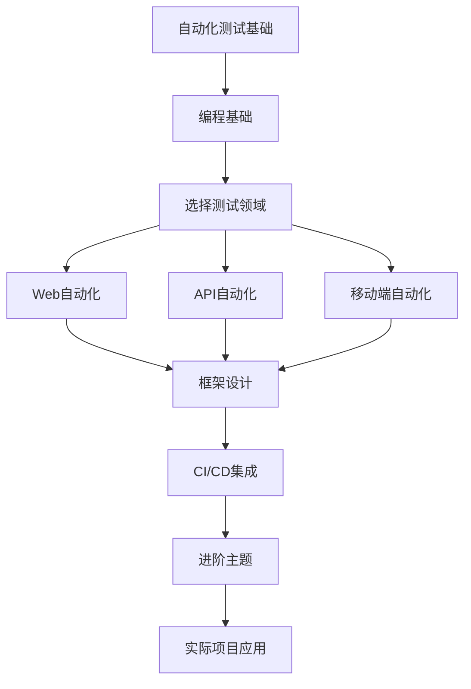

# 自动化测试完整学习指南

> **学习目标定位**: 本笔记面向0-5年经验的软件测试工程师、开发工程师以及希望转型自动化测试的从业者
>
> **预期学习成果**: 通过本笔记的学习，能够独立设计、开发和维护自动化测试框架，掌握主流测试工具和最佳实践

---

## 📋 目录导航

- [第一章: 自动化测试基础](#第一章-自动化测试基础)
- [第二章: Web自动化测试实战](#第二章-web自动化测试实战)
- [第三章: API自动化测试](#第三章-api自动化测试)
- [第四章: 移动端自动化测试](#第四章-移动端自动化测试)
- [第五章: 测试框架设计与实现](#第五章-测试框架设计与实现)
- [第六章: CI/CD集成](#第六章-cicd集成)
- [第七章: 性能测试自动化](#第七章-性能测试自动化)
- [第八章: 测试报告与监控](#第八章-测试报告与监控)

---

## 第一章: 自动化测试基础

### 1.1 自动化测试核心概念

#### 1.1.1 什么是自动化测试

自动化测试是指使用专门的测试工具和脚本，模拟手动测试过程，自动执行测试用例并验证测试结果的过程。

**核心特征**:
- **可重复性**: 测试用例可以多次执行，结果一致
- **高效性**: 能够快速执行大量测试用例
- **准确性**: 减少人为错误，提高测试精度
- **持续性**: 可集成到CI/CD流程中持续执行

#### 1.1.2 自动化测试的价值与局限

**✅ 优势**:
1. **提高测试效率**: 自动化测试可以在短时间内执行大量测试用例
2. **降低长期成本**: 虽然初期投入较高，但长期来看可以显著降低测试成本
3. **提高测试覆盖率**: 可以执行更多的测试场景和边界条件
4. **支持持续集成**: 可以在代码提交后自动触发测试
5. **提高产品质量**: 及早发现缺陷，减少生产环境问题

**❌ 局限性**:
1. **初期投入高**: 需要学习成本、框架搭建、用例编写
2. **维护成本**: UI变化、需求变更需要同步更新测试用例
3. **不适合探索性测试**: 无法替代人的创造性思维
4. **无法测试用户体验**: 无法评估界面美观度、易用性等主观因素
5. **工具依赖性**: 受限于工具的能力和稳定性

#### 1.1.3 自动化测试适用场景

**🎯 适合自动化的场景**:
- 回归测试（功能稳定，频繁执行）
- 冒烟测试（核心功能验证）
- 数据驱动测试（相同逻辑，不同数据）
- 性能测试和压力测试
- API接口测试
- 跨平台兼容性测试

**🚫 不适合自动化的场景**:
- 需求频繁变动的功能
- 一次性测试场景
- 复杂的用户体验测试
- 需要人工判断的场景
- 投入产出比过低的场景

#### 1.1.4 测试金字塔理论

测试金字塔由Mike Cohn提出，描述了不同层次测试的比例关系：

```
        /\
       /  \      E2E Tests (10%)
      /----\     UI自动化测试
     /------\
    /--------\   Integration Tests (20%)
   /----------\  集成测试
  /------------\
 /--------------\ Unit Tests (70%)
/----------------\ 单元测试
```

**各层次测试特点**:

| 测试层次 | 比例 | 执行速度 | 维护成本 | 反馈速度 | 覆盖范围 |
|---------|------|---------|---------|---------|---------|
| 单元测试 | 70% | 极快 | 低 | 秒级 | 代码级 |
| 集成测试 | 20% | 较快 | 中 | 分钟级 | 模块级 |
| E2E测试 | 10% | 较慢 | 高 | 小时级 | 业务级 |

**最佳实践建议**:
1. 优先编写单元测试，确保代码质量
2. 适量的集成测试验证模块协作
3. 少量E2E测试覆盖关键业务流程
4. 避免"倒置金字塔"（过度依赖UI测试）

---

### 1.2 测试类型详解

#### 1.2.1 单元测试 (Unit Testing)

**定义**: 对软件中最小可测试单元（函数、方法、类）进行检查和验证。

**特点**:
- 测试粒度最小
- 执行速度最快
- 由开发人员编写
- 高度隔离（使用Mock/Stub）

**实战示例 - Python pytest**:

```python
# calculator.py
class Calculator:
    def add(self, a, b):
        """加法运算"""
        return a + b

    def divide(self, a, b):
        """除法运算"""
        if b == 0:
            raise ValueError("除数不能为0")
        return a / b

# test_calculator.py
import pytest
from calculator import Calculator

class TestCalculator:
    def setup_method(self):
        """每个测试方法执行前的准备工作"""
        self.calc = Calculator()

    def test_add_positive_numbers(self):
        """测试正数相加"""
        result = self.calc.add(3, 5)
        assert result == 8

    def test_add_negative_numbers(self):
        """测试负数相加"""
        result = self.calc.add(-3, -5)
        assert result == -8

    def test_divide_normal(self):
        """测试正常除法"""
        result = self.calc.divide(10, 2)
        assert result == 5.0

    def test_divide_by_zero(self):
        """测试除以零异常"""
        with pytest.raises(ValueError, match="除数不能为0"):
            self.calc.divide(10, 0)

    @pytest.mark.parametrize("a,b,expected", [
        (0, 0, 0),
        (1, 0, 1),
        (100, 200, 300),
        (-10, 10, 0)
    ])
    def test_add_multiple_cases(self, a, b, expected):
        """参数化测试多个场景"""
        assert self.calc.add(a, b) == expected
```

**执行测试**:
```bash
# 运行所有测试
pytest test_calculator.py -v

# 运行特定测试
pytest test_calculator.py::TestCalculator::test_add_positive_numbers

# 生成覆盖率报告
pytest --cov=calculator --cov-report=html
```

#### 1.2.2 集成测试 (Integration Testing)

**定义**: 测试多个模块或组件之间的交互和协作。

**实战示例 - 数据库集成测试**:

```python
# models.py
from sqlalchemy import Column, Integer, String, create_engine
from sqlalchemy.ext.declarative import declarative_base
from sqlalchemy.orm import sessionmaker

Base = declarative_base()

class User(Base):
    __tablename__ = 'users'
    id = Column(Integer, primary_key=True)
    username = Column(String(50), unique=True, nullable=False)
    email = Column(String(100), nullable=False)

class UserRepository:
    def __init__(self, session):
        self.session = session

    def create_user(self, username, email):
        user = User(username=username, email=email)
        self.session.add(user)
        self.session.commit()
        return user

    def get_user_by_username(self, username):
        return self.session.query(User).filter_by(username=username).first()

# test_integration.py
import pytest
from sqlalchemy import create_engine
from sqlalchemy.orm import sessionmaker
from models import Base, User, UserRepository

@pytest.fixture(scope='function')
def db_session():
    """创建测试数据库会话"""
    engine = create_engine('sqlite:///:memory:')  # 使用内存数据库
    Base.metadata.create_all(engine)
    Session = sessionmaker(bind=engine)
    session = Session()

    yield session

    session.close()

class TestUserRepository:
    def test_create_and_retrieve_user(self, db_session):
        """测试用户创建和查询"""
        repo = UserRepository(db_session)

        # 创建用户
        user = repo.create_user("testuser", "test@example.com")
        assert user.id is not None
        assert user.username == "testuser"

        # 查询用户
        retrieved_user = repo.get_user_by_username("testuser")
        assert retrieved_user is not None
        assert retrieved_user.email == "test@example.com"

    def test_duplicate_username(self, db_session):
        """测试重复用户名"""
        repo = UserRepository(db_session)
        repo.create_user("testuser", "test1@example.com")

        with pytest.raises(Exception):  # 会触发数据库唯一约束异常
            repo.create_user("testuser", "test2@example.com")
```

#### 1.2.3 端到端测试 (E2E Testing)

**定义**: 从用户视角测试完整的业务流程，验证系统各组件的协同工作。

**实战示例将在Web自动化测试章节详细讲解**

---

### 1.3 自动化测试学习路径



**推荐学习时间线**:
- **第1-2周**: 自动化测试基础理论 + 编程语言基础（Python/Java）
- **第3-6周**: 选择一个领域深入学习（Web/API/移动端）
- **第7-8周**: 学习测试框架和设计模式（POM、数据驱动等）
- **第9-10周**: CI/CD集成和持续测试
- **第11-12周**: 实际项目实践和问题解决

---

## 第二章: Web自动化测试实战

### 2.1 Selenium WebDriver 核心技术

#### 2.1.1 Selenium简介

Selenium是Web自动化测试的事实标准，支持多种浏览器和编程语言。

**核心组件**:
- **Selenium WebDriver**: 浏览器自动化API
- **Selenium Grid**: 分布式测试执行
- **Selenium IDE**: 录制回放工具

**支持的浏览器**:
- Chrome/Chromium (ChromeDriver)
- Firefox (GeckoDriver)
- Safari (SafariDriver)
- Edge (EdgeDriver)

#### 2.1.2 环境搭建

**Python + Selenium安装**:

```bash
# 安装Selenium
pip install selenium

# 安装WebDriver管理工具
pip install webdriver-manager

# 安装测试框架
pip install pytest pytest-html
```

**示例代码 - 基础使用**:

```python
from selenium import webdriver
from selenium.webdriver.common.by import By
from selenium.webdriver.support.ui import WebDriverWait
from selenium.webdriver.support import expected_conditions as EC
from webdriver_manager.chrome import ChromeDriverManager
from selenium.webdriver.chrome.service import Service

# 自动管理ChromeDriver
service = Service(ChromeDriverManager().install())
driver = webdriver.Chrome(service=service)

try:
    # 打开网页
    driver.get("https://www.example.com")

    # 最大化窗口
    driver.maximize_window()

    # 查找元素并点击
    element = driver.find_element(By.ID, "submit-button")
    element.click()

    # 等待元素出现
    wait = WebDriverWait(driver, 10)
    result = wait.until(
        EC.presence_of_element_located((By.CLASS_NAME, "result"))
    )

    print(f"结果: {result.text}")

finally:
    driver.quit()
```

#### 2.1.3 元素定位策略

**8种定位方式**:

```python
from selenium.webdriver.common.by import By

# 1. ID定位（最推荐，唯一且稳定）
element = driver.find_element(By.ID, "username")

# 2. Name定位
element = driver.find_element(By.NAME, "email")

# 3. Class Name定位
element = driver.find_element(By.CLASS_NAME, "btn-primary")

# 4. Tag Name定位
element = driver.find_element(By.TAG_NAME, "button")

# 5. Link Text定位（完整文本）
element = driver.find_element(By.LINK_TEXT, "登录")

# 6. Partial Link Text定位（部分文本）
element = driver.find_element(By.PARTIAL_LINK_TEXT, "登")

# 7. CSS Selector定位（推荐，灵活强大）
element = driver.find_element(By.CSS_SELECTOR, "div.container > input[type='text']")

# 8. XPath定位（最灵活，但性能较差）
element = driver.find_element(By.XPATH, "//input[@id='username']")
```

**定位器选择优先级**:
1. **ID** > **Name** > **CSS Selector** > **XPath**
2. 优先选择稳定的属性（避免动态生成的ID）
3. 避免使用绝对路径XPath

**CSS Selector实用技巧**:

```python
# 属性选择器
driver.find_element(By.CSS_SELECTOR, "input[name='username']")

# 类选择器组合
driver.find_element(By.CSS_SELECTOR, ".form-control.input-lg")

# 子元素选择
driver.find_element(By.CSS_SELECTOR, "div.header > nav > a")

# 第n个子元素
driver.find_element(By.CSS_SELECTOR, "ul > li:nth-child(2)")

# 属性包含
driver.find_element(By.CSS_SELECTOR, "a[href*='login']")

# 属性开头
driver.find_element(By.CSS_SELECTOR, "img[src^='https://']")

# 属性结尾
driver.find_element(By.CSS_SELECTOR, "a[href$='.pdf']")
```

#### 2.1.4 常见操作

**输入和点击**:

```python
from selenium.webdriver.common.keys import Keys

# 输入文本
input_field = driver.find_element(By.ID, "search")
input_field.send_keys("自动化测试")

# 清空输入框
input_field.clear()

# 模拟键盘操作
input_field.send_keys("Selenium")
input_field.send_keys(Keys.ENTER)

# 点击按钮
button = driver.find_element(By.ID, "submit")
button.click()

# 双击
from selenium.webdriver.common.action_chains import ActionChains
actions = ActionChains(driver)
actions.double_click(button).perform()

# 右键点击
actions.context_click(button).perform()
```

**下拉框操作**:

```python
from selenium.webdriver.support.ui import Select

# 定位下拉框
select_element = driver.find_element(By.ID, "country")
select = Select(select_element)

# 通过可见文本选择
select.select_by_visible_text("中国")

# 通过值选择
select.select_by_value("cn")

# 通过索引选择
select.select_by_index(1)

# 获取所有选项
all_options = select.options
for option in all_options:
    print(option.text)

# 获取当前选中的选项
selected_option = select.first_selected_option
print(selected_option.text)
```

**多窗口/标签页处理**:

```python
# 获取当前窗口句柄
main_window = driver.current_window_handle

# 点击打开新窗口的链接
driver.find_element(By.LINK_TEXT, "打开新窗口").click()

# 获取所有窗口句柄
all_windows = driver.window_handles

# 切换到新窗口
for window in all_windows:
    if window != main_window:
        driver.switch_to.window(window)
        break

# 在新窗口中操作
print(driver.title)

# 关闭当前窗口
driver.close()

# 切换回主窗口
driver.switch_to.window(main_window)
```

**iframe处理**:

```python
# 切换到iframe（通过索引）
driver.switch_to.frame(0)

# 切换到iframe（通过name或id）
driver.switch_to.frame("iframe_name")

# 切换到iframe（通过WebElement）
iframe_element = driver.find_element(By.TAG_NAME, "iframe")
driver.switch_to.frame(iframe_element)

# 在iframe中操作
driver.find_element(By.ID, "button_in_iframe").click()

# 切换回主文档
driver.switch_to.default_content()
```

**弹窗处理**:

```python
from selenium.webdriver.common.alert import Alert

# 点击触发弹窗的按钮
driver.find_element(By.ID, "alert-button").click()

# 切换到弹窗
alert = Alert(driver)

# 获取弹窗文本
print(alert.text)

# 接受弹窗（点击确定）
alert.accept()

# 拒绝弹窗（点击取消）
# alert.dismiss()

# 输入文本到prompt弹窗
# alert.send_keys("输入的文本")
# alert.accept()
```

#### 2.1.5 等待机制

**三种等待方式对比**:

| 等待类型 | 优点 | 缺点 | 使用场景 |
|---------|------|------|---------|
| 强制等待 | 简单 | 浪费时间，不智能 | 不推荐使用 |
| 隐式等待 | 全局生效 | 不够灵活 | 简单场景 |
| 显式等待 | 灵活，智能 | 代码稍复杂 | 推荐使用 |

**实战代码**:

```python
import time
from selenium.webdriver.support.ui import WebDriverWait
from selenium.webdriver.support import expected_conditions as EC
from selenium.webdriver.common.by import By

# 1. 强制等待（不推荐）
time.sleep(5)  # 无论元素是否加载完成都等待5秒

# 2. 隐式等待（全局设置）
driver.implicitly_wait(10)  # 最多等待10秒，找到元素立即返回

# 3. 显式等待（推荐）
wait = WebDriverWait(driver, 10, poll_frequency=0.5)

# 等待元素可见
element = wait.until(
    EC.visibility_of_element_located((By.ID, "result"))
)

# 等待元素可点击
element = wait.until(
    EC.element_to_be_clickable((By.ID, "submit"))
)

# 等待元素出现
element = wait.until(
    EC.presence_of_element_located((By.CLASS_NAME, "content"))
)

# 等待文本出现
wait.until(
    EC.text_to_be_present_in_element((By.ID, "status"), "成功")
)

# 等待URL包含特定文本
wait.until(EC.url_contains("dashboard"))

# 等待标题包含特定文本
wait.until(EC.title_contains("首页"))

# 自定义等待条件
def element_has_text(locator, text):
    def _predicate(driver):
        element = driver.find_element(*locator)
        return text in element.text
    return _predicate

wait.until(element_has_text((By.ID, "message"), "欢迎"))
```

#### 2.1.6 完整实战案例 - 登录测试

```python
import pytest
from selenium import webdriver
from selenium.webdriver.common.by import By
from selenium.webdriver.support.ui import WebDriverWait
from selenium.webdriver.support import expected_conditions as EC
from webdriver_manager.chrome import ChromeDriverManager
from selenium.webdriver.chrome.service import Service

class TestLogin:
    @pytest.fixture(scope="function")
    def driver(self):
        """为每个测试方法创建独立的浏览器实例"""
        service = Service(ChromeDriverManager().install())
        driver = webdriver.Chrome(service=service)
        driver.maximize_window()
        driver.implicitly_wait(10)

        yield driver

        driver.quit()

    def test_login_success(self, driver):
        """测试成功登录"""
        # 打开登录页面
        driver.get("https://example.com/login")

        # 输入用户名
        username_input = driver.find_element(By.ID, "username")
        username_input.send_keys("testuser")

        # 输入密码
        password_input = driver.find_element(By.ID, "password")
        password_input.send_keys("Test@123")

        # 点击登录按钮
        login_button = driver.find_element(By.ID, "login-btn")
        login_button.click()

        # 验证登录成功
        wait = WebDriverWait(driver, 10)
        welcome_msg = wait.until(
            EC.visibility_of_element_located((By.CLASS_NAME, "welcome"))
        )

        assert "欢迎" in welcome_msg.text
        assert "dashboard" in driver.current_url

    def test_login_with_wrong_password(self, driver):
        """测试错误密码登录"""
        driver.get("https://example.com/login")

        driver.find_element(By.ID, "username").send_keys("testuser")
        driver.find_element(By.ID, "password").send_keys("wrongpassword")
        driver.find_element(By.ID, "login-btn").click()

        # 验证错误提示
        wait = WebDriverWait(driver, 10)
        error_msg = wait.until(
            EC.visibility_of_element_located((By.CLASS_NAME, "error-message"))
        )

        assert "用户名或密码错误" in error_msg.text

    def test_login_with_empty_username(self, driver):
        """测试空用户名登录"""
        driver.get("https://example.com/login")

        driver.find_element(By.ID, "password").send_keys("Test@123")
        driver.find_element(By.ID, "login-btn").click()

        # 验证HTML5验证提示
        username_input = driver.find_element(By.ID, "username")
        validation_message = username_input.get_attribute("validationMessage")

        assert "请填写此字段" in validation_message

    @pytest.mark.parametrize("username,password,expected_error", [
        ("", "Test@123", "请输入用户名"),
        ("testuser", "", "请输入密码"),
        ("short", "123", "用户名至少6个字符"),
        ("testuser", "weak", "密码强度不足"),
    ])
    def test_login_validation(self, driver, username, password, expected_error):
        """参数化测试登录验证"""
        driver.get("https://example.com/login")

        if username:
            driver.find_element(By.ID, "username").send_keys(username)
        if password:
            driver.find_element(By.ID, "password").send_keys(password)

        driver.find_element(By.ID, "login-btn").click()

        wait = WebDriverWait(driver, 5)
        error_element = wait.until(
            EC.presence_of_element_located((By.CLASS_NAME, "validation-error"))
        )

        assert expected_error in error_element.text
```

**执行测试**:

```bash
# 运行所有测试
pytest test_login.py -v

# 生成HTML报告
pytest test_login.py --html=report.html --self-contained-html

# 并行执行（安装pytest-xdist）
pytest test_login.py -n 4
```

---

### 2.2 Playwright - 现代化测试框架

#### 2.2.1 Playwright优势

相比Selenium，Playwright具有以下优势：
- **更快的执行速度**: 原生支持浏览器协议
- **自动等待**: 内置智能等待机制
- **更好的稳定性**: 减少flaky测试
- **多浏览器支持**: Chrome、Firefox、Safari、Edge
- **移动端仿真**: 支持移动设备模拟
- **网络拦截**: 可以拦截和修改网络请求

#### 2.2.2 快速开始

**安装**:

```bash
pip install playwright pytest-playwright

# 安装浏览器
playwright install
```

**基础示例**:

```python
from playwright.sync_api import sync_playwright, expect

def test_basic_navigation():
    with sync_playwright() as p:
        # 启动浏览器
        browser = p.chromium.launch(headless=False)

        # 创建上下文
        context = browser.new_context()

        # 创建页面
        page = context.new_page()

        # 导航
        page.goto("https://www.example.com")

        # 点击元素
        page.click("text=More information")

        # 断言
        expect(page).to_have_url("https://www.iana.org/domains/reserved")

        # 关闭
        browser.close()
```

#### 2.2.3 Playwright pytest插件

```python
import pytest
from playwright.sync_api import Page, expect

def test_homepage_title(page: Page):
    """测试首页标题"""
    page.goto("https://example.com")
    expect(page).to_have_title("Example Domain")

def test_search_functionality(page: Page):
    """测试搜索功能"""
    page.goto("https://example.com/search")

    # 输入搜索关键词
    page.fill("input[name='q']", "playwright")

    # 点击搜索按钮
    page.click("button[type='submit']")

    # 等待结果加载
    page.wait_for_selector(".search-results")

    # 验证结果
    results = page.locator(".search-result")
    expect(results).to_have_count(10)

def test_login_flow(page: Page):
    """测试登录流程"""
    page.goto("https://example.com/login")

    # 填写表单
    page.fill("#username", "testuser")
    page.fill("#password", "Test@123")

    # 提交表单
    page.click("#login-button")

    # 验证重定向
    expect(page).to_have_url("https://example.com/dashboard")

    # 验证欢迎消息
    welcome = page.locator(".welcome-message")
    expect(welcome).to_contain_text("欢迎, testuser")

@pytest.fixture(scope="session")
def browser_context_args(browser_context_args):
    """自定义浏览器上下文配置"""
    return {
        **browser_context_args,
        "viewport": {
            "width": 1920,
            "height": 1080,
        },
        "locale": "zh-CN",
        "timezone_id": "Asia/Shanghai",
    }
```

**配置文件 - pytest.ini**:

```ini
[pytest]
addopts =
    --browser chromium
    --headed
    --slowmo 500
    --screenshot only-on-failure
    --video retain-on-failure
```

#### 2.2.4 高级功能

**网络拦截**:

```python
def test_api_mocking(page: Page):
    """模拟API响应"""
    # 拦截API请求
    def handle_route(route):
        # 返回模拟数据
        route.fulfill(
            status=200,
            content_type="application/json",
            body='{"status": "success", "data": [{"id": 1, "name": "测试数据"}]}'
        )

    page.route("**/api/users", handle_route)

    # 访问页面
    page.goto("https://example.com/users")

    # 验证模拟数据被使用
    user_name = page.locator(".user-name").first
    expect(user_name).to_have_text("测试数据")

def test_network_monitoring(page: Page):
    """监控网络请求"""
    requests = []

    # 监听请求
    page.on("request", lambda request: requests.append(request.url))

    page.goto("https://example.com")

    # 验证特定请求被发送
    assert any("analytics" in url for url in requests)
```

**文件操作**:

```python
def test_file_upload(page: Page):
    """测试文件上传"""
    page.goto("https://example.com/upload")

    # 选择文件
    page.set_input_files("#file-upload", "test_data/sample.pdf")

    # 点击上传
    page.click("#upload-button")

    # 验证上传成功
    success_msg = page.locator(".upload-success")
    expect(success_msg).to_be_visible()

def test_file_download(page: Page):
    """测试文件下载"""
    page.goto("https://example.com/downloads")

    # 开始等待下载
    with page.expect_download() as download_info:
        page.click("text=下载报告")

    download = download_info.value

    # 保存文件
    download.save_as("downloads/report.pdf")

    # 验证文件名
    assert download.suggested_filename == "report.pdf"
```

**移动端测试**:

```python
import pytest
from playwright.sync_api import Page

@pytest.fixture
def mobile_context(playwright):
    """创建移动设备上下文"""
    iphone = playwright.devices["iPhone 12"]
    browser = playwright.chromium.launch()
    context = browser.new_context(**iphone)

    yield context

    context.close()
    browser.close()

def test_mobile_responsive(mobile_context):
    """测试移动端响应式"""
    page = mobile_context.new_page()
    page.goto("https://example.com")

    # 验证移动端特定元素
    mobile_menu = page.locator(".mobile-menu-icon")
    expect(mobile_menu).to_be_visible()

    # 点击移动菜单
    mobile_menu.click()

    # 验证菜单展开
    nav_menu = page.locator(".navigation-menu")
    expect(nav_menu).to_be_visible()
```

---

### 2.3 页面对象模式 (POM)

#### 2.3.1 为什么需要POM

**问题**: 直接在测试中操作元素导致：
- 代码重复
- 维护困难（UI变更需要修改多处）
- 可读性差

**解决方案**: 页面对象模式
- 将页面元素和操作封装到类中
- 测试代码只调用页面对象的方法
- UI变更只需修改页面对象类

#### 2.3.2 POM实战示例

**目录结构**:

```
project/
├── pages/
│   ├── __init__.py
│   ├── base_page.py
│   ├── login_page.py
│   └── dashboard_page.py
├── tests/
│   ├── __init__.py
│   └── test_login.py
├── utils/
│   └── config.py
└── conftest.py
```

**基础页面类**:

```python
# pages/base_page.py
from selenium.webdriver.support.ui import WebDriverWait
from selenium.webdriver.support import expected_conditions as EC

class BasePage:
    """所有页面对象的基类"""

    def __init__(self, driver):
        self.driver = driver
        self.wait = WebDriverWait(driver, 10)

    def find_element(self, locator):
        """查找元素"""
        return self.wait.until(EC.presence_of_element_located(locator))

    def click(self, locator):
        """点击元素"""
        element = self.wait.until(EC.element_to_be_clickable(locator))
        element.click()

    def input_text(self, locator, text):
        """输入文本"""
        element = self.find_element(locator)
        element.clear()
        element.send_keys(text)

    def get_text(self, locator):
        """获取文本"""
        element = self.find_element(locator)
        return element.text

    def is_element_visible(self, locator, timeout=10):
        """检查元素是否可见"""
        try:
            WebDriverWait(self.driver, timeout).until(
                EC.visibility_of_element_located(locator)
            )
            return True
        except:
            return False

    def wait_for_url_contains(self, text, timeout=10):
        """等待URL包含特定文本"""
        WebDriverWait(self.driver, timeout).until(
            EC.url_contains(text)
        )
```

**登录页面对象**:

```python
# pages/login_page.py
from selenium.webdriver.common.by import By
from pages.base_page import BasePage

class LoginPage(BasePage):
    """登录页面对象"""

    # 定位器
    USERNAME_INPUT = (By.ID, "username")
    PASSWORD_INPUT = (By.ID, "password")
    LOGIN_BUTTON = (By.ID, "login-btn")
    ERROR_MESSAGE = (By.CLASS_NAME, "error-message")
    REMEMBER_ME_CHECKBOX = (By.ID, "remember-me")

    def __init__(self, driver):
        super().__init__(driver)
        self.url = "https://example.com/login"

    def navigate(self):
        """导航到登录页面"""
        self.driver.get(self.url)
        return self

    def enter_username(self, username):
        """输入用户名"""
        self.input_text(self.USERNAME_INPUT, username)
        return self

    def enter_password(self, password):
        """输入密码"""
        self.input_text(self.PASSWORD_INPUT, password)
        return self

    def check_remember_me(self):
        """勾选记住我"""
        self.click(self.REMEMBER_ME_CHECKBOX)
        return self

    def click_login(self):
        """点击登录按钮"""
        self.click(self.LOGIN_BUTTON)

    def login(self, username, password, remember_me=False):
        """完整登录流程"""
        self.enter_username(username)
        self.enter_password(password)
        if remember_me:
            self.check_remember_me()
        self.click_login()

    def get_error_message(self):
        """获取错误消息"""
        return self.get_text(self.ERROR_MESSAGE)

    def is_error_displayed(self):
        """检查错误消息是否显示"""
        return self.is_element_visible(self.ERROR_MESSAGE)
```

**仪表板页面对象**:

```python
# pages/dashboard_page.py
from selenium.webdriver.common.by import By
from pages.base_page import BasePage

class DashboardPage(BasePage):
    """仪表板页面对象"""

    # 定位器
    WELCOME_MESSAGE = (By.CLASS_NAME, "welcome")
    USER_MENU = (By.ID, "user-menu")
    LOGOUT_BUTTON = (By.ID, "logout")

    def __init__(self, driver):
        super().__init__(driver)
        self.url = "https://example.com/dashboard"

    def get_welcome_message(self):
        """获取欢迎消息"""
        return self.get_text(self.WELCOME_MESSAGE)

    def is_logged_in(self):
        """检查是否已登录"""
        return self.is_element_visible(self.USER_MENU)

    def logout(self):
        """退出登录"""
        self.click(self.USER_MENU)
        self.click(self.LOGOUT_BUTTON)
```

**测试用例**:

```python
# tests/test_login.py
import pytest
from pages.login_page import LoginPage
from pages.dashboard_page import DashboardPage

class TestLogin:

    def test_successful_login(self, driver):
        """测试成功登录"""
        # 创建页面对象
        login_page = LoginPage(driver)
        dashboard_page = DashboardPage(driver)

        # 执行登录
        login_page.navigate().login("testuser", "Test@123")

        # 验证登录成功
        assert dashboard_page.is_logged_in()
        assert "欢迎" in dashboard_page.get_welcome_message()
        assert "dashboard" in driver.current_url

    def test_login_with_invalid_credentials(self, driver):
        """测试无效凭据登录"""
        login_page = LoginPage(driver)

        login_page.navigate().login("invalid_user", "wrong_password")

        # 验证错误消息
        assert login_page.is_error_displayed()
        assert "用户名或密码错误" in login_page.get_error_message()

    def test_login_with_remember_me(self, driver):
        """测试记住我功能"""
        login_page = LoginPage(driver)
        dashboard_page = DashboardPage(driver)

        # 登录并勾选记住我
        login_page.navigate().login("testuser", "Test@123", remember_me=True)

        # 验证登录成功
        assert dashboard_page.is_logged_in()

        # 关闭浏览器并重新打开（实际中需要保存cookies）
        # ... 验证仍然登录状态
```

**conftest.py配置**:

```python
# conftest.py
import pytest
from selenium import webdriver
from webdriver_manager.chrome import ChromeDriverManager
from selenium.webdriver.chrome.service import Service

@pytest.fixture(scope="function")
def driver():
    """为每个测试创建driver"""
    service = Service(ChromeDriverManager().install())
    driver = webdriver.Chrome(service=service)
    driver.maximize_window()
    driver.implicitly_wait(10)

    yield driver

    driver.quit()

@pytest.fixture(scope="session")
def test_config():
    """测试配置"""
    return {
        "base_url": "https://example.com",
        "timeout": 10,
        "browser": "chrome"
    }
```

---

## 第三章: API自动化测试

### 3.1 API测试基础

#### 3.1.1 什么是API测试

API（Application Programming Interface）测试是直接测试应用程序接口的过程，不通过用户界面。

**优势**:
- **执行速度快**: 不需要渲染UI
- **稳定性高**: 不受UI变化影响
- **易于维护**: 接口相对稳定
- **测试覆盖率高**: 可以测试各种边界条件

**常见API类型**:
- **RESTful API**: 基于HTTP协议，使用JSON/XML格式
- **GraphQL API**: 灵活的查询语言
- **SOAP API**: 基于XML的协议
- **gRPC**: 高性能RPC框架

#### 3.1.2 HTTP方法与状态码

**常用HTTP方法**:

| 方法 | 用途 | 是否幂等 | 示例 |
|-----|------|---------|------|
| GET | 获取资源 | 是 | 获取用户列表 |
| POST | 创建资源 | 否 | 创建新用户 |
| PUT | 完整更新资源 | 是 | 更新用户信息 |
| PATCH | 部分更新资源 | 否 | 更新用户名 |
| DELETE | 删除资源 | 是 | 删除用户 |

**常见HTTP状态码**:

| 状态码 | 含义 | 说明 |
|-------|------|------|
| 200 | OK | 请求成功 |
| 201 | Created | 资源创建成功 |
| 204 | No Content | 成功但无返回内容 |
| 400 | Bad Request | 请求参数错误 |
| 401 | Unauthorized | 未授权 |
| 403 | Forbidden | 无权限 |
| 404 | Not Found | 资源不存在 |
| 500 | Internal Server Error | 服务器错误 |
| 503 | Service Unavailable | 服务不可用 |

---

### 3.2 Requests库实战

#### 3.2.1 基础请求

```python
import requests

# GET请求
response = requests.get('https://api.example.com/users')
print(f"状态码: {response.status_code}")
print(f"响应体: {response.json()}")

# POST请求
data = {
    "username": "testuser",
    "email": "test@example.com"
}
response = requests.post('https://api.example.com/users', json=data)
print(f"创建结果: {response.json()}")

# PUT请求
update_data = {
    "email": "newemail@example.com"
}
response = requests.put('https://api.example.com/users/123', json=update_data)

# DELETE请求
response = requests.delete('https://api.example.com/users/123')
print(f"删除状态: {response.status_code}")
```

#### 3.2.2 请求参数

```python
# Query参数
params = {
    "page": 1,
    "limit": 10,
    "sort": "created_at"
}
response = requests.get('https://api.example.com/users', params=params)
# 实际请求URL: https://api.example.com/users?page=1&limit=10&sort=created_at

# Headers
headers = {
    "Authorization": "Bearer token123",
    "Content-Type": "application/json",
    "User-Agent": "MyTestClient/1.0"
}
response = requests.get('https://api.example.com/users', headers=headers)

# Cookies
cookies = {"session_id": "abc123"}
response = requests.get('https://api.example.com/profile', cookies=cookies)

# 超时设置
try:
    response = requests.get('https://api.example.com/users', timeout=5)
except requests.Timeout:
    print("请求超时")
```

#### 3.2.3 响应处理

```python
response = requests.get('https://api.example.com/users')

# 状态码检查
assert response.status_code == 200
response.raise_for_status()  # 如果状态码4xx或5xx会抛出异常

# JSON响应
data = response.json()
print(data['users'][0]['name'])

# 文本响应
html_content = response.text

# 二进制响应
file_content = response.content

# 响应头
print(response.headers['Content-Type'])
print(response.headers['Date'])

# Cookies
print(response.cookies['session_id'])

# 响应时间
print(f"响应时间: {response.elapsed.total_seconds()}秒")
```

#### 3.2.4 完整测试示例

```python
# test_api_users.py
import pytest
import requests

BASE_URL = "https://jsonplaceholder.typicode.com"

class TestUserAPI:

    def test_get_all_users(self):
        """测试获取所有用户"""
        response = requests.get(f"{BASE_URL}/users")

        # 验证状态码
        assert response.status_code == 200

        # 验证响应类型
        assert response.headers['Content-Type'] == 'application/json; charset=utf-8'

        # 验证响应数据
        users = response.json()
        assert isinstance(users, list)
        assert len(users) == 10

        # 验证数据结构
        first_user = users[0]
        assert 'id' in first_user
        assert 'name' in first_user
        assert 'email' in first_user

    def test_get_single_user(self):
        """测试获取单个用户"""
        user_id = 1
        response = requests.get(f"{BASE_URL}/users/{user_id}")

        assert response.status_code == 200

        user = response.json()
        assert user['id'] == user_id
        assert user['name'] == "Leanne Graham"
        assert '@' in user['email']

    def test_get_nonexistent_user(self):
        """测试获取不存在的用户"""
        response = requests.get(f"{BASE_URL}/users/999")
        assert response.status_code == 404

    def test_create_user(self):
        """测试创建用户"""
        new_user = {
            "name": "Test User",
            "username": "testuser",
            "email": "test@example.com"
        }

        response = requests.post(f"{BASE_URL}/users", json=new_user)

        # 验证创建成功
        assert response.status_code == 201

        # 验证返回的用户数据
        created_user = response.json()
        assert created_user['name'] == new_user['name']
        assert created_user['email'] == new_user['email']
        assert 'id' in created_user

    def test_update_user(self):
        """测试更新用户"""
        user_id = 1
        update_data = {
            "name": "Updated Name",
            "email": "updated@example.com"
        }

        response = requests.put(f"{BASE_URL}/users/{user_id}", json=update_data)

        assert response.status_code == 200

        updated_user = response.json()
        assert updated_user['name'] == update_data['name']
        assert updated_user['email'] == update_data['email']

    def test_delete_user(self):
        """测试删除用户"""
        user_id = 1
        response = requests.delete(f"{BASE_URL}/users/{user_id}")

        assert response.status_code == 200

    def test_response_time(self):
        """测试响应时间"""
        response = requests.get(f"{BASE_URL}/users")

        # 验证响应时间小于2秒
        assert response.elapsed.total_seconds() < 2

    @pytest.mark.parametrize("user_id", [1, 2, 3, 4, 5])
    def test_multiple_users(self, user_id):
        """参数化测试多个用户"""
        response = requests.get(f"{BASE_URL}/users/{user_id}")

        assert response.status_code == 200
        user = response.json()
        assert user['id'] == user_id
```

---

### 3.3 pytest进阶技巧

#### 3.3.1 Fixtures复用

```python
# conftest.py
import pytest
import requests

@pytest.fixture(scope="session")
def api_client():
    """创建API客户端"""
    class APIClient:
        def __init__(self, base_url):
            self.base_url = base_url
            self.session = requests.Session()

        def get(self, endpoint, **kwargs):
            return self.session.get(f"{self.base_url}{endpoint}", **kwargs)

        def post(self, endpoint, **kwargs):
            return self.session.post(f"{self.base_url}{endpoint}", **kwargs)

        def put(self, endpoint, **kwargs):
            return self.session.put(f"{self.base_url}{endpoint}", **kwargs)

        def delete(self, endpoint, **kwargs):
            return self.session.delete(f"{self.base_url}{endpoint}", **kwargs)

    client = APIClient("https://jsonplaceholder.typicode.com")
    yield client
    client.session.close()

@pytest.fixture
def auth_token():
    """获取认证token"""
    # 模拟登录获取token
    response = requests.post("https://api.example.com/login", json={
        "username": "testuser",
        "password": "Test@123"
    })
    return response.json()['token']

@pytest.fixture
def auth_headers(auth_token):
    """生成认证请求头"""
    return {
        "Authorization": f"Bearer {auth_token}",
        "Content-Type": "application/json"
    }

# 测试中使用
def test_with_auth(api_client, auth_headers):
    response = api_client.get("/protected-resource", headers=auth_headers)
    assert response.status_code == 200
```

#### 3.3.2 数据驱动测试

```python
import pytest
import json

# 从JSON文件加载测试数据
def load_test_data(filename):
    with open(filename, 'r', encoding='utf-8') as f:
        return json.load(f)

# test_data.json
"""
[
    {
        "name": "有效用户名",
        "input": {"username": "testuser", "email": "test@example.com"},
        "expected_status": 201
    },
    {
        "name": "无效邮箱",
        "input": {"username": "testuser", "email": "invalid-email"},
        "expected_status": 400
    }
]
"""

@pytest.mark.parametrize(
    "test_case",
    load_test_data("test_data.json"),
    ids=lambda tc: tc['name']
)
def test_create_user_with_data_file(api_client, test_case):
    """使用外部数据文件测试"""
    response = api_client.post("/users", json=test_case['input'])
    assert response.status_code == test_case['expected_status']
```

#### 3.3.3 测试报告增强

```python
import pytest
import allure

@allure.feature('用户管理')
@allure.story('用户创建')
@allure.severity(allure.severity_level.CRITICAL)
def test_create_user_with_allure(api_client):
    """测试用户创建 - 带Allure报告"""

    with allure.step("准备测试数据"):
        user_data = {
            "name": "Test User",
            "email": "test@example.com"
        }
        allure.attach(
            json.dumps(user_data, indent=2),
            name="请求数据",
            attachment_type=allure.attachment_type.JSON
        )

    with allure.step("发送创建用户请求"):
        response = api_client.post("/users", json=user_data)

    with allure.step("验证响应"):
        assert response.status_code == 201
        allure.attach(
            response.text,
            name="响应数据",
            attachment_type=allure.attachment_type.JSON
        )

        created_user = response.json()
        assert created_user['name'] == user_data['name']
```

**生成Allure报告**:

```bash
# 运行测试并生成结果
pytest --alluredir=allure-results

# 生成并打开报告
allure serve allure-results
```

---

### 3.4 API测试框架设计

#### 3.4.1 完整框架结构

```
api_test_framework/
├── config/
│   ├── __init__.py
│   ├── config.py
│   └── environments.json
├── api/
│   ├── __init__.py
│   ├── base_api.py
│   ├── user_api.py
│   └── product_api.py
├── tests/
│   ├── __init__.py
│   ├── test_users.py
│   └── test_products.py
├── utils/
│   ├── __init__.py
│   ├── logger.py
│   ├── data_generator.py
│   └── assertions.py
├── test_data/
│   ├── users.json
│   └── products.json
├── conftest.py
├── pytest.ini
└── requirements.txt
```

#### 3.4.2 核心代码实现

**config/config.py**:

```python
import json
import os

class Config:
    """配置管理类"""

    def __init__(self, environment='test'):
        self.environment = environment
        self.load_config()

    def load_config(self):
        """加载环境配置"""
        config_file = os.path.join(
            os.path.dirname(__file__),
            'environments.json'
        )

        with open(config_file, 'r') as f:
            configs = json.load(f)

        env_config = configs.get(self.environment, {})

        self.base_url = env_config.get('base_url')
        self.timeout = env_config.get('timeout', 30)
        self.retry_times = env_config.get('retry_times', 3)

    @staticmethod
    def get_instance(environment='test'):
        """获取配置实例"""
        return Config(environment)

# environments.json
"""
{
    "test": {
        "base_url": "https://test-api.example.com",
        "timeout": 30,
        "retry_times": 3
    },
    "staging": {
        "base_url": "https://staging-api.example.com",
        "timeout": 30,
        "retry_times": 3
    },
    "production": {
        "base_url": "https://api.example.com",
        "timeout": 60,
        "retry_times": 1
    }
}
"""
```

**api/base_api.py**:

```python
import requests
from typing import Dict, Any, Optional
import logging

logger = logging.getLogger(__name__)

class BaseAPI:
    """API基类"""

    def __init__(self, base_url: str, timeout: int = 30):
        self.base_url = base_url
        self.timeout = timeout
        self.session = requests.Session()

    def _request(
        self,
        method: str,
        endpoint: str,
        **kwargs
    ) -> requests.Response:
        """
        发送HTTP请求的通用方法

        Args:
            method: HTTP方法
            endpoint: API端点
            **kwargs: 其他请求参数

        Returns:
            Response对象
        """
        url = f"{self.base_url}{endpoint}"

        # 设置默认超时
        if 'timeout' not in kwargs:
            kwargs['timeout'] = self.timeout

        logger.info(f"发送{method}请求: {url}")
        logger.debug(f"请求参数: {kwargs}")

        try:
            response = self.session.request(method, url, **kwargs)
            logger.info(f"响应状态码: {response.status_code}")
            logger.debug(f"响应内容: {response.text}")
            return response
        except requests.RequestException as e:
            logger.error(f"请求失败: {str(e)}")
            raise

    def get(self, endpoint: str, **kwargs) -> requests.Response:
        """GET请求"""
        return self._request('GET', endpoint, **kwargs)

    def post(self, endpoint: str, **kwargs) -> requests.Response:
        """POST请求"""
        return self._request('POST', endpoint, **kwargs)

    def put(self, endpoint: str, **kwargs) -> requests.Response:
        """PUT请求"""
        return self._request('PUT', endpoint, **kwargs)

    def patch(self, endpoint: str, **kwargs) -> requests.Response:
        """PATCH请求"""
        return self._request('PATCH', endpoint, **kwargs)

    def delete(self, endpoint: str, **kwargs) -> requests.Response:
        """DELETE请求"""
        return self._request('DELETE', endpoint, **kwargs)

    def set_auth_token(self, token: str):
        """设置认证token"""
        self.session.headers.update({
            'Authorization': f'Bearer {token}'
        })

    def close(self):
        """关闭session"""
        self.session.close()
```

**api/user_api.py**:

```python
from api.base_api import BaseAPI
from typing import Dict, List, Optional

class UserAPI(BaseAPI):
    """用户API封装"""

    def get_all_users(self, page: int = 1, limit: int = 10) -> Dict:
        """获取所有用户"""
        params = {'page': page, 'limit': limit}
        response = self.get('/users', params=params)
        return response.json()

    def get_user_by_id(self, user_id: int) -> Dict:
        """根据ID获取用户"""
        response = self.get(f'/users/{user_id}')
        return response.json()

    def create_user(self, user_data: Dict) -> Dict:
        """创建用户"""
        response = self.post('/users', json=user_data)
        response.raise_for_status()
        return response.json()

    def update_user(self, user_id: int, user_data: Dict) -> Dict:
        """更新用户"""
        response = self.put(f'/users/{user_id}', json=user_data)
        return response.json()

    def delete_user(self, user_id: int) -> bool:
        """删除用户"""
        response = self.delete(f'/users/{user_id}')
        return response.status_code == 200

    def search_users(self, keyword: str) -> List[Dict]:
        """搜索用户"""
        params = {'q': keyword}
        response = self.get('/users/search', params=params)
        return response.json()
```

**utils/assertions.py**:

```python
from typing import Any, Dict
import jsonschema

class APIAssertions:
    """API断言工具"""

    @staticmethod
    def assert_status_code(response, expected_code: int):
        """断言状态码"""
        actual_code = response.status_code
        assert actual_code == expected_code, \
            f"期望状态码{expected_code}, 实际为{actual_code}"

    @staticmethod
    def assert_response_time(response, max_time: float):
        """断言响应时间"""
        actual_time = response.elapsed.total_seconds()
        assert actual_time < max_time, \
            f"响应时间{actual_time}秒超过限制{max_time}秒"

    @staticmethod
    def assert_json_schema(data: Dict, schema: Dict):
        """断言JSON格式"""
        try:
            jsonschema.validate(instance=data, schema=schema)
        except jsonschema.ValidationError as e:
            raise AssertionError(f"JSON格式不匹配: {e.message}")

    @staticmethod
    def assert_contains(data: Any, expected: Any):
        """断言包含关系"""
        assert expected in data, \
            f"{expected} 不在 {data} 中"

    @staticmethod
    def assert_field_value(data: Dict, field: str, expected_value: Any):
        """断言字段值"""
        actual_value = data.get(field)
        assert actual_value == expected_value, \
            f"字段{field}期望值{expected_value}, 实际为{actual_value}"

# JSON Schema示例
USER_SCHEMA = {
    "type": "object",
    "properties": {
        "id": {"type": "integer"},
        "name": {"type": "string"},
        "email": {"type": "string", "format": "email"},
        "created_at": {"type": "string"}
    },
    "required": ["id", "name", "email"]
}
```

**测试用例**:

```python
# tests/test_users.py
import pytest
from api.user_api import UserAPI
from utils.assertions import APIAssertions, USER_SCHEMA

class TestUserAPI:

    @pytest.fixture(autouse=True)
    def setup(self, api_client):
        """测试准备"""
        self.user_api = api_client
        self.assertions = APIAssertions()

    def test_get_all_users_success(self):
        """测试获取所有用户成功"""
        # 执行
        users = self.user_api.get_all_users(page=1, limit=10)

        # 断言
        assert isinstance(users, list)
        assert len(users) <= 10

        # 验证第一个用户的结构
        if users:
            self.assertions.assert_json_schema(users[0], USER_SCHEMA)

    def test_create_user_success(self, test_user_data):
        """测试创建用户成功"""
        # 执行
        created_user = self.user_api.create_user(test_user_data)

        # 断言
        assert 'id' in created_user
        self.assertions.assert_field_value(
            created_user,
            'name',
            test_user_data['name']
        )

    def test_get_user_by_id_not_found(self):
        """测试获取不存在的用户"""
        with pytest.raises(requests.HTTPError):
            self.user_api.get_user_by_id(999999)

    def test_update_user_success(self, existing_user_id):
        """测试更新用户成功"""
        update_data = {"name": "Updated Name"}

        updated_user = self.user_api.update_user(
            existing_user_id,
            update_data
        )

        self.assertions.assert_field_value(
            updated_user,
            'name',
            "Updated Name"
        )

# conftest.py
@pytest.fixture
def test_user_data():
    """测试用户数据"""
    return {
        "name": "Test User",
        "email": f"test_{int(time.time())}@example.com",
        "password": "Test@123"
    }

@pytest.fixture
def existing_user_id(api_client, test_user_data):
    """创建测试用户并返回ID"""
    created_user = api_client.create_user(test_user_data)
    user_id = created_user['id']

    yield user_id

    # 清理：删除测试用户
    api_client.delete_user(user_id)
```

---

## 第四章: 移动端自动化测试

### 4.1 Appium简介

**Appium**是开源的移动端自动化测试框架，支持：
- iOS原生应用
- Android原生应用
- 混合应用（Hybrid）
- 移动Web应用

**架构**:
```
测试脚本 (Python/Java等)
        ↓
Appium Server (Node.js)
        ↓
WebDriver Protocol
        ↓
移动设备/模拟器
```

### 4.2 Android自动化测试

#### 4.2.1 环境准备

**安装要求**:
```bash
# 1. 安装Java JDK
# 2. 安装Android SDK
# 3. 配置环境变量
export ANDROID_HOME=/path/to/android-sdk
export PATH=$PATH:$ANDROID_HOME/tools:$ANDROID_HOME/platform-tools

# 4. 安装Appium
npm install -g appium

# 5. 安装Appium Python客户端
pip install Appium-Python-Client
```

#### 4.2.2 基础示例

```python
from appium import webdriver
from appium.options.android import UiAutomator2Options
from appium.webdriver.common.appiumby import AppiumBy
from selenium.webdriver.support.ui import WebDriverWait
from selenium.webdriver.support import expected_conditions as EC

# 配置
options = UiAutomator2Options()
options.platform_name = 'Android'
options.platform_version = '11'
options.device_name = 'Android Emulator'
options.app = '/path/to/app.apk'
options.automation_name = 'UiAutomator2'
options.app_package = 'com.example.app'
options.app_activity = '.MainActivity'

# 启动driver
driver = webdriver.Remote(
    'http://localhost:4723',
    options=options
)

try:
    # 等待元素
    wait = WebDriverWait(driver, 10)
    element = wait.until(
        EC.presence_of_element_located(
            (AppiumBy.ID, "com.example.app:id/button")
        )
    )

    # 点击
    element.click()

    # 输入文本
    input_field = driver.find_element(AppiumBy.ID, "input_field")
    input_field.send_keys("测试文本")

    # 滑动
    driver.swipe(start_x=500, start_y=1500, end_x=500, end_y=500, duration=800)

finally:
    driver.quit()
```

#### 4.2.3 高级操作

```python
# 滑动操作
from appium.webdriver.common.touch_action import TouchAction

action = TouchAction(driver)
action.press(x=100, y=500).wait(1000).move_to(x=100, y=100).release().perform()

# 多点触控
from appium.webdriver.common.multi_action import MultiAction

action1 = TouchAction(driver)
action1.press(x=100, y=100).move_to(x=100, y=500).release()

action2 = TouchAction(driver)
action2.press(x=300, y=100).move_to(x=300, y=500).release()

multi_action = MultiAction(driver)
multi_action.add(action1, action2)
multi_action.perform()

# 处理Toast消息
toast_element = driver.find_element(
    AppiumBy.XPATH,
    "//*[contains(@text, '登录成功')]"
)
print(toast_element.text)
```

---

## 第五章: 测试框架设计与实现

### 5.1 数据驱动测试

**核心思想**: 将测试数据与测试逻辑分离，使用相同的测试逻辑执行不同的测试数据。

```python
# data_driven_example.py
import pytest
import csv

def load_csv_data(filename):
    """从CSV文件加载测试数据"""
    with open(filename, 'r', encoding='utf-8') as f:
        reader = csv.DictReader(f)
        return list(reader)

# test_data.csv
"""
username,password,expected_result
validuser,ValidPass@123,success
invaliduser,wrongpass,fail
"",ValidPass@123,fail
validuser,"",fail
"""

@pytest.mark.parametrize(
    "test_case",
    load_csv_data("test_data.csv"),
    ids=lambda tc: f"{tc['username']}/{tc['password']}"
)
def test_login_data_driven(login_page, test_case):
    """数据驱动登录测试"""
    login_page.navigate()
    login_page.login(
        test_case['username'],
        test_case['password']
    )

    if test_case['expected_result'] == 'success':
        assert login_page.is_login_successful()
    else:
        assert login_page.is_error_displayed()
```

### 5.2 关键字驱动测试

**核心思想**: 将测试步骤抽象为关键字，通过组合关键字构建测试用例。

```python
# keyword_framework.py
class KeywordLibrary:
    """关键字库"""

    def __init__(self, driver):
        self.driver = driver

    def open_url(self, url):
        """关键字: 打开URL"""
        self.driver.get(url)

    def input_text(self, locator, text):
        """关键字: 输入文本"""
        element = self.driver.find_element(*locator)
        element.send_keys(text)

    def click_element(self, locator):
        """关键字: 点击元素"""
        element = self.driver.find_element(*locator)
        element.click()

    def verify_text(self, locator, expected_text):
        """关键字: 验证文本"""
        element = self.driver.find_element(*locator)
        assert expected_text in element.text

# 测试数据
"""
[
    ["open_url", "https://example.com/login"],
    ["input_text", ("id", "username"), "testuser"],
    ["input_text", ("id", "password"), "Test@123"],
    ["click_element", ("id", "login-btn")],
    ["verify_text", ("class", "welcome"), "欢迎"]
]
"""

def execute_keywords(keyword_library, test_steps):
    """执行关键字"""
    for step in test_steps:
        keyword = step[0]
        args = step[1:]
        method = getattr(keyword_library, keyword)
        method(*args)
```

---

## 第六章: CI/CD集成

### 6.1 Jenkins集成

**Jenkinsfile示例**:

```groovy
pipeline {
    agent any

    stages {
        stage('Checkout') {
            steps {
                git branch: 'main',
                    url: 'https://github.com/yourrepo/tests.git'
            }
        }

        stage('Install Dependencies') {
            steps {
                sh '''
                    python -m venv venv
                    . venv/bin/activate
                    pip install -r requirements.txt
                '''
            }
        }

        stage('Run Tests') {
            steps {
                sh '''
                    . venv/bin/activate
                    pytest tests/ --html=report.html --self-contained-html
                '''
            }
        }

        stage('Publish Report') {
            steps {
                publishHTML([
                    reportDir: '.',
                    reportFiles: 'report.html',
                    reportName: '测试报告'
                ])
            }
        }
    }

    post {
        always {
            junit 'test-results/*.xml'
        }
        failure {
            mail to: 'team@example.com',
                 subject: "测试失败: ${env.JOB_NAME}",
                 body: "构建 ${env.BUILD_NUMBER} 失败"
        }
    }
}
```

### 6.2 GitHub Actions

**.github/workflows/test.yml**:

```yaml
name: 自动化测试

on:
  push:
    branches: [ main, develop ]
  pull_request:
    branches: [ main ]
  schedule:
    - cron: '0 2 * * *'  # 每天凌晨2点执行

jobs:
  test:
    runs-on: ubuntu-latest

    strategy:
      matrix:
        python-version: [3.8, 3.9, 3.10]

    steps:
    - uses: actions/checkout@v3

    - name: 设置Python
      uses: actions/setup-python@v4
      with:
        python-version: ${{ matrix.python-version }}

    - name: 安装依赖
      run: |
        python -m pip install --upgrade pip
        pip install -r requirements.txt

    - name: 运行测试
      run: |
        pytest tests/ -v --html=report.html --self-contained-html

    - name: 上传测试报告
      if: always()
      uses: actions/upload-artifact@v3
      with:
        name: test-report-${{ matrix.python-version }}
        path: report.html

    - name: 发送通知
      if: failure()
      uses: 8398a7/action-slack@v3
      with:
        status: ${{ job.status }}
        text: '测试失败，请检查!'
        webhook_url: ${{ secrets.SLACK_WEBHOOK }}
```

---

## 第七章: 性能测试自动化

### 7.1 JMeter基础

**测试计划结构**:
```
Test Plan
├── Thread Group (用户组)
│   ├── HTTP Request (请求)
│   ├── Response Assertion (断言)
│   └── Listeners (监听器)
│       ├── View Results Tree
│       ├── Summary Report
│       └── Aggregate Report
└── CSV Data Set Config (数据配置)
```

**JMeter脚本示例(test_plan.jmx)**:
```xml
<?xml version="1.0" encoding="UTF-8"?>
<jmeterTestPlan version="1.2" properties="5.0">
  <hashTree>
    <TestPlan>
      <stringProp name="TestPlan.comments">API性能测试</stringProp>
      <boolProp name="TestPlan.functional_mode">false</boolProp>
      <boolProp name="TestPlan.serialize_threadgroups">false</boolProp>
    </TestPlan>
    <hashTree>
      <ThreadGroup>
        <stringProp name="ThreadGroup.num_threads">100</stringProp>
        <stringProp name="ThreadGroup.ramp_time">10</stringProp>
        <stringProp name="ThreadGroup.duration">60</stringProp>
      </ThreadGroup>
      <hashTree>
        <HTTPSamplerProxy>
          <stringProp name="HTTPSampler.domain">api.example.com</stringProp>
          <stringProp name="HTTPSampler.port">443</stringProp>
          <stringProp name="HTTPSampler.protocol">https</stringProp>
          <stringProp name="HTTPSampler.path">/api/users</stringProp>
          <stringProp name="HTTPSampler.method">GET</stringProp>
        </HTTPSamplerProxy>
      </hashTree>
    </hashTree>
  </hashTree>
</jmeterTestPlan>
```

**命令行执行**:
```bash
# 运行测试
jmeter -n -t test_plan.jmx -l results.jtl -e -o reports/

# -n: 非GUI模式
# -t: 测试计划文件
# -l: 结果文件
# -e: 生成HTML报告
# -o: 报告输出目录
```

### 7.2 Locust - Python性能测试

```python
# locustfile.py
from locust import HttpUser, task, between
import random

class WebsiteUser(HttpUser):
    """模拟网站用户行为"""

    # 用户等待时间（秒）
    wait_time = between(1, 3)

    def on_start(self):
        """用户开始时执行（登录）"""
        response = self.client.post("/login", json={
            "username": "testuser",
            "password": "Test@123"
        })
        self.token = response.json()['token']

    @task(3)  # 权重3
    def view_homepage(self):
        """访问首页"""
        self.client.get("/", headers=self.get_headers())

    @task(2)  # 权重2
    def view_products(self):
        """查看产品列表"""
        self.client.get("/products", headers=self.get_headers())

    @task(1)  # 权重1
    def view_product_detail(self):
        """查看产品详情"""
        product_id = random.randint(1, 100)
        self.client.get(
            f"/products/{product_id}",
            headers=self.get_headers(),
            name="/products/[id]"  # 分组统计
        )

    @task(1)
    def search_products(self):
        """搜索产品"""
        keywords = ["phone", "laptop", "camera", "watch"]
        keyword = random.choice(keywords)

        with self.client.get(
            "/search",
            params={"q": keyword},
            headers=self.get_headers(),
            catch_response=True
        ) as response:
            if response.status_code == 200:
                results = response.json()
                if len(results) > 0:
                    response.success()
                else:
                    response.failure("没有搜索结果")
            else:
                response.failure(f"状态码: {response.status_code}")

    def get_headers(self):
        """获取请求头"""
        return {
            "Authorization": f"Bearer {self.token}",
            "Content-Type": "application/json"
        }

# 压力测试场景
class StressTestUser(HttpUser):
    """压力测试用户"""
    wait_time = between(0.5, 1)  # 更短的等待时间

    @task
    def stress_endpoint(self):
        """持续压测某个端点"""
        self.client.get("/api/heavy-operation")
```

**运行Locust**:

```bash
# Web UI模式
locust -f locustfile.py --host=https://api.example.com

# 无UI模式（适合CI/CD）
locust -f locustfile.py --host=https://api.example.com \
       --users 100 --spawn-rate 10 --run-time 5m \
       --html report.html
```

---

## 第八章: 测试报告与监控

### 8.1 Allure Report

**安装配置**:

```bash
# 安装Allure命令行工具
brew install allure  # macOS
sudo apt-get install allure  # Linux

# 安装pytest-allure插件
pip install allure-pytest
```

**使用示例**:

```python
import allure
import pytest

@allure.epic("电商系统")
@allure.feature("用户模块")
class TestUserManagement:

    @allure.story("用户注册")
    @allure.title("测试成功注册用户")
    @allure.description("验证用户可以使用有效信息成功注册")
    @allure.severity(allure.severity_level.BLOCKER)
    def test_register_success(self):
        with allure.step("准备用户数据"):
            user_data = {"username": "newuser", "email": "new@example.com"}
            allure.attach(
                str(user_data),
                name="用户数据",
                attachment_type=allure.attachment_type.JSON
            )

        with allure.step("发送注册请求"):
            response = register_user(user_data)

        with allure.step("验证注册成功"):
            assert response.status_code == 201
            assert "id" in response.json()

    @allure.story("用户登录")
    @pytest.mark.parametrize("username,password,expected", [
        ("validuser", "ValidPass@123", "success"),
        ("invaliduser", "wrongpass", "fail"),
    ], ids=["有效凭据", "无效凭据"])
    def test_login(self, username, password, expected):
        """参数化登录测试"""
        allure.dynamic.title(f"测试登录 - {username}")

        result = login(username, password)

        if expected == "success":
            assert result.is_success
        else:
            assert not result.is_success

# 生成报告
# pytest --alluredir=allure-results
# allure serve allure-results
```

**Allure特性**:
- **Epic/Feature/Story**: 三级分类
- **Severity**: 优先级标记（blocker, critical, normal, minor, trivial）
- **Steps**: 测试步骤
- **Attachments**: 附件（截图、日志、数据）
- **Categories**: 失败分类
- **Flaky Tests**: 不稳定测试标记

### 8.2 测试监控与分析

**测试指标收集**:

```python
# test_metrics.py
import time
import psutil
from dataclasses import dataclass
from typing import List

@dataclass
class TestMetrics:
    """测试指标"""
    test_name: str
    duration: float
    status: str
    memory_usage: float
    cpu_usage: float
    timestamp: str

class MetricsCollector:
    """指标收集器"""

    def __init__(self):
        self.metrics: List[TestMetrics] = []

    def collect(self, test_name: str, func):
        """收集测试执行指标"""
        start_time = time.time()
        start_memory = psutil.Process().memory_info().rss / 1024 / 1024
        start_cpu = psutil.cpu_percent(interval=0.1)

        try:
            func()
            status = "PASSED"
        except Exception:
            status = "FAILED"
            raise
        finally:
            end_time = time.time()
            end_memory = psutil.Process().memory_info().rss / 1024 / 1024
            end_cpu = psutil.cpu_percent(interval=0.1)

            metrics = TestMetrics(
                test_name=test_name,
                duration=end_time - start_time,
                status=status,
                memory_usage=end_memory - start_memory,
                cpu_usage=(start_cpu + end_cpu) / 2,
                timestamp=time.strftime("%Y-%m-%d %H:%M:%S")
            )

            self.metrics.append(metrics)

    def export_to_csv(self, filename="test_metrics.csv"):
        """导出为CSV"""
        import csv

        with open(filename, 'w', newline='') as f:
            writer = csv.DictWriter(f, fieldnames=[
                'test_name', 'duration', 'status',
                'memory_usage', 'cpu_usage', 'timestamp'
            ])
            writer.writeheader()
            for metric in self.metrics:
                writer.writerow(metric.__dict__)

# 使用示例
@pytest.fixture(scope="session")
def metrics_collector():
    collector = MetricsCollector()
    yield collector
    collector.export_to_csv()

def test_with_metrics(metrics_collector):
    metrics_collector.collect("test_example", lambda: perform_test())
```

---

## 📚 学习成果验证

### ✅ 验证标准

完成本笔记学习后，你应该能够：

1. **理论知识** (20%)
   - [ ] 解释自动化测试的价值和局限性
   - [ ] 描述测试金字塔的各层次及其特点
   - [ ] 理解不同测试类型的应用场景

2. **实战能力** (60%)
   - [ ] 使用Selenium/Playwright编写Web自动化测试
   - [ ] 使用Requests/pytest编写API自动化测试
   - [ ] 设计并实现页面对象模式（POM）
   - [ ] 配置并运行CI/CD测试流水线
   - [ ] 生成专业的测试报告

3. **框架设计** (20%)
   - [ ] 设计可维护的测试框架结构
   - [ ] 实现数据驱动和关键字驱动测试
   - [ ] 集成测试到持续集成环境

### 🎯 实战项目建议

**初级项目**:
1. 为简单网站（如个人博客）编写UI自动化测试
2. 为公共API（如JSONPlaceholder）编写API测试套件

**中级项目**:
3. 为电商网站核心流程编写端到端测试
4. 设计POM架构的自动化测试框架

**高级项目**:
5. 构建包含Web+API+数据库的完整测试框架
6. 实现测试结果监控和分析系统

---

## 🔗 扩展资源

### 官方文档
- [Selenium官方文档](https://www.selenium.dev/documentation/)
- [Playwright官方文档](https://playwright.dev/python/)
- [Pytest官方文档](https://docs.pytest.org/)
- [Appium官方文档](http://appium.io/docs/)

### 推荐书籍
- 《软件测试的艺术》 - 测试理论基础
- 《Python Testing with pytest》 - pytest深入学习
- 《Selenium WebDriver实战宝典》 - Selenium实战

### 在线资源
- [Test Automation University](https://testautomationu.applitools.com/) - 免费测试课程
- [Ministry of Testing](https://www.ministryoftesting.com/) - 测试社区
- [Awesome Testing](https://github.com/TheJambo/awesome-testing) - 测试资源合集

### 实践平台
- [The Internet](https://the-internet.herokuapp.com/) - Web测试练习网站
- [Restful-booker](https://restful-booker.herokuapp.com/) - API测试练习
- [SauceDemo](https://www.saucedemo.com/) - 电商测试网站

---

## 💡 常见问题与最佳实践

### Q1: 什么时候开始自动化测试？

**A**: 当满足以下条件时：
- 功能相对稳定，不频繁变更
- 需要频繁回归测试
- 有足够的投入时间和资源
- 团队具备基础编程能力

### Q2: 如何提高测试稳定性？

**A**:
- 使用显式等待而非固定等待
- 合理使用重试机制
- 避免依赖动态数据
- 做好测试数据隔离
- 使用唯一标识符定位元素

### Q3: 如何选择自动化测试工具？

**A**: 考虑因素：
- 项目技术栈
- 团队技能
- 社区支持
- 文档完善度
- 学习曲线
- 成本预算

### Q4: 自动化测试覆盖率多少合适？

**A**:
- 单元测试：70-80%
- 集成测试：20-30%
- E2E测试：10-20%
- 不追求100%覆盖率
- 关注关键业务流程

---

## 🎓 总结

自动化测试是一个持续学习和实践的过程。本笔记涵盖了从基础到进阶的全面内容，但真正的掌握需要在实际项目中不断应用和优化。

**学习路径回顾**:
1. ✅ 掌握测试基础理论
2. ✅ 选择一个领域深入学习（Web/API/移动端）
3. ✅ 学习测试框架设计模式
4. ✅ 实践CI/CD集成
5. ✅ 持续优化和改进

**持续提升方向**:
- 关注新技术和工具发展
- 参与开源项目
- 分享经验和最佳实践
- 考取相关认证（ISTQB等）

祝你在自动化测试的道路上不断进步！🚀

---

**版本信息**: v1.0
**最后更新**: 2025-01
**维护**: 持续更新中

**反馈与建议**: 欢迎通过Issues提出改进建议